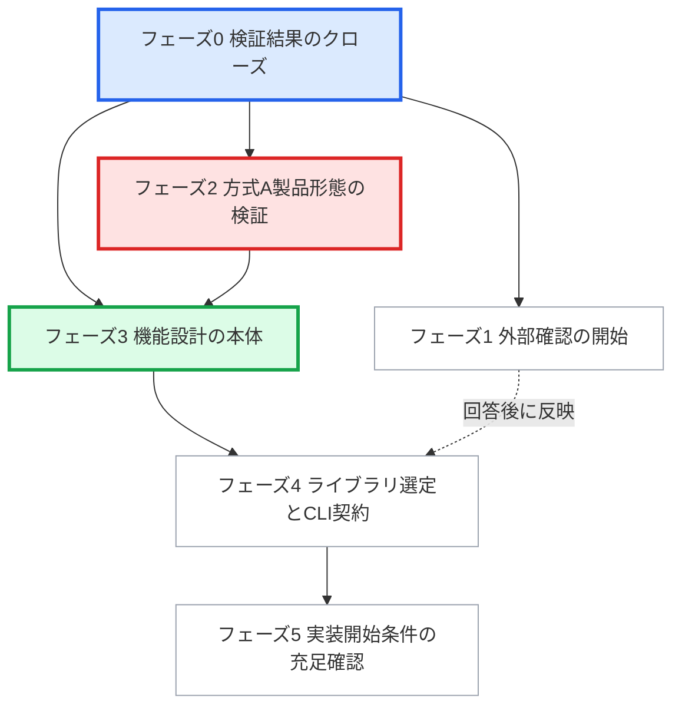

# AlgoLoom 作業TODO

> 対象: 全工程のうち**工程4「機能設計」**。`JudgeAdapter`技術検証の完了後から、MVPの実装開始条件10項目を満たすまでの作業を扱う（[§0](#0-本書が扱う範囲)）
>
> 状態: 進行中
>
> 作成日: 2026年8月13日
>
> 正本: 本書は作業の追跡用であり、製品判断の正本ではありません。範囲は[MVPスコープ](docs/product/mvp.md)、契約は[Core契約](docs/architecture/core-contracts.md)、判断状況は[未決事項一覧](docs/project/unresolved-decisions.md)を優先します。

## ドキュメント概要

本書は、AlgoLoomが完成するまでの全工程のうち本書が扱う範囲を先に定め（[§0](#0-本書が扱う範囲)）、その範囲内で次に行う作業を、カテゴリ、依存関係、手順、完了条件とともに一覧にします。あわせて、この期間に**行わない作業**と、**実行時に行ってはならないこと**を定義します。

各TODOは、この設計リポジトリを初めて読む人が、記載された手順と参照先だけで着手できる粒度で書きます。

## 0. 本書が扱う範囲

AlgoLoomが完成するまでの工程のうち、本書が定義するのは**工程4「機能設計」だけ**です。

| 工程 | 内容 | 主な成果物 | 状態 | 本書 |
|---:|---|---|---|---|
| 1 | 製品設計 | 製品ビジョン、MVPスコープ、Core契約、各領域の設計文書 | 完了 | 対象外 |
| 2 | 機能一覧の洗い出し | [`spec/features.md`](spec/features.md) | 完了 | 対象外 |
| 3 | `JudgeAdapter`技術検証 | `V-01`〜`V-11`の実行記録 | 完了 | 対象外 |
| **4** | **機能設計** | **論理モデル、契約テスト仕様、中断点と回復経路、CLI契約、ライブラリ選定** | **進行中** | **本書が扱う範囲** |
| 5 | 実装 | 実装リポジトリのコード | 未着手 | 対象外 |
| 6 | テストと堅牢化 | 自動テスト、障害注入、3つのOSでの実機確認、利用者検証 | 未着手 | 対象外 |
| 7 | 限定公開ベータ | AtCoderの回答の反映、配布物 | 未着手 | 対象外 |
| 8 | OSS公開 | PyPI等での公開 | 未着手 | 対象外 |

図の凡例を次に示します。色だけで区別せず、枠線でも区別できるようにしています。

| 図の表示 | 意味 | 該当する工程 |
|---|---|---|
| 緑の塗り・太い実線枠 | 本書が扱う範囲 | 4 |
| 灰色の塗り・実線枠 | 完了済み。本書の対象外 | 1〜3 |
| 塗りなし・破線枠 | 未着手。本書の対象外 | 5〜8 |

### 0.1. 本書の開始と完了

| 区分 | 定義 |
|---|---|
| 開始 | `JudgeAdapter`技術検証の全11項目が合格し、[MVPスコープ §4](docs/product/mvp.md#4-mvpの実装開始条件)の実装開始条件1〜3を充足した時点 |
| 完了 | 同§4の実装開始条件10項目すべてを満たした時点。確認作業は[`TD-25`](#td-25-実装開始条件の充足を確認する) |

**本書が完了した時点で、工程5「実装」を開始できます。** 実装以降の作業を本書へ追加しません。実装リポジトリを作成した後は、モジュール構成、依存関係、ビルド、CI等の作業を実装リポジトリ側で管理します（[`spec/README.md`](spec/README.md) §4.2）。

### 0.2. 工程4に含めないもの

工程4の期間中でも、次は行いません。詳細と再開する条件は[§6.1](#61-この期間に扱わない作業)を参照します。

- 実装コードの作成（工程5）
- タイムアウト、保持期間、性能目標の確定値（実測が必要なため工程6以降）
- クラス、モジュール、テーブル、カラムの最終名称（実装設計）
- MVP後の機能に関する未決事項の判断

### 0.3. 工程3から持ち越す作業

工程3は完了していますが、方式Aの**製品形態**だけは工程4の中で追加検証します（[`TD-09`](#td-09-方式aの製品形態候補を机上比較する)〜[`TD-11`](#td-11-方式a製品形態を実サービスで検証する)）。`V-10`が実証したのは認証方式の原理の成立であり、配布可能な形態の成立ではないためです。

## 1. 現在地

充足済みの実装開始条件は1〜3、残るのは4〜10です。工程4の開始時点で、次の3点が未了です。本書はここから始めます。

1. 検証で得た事実が正本文書へ反映されていません。[未決事項一覧](docs/project/unresolved-decisions.md)は`p0-23`しか参照しておらず、`p0-22`、`p1-01`〜`p1-03`、`p2-01`の結果が1.6、2.3、8.1へ入っていません。
2. 方式Aの**製品形態**が未検証です。`V-10`が合格したのは原理の成立であり、[AtCoder認証設計 §0](docs/architecture/atcoder-authentication.md#0-結論)が「手動で読み込む検証専用の拡張機能と一時的にコンパイルする秘密情報保管庫ヘルパーを、そのまま製品の配布形態として決定したとは扱わない」と明記しています。
3. AtCoderへの問い合わせ（未決事項8.1の12項目）が未送付です。回答待ちのリードタイムが最長です。

## 2. カテゴリの定義

| カテゴリ | 意味 | 成果物の置き場所 |
|---|---|---|
| 文書整備 | すでに決まった事実を正本文書へ反映し、文書間の不整合を解消する。新しい製品判断を行わない | 既存文書の更新 |
| 設計判断 | 未決事項に対して採否と方針を決定し、根拠とともに記録する | `docs/project/`、各正本文書 |
| 機能設計 | 機能要件、論理モデル、境界の契約、受け入れ条件を設計する | `docs/`の設計文書と`spec/`への投影 |
| 技術検証 | 実機または実サービスで成立性を確認し、匿名化した実行記録を残す | `docs/verification/` |
| 外部確認 | AtCoder等の外部へ問い合わせ、回答を設計へ反映する | `docs/project/` |
| 環境整備 | 検証と契約テストに必要な実行環境を用意する | 記録は`docs/project/` |

## 3. フェーズと依存関係

図の凡例を次に示します。

| 図の表示 | 意味 | 該当するフェーズ |
|---|---|---|
| 青の塗り・太枠 | 他のフェーズの前提。最初に完了させる | 0 |
| 赤の塗り・太枠 | 不合格ならMVPの範囲と価値仮説を再検討する | 2 |
| 緑の塗り・太枠 | 実装開始条件4〜9を直接満たす | 3 |
| 塗りなし・細枠 | 上記のいずれにも該当しない | 1、4、5 |
| 実線の矢印 | 先に完了させる必要がある依存 | ― |
| 破線の矢印 | 完了を待たずに進め、結果が出た時点で反映する依存 | ― |

フェーズ1とフェーズ2は、フェーズ3と並行して進められます。フェーズ1の回答待ちで他の作業を止めません。

## 4. TODO一覧

状態は`未着手`、`進行中`、`完了`、`保留`のいずれかで記します。

| ID | カテゴリ | 作業 | 依存 | 状態 |
|---|---|---|---|---|
| [`TD-01`](#td-01-未決事項一覧へv-06v-11の結果を反映する) | 文書整備 | 未決事項一覧へ`V-06`〜`V-11`の結果を反映する | ― | 未着手 |
| [`TD-02`](#td-02-未決事項-23-へ初期値候補を記録する) | 文書整備 | 未決事項 2.3 へ初期値候補を記録する | `TD-01` | 未着手 |
| [`TD-03`](#td-03-未決事項-81-へ問い合わせへ添える事実を集計する) | 文書整備 | 未決事項 8.1 へ問い合わせへ添える事実を集計する | `TD-01` | 未着手 |
| [`TD-04`](#td-04-検証の一時データ破棄と成果物のクローズを確認する) | 文書整備 | 検証の一時データ破棄と成果物のクローズを確認する | ― | 未着手 |
| [`TD-05`](#td-05-online-judge-toolsの採否を決定しライブラリ選定記録を作る) | 設計判断 | `online-judge-tools`の採否を決定し、ライブラリ選定記録を作る | `TD-01` | 未着手 |
| [`TD-06`](#td-06-atcoderへの問い合わせ文面を作成する) | 外部確認 | AtCoderへの問い合わせ文面を作成する | `TD-03` | 未着手 |
| [`TD-07`](#td-07-問い合わせを送付し記録する) | 外部確認 | 問い合わせを送付し、記録する | `TD-06` | 未着手 |
| [`TD-08`](#td-08-atcoderの回答を設計へ反映する) | 外部確認 | AtCoderの回答を設計へ反映する | `TD-07` | 保留 |
| [`TD-09`](#td-09-方式aの製品形態候補を机上比較する) | 設計判断 | 方式Aの製品形態候補を机上比較する | `TD-01` | 未着手 |
| [`TD-10`](#td-10-方式a製品形態の検証項目を追加する) | 技術検証 | 方式A製品形態の検証項目を追加する | `TD-09` | 未着手 |
| [`TD-11`](#td-11-方式a製品形態を実サービスで検証する) | 技術検証 | 方式A製品形態を実サービスで検証する | `TD-10` | 未着手 |
| [`TD-12`](#td-12-3つのosの認証検証マトリクスを作る) | 機能設計 | 3つのOSの認証検証マトリクスを作る | `TD-11` | 未着手 |
| [`TD-13`](#td-13-ツールチェーン観測を履歴へ保存するか決定する) | 設計判断 | ツールチェーン観測を履歴へ保存するか決定する | ― | 未着手 |
| [`TD-14`](#td-14-学習履歴の論理モデルを設計する) | 機能設計 | 学習履歴の論理モデルを設計する | `TD-13` | 未着手 |
| [`TD-15`](#td-15-認証の機能要件へ削除更新失敗分類を反映する) | 機能設計 | 認証の機能要件へ削除・更新・失敗分類を反映する | `TD-01` | 未着手 |
| [`TD-16`](#td-16-完了条件の追跡表を作り機能の漏れを確認する) | 機能設計 | 完了条件の追跡表を作り、機能の漏れを確認する | `TD-15` | 未着手 |
| [`TD-17`](#td-17-languageprofileとhostplatformの共通契約テスト仕様を作る) | 機能設計 | `LanguageProfile`と`HostPlatform`の共通契約テスト仕様を作る | ― | 未着手 |
| [`TD-18`](#td-18-windowsとlinuxの検証環境の確保方針を決める) | 環境整備 | WindowsとLinuxの検証環境の確保方針を決める | `TD-17` | 未着手 |
| [`TD-19`](#td-19-問題メタデータと利用者設定の責任分離を確定する) | 機能設計 | 問題メタデータと利用者設定の責任分離を確定する | `TD-14` | 未着手 |
| [`TD-20`](#td-20-中断点と回復経路を設計する) | 機能設計 | 中断点と回復経路を設計する | `TD-14`, `TD-19` | 未着手 |
| [`TD-21`](#td-21-ローカルテストの比較方式を確定する) | 機能設計 | ローカルテストの比較方式を確定する | ― | 未着手 |
| [`TD-22`](#td-22-ライブラリ選定基準を確定する) | 設計判断 | ライブラリ選定基準を確定する | `TD-05` | 未着手 |
| [`TD-23`](#td-23-各ライブラリを選定する) | 設計判断 | 各ライブラリを選定する | `TD-14`, `TD-22` | 未着手 |
| [`TD-24`](#td-24-cli契約を確定する) | 機能設計 | CLI契約を確定する | `TD-14`, `TD-20`, `TD-23` | 未着手 |
| [`TD-25`](#td-25-実装開始条件の充足を確認する) | 文書整備 | 実装開始条件の充足を確認する | `TD-12`, `TD-16`, `TD-17`, `TD-24` | 未着手 |

---

## 5. TODOの詳細

### フェーズ0: 検証結果のクローズ

#### `TD-01` 未決事項一覧へ`V-06`〜`V-11`の結果を反映する

| 項目 | 内容 |
|---|---|
| カテゴリ | 文書整備 |
| 対象ファイル | [`docs/project/unresolved-decisions.md`](docs/project/unresolved-decisions.md) |
| 参照 | [`p1-01`](docs/verification/judge-adapter/results/2026-08-13-p1-01.md)、[`p1-02`](docs/verification/judge-adapter/results/2026-08-13-p1-02.md)、[`p1-03`](docs/verification/judge-adapter/results/2026-08-13-p1-03.md)、[`p2-01`](docs/verification/judge-adapter/results/2026-08-13-p2-01.md) |

**目的:** 検証計画 §5 は「検証だけで決定はしません。得られた事実を持ち帰り、各文書で判断します」と定めています。現在の未決事項一覧は`p0-23`しか参照しておらず、`V-06`、`V-07`、`V-08`、`V-11`の結果が反映されていません。

**手順:**

1. 冒頭の「状態確認日」を作業日へ更新する。
2. 1.6「任意機能の具体的な導線」の「決定済みの内容」へ次を追記する。
   - `p1-02`で、未認証、サーバー由来の明示期限を過ぎた状態、AtCoder・Cloudflare側の拒否、ページ構造の変更、通信障害を、期限を推測せずに分類できたこと。
   - `p1-03`で、Cookie更新の追従、明示期限の扱い、世代付きの原子的置換、再起動後の本人照合、失効・更新競合・秘密情報保管庫の障害における提出前停止が成立したこと。
3. 1.6 の「残る未決」から、上記で確定した範囲を除く。残るのは、最終的なコマンド名と表示、方式Aで正式対応するブラウザ、配布境界、対話的なUIの有無であることを明記する。
4. 「状態確認の結果」の表で、1.6 の状態区分が現在も「一部決定済み」で妥当か確認する。

**完了条件:**

- [ ] 状態確認日が更新されている
- [ ] 1.6 が`p1-02`と`p1-03`を参照している
- [ ] 1.6 の「残る未決」に、`V-07`・`V-11`で確定済みの内容が残っていない
- [ ] 実際のアカウント名、Cookie、提出IDを追記していない

---

#### `TD-02` 未決事項 2.3 へ初期値候補を記録する

| 項目 | 内容 |
|---|---|
| カテゴリ | 文書整備 |
| 対象ファイル | [`docs/project/unresolved-decisions.md`](docs/project/unresolved-decisions.md) 2.3 |
| 依存 | `TD-01` |

**目的:** 検証計画 §5 は、2.3「実行・保持・性能の具体値」へ「判定確認の所要時間、ポーリング間隔と最大待機、接続とリクエストの上限の初期値」を渡すと定めています。実測値が得られたため記録します。

**手順:**

1. [`p0-22`](docs/verification/judge-adapter/results/2026-08-12-p0-22.md)から次を転記する。
   - 判定確認のポーリングで、サーバー指定の1秒より長い最小2秒の間隔を5回適用したこと。
   - 判定待ちの観測5回と最終判定1回で確定したこと。
   - 接続、リクエスト、ポーリング全体の上限を分けて設定し実動したこと。
   - 提出IDの取得から判定確認の開始までの所要時間。
2. [`p1-03`](docs/verification/judge-adapter/results/2026-08-13-p1-03.md)から、認証確認の通信を最大3回、各開始の間隔を2秒以上とした運用値を転記する。
3. [`p2-01`](docs/verification/judge-adapter/results/2026-08-13-p2-01.md)から、ジャッジ実行時間をミリ秒、最大メモリをバイトへ正規化した単位を転記する。
4. 転記した値を「初期値候補」と明示する。

**完了条件:**

- [ ] 2.3 に初期値候補の表がある
- [ ] 各値に出典の実行記録IDが付いている
- [ ] 「実測後に確定する」という2.3の性質を変更していない
- [ ] 性能目標（`log` p95 100ms 等）を確定値へ書き換えていない

---

#### `TD-03` 未決事項 8.1 へ問い合わせへ添える事実を集計する

| 項目 | 内容 |
|---|---|
| カテゴリ | 文書整備 |
| 対象ファイル | [`docs/project/unresolved-decisions.md`](docs/project/unresolved-decisions.md) 8.1 |
| 依存 | `TD-01` |

**目的:** 8.1 は「問い合わせへ添える実際のリクエスト数、間隔、保存内容は技術検証計画の観測記録から得る」と定めています。`TD-06`の入力を作ります。

**手順:**

1. [`docs/verification/judge-adapter/results/`](docs/verification/judge-adapter/results/)の全実行記録から次を集計する。
   - AtCoderへのHTTPメソッド別リクエスト数の合計と、実行ごとの内訳。
   - リクエストの間隔と、待機指示を尊重した事実。
   - 提出件数の合計、自動再送の回数、同一承認内の再提出の回数。
   - AtCoder以外への通信（パッケージの更新確認等）を別集計にした事実。
2. 保存する内容と保存しない内容を、[技術検証の実施手順 §5](docs/verification/judge-adapter/README.md#5-観測と保存の境界)の許可リストから転記する。
3. 認証方式として、方式Aの手順（可視の専用ブラウザ、利用者による手動ログインとTurnstile、`REVEL_SESSION`だけの取得、OSの秘密情報保管庫への保存、既存プロファイル非参照、後始末）を1段落へまとめる。
4. 集計結果を8.1の「決めること」の直下へ、問い合わせへ添える事実として記載する。

**完了条件:**

- [ ] リクエスト数、間隔、提出件数、保存内容、認証方式の5つが集計されている
- [ ] 12項目のうち、事実を添えるべき項目（1、2、3、4、5、10、11、12）に対応する事実がある
- [ ] 実際のアカウント名、Cookie、提出ID、ソースコードを含まない

---

#### `TD-04` 検証の一時データ破棄と成果物のクローズを確認する

| 項目 | 内容 |
|---|---|
| カテゴリ | 文書整備 |
| 対象ファイル | [`docs/verification/judge-adapter/README.md`](docs/verification/judge-adapter/README.md) §9 |
| 参照 | 同README §8「成果物の確定」 |

**目的:** 検証を正式に終了させ、認証情報と一時データを残しません。すでに実施済みの場合は確認だけを行います。

**手順:**

1. リポジトリ外の検証用一時ディレクトリ（`ALGOLOOM_VERIFY_ROOT`相当）の残存を確認し、あれば削除する。削除対象は作成時に記録した正確なパスに限定し、広いパスや未解決の変数を対象にしない。
2. 方式Cの一時Cookieファイル、方式Aの検証用秘密情報保管庫の項目、専用ブラウザの一時プロファイルの残存を確認する。項目名はAlgoLoom名前空間の正確な項目に限定する。
3. リポジトリ直下の`.verification-work/`が空であること、Gitの対象外設定が維持されていることを確認する。
4. 外部ツールが利用者の通常環境へ作成した認証状態がないか確認する。
5. §9「現在の準備状況」の表を最終状態へ更新し、全11項目の合格と検証終了を記す。

**完了条件:**

- [ ] 認証情報の残存が0件である
- [ ] `scripts/verification/`に秘密情報と実行固有値が含まれていない
- [ ] §9 の表が最終状態になっている
- [ ] ローカルのCookie削除を、AtCoder側のセッション失効として記録していない

---

#### `TD-05` `online-judge-tools`の採否を決定し、ライブラリ選定記録を作る

| 項目 | 内容 |
|---|---|
| カテゴリ | 設計判断 |
| 対象ファイル | 新規`docs/project/library-selection.md`、[`docs/product/mvp.md`](docs/product/mvp.md) §3.3 |
| 依存 | `TD-01` |

**目的:** 検証計画 §5 は「あわせて、`online-judge-tools`を`JudgeAdapter`の初期実装として採用できるかを判断できます」と定めています。判断材料が揃ったため決定します。以降のライブラリ選定に最も影響する項目です。

**手順:**

1. 新規文書`docs/project/library-selection.md`を作成する。構成は、選定対象の一覧、選定基準（`TD-22`で追記）、対象ごとの採否と根拠とする。
2. 最初の項目として`online-judge-tools`を扱い、[技術検証の実施手順 §10](docs/verification/judge-adapter/README.md#10-事前調査で判明した注意点)から次の観測事実を根拠として転記する。
   - PyPIの最新版は`11.5.1`で、公開日は2021年9月13日である。
   - Python 3.12.13では`distutils.version`の読み込みに失敗してCLIが起動しなかった。
   - `oj login --check`はログイン済みかを返すが、アカウント識別情報を返さない。
   - `oj-api`の公開サブコマンドに提出IDを指定する判定取得がなく、Python APIの提出詳細取得は非推奨かつ未実装である。
   - Python APIの提出一覧の反復は、ページ上限を渡さない場合に後続ページを走査し得る。
   - `oj --version`の実行時にもPyPIへの更新確認の通信が発生した。
3. `V-01`〜`V-11`のどの合格根拠にも`online-judge-tools`が使われていないことを、実行記録から確認して記す。
4. 採否を決定する。不採用とする場合は、`JudgeAdapter`の初期実装を薄い自作のHTTPアダプタとする方針と、その根拠を記す。
5. [`docs/product/mvp.md`](docs/product/mvp.md) §3.3 の「`online-judge-tools`は候補実装であり、AlgoLoomのDomainや保存Schemaの契約にしない」という記述と矛盾しないか確認し、必要であれば同じ変更で更新する。
6. [`docs/project/judge-adapter-verification.md`](docs/project/judge-adapter-verification.md) §5 の該当段落から、新しい選定記録へリンクする。

**完了条件:**

- [ ] 採否と根拠が、実行記録への参照付きで記録されている
- [ ] `mvp.md` §3.3 との間に矛盾がない
- [ ] 検証支援コードを製品コードとして採用したとは書いていない

---

### フェーズ1: 外部確認の開始

#### `TD-06` AtCoderへの問い合わせ文面を作成する

| 項目 | 内容 |
|---|---|
| カテゴリ | 外部確認 |
| 対象ファイル | 新規`docs/project/atcoder-inquiry.md` |
| 依存 | `TD-03` |
| 参照 | [配布方針ガイド §15](docs/operations/algoloom-distribution.md)、未決事項 8.1・5.2 |

**目的:** 回答待ちのリードタイムが最長であり、回答次第で認証方式と配布方針が変わります。事実が揃った現在が送付の時期です。

**手順:**

1. 配布方針ガイド §15 の12項目を確認し、そのまま問い合わせ項目とする。
2. 各項目へ`TD-03`で集計した事実を添える。
3. 項目2と項目12（方式Aに関する2項目）には、次を具体的に書く。
   - 可視の専用ブラウザを空の専用プロファイルで起動すること。
   - ユーザー名、パスワード、Turnstileの操作をすべて利用者が行うこと。
   - Cloudflare保護ページをCDP、WebDriver、リモートデバッグで制御しないこと。
   - `https://atcoder.jp`の`REVEL_SESSION`だけを取得し、OSの秘密情報保管庫へ保存すること。
   - 利用者の既存ブラウザプロファイルを参照しないこと。
   - 提出は利用者の明示操作ごとに1件であり、自動再送を行わないこと。
4. 未決事項 5.2「ADTで再利用中の過去問をAIレビュー対象とする解釈」を項目7として含める。
5. 送付前に、実際のアカウント名、Cookie、トークン、提出ID、ソースコード、生のヘッダーを含まないことを確認する。
6. AlgoLoomがAtCoder公式でも公認でもないことを文面の冒頭で明示する。

**完了条件:**

- [ ] 12項目すべてに、添える事実または質問の意図が書かれている
- [ ] 方式Aの手順が、回避策を含まない形で具体的に説明されている
- [ ] 秘密情報と個人を特定する情報を含まない

---

#### `TD-07` 問い合わせを送付し、記録する

| 項目 | 内容 |
|---|---|
| カテゴリ | 外部確認 |
| 対象ファイル | `docs/project/atcoder-inquiry.md` |
| 依存 | `TD-06` |

**手順:**

1. 送付先と送付方法を決める。公式が案内する問い合わせ経路を使う。
2. 送付日、送付方法、送付した内容の要点を記録する。
3. 回答欄を空の状態で用意し、回答受領後に`TD-08`で埋める旨を記す。
4. 未決事項 8.1 と 5.2 の状態を「外部確認待ち（送付済み）」へ更新する。

**完了条件:**

- [ ] 送付日と送付内容の記録がある
- [ ] 未決事項一覧の状態が更新されている
- [ ] 回答待ちを理由に他のTODOを停止していない

---

#### `TD-08` AtCoderの回答を設計へ反映する

| 項目 | 内容 |
|---|---|
| カテゴリ | 外部確認 |
| 依存 | `TD-07` |
| 状態 | 保留（回答受領後に着手） |

**手順:**

1. 回答を`docs/project/atcoder-inquiry.md`へ受領日とともに記録する。
2. 項目ごとに、影響する正本文書を特定して反映する。
   - 認証方式（項目2、12）→ [AtCoder認証設計](docs/architecture/atcoder-authentication.md)
   - アクセス間隔、再試行、User-Agent（項目3、4）→ 未決事項 2.3、`spec/features.md` §4.1
   - 入出力例のローカルキャッシュ（項目5）→ [Core契約](docs/architecture/core-contracts.md) §3.1
   - AIレビューの判定（項目6、7）→ [AIレビュー安全設計](docs/features/ai-review-safety-design.md)、未決事項 5.2
   - 表記（項目8）、有料版（項目9）、外部参照（項目10、11）→ [配布方針ガイド](docs/operations/algoloom-distribution.md)
3. 方式Aの変更または停止が必要な場合は、認証設計だけでなくMVPスコープと配布方針を[MVPスコープ §7](docs/product/mvp.md#7-変更管理)の変更管理に従って更新する。

**完了条件:**

- [ ] 12項目の回答が記録されている
- [ ] 各回答の反映先が特定され、反映されている
- [ ] 未決事項 8.1 と 5.2 の状態が更新されている

---

### フェーズ2: 方式A製品形態の検証

#### `TD-09` 方式Aの製品形態候補を机上比較する

| 項目 | 内容 |
|---|---|
| カテゴリ | 設計判断 |
| 対象ファイル | [`docs/architecture/atcoder-authentication.md`](docs/architecture/atcoder-authentication.md) |
| 依存 | `TD-01` |

**目的:** `V-10`で成立を確認した取得経路は、利用者が`chrome://extensions`でデベロッパーモードを有効にし、パッケージ化されていない拡張機能を手動で読み込むものです。Chrome 137以降は`--load-extension`を受け付けないため自動読込もできません。**製品の初回認証導線として成立しません。** 秘密情報保管庫へのアクセスも、実行時にコンパイルする一時的な実行ファイルであり配布物になりません。

**手順:**

1. 候補を列挙する。少なくとも次を含める。
   - 署名済みの拡張機能を公式ストアで配布し、ローカルの通信経路で受け渡す。
   - 拡張機能を使わず、専用プロファイルの終了後に、そのプロファイルのCookie保存領域を利用者の明示操作後に読む。
   - Chrome以外の対応ブラウザのプロファイル方式を使う。
2. 各候補を次の観点で評価する。
   - 3つのOSで成立するか。
   - Cloudflare互換性を壊さないか（`navigator.webdriver`が真にならない、自動化検知の対象にならない）。
   - 利用者の既存プロファイル非参照を維持できるか。
   - `REVEL_SESSION`だけへ限定できるか。
   - 配布物と通常のログへ秘密情報が混入しないか。
   - 初回認証で利用者に求める操作の数と、開発者向け設定の操作が不要か。
   - 中断、タイムアウト、異常終了後の後始末が成立するか。
3. [AtCoder認証設計 §8](docs/architecture/atcoder-authentication.md#8-採用しない前提と方式)「採用しない前提と方式」に抵触する候補を除外する。
4. 実機検証へ進む候補を1つに絞り、除外した候補とその理由を記録する。

**完了条件:**

- [ ] 候補比較表がある
- [ ] 実機検証へ進む候補が1つに決まっている
- [ ] 手動で読み込む検証専用の拡張機能を、そのまま製品形態として選んでいない
- [ ] Bot対策の回避を含む候補を残していない

---

#### `TD-10` 方式A製品形態の検証項目を追加する

| 項目 | 内容 |
|---|---|
| カテゴリ | 技術検証 |
| 対象ファイル | [`docs/project/judge-adapter-verification.md`](docs/project/judge-adapter-verification.md) §3、[`docs/verification/judge-adapter/README.md`](docs/verification/judge-adapter/README.md) §6 |
| 依存 | `TD-09` |

**手順:**

1. 検証計画 §3.1 へ新しいP0項目（`V-12`）を追加する。優先度をP0とする理由は、不合格ならMVPの認証導線が製品として成立しないためである。
2. 合格条件へ次をすべて含める。
   - 利用者が開発者向け設定を操作せずに認証を開始できる。
   - Cloudflare保護ページをリモート制御状態にしない。
   - `REVEL_SESSION`だけを取得する。
   - アカウント識別情報が期待値と一致する。
   - OSの秘密情報保管庫へ保存し、新しいプロセスから再照合できる。
   - 中断、タイムアウト、異常終了後に、孤児プロセス、利用可能な一時プロファイル、未確認のセッションを残さない。
   - 配布物として成立する形態である。
3. 実施手順のREADME §6 へ、この項目の実行ゲートと停止条件を追加する。
4. 追加提出を行わないことを明記する。
5. 不合格時の扱いを記す。回避実装へ進まず、方式Aの再設計またはMVP範囲の再検討へ戻す。

**完了条件:**

- [ ] 検証項目、合格条件、関係する機能が追加されている
- [ ] 実行ゲートと停止条件が定義されている
- [ ] 追加提出を行わないことが明記されている

---

#### `TD-11` 方式A製品形態を実サービスで検証する

| 項目 | 内容 |
|---|---|
| カテゴリ | 技術検証 |
| 対象ファイル | `docs/verification/judge-adapter/results/`配下の新しい実行記録 |
| 依存 | `TD-10` |

**手順:**

1. [実施手順 §3](docs/verification/judge-adapter/README.md#3-当日の外部条件)に従い、当日の外部条件（利用規約、対象コンテストの状態、Bot対策の状態、Cloudflareの対応ブラウザ）を確認する。開始しない条件に該当する場合は実行しない。
2. リポジトリ外の一時ディレクトリへ隔離した実行環境を用意する。
3. `TD-10`で追加した実行ゲートに従って実行する。
4. [記録テンプレート](docs/verification/judge-adapter/results/run-record-template.md)を複製し、匿名化した観測と合否を記録する。
5. 一時データ、認証情報、専用プロファイルを破棄する。
6. 合格の場合は、方式Aの製品形態を[AtCoder認証設計](docs/architecture/atcoder-authentication.md) §3 へ反映する。不合格の場合は、回避策を追加せず、`TD-09`の別候補または方式Aの再設計へ戻す。

**完了条件:**

- [ ] 合否が実行記録に記載されている
- [ ] 秘密情報が成果物、ログ、Gitへ残っていない
- [ ] 追加提出が0件である
- [ ] 不合格の場合、回避実装ではなく再設計または範囲再検討の記録がある

---

#### `TD-12` 3つのOSの認証検証マトリクスを作る

| 項目 | 内容 |
|---|---|
| カテゴリ | 機能設計 |
| 対象ファイル | [`docs/architecture/atcoder-authentication.md`](docs/architecture/atcoder-authentication.md) §6 |
| 依存 | `TD-11` |

**目的:** [MVPスコープ §5.1](docs/product/mvp.md#5-mvp完了条件)は「native macOS、native Linux、native Windowsの対応ブラウザと秘密情報保管庫で、方式Aの起動・保存・更新・削除・中断を検証できる」ことを完了条件にしています。

**手順:**

1. 行をOSとブラウザと秘密情報保管庫の組み合わせ、列を認証設計 §6 の5つの確認項目とする表を作る。
   - 可視ブラウザの起動、利用者による中断、タイムアウト、孤児プロセスの回収
   - 既存プロファイルを参照していないこと
   - 秘密情報保管庫への保存、取得、更新、削除と、利用不能時の安全側での停止
   - ログ、エラー、DB、エクスポート、配布物への秘密情報の非混入
   - アカウントの変更、期限切れ、ページ構造の変更における送信前停止
2. 秘密情報保管庫を、macOS Keychain、Windowsの保護領域、Linux Secret Serviceとして明示する。
3. 各セルの確認方法（実機、仮想マシン、自動テスト、未対応）を決める。`TD-18`と整合させる。
4. 利用者の手動操作を伴うため自動化できない範囲を明示する。
5. MVP完了条件 §5.1 と §5.2 の認証関連の行と対応付ける。

**完了条件:**

- [ ] 表があり、すべてのセルに確認方法がある
- [ ] 自動化できない範囲が明示されている
- [ ] 確認手段を用意できない組み合わせは、MVP保証範囲の変更提案として記録されている

---

### フェーズ3: 機能設計の本体

#### `TD-13` ツールチェーン観測を履歴へ保存するか決定する

| 項目 | 内容 |
|---|---|
| カテゴリ | 設計判断 |
| 対象ファイル | [`docs/architecture/core-contracts.md`](docs/architecture/core-contracts.md) §5.1、[`docs/architecture/language-and-platform-portability.md`](docs/architecture/language-and-platform-portability.md) §4.2 |
| 参照 | 未決事項 2.6 |

**目的:** 2文書の記述が一致していません。Core契約 §5.1 が挙げるMVPで保存する履歴7項目にツールチェーン観測は含まれませんが、可搬性設計 §4.2 は`HistoryStore`の責任に「toolchain観測」を含めています。`TD-14`の論理モデルより前に決着させます。

**手順:**

1. 両文書の該当箇所を突き合わせる。
2. 保存する場合は次を決める。
   - 保存する項目（コンパイラ名、バージョン、OS、CPUアーキテクチャ等）。
   - 端末固有情報（ホスト名、利用者名、絶対パス）を含めない境界。
   - エクスポートに含めるか。
   - 将来のクラウド同期で共有可能な論理データとするか、端末固有データとするか。[可搬性設計 §9.1](docs/architecture/language-and-platform-portability.md#91-共有可能な論理データと端末固有データ)と整合させる。
3. 保存しない場合は、可搬性設計 §4.2 の`HistoryStore`の責任から該当項目を外す。
4. 同じ変更で両文書を一致させる。
5. 未決事項 2.6 の状態を「決定済み」へ更新し、決定内容と理由を記す。

**完了条件:**

- [ ] 両文書の記述が一致している
- [ ] 未決事項 2.6 が更新されている
- [ ] 端末固有情報の扱いが決まっている

---

#### `TD-14` 学習履歴の論理モデルを設計する

| 項目 | 内容 |
|---|---|
| カテゴリ | 機能設計 |
| 対象ファイル | 新規`docs/architecture/history-logical-model.md`、および`spec/`への投影 |
| 依存 | `TD-13` |
| 参照 | [MVPスコープ §4](docs/product/mvp.md#4-mvpの実装開始条件) 条件6 |

**目的:** 実装開始条件6「SolveAttempt、FocusInterval、learning milestone、snapshot、submission operation、submission、verdict observation、account identityの論理モデルがある」を満たします。フェーズ3で最初に着手します。

**手順:**

1. 次のエンティティを定義する。
   - `SolveAttempt`（解答試行）、`FocusInterval`（集中区間）、学習マイルストーン、ソーススナップショット、提出操作記録、提出、判定観測、アカウント識別情報、問題、問題チェックアウト。
2. 各エンティティについて次を定める。
   - 識別子。恒久IDと表示用の名前を区別する。ディレクトリ名、接尾辞、連番、絶対パスを恒久IDにしない。
   - 属性と、必須・任意の区別。
   - 他エンティティとの関係と多重度。
   - 生成の契機と、更新が許される範囲。
3. 状態遷移を定義する。
   - `SolveAttempt`: `ACTIVE`、`PAUSED`、`COMPLETED`、`ABANDONED`。
   - 提出操作記録: `PREPARED`、`FAILED_BEFORE_SEND`、`SEND_STARTED`、`REMOTE_ACCEPTED`、`VERDICT_PENDING`、`FINAL`、`REMOTE_STATUS_UNKNOWN`。
4. 不変条件を列挙する。少なくとも次を含める。
   - 保存後のソースコード本文を上書きしない。正確なバイト列からハッシュを計算する。
   - 判定は取得時刻付きの追記型の観測とし、判定待ちから最終判定への進行をスナップショットの上書きとして実装しない。
   - 遅れて到着した判定で、確定済みマイルストーンの時間を増やさない。
   - 負の時間、推測した精密値を保存しない。
   - 提出スナップショットのバイト列と、実際に送信したバイト列を一致させる。
   - 解き直しは別の`SolveAttempt`とし、前回の履歴を上書きしない。
5. 時間の扱いを分ける。能動時間、実経過時間、処理時間、コンパイル所要時間、ローカル実行時間、ジャッジ実行時間、判定待機時間を別の属性とする。初ACの能動時間へ判定待機時間を加算しない。
6. ジャッジ実行時間とメモリを、値なしを許容する観測として定義し、正規化する単位を`p2-01`に合わせる。
7. `TD-13`の決定を反映する。
8. `spec/features.md` §5、§7、§8 と矛盾しないか確認する。矛盾がある場合は、どちらが正本かを`spec/README.md` §3 に従って判断する。

**完了条件:**

- [ ] 10のエンティティすべてに識別子、属性、関係、生成契機がある
- [ ] 2つの状態遷移が定義されている
- [ ] 不変条件が列挙され、`spec/features.md` §7.2 と一致している
- [ ] 7種類の時間が別の属性として定義されている
- [ ] テーブル名、カラム名、SQLのデータ型を確定していない（未決事項 2.1 の範囲）
- [ ] 実装開始条件6を満たすと判断できる

---

#### `TD-15` 認証の機能要件へ削除・更新・失敗分類を反映する

| 項目 | 内容 |
|---|---|
| カテゴリ | 機能設計 |
| 対象ファイル | [`spec/features.md`](spec/features.md) §8.1、§8.4、§2.2、§15 |
| 依存 | `TD-01` |

**目的:** `V-07`と`V-11`、`V-08`で確定した内容が機能要件へ落ちていません。`spec/`は`docs/`の投影であり、[AtCoder認証設計](docs/architecture/atcoder-authentication.md)が正本です。現在、次の不一致があります。

- `F-SUBMIT-01`の要件R1〜R9に、**セッションの削除がありません**。一方でMVP完了条件は「起動・保存・更新・削除・中断」を求め、§17 は「削除の最終コマンド名」を未決として挙げています。
- `F-SUBMIT-01`に、**Cookie更新への追従とサーバー由来の明示期限の扱いがありません**。認証設計 §4.2、§4.3 に契約があり、`V-11`で検証済みです。
- `F-SUBMIT-01`のR2の失敗分類は5種類ですが、認証設計 §5 は9分類です。**アカウント不一致、期限不明の未認証・期限切れ、秘密情報保管庫の障害**が欠けています。
- §8.4 の判定観測に、ジャッジ実行時間とメモリの**正規化する単位**がありません。

**手順:**

1. `F-SUBMIT-01`へ、保存済みセッションの削除に関する要件を追加する。ローカルの削除がAtCoder側の失効を保証しないことを含める。
2. `F-SUBMIT-01`へ、Cookie更新への追従の要件を追加する。次を含める。
   - サーバーが返していない有効期限を生成しない。
   - 更新後のセッションでも同じアカウント識別情報を確認してから永続化する。
   - 認証済み通信と保管の更新を排他する。
   - Cookie更新を「セッション延命」として表示しない。
3. `F-SUBMIT-01` R2 の失敗分類を、認証設計 §5 の9分類へ合わせる。
4. §8.4 へ、ジャッジ実行時間をミリ秒、メモリをバイトへ正規化する規約を追加する。欠損を`0`や推測値で補わない既存の制約は維持する。
5. §8.2 または §8.4 へ、ローカルの送信元ファイルサイズをリモート提出の識別条件に使わない制約を追加する（`p2-01`の観測）。
6. 上記の追加により、機能一覧 §2.2 へ新しい機能IDが必要か判断する。認証情報の削除と更新を`F-SUBMIT-01`の要件に含めるか、別の機能IDへ分けるかを決める。
7. 受け入れシナリオ §15 へ、認証情報の削除と、Cookie更新後の再照合のシナリオを追加するか判断する。

**完了条件:**

- [ ] 上記5点が`spec/features.md`へ反映されている
- [ ] [AtCoder認証設計](docs/architecture/atcoder-authentication.md) §5 の9分類と`F-SUBMIT-01` R2 が一致している
- [ ] 機能一覧 §2.2 と機能要件の対応が取れている
- [ ] §17 の未決事項の記述が、確定した範囲だけ更新されている

---

#### `TD-16` 完了条件の追跡表を作り、機能の漏れを確認する

| 項目 | 内容 |
|---|---|
| カテゴリ | 機能設計 |
| 対象ファイル | 新規`spec/traceability.md` |
| 依存 | `TD-15` |

**目的:** 機能の洗い出しは、新しい機能を思い付きで足す作業ではありません。**MVP完了条件のうち、対応する機能・品質要件・受け入れシナリオがない行が本当の漏れです。** `TD-15`で見つかった不一致は、この方法で網羅的に検出できます。

**手順:**

1. [MVPスコープ §5.1〜§5.3](docs/product/mvp.md#5-mvp完了条件)の完了条件を1行ずつ抽出する。
2. 各行を`F-*`（機能）、`Q-*`（品質要件）、`E2E-*`（受け入れシナリオ）のいずれかへ対応付ける表を作る。
3. 対応先がない行を「漏れ候補」として一覧にする。
4. 各漏れ候補について、次のいずれかを決める。
   - 機能を追加する。
   - 既存機能へ要件を追加する。
   - 受け入れシナリオを追加する。
   - MVP範囲外へ移す（[MVPスコープ §7](docs/product/mvp.md#7-変更管理)の変更管理に従う）。
5. 逆方向も確認する。`E2E-01`〜`E2E-30`と`Q-01`〜`Q-15`のうち、対応する完了条件がないものがないか確認する。
6. `spec/scope.md` §7 の「リリース判定基準として扱う」8項目も対応付ける。

**完了条件:**

- [ ] 完了条件のすべての行に対応先があるか、範囲外と判断した理由がある
- [ ] 漏れ候補への対応が決まっている
- [ ] 対応先のない`E2E-*`と`Q-*`がない

---

#### `TD-17` `LanguageProfile`と`HostPlatform`の共通契約テスト仕様を作る

| 項目 | 内容 |
|---|---|
| カテゴリ | 機能設計 |
| 対象ファイル | 新規`spec/contract-tests.md` |
| 参照 | [可搬性設計 §5、§6、§11](docs/architecture/language-and-platform-portability.md)、[MVPスコープ §4](docs/product/mvp.md#4-mvpの実装開始条件) 条件4・5 |

**目的:** 実装開始条件4「C++、Python、Go、Rustの組み込みlanguage profile案と共通契約テストがある」と条件5「3つのOSの`HostPlatform`契約と、4言語×3 OSの検証マトリクスがある」を満たします。**契約自体は可搬性設計 §5.1 と §6 にあります。不足しているのは契約テストの仕様と検証マトリクスです。**

**手順:**

1. 可搬性設計 §5.1 の概念インターフェースと §11 の実装チェックリストを入力にする。
2. `LanguageProfile`の共通契約テスト項目を列挙する。言語ごとに別の項目を作らず、全言語へ同じ項目を適用する。少なくとも次を含める。
   - `BuildPlan`と`RunPlan`がシェル文字列を含まず、`argv`配列であること。
   - コンパイルが不要な言語で`BuildPlan`をどう表すか。
   - 生成物の場所と、後始末の責任。
   - ツールチェーン診断が、利用可能・不足・バージョン不明を分類できること。
   - テンプレートを1言語分だけ生成すること。
3. `HostPlatform`の共通契約テスト項目を列挙する。少なくとも次を含める。
   - タイムアウトと取消でプロセスツリーを終了し、子プロセスを残さないこと。
   - 標準出力と標準エラー出力の量に上限があること。
   - 原子的なファイル書き込みと、途中状態を正式なファイルとして残さないこと。
   - パスの正規化と、書き込み先が許可された領域の内側であることの確認。
   - シンボリックリンクを既定で追跡しないこと。
   - ターミナル能力（TTY、色、幅）の判定。
   - 子プロセスへAtCoderセッションと不要な環境変数を渡さないこと。
4. 4言語×3つのOSの12セルの検証マトリクスを作り、各セルの確認方法（自動テスト、実機、障害注入）を決める。
5. 確認方法を決められないセルは、`TD-18`へ引き渡すか、MVP保証範囲から外す提案として記録する。

**完了条件:**

- [ ] 契約テスト項目が、言語別・OS別ではなく共通契約として書かれている
- [ ] 12セルすべてに確認方法がある
- [ ] 個別の`LanguageProfile`同士、個別の`HostPlatform`同士を依存させない制約が維持されている
- [ ] 実装開始条件4と5を満たすと判断できる

---

#### `TD-18` WindowsとLinuxの検証環境の確保方針を決める

| 項目 | 内容 |
|---|---|
| カテゴリ | 環境整備 |
| 対象ファイル | `docs/project/`の新規記録 |
| 依存 | `TD-17` |

**目的:** MVPはネイティブmacOS、ネイティブLinux、ネイティブWindowsを保証範囲としますが、これまでの検証はmacOSだけです。手段が用意できない場合、保証範囲の変更が必要になります。

**手順:**

1. 必要な確認内容を3つに分類する。
   - 自動化できる契約テスト。
   - OS依存の障害注入（プロセスツリー終了、ディスク容量不足、強制終了）。
   - 方式Aの認証（実ブラウザと秘密情報保管庫、利用者の手動操作が必要）。
2. 実現手段を比較する。実機、仮想マシン、CIのホストランナー、未対応として保証範囲から外す。
3. 方式Aの認証は利用者の手動操作を伴うため、CIで代替できない範囲を明示する。
4. 手段ごとに、費用、再現性、MVP完了条件を満たせるかを記録する。
5. 手段を用意できない組み合わせを一覧にする。

**完了条件:**

- [ ] 4言語×3つのOSと、方式Aの3つのOSについて確認手段が決まっている
- [ ] CIで代替できない範囲が明示されている
- [ ] 手段を用意できない組み合わせは、MVP保証範囲の変更提案として[MVPスコープ §7](docs/product/mvp.md#7-変更管理)の変更管理へ回っている

---

#### `TD-19` 問題メタデータと利用者設定の責任分離を確定する

| 項目 | 内容 |
|---|---|
| カテゴリ | 機能設計 |
| 対象ファイル | [`docs/architecture/core-contracts.md`](docs/architecture/core-contracts.md) §2.3、§2.4、[`spec/features.md`](spec/features.md) §3.2、§4.2 |
| 依存 | `TD-14` |
| 参照 | 未決事項 1.2、1.7、2.1 |

**目的:** 実装開始条件7「workspace metadataとuser-level設定の責任が分かれている」を満たします。

**手順:**

1. 問題メタデータのファイル名、形式、スキーマバージョンを決める。問題ディレクトリと一緒に移動できる通常ファイルであることを維持する。
2. 作業領域の探索範囲、除外ディレクトリ、規模上限、探索の打ち切り条件を決める。
3. AlgoLoom所有領域（設定、履歴DB、キャッシュ、一時領域）の配置を3つのOSで決める。各OSの標準的な配置規約に従う。
4. 利用者設定の保存場所、形式、スキーマバージョン、最初に採用する設定項目を決める。環境変数を設定経路として採用する範囲も決める。
5. 未知のスキーマバージョンを、推測して解釈せず、影響する操作だけを停止する扱いを確認する。
6. 次の境界が維持されていることを確認する。
   - 問題メタデータへ実行コマンド、認証情報、エンドポイントを置かない。
   - 作業領域から任意のコマンドを定義させない。
   - 明示指定、利用者設定、製品既定値の順に解決する。
   - 作業領域のメタデータを汎用の設定層にしない。

**完了条件:**

- [ ] 未決事項 1.2 の「残る未決」が解消されている
- [ ] 未決事項 2.1 のうち、保存領域の配置に関する部分が解消されている
- [ ] `spec/features.md` §3.2 の推奨構成と一致している
- [ ] 実装開始条件7を満たすと判断できる

---

#### `TD-20` 中断点と回復経路を設計する

| 項目 | 内容 |
|---|---|
| カテゴリ | 機能設計 |
| 対象ファイル | 新規`docs/architecture/interruption-and-recovery.md`、`spec/`への投影 |
| 依存 | `TD-14`、`TD-19` |
| 参照 | [MVPスコープ §4](docs/product/mvp.md#4-mvpの実装開始条件) 条件8・9 |

**目的:** 実装開始条件8「`get`、SolveAttemptの時間計測、`test`、`submit`の中断点と回復経路が機能設計に含まれている」と条件9「freshな解き直しについて、problem checkoutとSolveAttemptを分離し、file作成とDB保存の部分失敗から回復できる設計がある」を満たします。

**手順:**

1. 対象を5つに分ける。`get`、学習時間計測、`test`、`submit`、白紙からの解き直し。
2. 各対象について、中断し得る点を列挙する。少なくとも次の前後を含める。
   - ファイルの作成前後
   - DBのコミット前後
   - 外部への送信前後
   - 利用者へ制御を返す前後
3. 各中断点について次を決める。
   - 残る状態。
   - 再実行時に完了段階を識別する方法（マーカーの置き場所と形式）。
   - 重複を作らないための鍵。AtCoder側の重複防止キーと誤認しない。
   - 回復時に利用者へ示す内容（完了済み、未完了、保持されたデータ、次の安全な操作）。
4. ファイル成功・DB失敗と、DB成功・ファイル失敗を別の回復経路として書く。
5. 提出については、外部送信前に耐久保存する項目（`spec/features.md` §8.2 の7項目）と、`SEND_STARTED`以降で無条件の再送を行わない境界を明示する。
6. 受け入れシナリオ`E2E-03`、`E2E-06`、`E2E-08`、`E2E-09`、`E2E-10`、`E2E-12`、`E2E-24`、`E2E-26`と対応付ける。

**完了条件:**

- [ ] 5つの対象すべてに中断点の一覧がある
- [ ] すべての中断点に回復方法がある
- [ ] ファイルとDBの部分失敗が別の経路として書かれている
- [ ] 対応する受け入れシナリオが特定されている
- [ ] 実装開始条件8と9を満たすと判断できる

---

#### `TD-21` ローカルテストの比較方式を確定する

| 項目 | 内容 |
|---|---|
| カテゴリ | 機能設計 |
| 対象ファイル | [`docs/architecture/core-contracts.md`](docs/architecture/core-contracts.md) §4.1、[`spec/features.md`](spec/features.md) §6.2 |
| 参照 | 未決事項 2.5 |

**目的:** 空白と改行の正規化規則、浮動小数の既定の許容誤差、近似判定の表示文言が未確定です。確定するまで、近似判定を「AtCoderのジャッジと一致する」と表示できません。

**手順:**

1. 取得済みの入出力例と、AtCoderの代表的な問題の出力仕様を確認する。少なくとも次の観点を含める。
   - 末尾の改行の有無。
   - 行末の空白。
   - 複数行の出力。
   - `Yes`／`No`のような固定文字列。
   - 浮動小数を含む出力と、問題文に書かれた許容誤差の表現。
2. 空白と改行の正規化規則を決める。
3. 浮動小数の既定の許容誤差と、問題ごとに指定できるようにするかを決める。
4. 近似判定の表示文言を決める。
5. 特殊ジャッジ、複数解、対話的な問題を、未対応として停止する条件を決める。
6. 失敗の種別（コンパイルエラー、実行時エラー、タイムアウト、シグナルによる終了、出力量超過）を不一致と混同しない分類を維持する。

**完了条件:**

- [ ] 3項目（正規化規則、許容誤差、表示文言）が確定している
- [ ] `spec/features.md` §6.2 の未決参照が解消されている
- [ ] 未決事項 2.5 の状態が更新されている
- [ ] 近似判定を「AtCoderのジャッジと一致する」と表示しない制約が維持されている

---

### フェーズ4: ライブラリ選定とCLI契約

#### `TD-22` ライブラリ選定基準を確定する

| 項目 | 内容 |
|---|---|
| カテゴリ | 設計判断 |
| 対象ファイル | `docs/project/library-selection.md` |
| 依存 | `TD-05` |

**目的:** 個別のライブラリを比較する前に、判断基準を先に固定します。基準は既存の原則と検証の観測から導出でき、新しい製品判断を追加しません。

**手順:**

1. 足切り基準を書く。少なくとも次を含める。
   - 利用者が求めていない外部通信を起動時・実行時に行わない。根拠は`oj --version`の実行でPyPIへの更新確認が発生した観測と、`spec/features.md` §11.2「自動の更新確認を送信しない」である。
   - 3つのOSで動作する。
   - オフラインでCoreの主要導線が成立する。
2. 共通の評価観点を書く。少なくとも次を含める。
   - 配布（wheel）への影響と、依存の数。
   - ライセンス。
   - 更新の継続性と、最終リリースからの経過。
   - プロセスを`argv`配列で起動でき、シェル文字列へ利用者入力を連結しない。
   - 秘密情報を引数、環境変数、通常のログへ置かない。
   - 非TTY、色なし、狭い幅で意味が変わらない。
3. 選定しても製品契約にしない境界を書く。[`spec/README.md`](spec/README.md) §4.2「モジュール構成、依存関係、ビルド、CI等、製品契約を変えない実装判断は実装リポジトリで管理する」と整合させる。

**完了条件:**

- [ ] 足切り基準と評価観点の表がある
- [ ] 各基準が既存の原則または検証の観測へ紐付いている
- [ ] ライブラリの選定を製品契約にしない旨が明記されている

---

#### `TD-23` 各ライブラリを選定する

| 項目 | 内容 |
|---|---|
| カテゴリ | 設計判断 |
| 対象ファイル | `docs/project/library-selection.md` |
| 依存 | `TD-14`、`TD-22` |
| 参照 | 未決事項 2.1 |

**目的:** 論理モデル（`TD-14`）の確定後に着手します。順序を逆にすると、フレームワークに引きずられた契約になります。

**手順:**

対象ごとに候補を2〜3挙げ、`TD-22`の基準で比較し、採否と理由を記録する。

| 対象 | 確認する固有の条件 |
|---|---|
| HTTPクライアント | 接続、リクエスト、ポーリング全体の上限を**別々に**設定でき、待機指示を尊重できること。`V-09`の合格条件そのものである |
| HTML解析 | 許可リスト方式で必要なフィールドだけへ射影でき、生のHTMLを保存しない構造にできること |
| 秘密情報保管庫 | `V-11`で確認した**世代付きの原子的な置換**（現在の世代を検索条件とする更新）を実現でき、平文ファイルへのフォールバックを持たないこと。3つのOSの保管庫を1つの抽象で扱えるか。満たせない場合はOS別の自前実装を検討する |
| CLIフレームワーク | 終了コードの体系を自前で決められること。非対話実行で確認が必要な操作を実行しない制御ができること |
| ターミナル表示 | 色だけで成功・失敗を区別しない表示ができること。制御文字とマークアップの無害化 |
| マイグレーション | 退避付きで実行でき、未知の将来スキーマで停止できること |
| テスト | 障害注入と、実サービスへ接続しない固定入力のテストを書けること |
| パッケージングと配布 | 3つのOSでwheelとして配布でき、起動時に外部通信しないこと |
| 型検査・静的解析 | 依存方向の検査（個別`LanguageProfile`同士を依存させない等）を自動化できること |

**完了条件:**

- [ ] 対象すべてに採否と理由がある
- [ ] 秘密情報保管庫の候補が、世代付きの原子的な置換を満たすか確認されている
- [ ] HTTPクライアントの候補が、3種類の上限を分離できるか確認されている
- [ ] 未決事項 2.1 のうち、CLIフレームワークと依存性注入に関する部分が解消されている

---

#### `TD-24` CLI契約を確定する

| 項目 | 内容 |
|---|---|
| カテゴリ | 機能設計 |
| 対象ファイル | 新規`spec/cli-contract.md`、[`docs/architecture/overview.md`](docs/architecture/overview.md) |
| 依存 | `TD-14`、`TD-20`、`TD-23` |
| 参照 | 未決事項 1.1、1.4、1.5、1.6、1.8、1.9、1.10 |

**手順:**

1. サブコマンド、引数、オプション、エイリアスを決める。正式コマンドは`aloom`、互換コマンドは`algoloom`とし、`al`を自動登録しない既定を維持する。
2. 終了コードの体系を決める。成功、利用者の入力エラー、環境エラー、外部サービスのエラー、状態不明を区別する。通常出力と診断出力を別の出力先へ分ける。
3. AtCoder認証の設定、状態確認、更新、削除のコマンドと表示を決める。`TD-11`と`TD-15`の結果を反映する。
4. 学習時間計測の開始、一時停止、再開、状態確認、終了、放棄のコマンドを決める。時計の後退や飛躍からの回復の対話も決める。
5. 外部資料参照のコマンドと、未AC時のネタバレ確認の文言、非対話実行での明示オプションを決める。
6. 白紙からの解き直しのコマンドと、開始点を選ぶオプションを決める。
7. 表示の最小契約を決める。色だけで成否を区別しない、進捗で現在の段階と停止可否を示す、詳細を既定で大量表示しない。**色、スピナー、表のレイアウトの最終的な見た目は確定しない。**
8. 例示に留めるものと、正式な契約にするものを明示的に分ける。

**完了条件:**

- [ ] 未決事項 1.1 と 1.5 が解消されている
- [ ] 未決事項 1.4、1.6、1.8、1.9、1.10 の「決めること」に回答がある
- [ ] 正式な契約と暫定案の区別が明示されている
- [ ] 表示の最終的な見た目を確定していない

---

### フェーズ5: 実装開始条件の充足確認

#### `TD-25` 実装開始条件の充足を確認する

| 項目 | 内容 |
|---|---|
| カテゴリ | 文書整備 |
| 対象ファイル | [`docs/product/mvp.md`](docs/product/mvp.md) §4、[`spec/scope.md`](spec/scope.md) §6 |
| 依存 | `TD-12`、`TD-16`、`TD-17`、`TD-24` |

**手順:**

1. MVPスコープ §4 の10条件を1つずつ確認し、対応する成果物を対応付ける表を作る。

| 条件 | 対応する成果物 |
|---|---|
| 1〜3（技術検証） | `V-01`〜`V-11`の実行記録、`TD-11`の実行記録 |
| 4（`LanguageProfile`と契約テスト） | `TD-17` |
| 5（`HostPlatform`と検証マトリクス） | `TD-17`、`TD-18` |
| 6（論理モデル） | `TD-14` |
| 7（メタデータと設定の責任分離） | `TD-19` |
| 8（中断点と回復経路） | `TD-20` |
| 9（解き直しの部分失敗からの回復） | `TD-20` |
| 10（外部資料参照の分離） | [外部学習資料参照設計](docs/features/external-learning-resources.md)の確認 |

2. 条件10は既存の設計文書でほぼ充足しているため、`ReferenceLinkProvider`と`BrowserLauncher`の分離、本文の非取得、ネタバレ、コンテスト状態、起動失敗の扱いが揃っているかだけを確認する。
3. 不足がある条件について、追加のTODOを本書へ追記する。
4. 10条件すべてを満たした場合、`spec/README.md` §5 に従って実装リポジトリへ同期する`spec/`のリビジョンを決める。

**完了条件:**

- [ ] 10条件すべてに成果物が対応付いている
- [ ] 不足があれば追加のTODOが本書へ追記されている
- [ ] 実装リポジトリへ同期する`spec/`のリビジョンが決まっている

---

## 6. やらないこと

### 6.1. この期間に扱わない作業

次は意図的に着手しません。着手しないことが判断であり、忘れているのではありません。

| 対象 | 理由 | 再開する条件 |
|---|---|---|
| 実装コードの作成 | 実装開始条件10項目を満たすまで開始しない | `TD-25`の完了後 |
| タイムアウト、出力量、保持期間、性能目標の**確定値** | 実測後に確定する（未決事項 2.3）。`TD-02`は初期値候補の記録に留める | 実装後の計測 |
| コンパイラとランタイムの詳細なバージョン対応表 | 同上（未決事項 2.2、2.3） | 実装後の計測 |
| クラス、モジュール、テーブル、カラムの最終名称 | 実装設計で決める（未決事項 2.1）。`TD-14`は論理レベルに留める | 実装リポジトリの作成後 |
| ターミナル表示の色、スピナー、表のレイアウト | 利用者検証を経てから決める（未決事項 1.4） | 利用者検証後 |
| AIレビュー、LLMプロバイダ、Review Backend | MVP後の独立した採用判断（未決事項 3.1、3.2、5.1、5.3） | Core完了後 |
| クラウド同期、Turso、マネージド同期 | MVP後（未決事項 4.1〜4.5） | MVP完了後 |
| 問題カタログ、`pick`、問題タグ、解法タグ | Phase 2以降（未決事項 3.3、3.4、3.5） | Core安定後 |
| 公開用solution bundle | Phase 2候補（未決事項 3.6） | Core安定後 |
| Repair Lab | 将来構想（未決事項 6.1〜6.3） | 学習価値の小規模検証後 |
| 未信頼コードの実行、Web UI、複数ユーザー化 | MVP対象外（未決事項 7.1、7.2） | 該当機能の採用判断時 |
| 統合開発環境 | 長期候補。エディタ非依存の原則の見直しが前提（未決事項 3.7） | 原則の見直しを行った場合 |
| ターミナル内での資料表示手段の選定 | Phase 2（未決事項 1.11） | Core安定後 |
| 商用・法人向け配布 | OSS公開とは別判断（未決事項 8.2） | OSS公開後 |
| 学習データアクセス基盤、Hosted API | 長期候補（未決事項 4.5） | エクスポートと機械可読出力の利用実績を確認後 |

### 6.2. 実行時に行ってはならないこと

TODOを実行する人は、次を守ります。これらは実装判断で緩和できません。

**外部サービスに対して**

- CAPTCHA、Turnstile、その他のBot対策の回避・迂回を実装しない。回避方法を案内しない。
- 明示承認のないAtCoderへの提出を行わない。一つの承認で`SEND_STARTED`相当へ進めるのは最大1回であり、結果が成功・失敗・不明のいずれでも枠を消費する。日付の変更は新しい提出許可にならない。
- 送信結果が不明な場合に自動で再送しない。
- 一括取得、非公開テストの取得、背後でのクロールを行わない。
- レート制限を意図的に発生させない。発生した場合は指示された待機時間を尊重する。
- AtCoder側の拒否、レート制限、ページ変更、通信障害を、検証のために意図的に発生させない。

**認証と秘密情報に対して**

- 方式C（利用者が手動でCookieを取り込む方式）を、製品の通常の認証導線、CI、共有環境、非対話実行へ採用しない。
- 利用者の既存ブラウザプロファイルからCookieを探索しない。
- Cloudflare保護ページをCDP、WebDriver、リモートデバッグで制御しない。`navigator.webdriver`等の自動化信号を隠蔽しない。
- サーバーが返していないCookieの有効期限を生成しない。Cookie更新を「セッション延命」と表示しない。
- 秘密情報保管庫を利用できない場合に、平文の設定ファイルへ自動的に切り替えない。
- Cookie、トークン、パスワード、実際のアカウント名、ソースコード、生のHTTPヘッダー、生のHTMLを、成果物、通常のログ、履歴DB、作業領域、エクスポート、Gitへ残さない。

**文書に対して**

- `docs/`を経由せず`spec/`だけを変更して、新しい製品判断を追加しない（[`spec/README.md`](spec/README.md) §3、§4.1）。
- `docs/`と`spec/`が矛盾した状態で実装へ進まない。一方を選ぶのではなく、設計不整合として修正する。
- 検証支援コード（[`scripts/verification/`](scripts/verification/)）を、製品コード、通常の認証導線、CI用の認証手段、または実サービスでの合格証拠として扱わない。観測の正本は匿名化した実行記録である。
- MVPの対象機能、対象ジャッジ、OS、言語、認証方式、履歴の意味を変える場合は、[MVPスコープ §7](docs/product/mvp.md#7-変更管理)の変更管理に従う。
- 実行記録を後から書き換えない。新しい観測は新しい実行記録として追加する。

### 6.3. 進め方の規則

- 状態は`未着手`、`進行中`、`完了`、`保留`のいずれかで、§4 の一覧へ記します。
- 製品の挙動、MVP範囲、データの意味、安全性、外部作用、利用体験の契約を変更する場合は、`docs/`の正本を更新してから`spec/`を更新し、同じ変更としてリンクと用語を確認します。
- 新しい文書は[ドキュメント表記規則](docs/project/writing-conventions.md)に従います。一般語は日本語で書き、コード上の名前だけを英語で残します。
- 本書に書かれていない作業が必要だと判明した場合は、本書へTODOとして追記してから着手します。
- 本書は作業の追跡用です。ここに書いた内容が正本文書と矛盾した場合は、正本文書を優先します。
