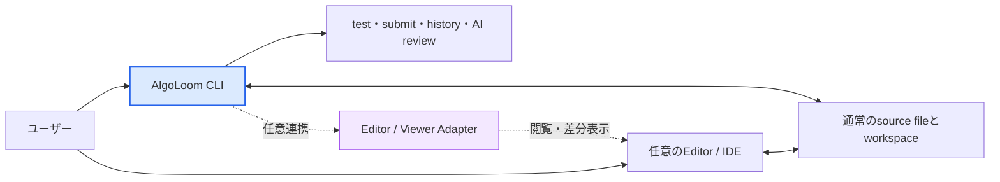

# プロジェクト草案: AlgoLoom

## 1. プロジェクトの目的
アルゴリズムという思考の糸を、ターミナル上で丁寧に織り上げるための完全ローカル完結型CLIツール。
ブラウザの往復を最小限に抑え、特定のエディタやIDEに依存せず、ユーザーが使い慣れた環境でコーディング・テスト・提出・AIレビュー・成長履歴の管理をシームレスに行う学習基盤を構築する。

AlgoLoomは、ユーザーがコードを書く道具やAIの利用範囲を決めない。ユーザー自身が、自分にとって最も集中しやすいエディタ、IDE、ターミナル、AI支援の組み合わせを選択できることを重視する。

## 2. システムアーキテクチャ・技術スタック
* **CLIツール開発言語:** Python (Typer または Click を想定)
* **コア機能補助:** online-judge-tools (スクレイピング、入出力例の取得、提出処理の代行)
* **AIレビュー連携:** ユーザーが明示的に選択するReview Backend。初期候補のlocal Model APIはOllamaとLM Studioとし、将来はBYOKのCloud APIや、公式interfaceを持つCoding Agent Bridgeへ段階的に拡張する。AlgoLoomはProvider本体やモデルをインストール・起動しない。
* **データベース:** SQLite (sqlite3 標準ライブラリを使用)
* **データ同期・インフラ:** Google ドライブの仮想ドライブ上にSQLiteの .db ファイルを配置し、端末間で自動同期。
* **エディタ連携:** AlgoLoom Coreはエディタに依存しない。閲覧や差分表示が必要な場合だけ、ユーザーが選択した外部Editor / ViewerをAdapter経由で起動する。

## 3. 中核となる設計思想

### 3.1. エディタ非依存

AlgoLoomは、Neovim、Vim、VS Code、Emacs、Helix、Zed等、特定のエディタやIDEを必須としない。ワークスペースには通常のディレクトリとソースファイルを作成し、編集方法をユーザーへ委ねる。

- `get`、`test`、`submit`等の主要コマンドは、エディタ連携がなくても利用できる。
- AlgoLoom Coreは、特定エディタのコマンド、設定形式、plugin APIを知らない。
- `show`と`diff`は、設定されたEditor / Viewer Adapterを介して外部ツールを利用する。
- 外部Viewerが未設定または利用不可の場合も、`show`はterminal上のplain text、`diff`はunified diffで表示できるfallbackを用意する。
- AlgoLoomはエディタ本体、plugin、ユーザー設定を無断でインストール、更新、変更しない。
- Neovim等への最適化は任意の初期設定またはAdapterとして提供し、Coreの必須依存にしない。



### 3.2. ユーザーの主体性とLLM

LLMがコードを生成できる時代でも、人間が自ら考えてコードを書く行為をAlgoLoomの中心から外さない。一方で、AIを使わないことを利用者へ強制もしない。

- 自分ですべて書く。
- エディタの補完だけを利用する。
- 設計相談や提出後のレビューだけにLLMを利用する。
- AI支援を利用しない。

これらを等しく有効な利用方法として扱う。コーディングを始めるまでの摩擦を下げることは、単なる効率化ではなく、ユーザーが自分の思考と技術でコードを書き、人間としての限界へ挑戦し続けられるUXにつながる。

AlgoLoomのAIレビューは任意機能とし、ユーザーのコードを自動編集、自動実行、自動提出する主体にはしない。AlgoLoomは学習者の代わりに問題を解くのではなく、学習者が選んだ道具と進め方を支える基盤である。

AIレビューの接続先も、エディタと同じくユーザーが選べる道具として扱う。local Model API、ユーザー自身のAPI credentialを使うCloud API、Providerが公式に組み込みを認めるCoding Agent Bridgeを同じReview Backend境界の後ろへ置く。一方、subscriptionとAPI認証は別の製品経路として区別し、Providerの許可なくlogin情報やOAuth tokenを転用しない。credentialは可能な限りユーザーまたは外部runtimeが所有し、AlgoLoomは安全判定、送信同意、review-onlyの権限制約を担う。

### 3.3. シンプルさとユーザーの自由

AlgoLoomは、初心者を助けるために学習手順を固定したり、利用者を特定の操作方法へ閉じ込めたりしない。CLIの敷居は、案内やモードを増やすことではなく、日常操作で覚える必要がある概念、入力、設定を減らすことで下げる。

- Coreの機能と日常操作は小さく保ち、1つの操作へ複数の目的を持たせすぎない。
- 安全に推測できる値には自然な既定値を用意する。ただし、暗黙の判断を隠さず、必要な利用者は明示的に上書きできるようにする。
- コマンドの実行順序、エディタ、言語、AIの利用有無、問題の選び方、振り返り方を必要以上に規定しない。
- 任意機能は、未設定であってもCoreの利用を妨げず、有効化を繰り返し要求しない。
- 初心者向けの使いやすさをAIへ依存させない。AIがなくても、主要操作、help、エラーからの復旧を理解できるようにする。
- 通常の成功出力は簡潔にし、詳細情報はhelp、明示option、診断command等から必要なときに取得できるようにする。
- 厳格な制約は、安全性、法令・サービスルール、privacy、データ完全性、外部送信や提出等の明示的な同意が必要な境界に限定する。
- これらの制約は学習方法を統制するためではなく、ユーザーのデータ、環境、選択権を守るために設ける。

AlgoLoomの内部実装が複雑になっても、その複雑さを日常のCLIへそのまま露出させない。一方で、簡略化のために必要な選択肢まで削るのではなく、一般的な操作を短くし、必要な場合だけ詳細な指定へ進める構造を採る。

本書および関連文書に記載するcommand名、引数、option、対話例、出力例は、明示的にCLI契約として確定したものを除き、機能と責任を説明するための暫定案とする。具体的なCLI設計は、上記原則と実際の利用検証を踏まえて別途決定する。

利用者導線ごとのストレス要因、改善優先度、errorと回復の共通契約は、[ストレスフリーUX設計](design/stress-free-ux-design.md)で定義する。

## 4. 解答言語と設定管理
C++（新規挑戦）、Python、Go、Rustなどの複数言語に対応。
プロジェクトルートに配置する config.yaml で、各言語の拡張子、テンプレートファイルパス、コンパイルコマンド、実行コマンドを管理する。

## 5. ディレクトリ構成（ハイブリッド型）
コンテキストスイッチを防ぐため、作業ディレクトリ直下に「問題ごとのフォルダ」を1階層だけ作成する構成。

    algoloom_workspace/
    ├── config.yaml
    ├── templates/
    │   ├── template.cpp
    │   └── template.py
    └── abc300_a/             # aloom get で自動生成
        ├── main.cpp          # 指定言語のテンプレートをコピー
        └── test/             # online-judge-tools が取得した入出力例

## 6. CLIコマンド構成

本節は、現時点で想定している機能と責任の整理であり、最終的なsubcommand名、引数、optionを確定するものではない。具体的なCLIは、シンプルさとユーザーの自由を優先して後の設計段階で決定する。

AlgoLoomの日常操作では、短く入力でき、製品名との関係も識別しやすい`aloom`を正式command名とする。Python package名や内部module名、保存directory名は`algoloom`を維持でき、command名と一致させる必要はない。

| 区分 | 名前 | 方針 |
|---|---|---|
| 製品名 | AlgoLoom | UI、文書、配布時の正式名称 |
| 正式command | `aloom` | README、help、利用例で優先して使用する |
| 互換command | `algoloom` | `aloom`と同じentry pointを呼び、既存scriptや明示的な正式名入力を支える |
| 任意alias | `al` | ユーザーが望む場合だけshell側で設定する。AlgoLoomから自動登録しない |

```bash
aloom get abc300_a
aloom test main.cpp
aloom submit main.cpp
```

`loom`は他のCLIと衝突しやすいため使用しない。AlgoLoomはshellの設定fileを無断で変更せず、`al`のaliasとcompletionを設定する手順だけを案内する。

| コマンド | 引数 / オプション | 実行される処理 |
| :--- | :--- | :--- |
| **get** | [問題ID]<br>--lang [言語] | ①online-judge-toolsでテストケースをtest/にDL<br>②指定言語の雛形ファイルを作成<br>③問題ページをデフォルトブラウザで自動起動 |
| **test** | [ファイル名] | config.yamlに基づきビルド（C++等）を行い、test/内のデータを使ってローカルで正誤判定を実行 |
| **submit** | [ファイル名]<br>--review | ①online-judge-toolsでAtCoderへコードを提出<br>②結果(AC/WA等)をポーリングして取得<br>③SQLiteにコードと結果を保存<br>④(--review時) 安全判定後、ユーザーが選択したReview Backendへコードと結果を送り、ターミナルに助言を出力 |
| **log** | なし | SQLiteから過去の提出履歴を取得し、ターミナル上に表形式（Rich等を使用）で一覧表示する |
| **show** | [問題ID] | DBから指定問題でACを出した最新のコードを取得し、安全な一時ファイルを設定済みEditor / Viewerで読み取り専用表示する。Viewerを利用できない場合はterminal上のplain text表示へfallbackする |
| **diff** | [問題ID] | DBから「初回提出時」と「最新提出時」のコードを取得し、設定済みDiff Viewerで成長差分を表示する。Viewerを利用できない場合はterminal上のunified diffへfallbackする |

## 7. 今後の拡張構想 (フェーズ2以降)
* **fzf連携の実装:** log や show コマンド実行時に、Linuxコマンドの fzf ライクなインタラクティブ検索UIをターミナルに表示し、過去問をインクリメンタルサーチできるようにする。
* **ダッシュボード化:** DBの蓄積データを利用し、将来的にチャート等を用いたWeb UIを作成する。
* **Editor / Viewer Adapter:** 実需に応じて代表的な外部ツール向け設定例を追加する。ただし、個別エディタの機能をAlgoLoom Coreへ組み込まない。
