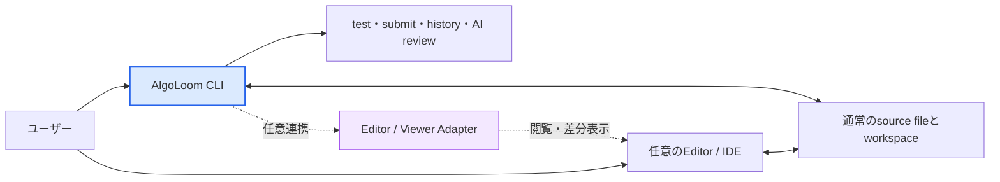

# プロジェクト草案: AlgoLoom

## 1. プロジェクトの目的
アルゴリズムという思考の糸を、ターミナル上で丁寧に織り上げるためのローカルファーストCLIツール。
ブラウザの往復を最小限に抑え、特定のエディタやIDEに依存せず、ユーザーが使い慣れた環境でコーディング・テスト・提出・AIレビュー・成長履歴の管理をシームレスに行う学習基盤を構築する。

AlgoLoomは、ユーザーがコードを書く道具やAIの利用範囲を決めない。ユーザー自身が、自分にとって最も集中しやすいエディタ、IDE、ターミナル、AI支援の組み合わせを選択できることを重視する。

## 2. システムアーキテクチャ・技術スタック
* **CLIツール開発言語:** Python (Typer または Click を想定)
* **コア機能補助:** online-judge-tools (スクレイピング、入出力例の取得、提出処理の代行)
* **AIレビュー連携:** ユーザーが明示的に選択するReview Backend。初期候補のlocal Model APIはOllamaとLM Studioとし、将来はBYOKのCloud APIや、公式interfaceを持つCoding Agent Bridgeへ段階的に拡張する。AlgoLoomはProvider本体やモデルをインストール・起動しない。
* **データベース:** ローカルSQLiteを履歴の通常の読み書き先として使用する。基本構成ではPython標準`sqlite3`を使用する。
* **データ同期・インフラ:** 複数端末利用を望むユーザーだけが、Turso Cloudを介した任意の同期機能を有効化できる。Cloudは履歴表示の必須経路ではなく、端末間共有のために使用する。Google Drive等のファイル同期領域へSQLite DBファイルを置かない。
* **エディタ連携:** AlgoLoom Coreはエディタに依存しない。閲覧や差分表示が必要な場合だけ、ユーザーが選択した外部Editor / ViewerをAdapter経由で起動する。

## 3. 中核となる設計思想

### 3.1. エディタ非依存

AlgoLoomは、Neovim、Vim、VS Code、Emacs、Helix、Zed等、特定のエディタやIDEを必須としない。ワークスペースには通常のディレクトリとソースファイルを作成し、編集方法をユーザーへ委ねる。

- `get`、`test`、`submit`等の主要コマンドは、エディタ連携がなくても利用できる。
- AlgoLoom Coreは、特定エディタのコマンド、設定形式、plugin APIを知らない。
- `show`と`diff`は、設定されたEditor / Viewer Adapterを介して外部ツールを利用する。
- 外部Viewerが未設定または利用不可の場合も、`show`はterminal上のplain text、`diff`はunified diffで表示できるfallbackを用意する。
- AlgoLoomはエディタ本体、plugin、ユーザー設定を無断でインストール、更新、変更しない。
- Neovim等への最適化は任意の初期設定またはAdapterとして提供し、Coreの必須依存にしない。



### 3.2. ユーザーの主体性とLLM

LLMがコードを生成できる時代でも、人間が自ら考えてコードを書く行為をAlgoLoomの中心から外さない。一方で、AIを使わないことを利用者へ強制もしない。

- 自分ですべて書く。
- エディタの補完だけを利用する。
- 設計相談や提出後のレビューだけにLLMを利用する。
- AI支援を利用しない。

これらを等しく有効な利用方法として扱う。コーディングを始めるまでの摩擦を下げることは、単なる効率化ではなく、ユーザーが自分の思考と技術でコードを書き、人間としての限界へ挑戦し続けられるUXにつながる。

AlgoLoomのAIレビューは任意機能とし、ユーザーのコードを自動編集、自動実行、自動提出する主体にはしない。AlgoLoomは学習者の代わりに問題を解くのではなく、学習者が選んだ道具と進め方を支える基盤である。

#### AIレビューの目的

AlgoLoomのAIレビューの目的は、主として終了済み過去問について、**自分で書いた解答を次の一問で使える知識へ変えること**である。AIによる採点や完成解答の生成を主目的にせず、利用者自身の実装、test結果、提出結果、過去の実装snapshotを材料に、正誤判定だけでは得られない振り返りを支援する。

- ACした実装について、計算量の余裕、境界値、可読性、言語固有のidiom等、正誤判定の外側にある観点を学ぶ。
- 自分の実装と、同じalgorithmの別表現、別のdata structure、異なるalgorithm等を比較し、優劣の断定ではなくtrade-offを理解する。
- WA、TLE、RE、CE等について、完成codeを直ちに受け取るのではなく、原因候補、根拠、追加で試すtest、段階的なhintから自分で修正する力を育てる。
- 初回提出からACまでの実装差分や、同じ問題に対する過去の提出を振り返り、何を理解し、何を変更し、どの課題を繰り返しているかを確認する。複数問題を横断する成長分析は、各問題の安全判定と送信範囲を設計した後の拡張とする。
- 個別の指摘を今回限りの修正で終わらせず、次の問題へ持ち越せる原則、言語知識、確認習慣として整理する。

実装履歴は単に古いcodeを保存するためのものではなく、利用者自身の試行錯誤と成長を振り返る学習資産として扱う。AlgoLoomは、現在のcodeだけを単発でreviewする機能よりも、提出履歴、判定、差分、過去のreviewを結び付けた継続的な振り返りに固有の価値を置く。

AI reviewは常に有益な指摘を返せるとは限らない。重要な改善点を確認できない場合に無理に批判を生成させず、correctness上の疑い、performance上の懸念、readabilityの提案、style上の好み、代替案を区別する。利用者が根拠を確認して採否を決めるための助言として表示し、正解、採点、公式解説、人間のreviewerの代替とはみなさない。

学習者の主体性を守るため、AI reviewは利用者が明示的に求めたときだけ実行する。提出のたびに自動実行せず、完成した別解codeの一括提示や自動適用よりも、少数の重要な観点、実装間の差とtrade-off、利用者自身が考えるための問いを優先する。AtCoderの現行ルールと個別contest ruleをreview前に確認し、禁止対象または判定不能な場合は実行しない。

AIレビューの接続先も、エディタと同じくユーザーが選べる道具として扱う。local Model API、ユーザー自身のAPI credentialを使うCloud API、Providerが公式に組み込みを認めるCoding Agent Bridgeを同じReview Backend境界の後ろへ置く。一方、subscriptionとAPI認証は別の製品経路として区別し、Providerの許可なくlogin情報やOAuth tokenを転用しない。credentialは可能な限りユーザーまたは外部runtimeが所有し、AlgoLoomは安全判定、送信同意、review-onlyの権限制約を担う。

### 3.3. シンプルさとユーザーの自由

AlgoLoomは、初心者を助けるために学習手順を固定したり、利用者を特定の操作方法へ閉じ込めたりしない。CLIの敷居は、案内やモードを増やすことではなく、日常操作で覚える必要がある概念、入力、設定を減らすことで下げる。

- Coreの機能と日常操作は小さく保ち、1つの操作へ複数の目的を持たせすぎない。
- 安全に推測できる値には自然な既定値を用意する。ただし、暗黙の判断を隠さず、必要な利用者は明示的に上書きできるようにする。
- コマンドの実行順序、エディタ、言語、AIの利用有無、問題の選び方、振り返り方を必要以上に規定しない。
- 任意機能は、未設定であってもCoreの利用を妨げず、有効化を繰り返し要求しない。
- 初心者向けの使いやすさをAIへ依存させない。AIがなくても、主要操作、help、エラーからの復旧を理解できるようにする。
- 通常の成功出力は簡潔にし、詳細情報はhelp、明示option、診断command等から必要なときに取得できるようにする。
- 厳格な制約は、安全性、法令・サービスルール、privacy、データ完全性、外部送信や提出等の明示的な同意が必要な境界に限定する。
- これらの制約は学習方法を統制するためではなく、ユーザーのデータ、環境、選択権を守るために設ける。

AlgoLoomの内部実装が複雑になっても、その複雑さを日常のCLIへそのまま露出させない。一方で、簡略化のために必要な選択肢まで削るのではなく、一般的な操作を短くし、必要な場合だけ詳細な指定へ進める構造を採る。

### 3.4. 標準ツールとの責任境界

AlgoLoomは、AlgoLoomだけが意味を理解できる操作に専用commandを用意し、一般的なfile・directory操作を独自commandとして再定義しない。目的はcommand数そのものを最小化することではなく、利用者が新たに覚える製品固有の概念を必要最小限にすることである。

- 問題取得、sample test、提出、判定取得、履歴、AI review、同期等、AlgoLoom固有のmetadata、状態遷移、外部作用を扱う操作はAlgoLoomが担う。
- `cd`、`pwd`、一覧表示、通常fileやdirectoryの作成・移動・rename・copy・削除等、一般的な操作は、利用者が選んだshell、OSのfile manager、Editor / IDE等へ委ねる。
- AlgoLoomは、一般操作の単なる別名となる`move`、`copy`、`cd`等を、初心者向けという理由だけで追加しない。
- 一般操作であっても、AlgoLoom管理dataの整合性、安全な復旧、外部送信への同意等、製品固有の保証が必要な場合は、専用commandまたは専用optionを設けることを妨げない。
- OSの標準操作によるsourceや問題directoryの削除は、AlgoLoomの提出履歴、Cloud上のdata、credential等の削除を意味しない。それらAlgoLoom管理dataの削除が必要になった場合は、対象と影響を確認できる専用操作として分離する。
- helpとerrorは、作成・参照したpath、現在AlgoLoomが認識しているcontext、次に可能な操作を平易に示す。必要な場合はOS・shellごとの標準的な操作例を文書で案内する。
- 初心者支援では独自操作を増やすのではなく、標準的な操作を理解して安全に次へ進める案内を優先する。そこで得た知識をAlgoLoom以外の開発でも使える状態を目指す。
- 最初の問題取得からlocal testまでの推奨導線では、workspace整理のための移動・rename等を必須にしない。標準操作は利用者が必要とした時点で学べるようにする。

この責任境界はCLI上のUXに関するものである。AlgoLoom自身が内部処理としてdirectory作成やfile copyを行う場合は、shell command文字列を組み立ててOS utilityを起動するのではなく、Pythonの安全なfilesystem APIを使用する。

本書および関連文書に記載するcommand名、引数、option、対話例、出力例は、明示的にCLI契約として確定したものを除き、機能と責任を説明するための暫定案とする。具体的なCLI設計は、上記原則と実際の利用検証を踏まえて別途決定する。

利用者導線ごとのストレス要因、改善優先度、errorと回復の共通契約は、[ストレスフリーUX設計](design/stress-free-ux-design.md)で定義する。

### 3.5. 履歴参照のローカルファースト契約

過去の提出コードは学習のために繰り返し参照する資産である。したがって、同期を有効化しているか、ネットワークやCloudが利用可能かにかかわらず、履歴参照の通常経路をCloud問い合わせに依存させない。

- `log`、`show`、`diff`は、その端末のローカルユーザーDBから直ちに読み取る。
- 通常の履歴参照で同期完了を待たない。別端末の変更を反映した最新状態が必要な場合だけ、利用者が明示的に同期を実行する。
- `submit`で取得した履歴は、Cloud送信より先にローカルへ原子的に永続化する。Cloud同期が失敗した場合も、履歴を表示・差分比較できる状態を保ち、再送対象として保持する。
- Cloudへの反映成功は「別端末から取得可能」、ローカル保存成功は「この端末から直ちに参照・回復可能」と区別して表示する。
- 問題カタログなど再取得可能な補助データだけをTTL付きローカルキャッシュとして扱う。提出コードや判定結果を、失われてもよいキャッシュとして扱わない。
- 「ローカルが真」とは、すべてのデータをローカルだけで決定する意味ではない。データごとに権威を1つ定める。編集中のcodeはworkspace、AtCoderの提出ID・判定はAtCoder、提出履歴とreview revisionはAlgoLoomの不変レコード、問題カタログは取得元サービスを権威とする。
- 同じ提出履歴をローカルDBとCloudへ保存しても、別々の正本を作らない。同じUUIDとcode hashを持つ1つの論理レコードを、ローカル保存済み・共有済みという状態で複製する。同期状態や再送キューは業務履歴の別の正本ではない。

同期、競合、バックアップ、障害復旧の詳細は[ローカル利用とCloud同期の段階的設計](database/local-and-cloud-sync-design.md)で定義する。待機時間、resource上限、性能計測、修正優先順位は[パフォーマンスと待機体験の設計](design/performance-and-waiting-design.md)で定義する。

## 4. 解答言語と設定管理
C++（新規挑戦）、Python、Go、Rustなどの複数言語に対応。
プロジェクトルートに配置する config.yaml で、各言語の拡張子、テンプレートファイルパス、コンパイルコマンド、実行コマンドを管理する。

## 5. ディレクトリ構成（ハイブリッド型）
コンテキストスイッチを防ぐため、`get`は既定でworkspace直下に「問題ごとのフォルダ」を1階層だけ作成する。この構成は開始時の推奨layoutであり、利用者が維持し続けなければならない実行時制約ではない。

    algoloom_workspace/
    ├── config.yaml
    ├── templates/
    │   ├── template.cpp
    │   └── template.py
    └── abc300_a/             # aloom get で自動生成
        ├── main.cpp          # 指定言語のテンプレートをコピー
        └── test/             # online-judge-tools が取得した入出力例

作成後は、利用者がOS、shell、file manager、Editor / IDEの標準操作でworkspace全体や問題directoryを移動・rename・整理できることを基本契約とする。

- workspace全体を移動しても、workspace内の相対的な構成から再認識できるようにする。
- 問題directoryは、workspace内でrenameまたは下位directoryへ移動しても、directory名ではなく保存済みの正規問題IDを含むmetadataから識別する。
- 問題metadataは問題directoryと一緒に移動できる通常fileとして保存し、絶対pathを問題や履歴の恒久的な識別子にしない。
- commandは現在directoryまたは明示されたsourceから親方向へcontextを探索し、安全に一意に決まる場合だけworkspace、問題、sourceを推測する。
- sourceだけを問題context外へ移動した場合等、一意に判断できない状態では勝手に関連付けず、必要なcontextと明示指定方法を説明する。
- 複数の同一問題directoryが存在する場合は、暗黙に先頭候補を選んだりmerge・削除したりしない。

## 6. CLIコマンド構成

本節は、現時点で想定している機能と責任の整理であり、最終的なsubcommand名、引数、optionを確定するものではない。具体的なCLIは、シンプルさとユーザーの自由を優先して後の設計段階で決定する。

AlgoLoomの日常操作では、短く入力でき、製品名との関係も識別しやすい`aloom`を正式command名とする。Python package名や内部module名、保存directory名は`algoloom`を維持でき、command名と一致させる必要はない。

| 区分 | 名前 | 方針 |
|---|---|---|
| 製品名 | AlgoLoom | UI、文書、配布時の正式名称 |
| 正式command | `aloom` | README、help、利用例で優先して使用する |
| 互換command | `algoloom` | `aloom`と同じentry pointを呼び、既存scriptや明示的な正式名入力を支える |
| 任意alias | `al` | ユーザーが望む場合だけshell側で設定する。AlgoLoomから自動登録しない |

```bash
aloom get abc300_a
aloom test main.cpp
aloom submit main.cpp
```

`loom`は他のCLIと衝突しやすいため使用しない。AlgoLoomはshellの設定fileを無断で変更せず、`al`のaliasとcompletionを設定する手順だけを案内する。

| コマンド | 引数 / オプション | 実行される処理 |
| :--- | :--- | :--- |
| **get** | [問題ID]<br>--lang [言語] | ①online-judge-toolsでテストケースをtest/にDL<br>②指定言語の雛形ファイルを作成<br>③問題ページをデフォルトブラウザで自動起動 |
| **test** | [ファイル名] | config.yamlに基づきビルド（C++等）を行い、test/内のデータを使ってローカルで正誤判定を実行 |
| **submit** | [ファイル名]<br>--review | ①online-judge-toolsでAtCoderへコードを提出<br>②結果(AC/WA等)をポーリングして取得<br>③コードと結果をローカルSQLiteへ原子的に保存<br>④同期有効時だけCloud反映を短時間試行し、失敗時は再送対象として保持<br>⑤(--review時) 安全判定後、ユーザーが選択したReview Backendへコードと結果を送り、ターミナルに助言を出力 |
| **log** | なし | ローカルSQLiteから過去の提出履歴を取得し、通信を待たずにターミナル上へ表形式（Rich等を使用）で一覧表示する |
| **show** | [問題ID] | ローカルDBから指定問題でACを出した最新のコードを取得し、安全な一時ファイルを設定済みEditor / Viewerで読み取り専用表示する。Viewerを利用できない場合はterminal上のplain text表示へfallbackする。通常はCloud同期を待たない。 |
| **diff** | [問題ID] | ローカルDBから「初回提出時」と「最新提出時」等、利用者が振り返る2つの実装snapshotを取得し、設定済みDiff Viewerで試行錯誤と成長の差分を表示する。Viewerを利用できない場合はterminal上のunified diffへfallbackする。通常はCloud同期を待たない。 |

一般的なfile・directory操作はこのcommand体系へ含めない。例えば問題directoryの移動には、macOS / Linuxの`mv`、PowerShellの`Move-Item`、各OSのfile manager、Editor / IDEのfile操作等をそのまま利用できるようにする。

## 7. 今後の拡張構想 (フェーズ2以降)
* **fzf連携の実装:** log や show コマンド実行時に、Linuxコマンドの fzf ライクなインタラクティブ検索UIをターミナルに表示し、過去問をインクリメンタルサーチできるようにする。
* **ダッシュボード化:** DBの蓄積データを利用し、将来的にチャート等を用いたWeb UIを作成する。
* **Editor / Viewer Adapter:** 実需に応じて代表的な外部ツール向け設定例を追加する。ただし、個別エディタの機能をAlgoLoom Coreへ組み込まない。
* **Repair Lab（将来の独立学習モード）:** AtCoder Coreが安定した後、他者またはLLMが書いた検証済みcodeを読み、修正前に原因仮説・根拠・予測・確信度を記録し、testによる検証、最小限の修正、回帰確認、確信度の更新までを練習する独立モードを検討する。patchの速さや想定解との一致ではなく、調査と検証の質を中心に扱う。詳細は[Repair Lab 将来構想](design/repair-lab-future-design.md)で定義する。
