# AlgoLoom Turso設計ガイド

> 対象: AlgoLoomにおけるTursoの採用判断、データの権威、複数デバイス同期、競合・障害時の設計
>
> 作成日: 2026年7月15日
>
> 注意: TursoのSDK、同期方式、料金、制約は変更される可能性がある。実装開始時には末尾の公式資料を再確認すること。

---

## 0. 結論

Tursoには、性質の異なる2つの利用方式がある。

1. **Embedded Replica方式**
   - Turso Cloudを共有データの正本とする。
   - 各端末はローカルレプリカから高速に読み取る。
   - 通常の書き込みはCloud primaryへ送る。
   - データの権威が明確で、複数デバイス同期を理解しやすい。

2. **Turso Sync方式**
   - 各端末のローカルDBで読み書きし、`push()` / `pull()`でCloudと同期する。
   - オフライン書き込みができる。
   - Cloudは共有状態の集約点だが、未pushの変更は端末内にしか存在しない。
   - 同じ行を複数端末で変更した場合の競合設計が必要になる。

**AlgoLoomの初期版では、Embedded Replica方式を採用する。**

理由は、`submit`自体がAtCoderへの接続を必要とするため、提出履歴の保存もオンラインで行う設計が許容でき、Cloudを正本とする単純なモデルを選べるからである。`log`、`show`、`diff`はローカルレプリカから読み取れるため、通常の履歴参照はオフラインでも利用できる。

完全なオフライン書き込みが必要になった段階で、Turso Syncへの移行を再検討する。

なお、AlgoLoomは個人または数人での利用を想定し、同じ論理データを複数端末から同時編集しない。そのため、Turso Syncの**last-push-wins（後勝ち）を許容する**。競合方式そのものはTurso Syncの採用阻害要因としない。ただし、初期版でEmbedded Replicaを選ぶ判断は、Python SDKの安定性や運用の単純さも含めたものであり、この合意だけでは変更しない。

---

## 1. 「ローカルファースト」の意味

ローカルファーストは、次のことを意味する。

- 通常の読み書きをネットワーク越しではなくローカルDBに対して行う。
- ネットワーク障害中でもアプリの主要機能を継続できる。
- 変更は後から共有先へ同期する。

一方で、次の意味ではない。

- 各端末のデータが常に同一である。
- 各端末が同時に唯一の正本になる。
- 同期競合が自動的に意図どおり解決される。
- 同期がバックアップの代わりになる。

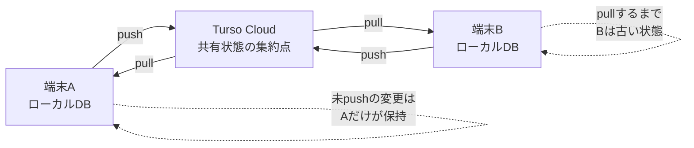

Turso Syncはピア・ツー・ピア同期ではない。端末間の変更はTurso Cloudを経由する。ただし、未pushの変更までCloudが把握しているわけではないため、全端末にまたがる「常に最新の単一状態」は存在しない。

---

## 2. 用語とデータの権威

### 2.1. 用語

| 用語 | この文書での意味 |
|---|---|
| 正本 / System of Record | 複数デバイス間で共有される、最終的に参照すべきデータ |
| ローカル状態 | その端末が現在認識しているデータ。未同期変更を含む場合がある |
| 共有確定状態 | Cloudへの書き込みまたはpushが成功し、他端末が取得可能になった状態 |
| pending変更 | ローカルには存在するが、まだCloudに反映されていない変更 |
| pull | Cloudの変更をローカルへ取り込む処理 |
| push | ローカルの変更をCloudへ送る処理 |
| 競合 | 複数端末が同じ論理データへ両立しない変更を行った状態 |

### 2.2. AlgoLoomにおける権威の所在

| データ | 権威 | 補足 |
|---|---|---|
| 提出ID、提出時刻、判定結果 | AtCoder | AlgoLoomは取得した結果を保存する |
| 共有済みの提出履歴・コード | Turso Cloud | 複数端末間で共有する正本 |
| 編集中のソースコード | 各端末のワークスペース | 未提出コードはDB共有の対象外 |
| ローカルレプリカ | 各端末 | Cloudの複製または未同期変更を含む作業状態 |
| 同期キュー / outbox | 作成した端末 | Cloud反映前の変更を失わないためのローカル専用データ |
| バックアップ | Cloudとは別の保存先 | 同期とは別に管理する |

---

## 3. 2方式の比較

| 評価軸 | Embedded Replica | Turso Sync |
|---|---|---|
| 共有データの正本 | Turso Cloud | Cloud上の共有状態。ただし未push変更は端末内 |
| 読み取り先 | ローカルレプリカ | ローカルDB |
| 通常の書き込み先 | Cloud primary | ローカルDB |
| オフライン読み取り | 可能 | 可能 |
| オフライン書き込み | 原則不可 | 可能 |
| 他端末への反映 | Cloud書き込み後、他端末が同期 | push成功後、他端末がpull |
| 同じ行の同時更新 | primary側で直列化される | 標準はlast-push-wins |
| データの権威の分かりやすさ | 高い | 運用ルールが必要 |
| アプリ側の同期制御 | 少ない | push、pull、checkpoint、競合方針が必要 |
| AlgoLoom初期版との相性 | **最適** | 将来候補 |
| 主なPythonパッケージ | `libsql` | `pyturso` / `turso.sync` |

---

## 4. Embedded Replica方式

### 4.1. アーキテクチャ

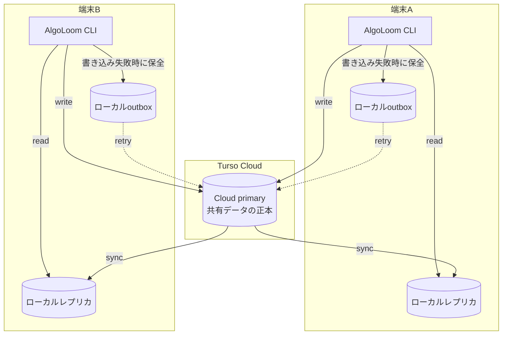

### 4.2. データフロー

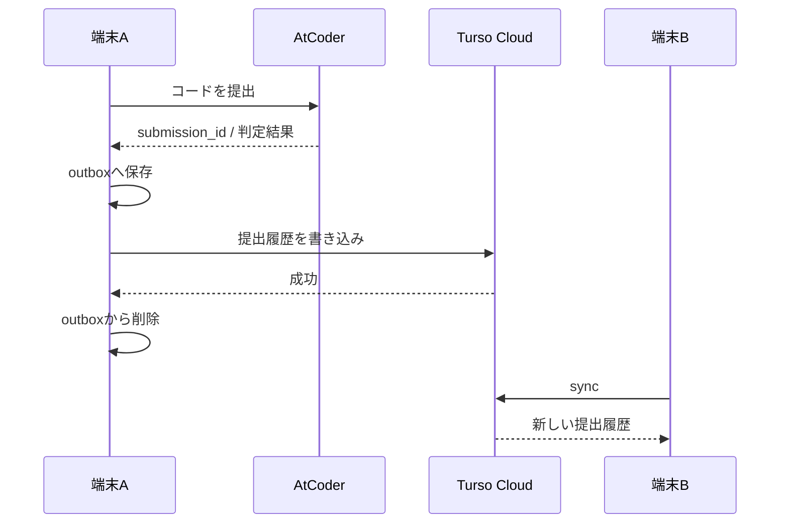

### 4.3. 特徴

- Cloud primaryが共有データの正本になる。
- 読み取りはローカルファイルから行われる。
- 書き込みはCloud primaryへ送られ、成功後にローカルへ反映される。
- 別端末は同期するまで古いデータを読む可能性がある。
- Cloudへ接続できない間も、同期済みの履歴は参照できる。
- Cloud書き込みに失敗したデータは、アプリ側のoutboxで再送可能にする。

### 4.4. AlgoLoomでのコマンド挙動

| コマンド | オフライン時 | 同期方針 |
|---|---|---|
| `get` | 問題取得は不可 | DB同期とは独立 |
| `test` | 利用可能 | DBアクセス不要 |
| `submit` | AtCoder提出が不可 | 提出成功後、outboxを経由してCloudへ保存 |
| `log` | 同期済み範囲を表示可能 | 開始時にbest-effortでsync |
| `show` | 同期済み範囲を表示可能 | 開始時にbest-effortでsync |
| `diff` | 同期済み範囲を表示可能 | 開始時にbest-effortでsync |
| `sync` | 失敗を明示 | outbox再送後、Cloudから同期 |
| `sync status` | ローカル情報を表示 | 最終成功時刻、outbox件数、最終エラーを表示 |

### 4.5. 採用理由

- AlgoLoomのデータ更新は主に`submit`で発生し、`submit`は元々オンライン処理である。
- 履歴参照系コマンドはローカルレプリカで動作できる。
- 複数端末からの書き込み先がCloud primaryに集約される。
- Turso Syncより競合・同期状態の設計が単純になる。

---

## 5. Turso Sync方式

### 5.1. アーキテクチャ

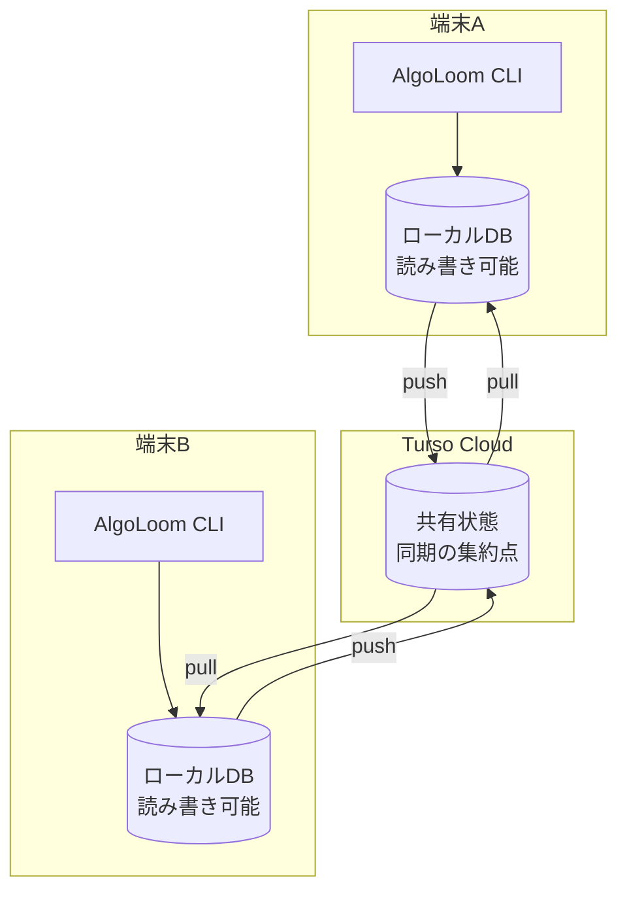

### 5.2. データフロー

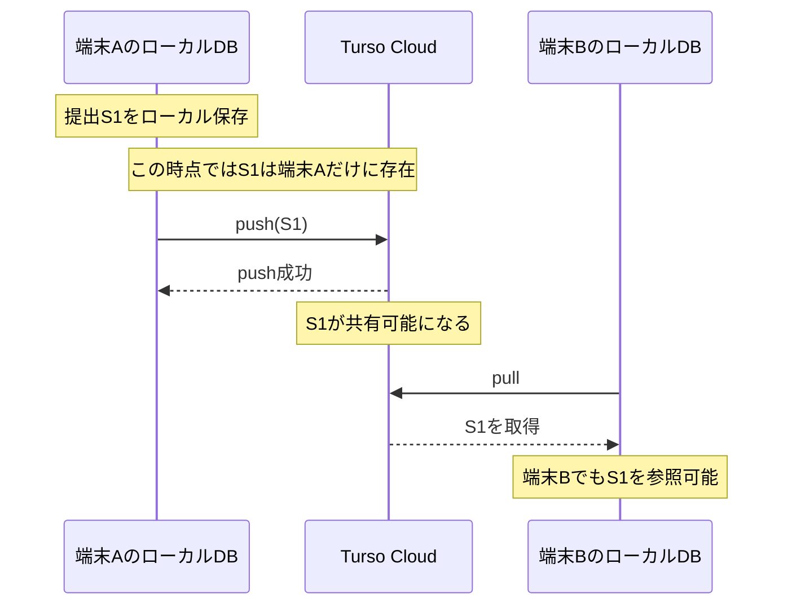

### 5.3. 権威の考え方

Turso Syncでは、データの権威を二段階に分ける。

- **ローカル作業状態**
  - その端末にとっての最新状態。
  - 未push変更を含む可能性がある。
- **Cloud共有状態**
  - 他端末へ配布可能な共有状態。
  - pushされていない変更は含まない。

したがって、ユーザーへ「同期済みか」「この端末だけに存在する変更があるか」を明示する必要がある。

### 5.4. pull時の扱い

公式仕様では、未pushのローカル変更がある状態でpullした場合、概ね次の順序で処理される。

1. ローカルDBを最後に同期した状態へ一時的に戻す。
2. Cloudの変更を適用する。
3. 未pushだったローカル変更をその上へ再適用する。
4. 一連の処理をアトミックに完了する。

### 5.5. 競合

Turso Syncの標準的な競合解決は**last-push-wins**である。

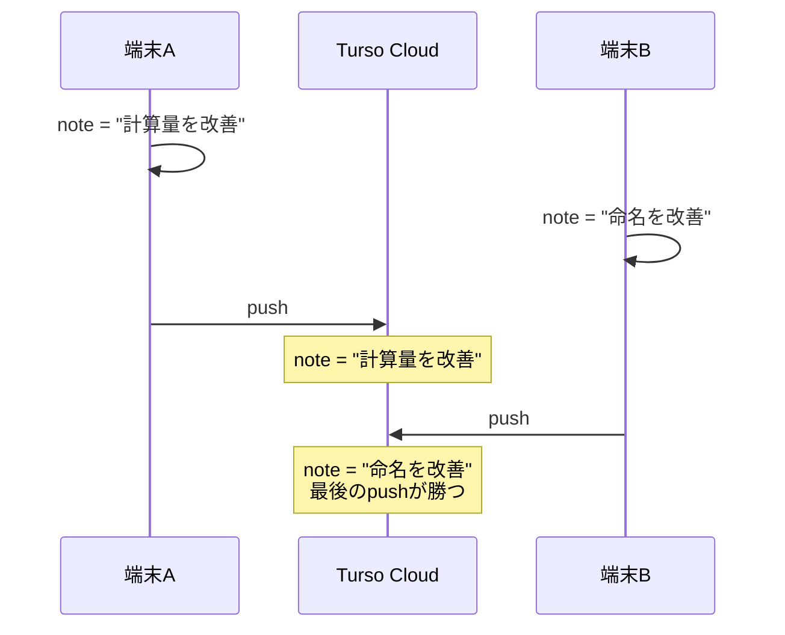

この方式では、同じ行の更新を複数端末で許すと、先にpushした内容が失われる可能性がある。AlgoLoomでは、競合を解決するよりも、競合しにくいデータモデルを採用する。

#### 5.5.1. 「後勝ち」の基準

last-push-winsで基準になるのは、原則として**編集した時刻ではなく、Cloudへpushした順序**である。

たとえば、端末Bが先に編集していても、端末Bのpushが最後なら端末Bの変更が最終状態になる。ローカル時計の`updated_at`だけを見て勝敗を決める仕組みとして扱ってはならない。

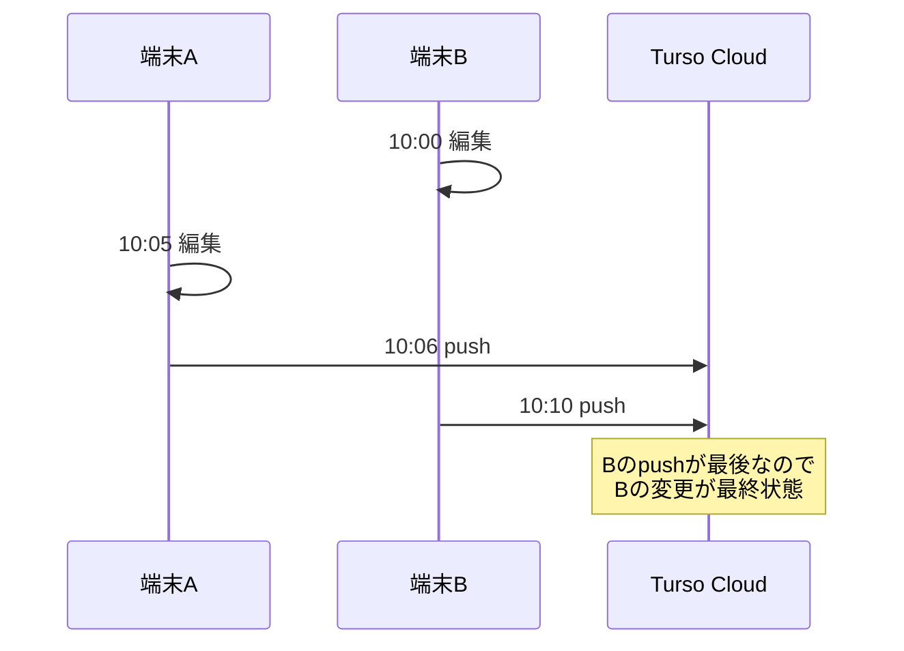

#### 5.5.2. AlgoLoomとしての設計判断

AlgoLoomでは、次の利用前提に基づいてlast-push-winsを正式に許容する。

| 前提 | 内容 |
|---|---|
| 利用者数 | 個人、または相互に運用を調整できる数人 |
| 同時編集 | 同じ提出・レビュー・設定を複数端末から同時編集しない |
| 主な共有データ | 競合しにくい追記専用の提出履歴 |
| 端末切り替え | 別端末で作業を始める前にpullする |
| 作業終了 | 重要な変更後、端末を離れる前にpushする |
| 競合発生時 | 最後にpushした変更を採用しても、許容できない損害にならない |

この前提では、Gitのような手動マージUIや、フィールド単位の複雑な競合解決は実装しない。代わりに、次の単純な運用を採用する。

- 作業開始時にpullする。
- 作業終了時にpushする。
- 未push変更がある間は、別端末で同じデータを編集しない。
- 提出履歴は更新ではなく追加する。
- レビューを残す必要がある場合は、上書きよりリビジョン追加を優先する。
- push / pullの最終成功時刻を確認できるようにする。

#### 5.5.3. 再検討が必要になる条件

次のいずれかが発生した場合は、last-push-winsを再評価する。

| 再検討条件 | 必要になる可能性がある対策 |
|---|---|
| 不特定多数または大人数で利用する | ユーザー認証、権限、監査ログ |
| 同じレビューや設定を共同編集する | 楽観ロック、バージョン番号、競合UI |
| リアルタイム共同編集を行う | CRDT、OT、Realtime対応基盤 |
| 上書きによる情報消失を許容できない | 追記専用イベント、リビジョン履歴、手動マージ |
| 削除操作を複数端末で行う | tombstone、削除権限、復元期間 |
| 正確な監査証跡が必要になる | 不変ログ、サーバー時刻、監査専用テーブル |

これらに該当しない限り、last-push-winsはAlgoLoomの規模と用途に対して十分な競合解決方式と判断する。

### 5.6. 運用上必要な処理

- 起動時またはコマンド開始時のbest-effort `pull()`
- ローカル変更後のbest-effort `push()`
- 明示的な`algoloom sync`
- 最終pull / push時刻とエラーの表示
- WAL肥大化を防ぐ定期的な`checkpoint()`
- スキーマバージョンの互換性確認
- 同じ論理データを同時更新しないためのデータモデリング

---

## 6. AlgoLoom向けデータ設計

### 6.1. 基本原則

- 提出履歴は**追記専用（append-only）**にする。
- 端末ごとの連番や`AUTOINCREMENT`を共有IDに使わない。
- 主キーにはUUIDv7またはULIDを使用する。
- AtCoderのsubmission IDには一意制約を付け、再取得時の重複登録を防ぐ。
- 提出済みコードと判定結果は原則として上書きしない。
- レビューやメモを更新可能にする場合は、行の上書きではなくリビジョンを追加する。
- 削除は必要になるまで実装しない。実装する場合はhard deleteではなくtombstoneを検討する。
- スキーママイグレーションは一度に1端末だけで実行する。

### 6.2. 推奨する論理モデル

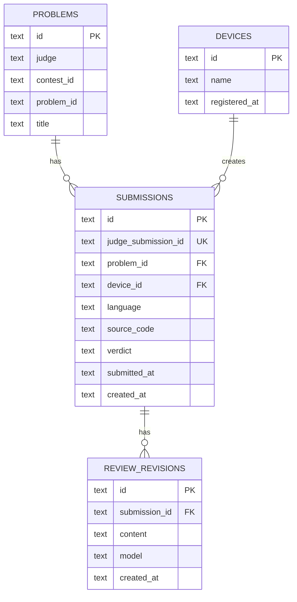

### 6.3. 競合を避けるルール

| 操作 | 競合リスク | 方針 |
|---|---:|---|
| 新しい提出の保存 | 低 | UUIDで新規行を追加する |
| 同じ提出の再取得 | 低 | `judge_submission_id`の一意制約で冪等化する |
| 判定結果の更新 | 中 | 確定後に保存する。更新が必要なら状態遷移を限定する |
| AIレビューの編集 | 高 | `REVIEW_REVISIONS`へ新しい版を追加する |
| 問題タイトル等の更新 | 中 | judge + contest + problemの決定的IDでupsertする |
| データ削除 | 高 | tombstoneまたは特定端末だけに操作権限を限定する |
| スキーマ変更 | 非常に高 | 単一端末から実行し、他端末は先に同期する |

### 6.4. 同期状態を共有DBへ保存しない

`sync_status = synced`のような状態を共有対象の同じDBへ書くと、その更新自体が新しい未同期変更になる場合がある。

そのため、同期状態は次のどちらかで管理する。

- Turso SDKが返す同期統計を参照する。
- ローカル専用のsidecar DBまたは設定ファイルへ保存する。

ローカル専用情報の例:

- 最終pull成功時刻
- 最終push成功時刻
- 最終エラー
- outbox件数
- Cloud revision
- 送受信バイト数

---

## 7. 同期ポリシー

### 7.1. Embedded Replica採用時

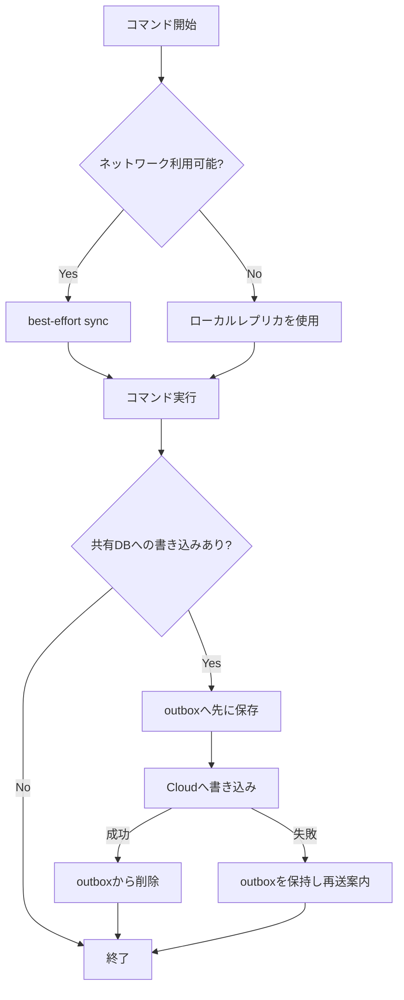

- 読み取り系コマンドは同期失敗を致命的エラーにしない。
- 履歴が古い可能性がある場合は、最終同期時刻を表示できるようにする。
- 書き込み前にoutboxへ保存し、Cloud障害による履歴消失を防ぐ。
- outboxへの保存とCloudへの書き込みは同じトランザクションにはできないため、冪等キーで再送を安全にする。

### 7.2. Turso Sync採用時

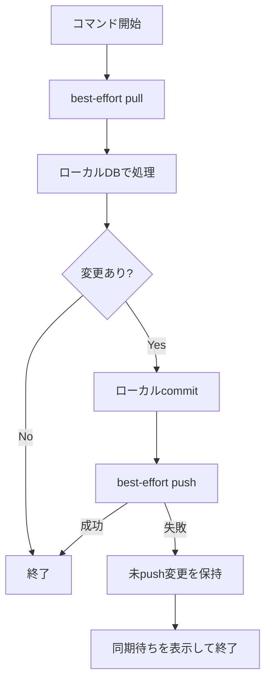

- ローカルcommitが成功していれば、push失敗でコマンド全体を失敗扱いにしない。
- `push()`成功前に「他端末へ共有済み」と表示しない。
- 別端末で作業を開始する前に`pull()`する。
- push失敗中の端末を削除・初期化しない。
- `checkpoint()`を定期実行し、ローカルWALの無制限な増加を防ぐ。

---

## 8. 障害・競合時の設計

| 状況 | Embedded Replica | Turso Sync | AlgoLoomの対応 |
|---|---|---|---|
| ネットワーク切断 | 同期済みデータの読み取りのみ | ローカル読み書き可能 | 最終同期時刻を表示する |
| Cloud障害 | 書き込み不可 | ローカルcommit後、push待ち | outboxまたは未push変更を保持する |
| 端末紛失 | Cloud書き込み済みデータは保持 | 未push変更は失われる | 重要変更後はpushを促す |
| 同じ提出を再登録 | 一意制約違反の可能性 | 同左 | 冪等キーで成功扱いにする |
| 同じ行を別端末で更新 | primary側で順序付け | last-push-wins | 追記専用モデルで回避する |
| 古い端末が接続 | syncで更新 | pullで更新 | スキーマ互換性を先に検証する |
| スキーマ不一致 | クエリエラーの可能性 | replay失敗の可能性 | DBアクセス前にschema versionを確認する |
| ローカルDB破損 | Cloudから再構築 | 未push変更がなければ再構築 | 破損検査後、退避して再bootstrapする |

### 8.1. 復旧時に守ること

- 破損・競合が疑われるローカルDBを即座に削除しない。
- 未push変更の有無を確認する。
- DBファイル、WAL、sidecar、outboxをまとめて退避する。
- Cloud側の状態を別ファイルへdumpする。
- 復旧後に`judge_submission_id`を使って重複を検査する。

---

## 9. セキュリティ

- `TURSO_AUTH_TOKEN`をGit管理しない。
- `config.yaml`へ平文で埋め込まない。
- OSのキーチェーン、資格情報ストア、または権限`0600`の専用設定ファイルを使用する。
- トークンをCLIのログやエラーメッセージへ出力しない。
- 端末紛失時にトークンを失効・再発行できるよう、端末単位で管理する。
- バックアップには提出コードやAIレビューが含まれるため、公開リポジトリへ保存しない。
- Webダッシュボードを公開する場合、TursoのDBトークンをブラウザへ直接配布せず、認証付きバックエンドを介する。

---

## 10. バックアップ

同期はバックアップではない。誤更新や削除も他端末へ同期されるため、別系統のバックアップが必要になる。

### 推奨方針

- 定期的にCloud DBのdumpを取得する。
- ローカルDBは整合したスナップショットとして保存する。
- dumpまたはスナップショットを暗号化して別ストレージへ保管する。
- 世代管理を行い、直近の1ファイルだけでなく複数世代を残す。
- 復元手順を定期的にテストする。

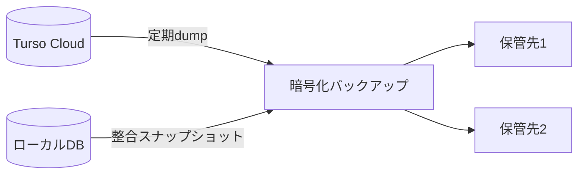

Google Driveを使う場合は、稼働中のDBファイルを直接同期せず、安全に作成したdumpまたはスナップショットだけを配置する。

---

## 11. CLIとして用意したい同期機能

| コマンド案 | 目的 |
|---|---|
| `algoloom sync` | outbox再送、push、pullまたはレプリカ同期を明示実行する |
| `algoloom sync status` | 最終成功時刻、未送信件数、Cloud revision、最終エラーを表示する |
| `algoloom sync retry` | 失敗したoutboxを再送する |
| `algoloom sync doctor` | DB整合性、認証、接続、スキーマ、同期状態を診断する |
| `algoloom backup` | 整合したバックアップを作成する |

通常のコマンドでは同期をbest-effortで行い、ネットワーク障害によってローカルで可能な処理まで止めない。同期の詳細確認と復旧は専用コマンドへ分離する。

---

## 12. 段階的な採用計画

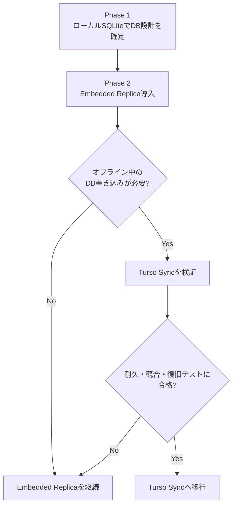

### Phase 1: DB設計の確定

- 追記専用の提出履歴を実装する。
- UUIDとAtCoder submission IDによる冪等性を実装する。
- マイグレーション方式を決める。
- バックアップと復元を実装する。

### Phase 2: Embedded Replica

- Turso Cloudを共有データの正本にする。
- ローカルレプリカを導入する。
- outboxと再送処理を実装する。
- 複数端末で同期テストを行う。

### Phase 3: Turso Syncの再評価

- オフライン書き込みの実需を確認する。
- 対象Python SDKの安定性と既知の問題を確認する。
- last-push-winsは許容済みとし、個人・少人数かつ同時編集なしという前提が変わっていないか確認する。
- last-push-winsで許容できない新しいデータが追加されていないか確認する。
- 競合・切断・復旧テストに合格した場合だけ移行する。

---

## 13. 採用判断フロー

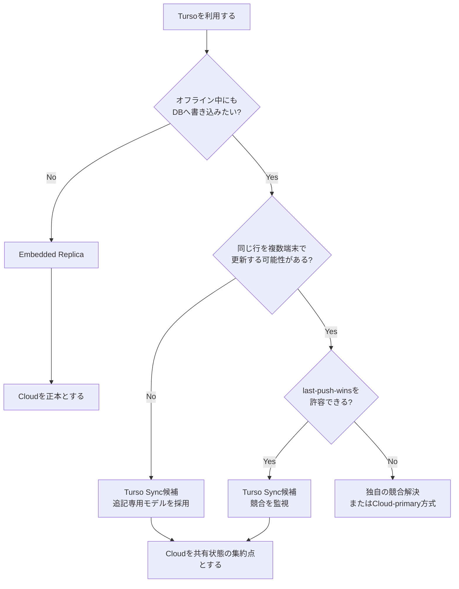

---

## 14. 実装前の検証チェックリスト

### 機能

- [ ] 端末Aの提出が端末Bへ反映される。
- [ ] 端末Bで同じsubmission IDを再取得しても重複しない。
- [ ] オフラインで`log`、`show`、`diff`が動作する。
- [ ] 同期失敗後に再実行すると正常に回復する。
- [ ] 古い端末を長期間ぶりに起動しても同期できる。

### 障害

- [ ] Cloud書き込み直前にプロセスを強制終了しても履歴を回収できる。
- [ ] push / pull中の通信切断から回復できる。
- [ ] 同じレコードを2端末で変更した結果を説明できる。
- [ ] ローカルDBを失ってもCloudから再構築できる。
- [ ] 未push変更がある端末を識別できる。

### 運用

- [ ] 認証トークンがGitやログへ漏れない。
- [ ] 最終同期時刻と未送信件数を確認できる。
- [ ] バックアップから別環境へ復元できる。
- [ ] スキーマ更新前後の端末が混在した場合に安全に停止できる。
- [ ] 利用中のSDKバージョンを固定している。

---

## 15. 公式資料

- [Turso SDKの選択](https://docs.turso.tech/sdk/introduction)
- [Python Quickstart](https://docs.turso.tech/sdk/python/quickstart)
- [Embedded Replicas](https://docs.turso.tech/features/embedded-replicas/introduction)
- [Turso Sync Usage](https://docs.turso.tech/sync/usage)
- [Turso Sync Conflict Resolution](https://docs.turso.tech/sync/conflict-resolution)
- [Turso Sync Checkpoint](https://docs.turso.tech/sync/checkpoint)
- [Turso Cloud Limitations](https://docs.turso.tech/cloud/limitations)
- [Usage and Billing](https://docs.turso.tech/help/usage-and-billing)
- [Turso Pricing](https://turso.tech/pricing)
- [pyturso on PyPI](https://pypi.org/project/pyturso/)

---

## 16. 最終方針

AlgoLoomでは、Tursoを「SQLiteファイルをCloudへ置く仕組み」ではなく、**ローカルDBとCloud上の共有状態を安全に接続する仕組み**として扱う。

- 初期版はEmbedded Replicaを採用する。
- Turso Cloudを共有データの正本とする。
- 提出履歴は追記専用・UUID主キー・冪等保存にする。
- Cloud書き込み失敗に備えてローカルoutboxを持つ。
- 同期状態は共有DBではなくローカルsidecarで管理する。
- 個人・少人数かつ同時編集なしを前提として、Turso Syncのlast-push-winsを許容する。
- Turso Syncは、オフライン書き込みが本当に必要になり、耐久・競合・復旧テストを通過した段階で採用する。
- 同期とは別に、世代管理されたバックアップを用意する。

この方針により、初期版ではデータの権威を明確に保ちつつ、将来的に完全なローカルファーストへ拡張できる。
