# AlgoLoom Turso設計ガイド

> 対象: AlgoLoomにおけるTursoの採用判断、データの権威、複数デバイス同期、競合・障害時の設計
>
> 作成日: 2026年7月15日
>
> 更新日: 2026年7月18日
>
> 注意: TursoのSDK、同期方式、料金、制約は変更される可能性がある。実装開始時には末尾の公式資料を再確認すること。

---

## 0. 結論

Tursoには、性質の異なる2つの利用方式がある。

1. **Embedded Replica方式**
   - Turso Cloudを共有データの正本とする。
   - 各端末はローカルレプリカから高速に読み取る。
   - 通常の書き込みはCloud primaryへ送る。
   - データの権威が明確で、複数デバイス同期を理解しやすい。

2. **Turso Sync方式**
   - 各端末のローカルDBで読み書きし、`push()` / `pull()`でCloudと同期する。
   - オフライン書き込みができる。
   - Cloudは共有状態の集約点だが、未pushの変更は端末内にしか存在しない。
   - 同じ行を複数端末で変更した場合の競合設計が必要になる。

**AlgoLoomは、ローカルDBへのcommitを履歴保存の成功条件とし、Turso Syncを同期方式の第一候補として検証・採用する。**

理由は、提出履歴をCloud障害時にも直ちに`log`、`show`、`diff`で参照できることを製品契約とするためである。Turso Syncでは通常の読み書きがローカルDBで完結し、Cloudへの`push()`は端末間共有を追加する処理になる。この構造は「同期利用はローカル利用への追加機能」というAlgoLoomのモデルと一致する。

採用はSDKのPython対応、耐久性、競合、強制終了、bootstrap、配布wheelを実測して決定する。検証に不合格の場合だけ、Embedded Replica + outboxを暫定Adapterとして検討する。その場合も、outbox内の未共有履歴を`HistoryStore`がローカル履歴として読めなければならない。Cloud障害直後の履歴を`show`できない実装は採用しない。

2026年7月18日に確認した[Turso Python Reference](https://docs.turso.tech/sdk/python/reference)でも、Pythonの新規同期用途には`pyturso` / `turso.sync`が案内され、Embedded Replicaはlegacyとして区別されている。この外部仕様は変更され得るため、実装開始時とリリース前にも同じ確認を行う。

なお、AlgoLoomは個人または数人での利用を想定し、同じ論理データを複数端末から同時編集しない。そのため、Turso Syncの**last-push-wins（後勝ち）を許容する**。ただし、競合を許容できるのは、提出履歴を追記専用にし、レビュー等の変更をリビジョン追加として扱う前提が守られる場合だけである。

---

## 1. 「ローカルファースト」の意味

この節の「通常の読み書きをローカルDBで行う」という説明は、主にTurso Sync方式を指す。Embedded Replica方式では読み取りはローカルだが、通常の書き込みはCloud primaryへ送られる。

ローカルファーストは、次のことを意味する。

- 通常の読み書きをネットワーク越しではなくローカルDBに対して行う。
- ネットワーク障害中でもアプリの主要機能を継続できる。
- 変更は後から共有先へ同期する。

一方で、次の意味ではない。

- 各端末のデータが常に同一である。
- 各端末が同時に唯一の正本になる。
- 同期競合が自動的に意図どおり解決される。
- 同期がバックアップの代わりになる。

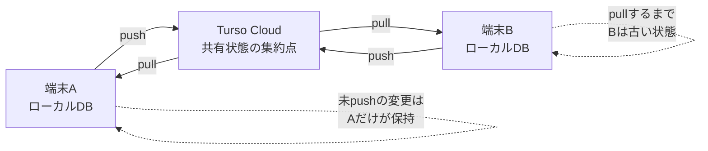

Turso Syncはピア・ツー・ピア同期ではない。端末間の変更はTurso Cloudを経由する。ただし、未pushの変更までCloudが把握しているわけではないため、全端末にまたがる「常に最新の単一状態」は存在しない。

---

## 2. 用語とデータの権威

### 2.1. 用語

| 用語 | この文書での意味 |
|---|---|
| 正本 / System of Record | あるデータの事実や更新規則を決める主体または不変レコード。保存場所が複数あっても、同じ論理レコードに複数の独立した正本を作らない |
| primary | 書き込みを受け付け、レプリカへ変更を配る中心DB。Embedded Replica方式ではTurso Cloud上にある |
| レプリカ / replica | 別のDBを元に作られ、同期によって内容を近づける複製。技術用語であり、単なる手動コピーとは異なる |
| ローカルレプリカ | ユーザー端末内に置くレプリカ。Embedded Replica方式ではCloud primaryのSQLite互換な複製として読み取りに使う |
| ローカル状態 | その端末が現在認識しているデータ。未同期変更を含む場合がある |
| 共有確定状態 | Cloudへの書き込みまたはpushが成功し、他端末が取得可能になった状態 |
| pending変更 | ローカルには存在するが、まだCloudに反映されていない変更 |
| pull | Cloudの変更をローカルへ取り込む処理 |
| push | ローカルの変更をCloudへ送る処理 |
| outbox | Cloudへ未送信の変更を失わないため、AlgoLoomが端末内へ先に保存する再送キュー。Tursoが自動作成するレプリカではない |
| sidecar | 共有DBとは別に置く、端末固有の小さなDBまたは設定ファイル |
| バックアップ | 誤更新、削除、障害等から復元するための世代別コピー。通常処理で直接読み書きする正本やレプリカではない |
| 障害領域 | ある障害が同時に影響する範囲。同じ端末や同じサービスだけに正本とバックアップを置くと、1つの障害で両方を失う可能性がある |
| 競合 | 複数端末が同じ論理データへ両立しない変更を行った状態 |

レプリカは「同期機能を持つコピー」と考えると分かりやすい。ただし、次の点でバックアップとは異なる。

- 同期前はprimaryより古い可能性がある。
- primaryの誤更新や削除も同期される。
- Embedded Replica方式では共有データの正本ではない。
- 消失しても、Cloud primaryから再構築できることを前提とする。

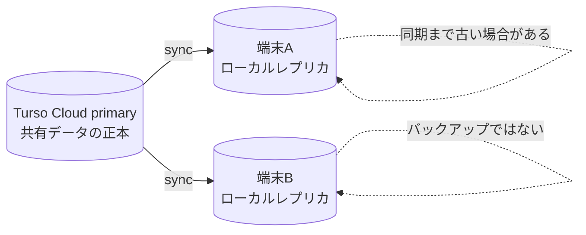

### 2.2. AlgoLoomにおける権威の所在

Turso Syncの通常構成では、提出履歴を「ローカル正本」と「Cloud正本」という二つの別データとして扱わない。ローカルcommitで生成するUUID付きの追記レコードが論理データであり、pushはその同じレコードをCloudへ公開する操作である。Cloudは共有済みレコードの集約点および新端末bootstrapの取得元になるが、未push変更を否定したり、日常の履歴参照を支配したりしない。

| データ | 権威 | 補足 |
|---|---|---|
| 提出ID、提出時刻、判定結果 | AtCoder | AlgoLoomは取得した事実を保存する。更新が必要なら許可した状態遷移または観測recordを追加する |
| 提出履歴・コード・review revision | UUIDとhashを持つAlgoLoomの不変レコード | ローカルDBとCloudは同じレコードの保存先。ローカルcommit後にCloudへ複製する |
| 編集中のソースコード | 各端末のワークスペース | 未提出codeはDB共有の対象外 |
| Turso SyncのローカルDB | 各端末 | 未push変更を含む、その端末の耐久保存先。通常の`log`、`show`、`diff`はここを読む |
| Turso Cloud | 共有済みレコードの集約点 | push済みの履歴を他端末へ配布し、bootstrapに使う。通常の表示経路には置かない |
| Embedded Replicaのoutbox | 端末内の輸送・復旧キュー | 業務履歴の別正本ではない。暫定Adapterでだけ使い、UUIDでレプリカと統合して表示する |
| 問題カタログ | 取得元サービス | ローカルcacheは再取得可能な補助データであり、同期しない |
| 同期状態・credential・バックアップ | それぞれ端末、credential owner、独立保存先 | いずれも共有業務レコードの正本ではない |

### 2.3. ローカルDBファイルの役割分担

Embedded Replicaを暫定Adapterとして採用する場合、ローカルレプリカ、outbox、問題カタログは別のDBとして扱う。

```text
<OSの標準データディレクトリ>/algoloom/
├── user-replica.db       # libSQL SDKが管理するSQLite互換レプリカ
└── local-state.sqlite    # Python標準sqlite3で管理するoutbox・同期状態

<OSの標準キャッシュディレクトリ>/algoloom/catalog/
└── catalog.sqlite        # Python標準sqlite3で管理する問題カタログ
```

| ファイル | 実装 | 内容 | Turso同期 |
|---|---|---|---:|
| `user-replica.db` | libSQL / Embedded Replica | 提出、コード、レビュー等の共有済みユーザーデータ | する |
| `local-state.sqlite` | 標準SQLite | outbox、最終同期時刻、最終エラー等の端末固有データ | しない |
| `catalog.sqlite` | 標準SQLite | AtCoder Problemsから再取得できる全問題カタログ | しない |

`user-replica.db`は実用上SQLiteとして理解できるが、正確にはlibSQL SDKが同期を管理するSQLite互換ファイルである。同期中に別の`sqlite3`接続で直接開かず、libSQL SDKを通して操作する。暗号化した場合は、標準SQLiteで直接読めない可能性がある。

outboxを`user-replica.db`へ入れると、outboxへの保存自体がCloud書き込みになり、Cloud障害時の退避先として機能しない。そのため、outboxは同期しない`local-state.sqlite`へ保存する。

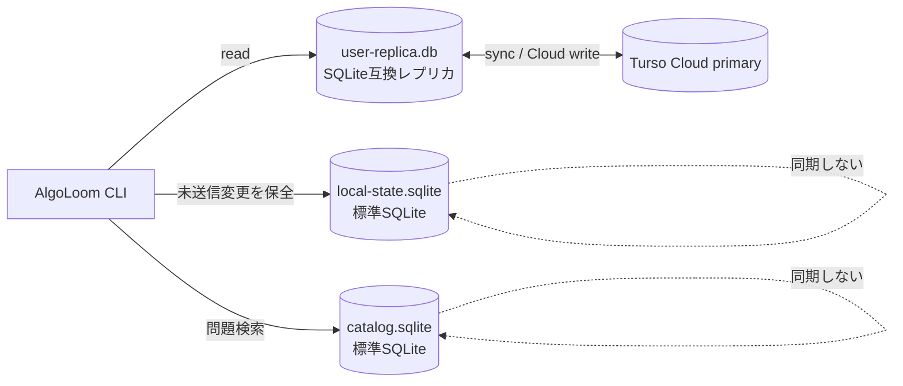

### 2.4. outboxの役割とライフサイクル

outboxは独立したDBではなく、`local-state.sqlite`内に作る再送キュー用のテーブルである。「提出コードを一時的に格納するDB」という理解は概ね正しいが、保存単位はコードだけではなく、**Turso Cloudへ反映したい1回の書き込み操作に必要なデータ一式**である。

初期版で主に保存するものは次のとおりである。

- AtCoderのsubmission ID
- 問題ID、言語、提出時刻、判定結果
- 提出したソースコード
- Cloudで重複登録を防ぐための冪等キー
- 再送回数、最終試行時刻、最終エラー

将来、開始問題やAIレビューもTursoへ同期する場合は、それらの未送信操作もoutboxの対象にできる。

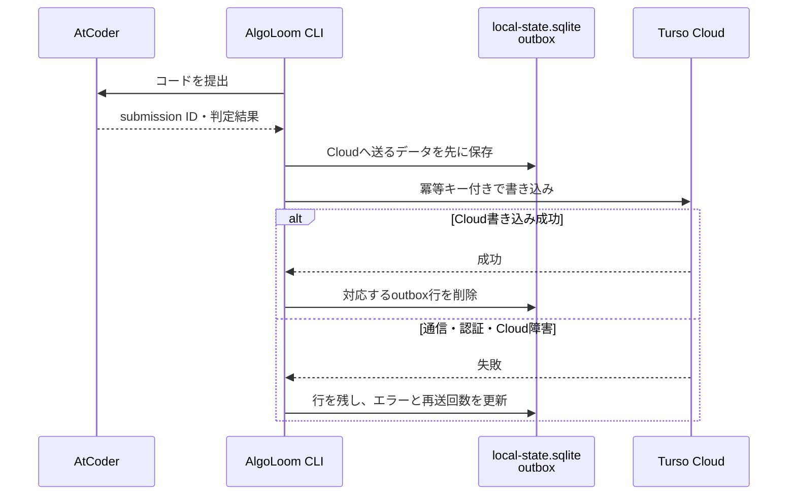

| 状況 | outboxの状態 | AlgoLoomの動作 |
|---|---|---|
| 通常時 | 数秒程度だけ保持 | Cloud成功後に削除する |
| ネットワーク・Cloud障害 | 未送信行を保持 | `sync retry`または次回起動時に再送する |
| Cloud成功後、削除前にCLIが終了 | 送信済み行が残る | 同じ冪等キーで再送し、重複を成功扱いにして削除する |
| 認証設定の誤り | 原因が解消するまで保持 | エラーを表示し、自動的に破棄しない |

outboxはキャッシュではない。Cloud反映前は、その書き込みを回復するための端末内で唯一のコピーになる可能性があるため、送信失敗を理由に自動削除してはならない。一方、Cloud反映後はTurso Cloudが共有データの正本となるため、outbox行を保持し続ける必要はない。

outboxが主に防ぐのは、Turso Cloudやネットワークの一時障害による書き込み消失である。同じ端末の故障・紛失まで防ぐバックアップではない。端末自体を失う前にCloudへ再送することと、独立バックアップを別途用意することが必要になる。

Turso Sync方式へ移行した場合は、Cloud送信前の変更がローカルDB自体へcommitされる。このため専用outboxが不要になる可能性があり、移行時に役割を再評価する。

### 2.5. DBと保存領域の全体像

次の図は、Embedded Replicaとローカル問題カタログを利用する端末1台あたりの構成を示す。青はローカル領域、橙はTurso Cloud、緑は独立バックアップ領域、灰色はAlgoLoom外部のサービスである。

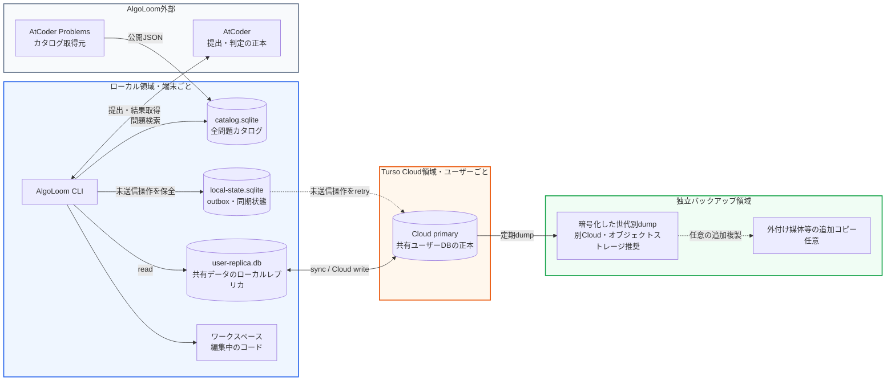

| 領域 | 数 | DB・保存先 | 役割 |
|---|---:|---|---|
| ローカル | 3 DB / 端末 | `user-replica.db` | Turso Cloudの同期済みユーザーデータを高速に読む |
| ローカル |  | `local-state.sqlite` | outboxと端末固有の同期状態を保持する |
| ローカル |  | `catalog.sqlite` | 全問題カタログを検索する |
| Turso Cloud | 1 DB / ユーザー | Cloud primary | 共有済みの提出、コード、レビュー等の正本 |
| 独立バックアップ | 1保存先以上 | 暗号化dump・スナップショット | 世代を指定して復元する。通常処理からは参照しない |
| AlgoLoom外部 | AlgoLoomのDBには数えない | AtCoder / AtCoder Problems | 提出・判定の正本、カタログの取得元 |

バックアップは稼働中のDBではないため、上表の「Cloud 1 DB」には数えない。最低1つはTurso Cloudと異なる障害領域へ置く。同じPCの内蔵ディスクだけに置く方法は、端末故障や紛失で正本のローカル作業と同時に失うため、唯一のバックアップ先にはしない。

---

## 3. 2方式の比較

| 評価軸 | Embedded Replica | Turso Sync |
|---|---|---|
| 共有データの正本 | Turso Cloud | Cloud上の共有状態。ただし未push変更は端末内 |
| 読み取り先 | ローカルレプリカ | ローカルDB |
| 通常の書き込み先 | Cloud primary | ローカルDB |
| オフライン読み取り | 可能 | 可能 |
| オフライン書き込み | 原則不可 | 可能 |
| 他端末への反映 | Cloud書き込み後、他端末が同期 | push成功後、他端末がpull |
| 同じ行の同時更新 | primary側で直列化される | 標準はlast-push-wins |
| データの権威の分かりやすさ | 高い | 運用ルールが必要 |
| アプリ側の同期制御 | 少ない | push、pull、checkpoint、競合方針が必要 |
| AlgoLoomのローカルファースト契約との相性 | 条件付き。outboxとの統合読み取りが必要 | **最適。検証合格時の第一候補** |
| 主なPythonパッケージ | `libsql` | `pyturso` / `turso.sync` |

---

## 4. Embedded Replica方式

### 4.1. アーキテクチャ

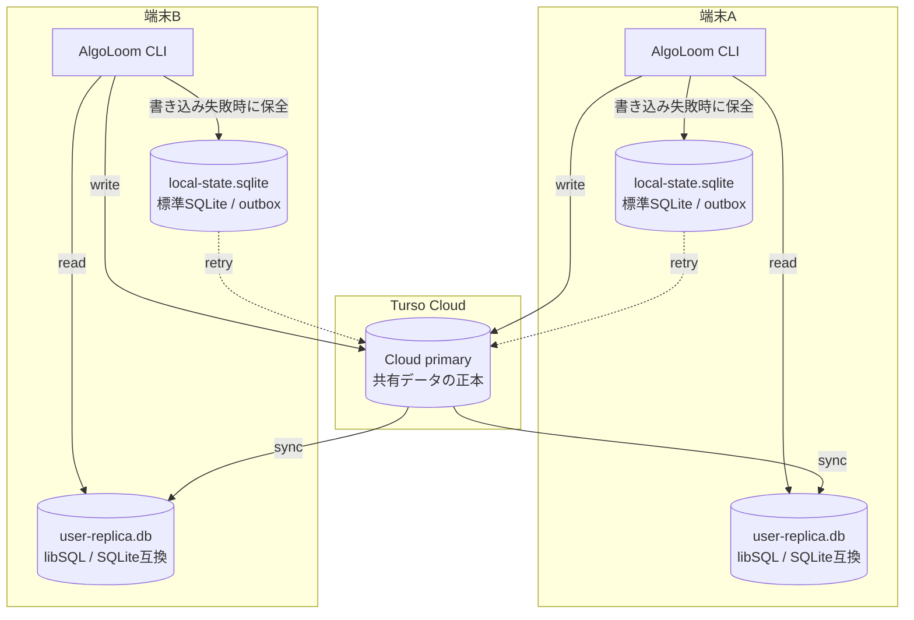

### 4.2. データフロー

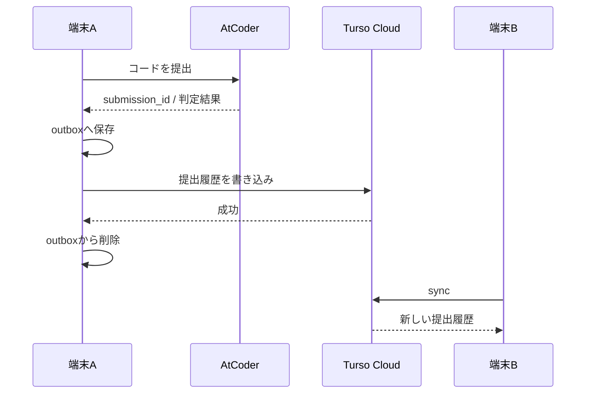

### 4.3. 特徴

- Cloud primaryが共有データの正本になる。
- 読み取りはlibSQL SDKが管理するSQLite互換のローカルレプリカから行われる。
- 書き込みはCloud primaryへ送られ、成功後にローカルへ反映される。
- 別端末は同期するまで古いデータを読む可能性がある。
- Cloudへ接続できない間も、同期済みの履歴は参照できる。
- Cloud書き込みに失敗したデータは、同期対象外の標準SQLiteに置くアプリ側outboxで再送可能にする。

### 4.4. AlgoLoomでのコマンド挙動

| コマンド | オフライン時 | 同期方針 |
|---|---|---|
| `get` | 問題取得は不可 | DB同期とは独立 |
| `test` | 利用可能 | DBアクセス不要 |
| `submit` | AtCoder提出が不可 | 提出成功後、outboxを経由してCloudへ保存 |
| `log` | レプリカとoutboxに存在する範囲を表示可能 | Cloud同期を待たずローカル表示 |
| `show` | レプリカとoutboxに存在する範囲を表示可能 | Cloud同期を待たずローカル表示 |
| `diff` | レプリカとoutboxに存在する範囲を表示可能 | Cloud同期を待たずローカル表示 |
| `sync` | 失敗を明示 | outbox再送後、Cloudから同期 |
| `sync status` | ローカル情報を表示 | 最終成功時刻、outbox件数、最終エラーを表示 |

### 4.5. 暫定Adapterとして選ぶ条件

- Turso SyncのSDKまたは配布wheelが対応環境で実用水準に達しない。
- outboxを含むローカル履歴の統合読み取り、冪等な再送、強制終了からの復旧を契約テストで満たせる。
- Cloud障害中でも、ローカル保存済みの履歴が`log`、`show`、`diff`で直ちに参照できる。

Cloud primaryへの書き込みを単純に行えることだけでは、AlgoLoomで採用する理由にならない。ローカル保存・読み取りの契約を満たすための統合処理が増える点を、Turso Syncとの比較に含める。

---

## 5. Turso Sync方式

### 5.1. アーキテクチャ

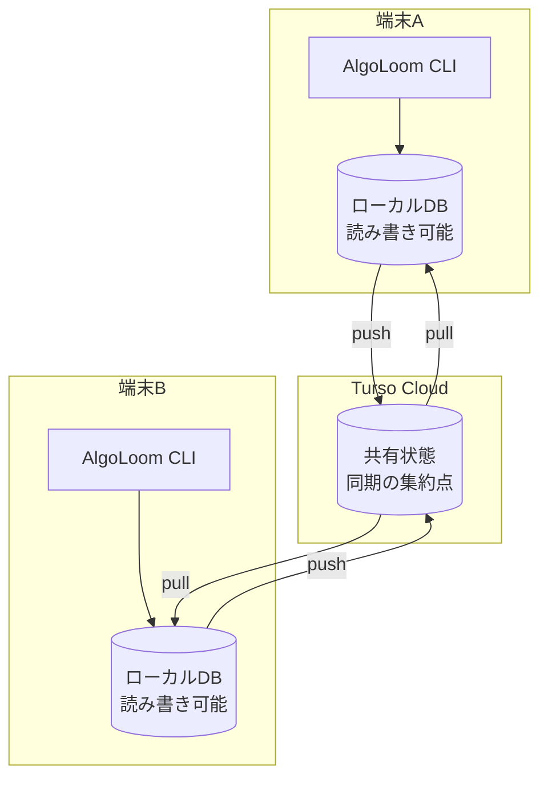

### 5.2. データフロー

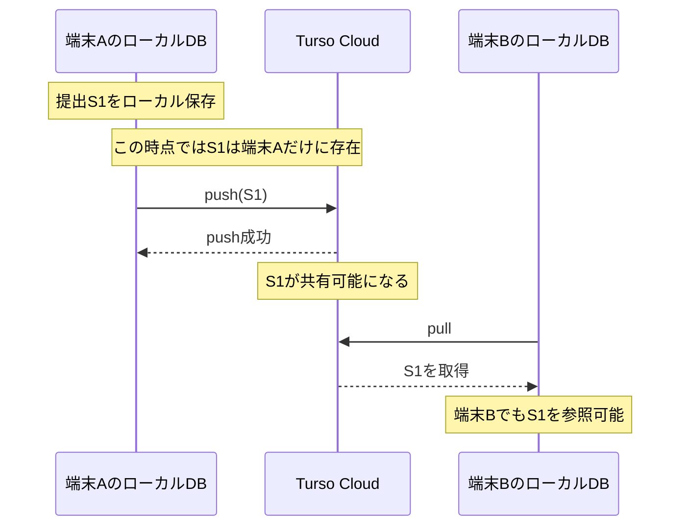

### 5.3. 保存範囲と共有範囲

Turso Syncでは、同じ論理レコードの**保存範囲**と**共有範囲**を二段階に分ける。これは二つの正本を作ることではない。

- **ローカル保存済み状態**
  - その端末から回復・参照できる状態。
  - 未push変更を含み得る。
- **Cloud共有済み状態**
  - 同じUUIDのレコードがCloudへ複製され、他端末へ配布可能な状態。
  - pushされていない変更は含まない。

したがって、ユーザーへ「同期済みか」「この端末だけに存在する変更があるか」を明示する必要がある。どちらの状態でも、提出履歴の同一性はUUID、AtCoder submission ID、code hashで確認する。

### 5.4. pull時の扱い

公式仕様では、未pushのローカル変更がある状態でpullした場合、概ね次の順序で処理される。

1. ローカルDBを最後に同期した状態へ一時的に戻す。
2. Cloudの変更を適用する。
3. 未pushだったローカル変更をその上へ再適用する。
4. 一連の処理をアトミックに完了する。

### 5.5. 競合

Turso Syncの標準的な競合解決は**last-push-wins**である。

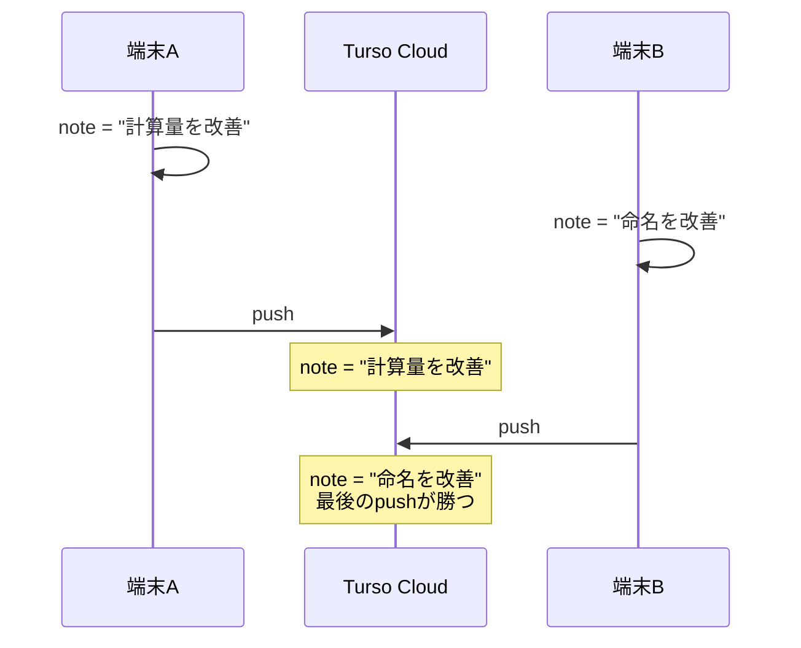

この方式では、同じ行の更新を複数端末で許すと、先にpushした内容が失われる可能性がある。AlgoLoomでは、競合を解決するよりも、競合しにくいデータモデルを採用する。

#### 5.5.1. 「後勝ち」の基準

last-push-winsで基準になるのは、原則として**編集した時刻ではなく、Cloudへpushした順序**である。

たとえば、端末Bが先に編集していても、端末Bのpushが最後なら端末Bの変更が最終状態になる。ローカル時計の`updated_at`だけを見て勝敗を決める仕組みとして扱ってはならない。

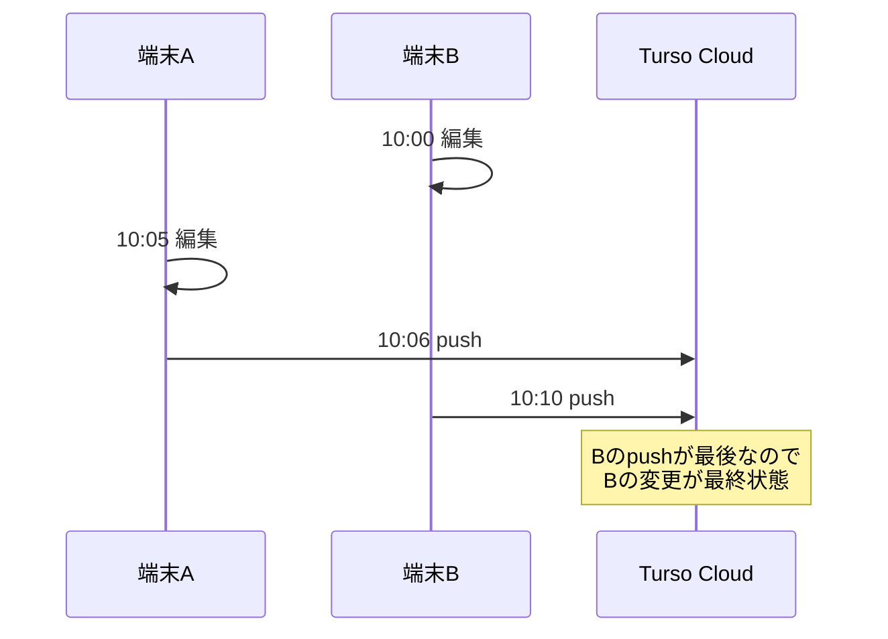

#### 5.5.2. AlgoLoomとしての設計判断

AlgoLoomでは、次の利用前提に基づいてlast-push-winsを正式に許容する。

| 前提 | 内容 |
|---|---|
| 利用者数 | 個人、または相互に運用を調整できる数人 |
| 同時編集 | 同じ提出・レビュー・設定を複数端末から同時編集しない |
| 主な共有データ | 競合しにくい追記専用の提出履歴 |
| 端末切り替え | 別端末で作業を始める前にpullする |
| 作業終了 | 重要な変更後、端末を離れる前にpushする |
| 競合発生時 | 最後にpushした変更を採用しても、許容できない損害にならない |

この前提では、Gitのような手動マージUIや、フィールド単位の複雑な競合解決は実装しない。代わりに、次の単純な運用を採用する。

- 別端末へ切り替えて共有済みの最新状態が必要な場合だけ、明示的にpullする。
- 作業終了時にpushする。
- 未push変更がある間は、別端末で同じデータを編集しない。
- 提出履歴は更新ではなく追加する。
- レビューを残す必要がある場合は、上書きよりリビジョン追加を優先する。
- push / pullの最終成功時刻を確認できるようにする。

#### 5.5.3. 再検討が必要になる条件

次のいずれかが発生した場合は、last-push-winsを再評価する。

| 再検討条件 | 必要になる可能性がある対策 |
|---|---|
| 不特定多数または大人数で利用する | ユーザー認証、権限、監査ログ |
| 同じレビューや設定を共同編集する | 楽観ロック、バージョン番号、競合UI |
| リアルタイム共同編集を行う | CRDT、OT、Realtime対応基盤 |
| 上書きによる情報消失を許容できない | 追記専用イベント、リビジョン履歴、手動マージ |
| 削除操作を複数端末で行う | tombstone、削除権限、復元期間 |
| 正確な監査証跡が必要になる | 不変ログ、サーバー時刻、監査専用テーブル |

これらに該当しない限り、last-push-winsはAlgoLoomの規模と用途に対して十分な競合解決方式と判断する。

### 5.6. 運用上必要な処理

- `aloom sync run`など、共有済みの最新状態が必要な明示操作での`pull()`
- ローカル変更後のbest-effort `push()`
- 明示的な`aloom sync`
- 最終pull / push時刻とエラーの表示
- WAL肥大化を防ぐ定期的な`checkpoint()`
- スキーマバージョンの互換性確認
- 同じ論理データを同時更新しないためのデータモデリング

---

## 6. AlgoLoom向けデータ設計

### 6.1. 基本原則

- 提出履歴は**追記専用（append-only）**にする。
- 端末ごとの連番や`AUTOINCREMENT`を共有IDに使わない。
- 主キーにはUUIDv7またはULIDを使用する。
- AtCoderのsubmission IDには一意制約を付け、再取得時の重複登録を防ぐ。
- 提出済みコードと判定結果は原則として上書きしない。
- レビューやメモを更新可能にする場合は、行の上書きではなくリビジョンを追加する。
- 削除は必要になるまで実装しない。実装する場合はhard deleteではなくtombstoneを検討する。
- スキーママイグレーションは一度に1端末だけで実行する。

### 6.2. 推奨する論理モデル

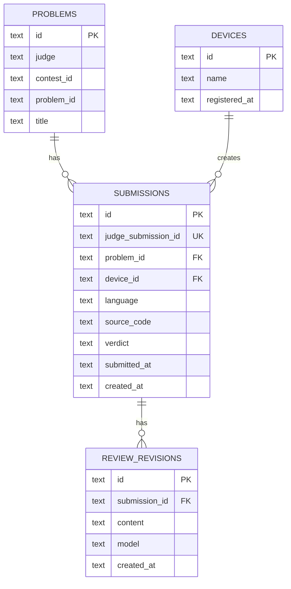

### 6.3. 競合を避けるルール

| 操作 | 競合リスク | 方針 |
|---|---:|---|
| 新しい提出の保存 | 低 | UUIDで新規行を追加する |
| 同じ提出の再取得 | 低 | `judge_submission_id`の一意制約で冪等化する |
| 判定結果の更新 | 中 | 確定後に保存する。更新が必要なら状態遷移を限定する |
| AIレビューの編集 | 高 | `REVIEW_REVISIONS`へ新しい版を追加する |
| 問題タイトル等の更新 | 中 | judge + contest + problemの決定的IDでupsertする |
| データ削除 | 高 | tombstoneまたは特定端末だけに操作権限を限定する |
| スキーマ変更 | 非常に高 | 単一端末から実行し、他端末は先に同期する |

### 6.4. 同期状態を共有DBへ保存しない

`sync_status = synced`のような状態を共有対象の同じDBへ書くと、その更新自体が新しい未同期変更になる場合がある。

そのため、同期状態は次のどちらかで管理する。

- Turso SDKが返す同期統計を参照する。
- ローカル専用のsidecar DBまたは設定ファイルへ保存する。

ローカル専用情報の例:

- 最終pull成功時刻
- 最終push成功時刻
- 最終エラー
- outbox件数
- Cloud revision
- 送受信バイト数

---

## 7. 同期ポリシー

### 7.1. Embedded Replicaを暫定採用する場合

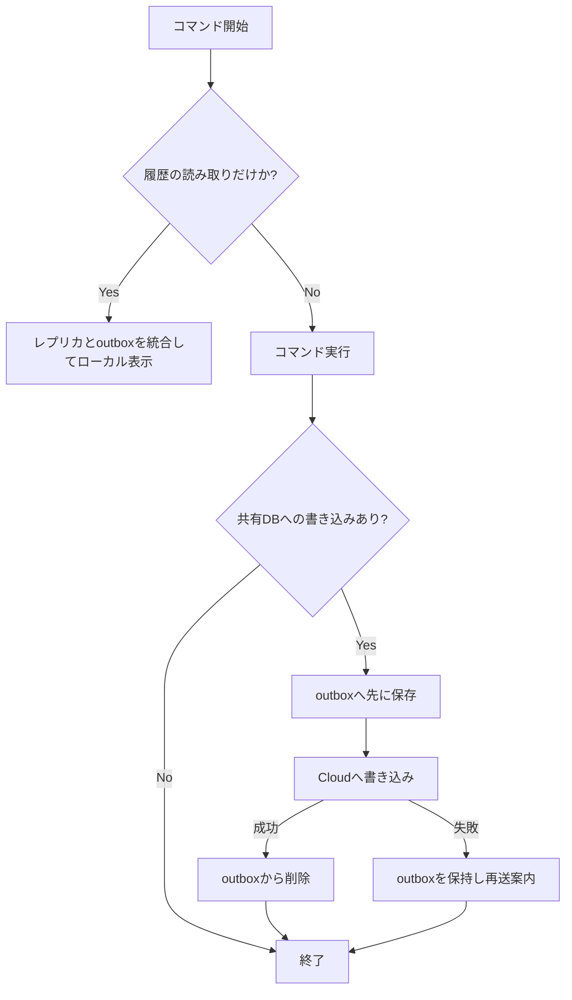

- 読み取り系コマンドはCloud同期を開始・待機せず、レプリカとoutboxを統合してローカル表示する。
- 履歴が古い可能性がある場合は、最終同期時刻を表示できるようにする。
- 書き込み前にoutboxへ保存し、Cloud障害による履歴消失を防ぐ。
- outboxへの保存とCloudへの書き込みは同じトランザクションにはできないため、冪等キーで再送を安全にする。

### 7.2. Turso Sync採用時

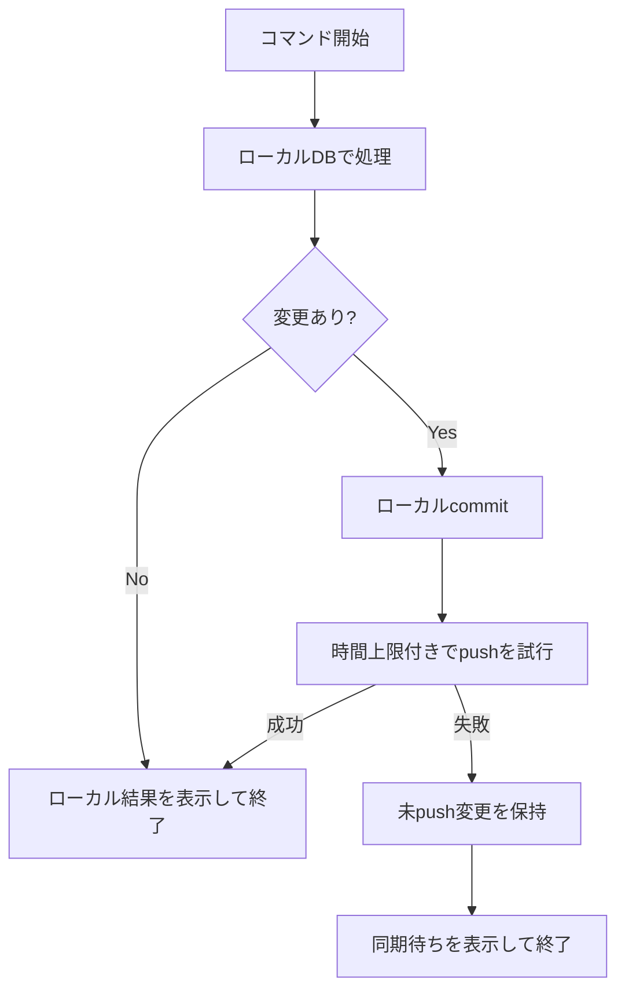

- ローカルcommitが成功していれば、push失敗でコマンド全体を失敗扱いにしない。
- `push()`成功前に「他端末へ共有済み」と表示しない。
- `log`、`show`、`diff`は`pull()`を待たず、ローカルDBから表示する。共有済みの最新状態が必要な場合は`aloom sync run`で明示的にpullする。
- push失敗中の端末を削除・初期化しない。
- `checkpoint()`を定期実行し、ローカルWALの無制限な増加を防ぐ。

---

## 8. 障害・競合時の設計

| 状況 | Embedded Replica | Turso Sync | AlgoLoomの対応 |
|---|---|---|---|
| ネットワーク切断 | 同期済みデータの読み取りのみ | ローカル読み書き可能 | 最終同期時刻を表示する |
| Cloud障害 | 書き込み不可 | ローカルcommit後、push待ち | outboxまたは未push変更を保持する |
| 端末紛失 | Cloud書き込み済みデータは保持 | 未push変更は失われる | 重要変更後はpushを促す |
| 同じ提出を再登録 | 一意制約違反の可能性 | 同左 | 冪等キーで成功扱いにする |
| 同じ行を別端末で更新 | primary側で順序付け | last-push-wins | 追記専用モデルで回避する |
| 古い端末が接続 | syncで更新 | pullで更新 | スキーマ互換性を先に検証する |
| スキーマ不一致 | クエリエラーの可能性 | replay失敗の可能性 | DBアクセス前にschema versionを確認する |
| ローカルDB破損 | Cloudから再構築 | 未push変更がなければ再構築 | 破損検査後、退避して再bootstrapする |

### 8.1. 復旧時に守ること

- 破損・競合が疑われるローカルDBを即座に削除しない。
- 未push変更の有無を確認する。
- DBファイル、WAL、sidecar、outboxをまとめて退避する。
- Cloud側の状態を別ファイルへdumpする。
- 復旧後に`judge_submission_id`を使って重複を検査する。

---

## 9. セキュリティ

- `TURSO_AUTH_TOKEN`をGit管理しない。
- `config.yaml`へ平文で埋め込まない。
- OSのキーチェーン、資格情報ストア、または権限`0600`の専用設定ファイルを使用する。
- トークンをCLIのログやエラーメッセージへ出力しない。
- 端末紛失時にトークンを失効・再発行できるよう、端末単位で管理する。
- バックアップには提出コードやAIレビューが含まれるため、公開リポジトリへ保存しない。
- `local-state.sqlite`のoutboxにも未送信のソースコード等が入り得るため、ユーザーDBと同様にアクセス権を制限する。
- Webダッシュボードを公開する場合、TursoのDBトークンをブラウザへ直接配布せず、認証付きバックエンドを介する。

---

## 10. バックアップ

同期はバックアップではない。誤更新や削除も他端末へ同期されるため、Turso Cloudおよび作業端末とは障害領域が異なるバックアップ先が必要になる。

### 10.1. バックアップ先

「Cloudとは別の保存先」は、「必ずローカルへ置く」という意味ではない。Turso CloudのDB障害、アカウント誤操作、端末故障の影響を同時に受けない場所を意味する。

| 保存先 | 位置付け | 方針 |
|---|---|---|
| Tursoとは別のCloud・オブジェクトストレージ | 主なバックアップ先 | 暗号化した世代別dumpを置く。初期版の推奨 |
| 外付けSSD等、作業端末とは別の媒体 | 追加のバックアップ先 | 任意。Cloudバックアップの複製先として利用できる |
| 作業端末の内蔵ディスク | 一時的な生成場所 | ここだけを唯一のバックアップ先にしない |
| Tursoと同じサービス内の複製・復旧機能 | 迅速な復旧手段 | 有用だが、独立バックアップの代わりにはしない |

最低1つはTurso Cloudと異なる障害領域へ置く。可能であれば、別Cloudと外付け媒体の2系統を持つ。

### 10.2. バックアップ対象

| 対象 | 必要性 | 方法 |
|---|---:|---|
| Turso Cloud primary | 必須 | 定期dumpを暗号化し、世代管理して独立保存先へ送る |
| `local-state.sqlite` | outboxが空でない場合は重要 | SQLiteの整合したスナップショットを作る |
| `user-replica.db` | 任意 | Cloudから再構築できるため、迅速な端末復旧が必要な場合だけ保存する |
| `catalog.sqlite` | 原則不要 | AtCoder Problemsから再取得して再構築する |
| ワークスペース | DBとは別に必要 | 非公開のGitリポジトリやユーザー自身のバックアップ方針で保護する |

### 10.3. 作成・復元方針

- 定期的にCloud DBのdumpを取得する。
- ローカルDBを保存する場合は、稼働中のファイルを直接コピーせず、整合したスナップショットを作る。
- dumpまたはスナップショットを暗号化して別ストレージへ保管する。
- 世代管理を行い、直近の1ファイルだけでなく複数世代を残す。
- 復元手順を定期的にテストする。

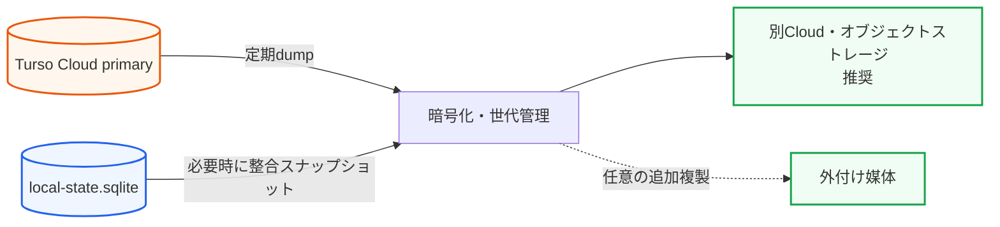

Google Driveを使う場合は、稼働中のDBファイルを直接同期せず、安全に作成したdumpまたはスナップショットだけを配置する。

---

## 11. CLIとして用意したい同期機能

| コマンド案 | 目的 |
|---|---|
| `aloom sync` | outbox再送、push、pullまたはレプリカ同期を明示実行する |
| `aloom sync status` | 最終成功時刻、未送信件数、Cloud revision、最終エラーを表示する |
| `aloom sync retry` | 失敗したoutboxを再送する |
| `aloom sync doctor` | DB整合性、認証、接続、スキーマ、同期状態を診断する |
| `aloom backup` | 整合したバックアップを作成する |

通常のコマンドでは同期をbest-effortで行い、ネットワーク障害によってローカルで可能な処理まで止めない。同期の詳細確認と復旧は専用コマンドへ分離する。

---

## 12. 段階的な採用計画

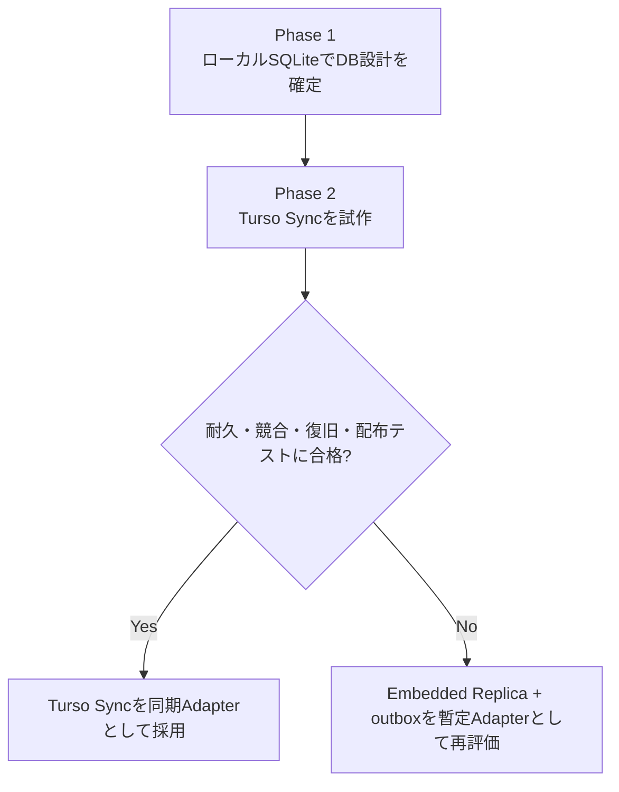

### Phase 1: DB設計の確定

- 追記専用の提出履歴を実装する。
- UUIDとAtCoder submission IDによる冪等性を実装する。
- マイグレーション方式を決める。
- バックアップと復元を実装する。

### Phase 2: Turso Sync試作

- Turso Sync Adapterを実装し、ローカルcommit後のpush / pullを検証する。
- 通常の履歴参照が同期完了を待たないことを検証する。
- 複数端末、オフライン、競合、強制終了、bootstrap、wheel導入を検証する。

### Phase 3: Embedded Replicaの暫定採用を再評価

- Turso Sync試作が不合格だった原因を切り分ける。
- outboxとレプリカの統合読み取りがローカルファースト契約を満たすか検証する。
- 競合・切断・復旧テストに合格した場合だけ暫定Adapterとして採用する。

---

## 13. 採用判断フロー

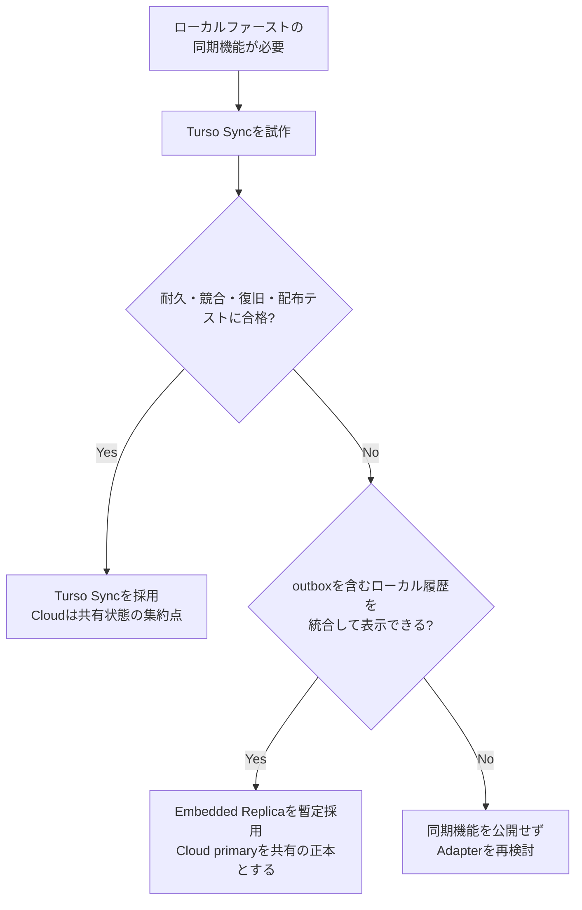

---

## 14. 実装前の検証チェックリスト

### 機能

- [ ] 端末Aの提出が端末Bへ反映される。
- [ ] 端末Bで同じsubmission IDを再取得しても重複しない。
- [ ] オフラインで`log`、`show`、`diff`が動作する。
- [ ] 同期失敗後に再実行すると正常に回復する。
- [ ] 古い端末を長期間ぶりに起動しても同期できる。

### 障害

- [ ] Cloud書き込み直前にプロセスを強制終了しても履歴を回収できる。
- [ ] Cloud書き込み失敗時に、ソースコードを含む送信データ一式がoutboxへ残る。
- [ ] Cloud書き込み成功後に、対応するoutbox行が削除される。
- [ ] Cloud成功後・outbox削除前の強制終了でも、冪等キーにより重複登録しない。
- [ ] push / pull中の通信切断から回復できる。
- [ ] 同じレコードを2端末で変更した結果を説明できる。
- [ ] ローカルDBを失ってもCloudから再構築できる。
- [ ] 未push変更がある端末を識別できる。
- [ ] ローカルレプリカとoutboxを別DBに分離している。
- [ ] outboxと同期状態がTursoへ同期されない。

### 運用

- [ ] 認証トークンがGitやログへ漏れない。
- [ ] 最終同期時刻と未送信件数を確認できる。
- [ ] バックアップから別環境へ復元できる。
- [ ] スキーマ更新前後の端末が混在した場合に安全に停止できる。
- [ ] 利用中のSDKバージョンを固定している。

---

## 15. 公式資料

- [Turso SDKの選択](https://docs.turso.tech/sdk/introduction)
- [Python Quickstart](https://docs.turso.tech/sdk/python/quickstart)
- [Embedded Replicas](https://docs.turso.tech/features/embedded-replicas/introduction)
- [Turso Sync Usage](https://docs.turso.tech/sync/usage)
- [Turso Sync Conflict Resolution](https://docs.turso.tech/sync/conflict-resolution)
- [Turso Sync Checkpoint](https://docs.turso.tech/sync/checkpoint)
- [Turso Cloud Limitations](https://docs.turso.tech/cloud/limitations)
- [Usage and Billing](https://docs.turso.tech/help/usage-and-billing)
- [Turso Pricing](https://turso.tech/pricing)
- [pyturso on PyPI](https://pypi.org/project/pyturso/)

---

## 16. 最終方針

AlgoLoomでは、Tursoを「SQLiteファイルをCloudへ置く仕組み」ではなく、**ローカルDBとCloud上の共有状態を安全に接続する仕組み**として扱う。

- ローカルDBへのcommitを履歴保存の成功条件とし、`log`、`show`、`diff`は通常の実行でCloud同期を待たない。
- Turso Syncを第一候補として試作し、耐久・競合・復旧・配布テストに合格した場合だけ同期Adapterとして採用する。
- 提出履歴は追記専用・UUID主キー・冪等保存にする。
- Turso Syncのpush失敗時は、未push変更をローカルDBに保持する。Embedded Replicaを暫定採用する場合は、ローカルレプリカとは別の標準SQLiteにoutboxを持ち、outboxを含む履歴を表示できるようにする。
- 同期状態は共有DBではなくローカルsidecarで管理する。
- 個人・少人数かつ同時編集なしを前提として、Turso Syncのlast-push-winsを許容する。
- 同期とは別に、Turso Cloudおよび作業端末と障害領域を分けた世代管理バックアップを用意する。

この方針により、最初からローカルファーストのUXを保ち、Cloud同期を端末間共有の追加機能として扱える。
