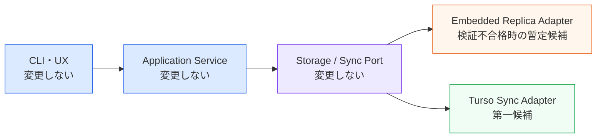
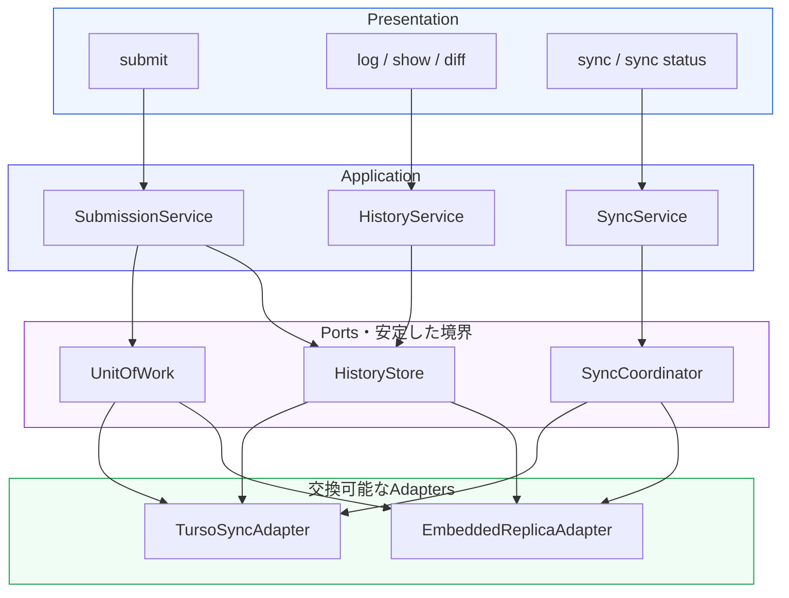
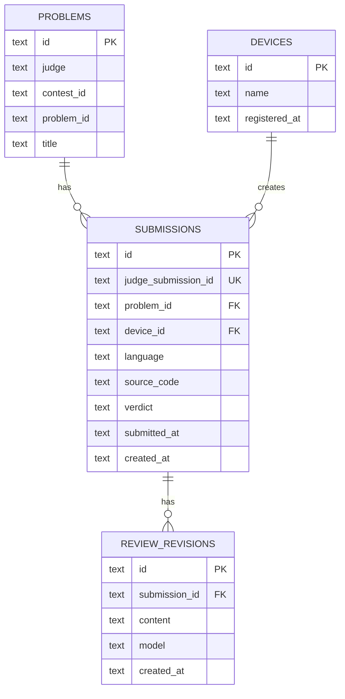
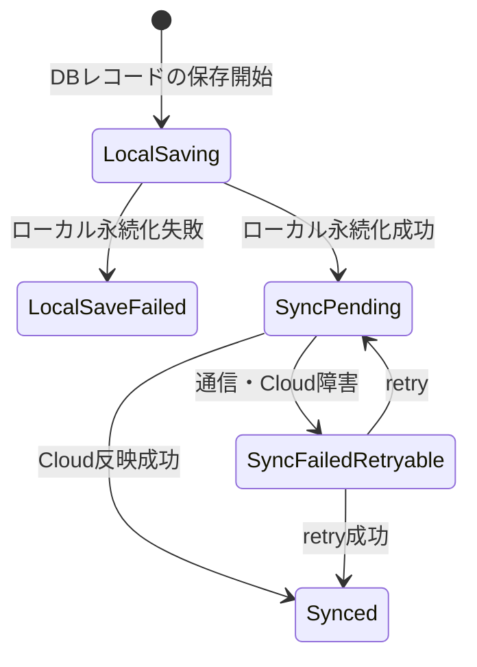
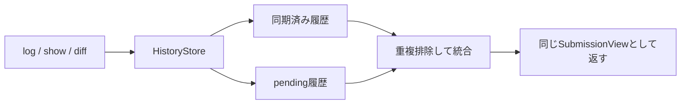
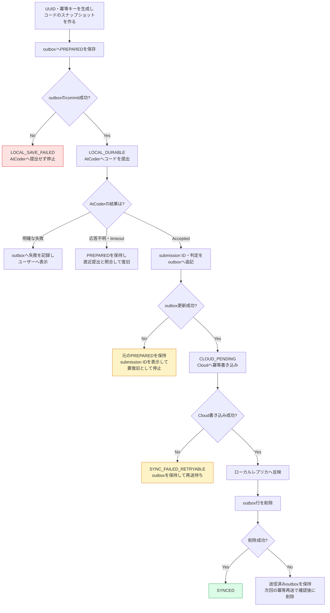
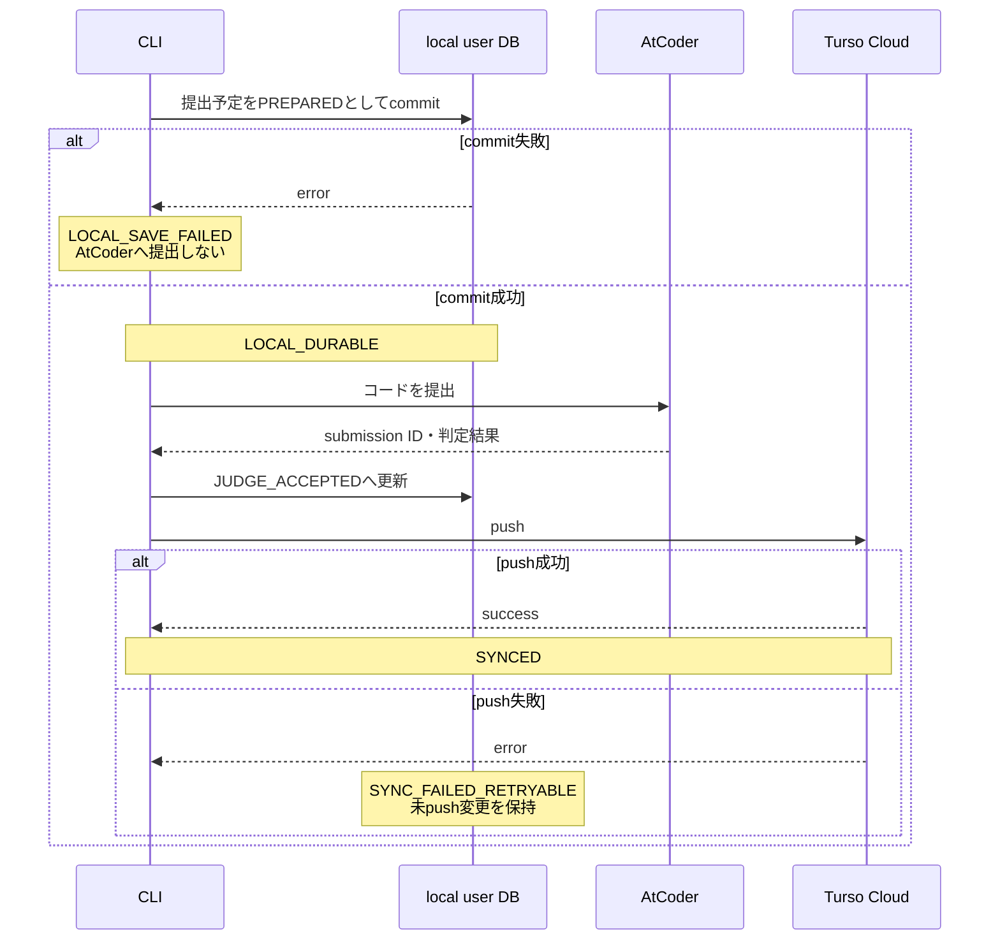
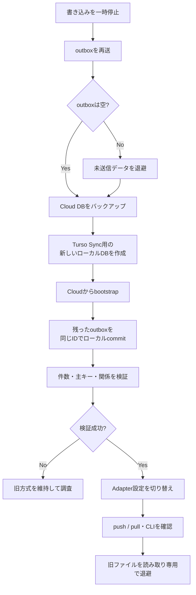
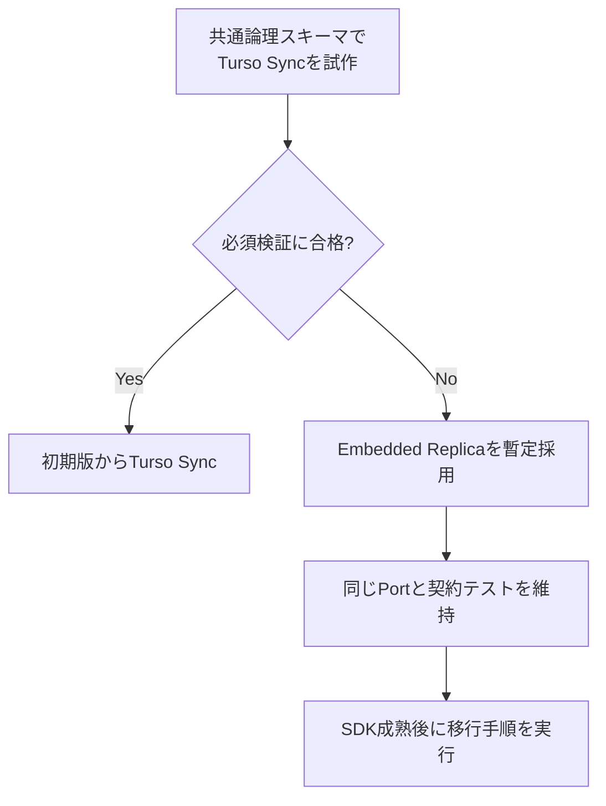

# AlgoLoom Turso移行互換性設計

> 対象: Embedded ReplicaとTurso Syncの間で、論理データモデルとCLIのUXを維持したまま同期実装を切り替えるための設計
>
> 状態: 設計方針
>
> 作成日: 2026年7月16日
> 更新日: 2026年7月18日
>
> 関連文書:
> - [AlgoLoom Turso設計ガイド](./turso-design-guide.md)
> - [DB候補比較](./db-comparison.md)
> - [プロジェクト草案](../concept.md)
>
> 注意: TursoのSDK、同期方式、ファイル形式、制約は変更される可能性がある。実装開始時と移行前に公式資料を再確認すること。

---

## 0. 結論

AlgoLoomでは、Embedded ReplicaからTurso Syncへ移行しても、次のものを変更しない。

- 提出、問題、レビュー等の論理データモデル
- 主キー、一意制約、外部キー等の業務ルール
- `submit`、`log`、`show`、`diff`、`sync`等のCLI契約
- ユーザーへ表示する保存・同期状態
- RepositoryとServiceのインターフェース

移行時に変更してよいものは、次の同期インフラに限定する。

- DBドライバーと接続初期化
- ローカル物理DBファイル
- outboxの実装
- Cloudへ反映する方法
- `sync()`または`push()` / `pull()` / `checkpoint()`の制御
- 同期統計、競合、障害復旧の内部処理



「処理フローだけを変える」とは、変更量が小さいという意味ではない。ストレージ内部の実装は大きく変わるが、その変更をアプリケーション全体やUXへ波及させないことを意味する。

---

## 1. 目的と対象外

### 1.1. 目的

- 同期方式の変更を、業務データモデルの変更から切り離す。
- CLIコマンドがTurso SDKを直接呼ばない構造にする。
- Embedded ReplicaとTurso Syncで、同じ保存・同期UXを提供する。
- 移行時にCloud上の業務データを書き換えず、新しいローカルDBを再構築できるようにする。
- 両方式へ同じ契約テストを適用できるようにする。
- SDKの成熟度によって初期方式を変更しても、上位層へ影響を出さない。

### 1.2. 対象外

- Embedded ReplicaとTurso Syncの内部実装を完全に同一にすること
- 異なるDBエンジンの物理ファイルをそのまま引き継ぐこと
- 大人数でのリアルタイム共同編集
- フィールド単位の自動マージ
- last-push-winsで解決できない共同編集機能
- 同期をバックアップの代わりにすること

### 1.3. 関連文書との責任分担

| 文書 | 主な責任 |
|---|---|
| [Turso設計ガイド](./turso-design-guide.md) | 現在採用する方式、データの権威、outbox、バックアップ、障害時の基本方針 |
| 本文書 | 同期方式を交換可能にする境界、UXの不変条件、移行手順、採用前の互換性検証 |

現在の採用方式はTurso設計ガイドを正とする。本書のTurso Sync試作が合格して初期方式を変更する場合は、実装前にTurso設計ガイドの結論も更新する。

---

## 2. 用語

| 用語 | この文書での意味 |
|---|---|
| 論理データモデル | テーブル、列、主キー、制約、データ間の関係等、業務上のデータ構造 |
| 物理ストレージ | DBエンジン、ローカルファイル、WAL、レプリケーション情報等、実際の保存方式 |
| Port | Application層が必要とする操作を定義したインターフェース |
| Adapter | PortをEmbedded ReplicaまたはTurso Syncで実装する部品 |
| Repository | 提出履歴等の保存・検索を、DB固有処理から隠蔽する部品 |
| 同期方式 | Embedded ReplicaまたはTurso Syncによる、ローカルとCloudのデータ反映方法 |
| CLI契約 | コマンド、終了コード、表示状態、保存成功と同期成功の意味 |
| ローカル永続化 | プロセス終了後も端末内から回復できる状態まで保存できたこと |
| 共有確定 | Cloudへ反映され、他端末が取得可能になったこと |
| pending | ローカルには永続化済みだが、Cloudへの共有が未完了の状態 |
| bootstrap | Cloudのスキーマとデータから、新しいローカルDBを初期構築すること |
| 契約テスト | 複数Adapterへ同じテストを実行し、外部から見た動作が同じことを確認するテスト |

---

## 3. 移行互換性の境界

### 3.1. 変更してはいけないもの

| 対象 | 不変条件 |
|---|---|
| `PROBLEMS` | judgeと問題IDから同じ問題を一意に識別できる |
| `SUBMISSIONS` | 同じUUIDとAtCoder submission IDを移行後も保持する |
| `REVIEW_REVISIONS` | レビュー履歴を上書きせず、同じリビジョンとして保持する |
| `DEVICES` | データを作成した端末を引き続き識別できる |
| 主キー | 端末側で生成したUUIDv7またはULIDを使用する |
| 一意制約 | AtCoder submission ID等による冪等性を維持する |
| CLI | コマンド名、主要オプション、終了コードの意味を維持する |
| 表示 | ローカル保存済み、同期待ち、同期済みを同じ名称で表示する |

### 3.2. 変更してよいもの

| 対象 | Embedded Replica | Turso Sync |
|---|---|---|
| Pythonパッケージ | `libsql` | `pyturso` / `turso.sync` |
| 読み取り先 | ローカルレプリカ | 読み書き可能なローカルDB |
| 最初の永続保存 | `local-state.sqlite`のoutbox | ローカルユーザーDBへのcommit |
| Cloud反映 | Cloud primaryへ直接書き込み | `push()` |
| Cloudからの取得 | replica `sync()` | `pull()` |
| 未共有変更 | outbox行 | 未pushのローカル変更 |
| ローカルWAL管理 | libSQL SDK中心 | `checkpoint()`を明示管理 |
| ローカルファイル | Embedded Replica用ファイル | Turso Sync用の新規ファイル |

### 3.3. 移行完了の判定

次のすべてを満たした場合だけ、「同期方式の変更だけで移行できた」と判定する。

- Cloud上の業務テーブルへ移行専用の列を追加していない。
- 既存レコードの主キーを変更していない。
- 提出、問題、レビューの件数と関係が一致している。
- CLIコマンドと終了コードの意味が変わっていない。
- pendingを含む履歴が移行前後で同じように見える。
- Cloud障害時も、ローカル永続化済みデータを回復できる。
- 旧方式へ戻せる退避データと手順がある。

---

## 4. アーキテクチャ

### 4.1. レイヤー構成



PresentationとApplicationは、Turso SDKの型、接続、`push()`、`pull()`を知らない。Turso固有処理はAdapter内へ閉じ込める。

### 4.2. Portの責任

概念的なインターフェースは次のとおりである。

```python
class HistoryStore(Protocol):
    def save_submission(self, submission: Submission) -> WriteReceipt:
        ...

    def list_submissions(self, query: SubmissionQuery) -> list[SubmissionView]:
        ...

    def get_submission(self, submission_id: str) -> SubmissionView | None:
        ...


class SyncCoordinator(Protocol):
    def sync(self) -> SyncResult:
        ...

    def retry_pending(self) -> SyncResult:
        ...

    def status(self) -> SyncStatus:
        ...
```

`HistoryStore`は、保存先がoutboxかTurso SyncのローカルDBかを呼び出し元へ見せない。`SyncCoordinator`は、Embedded ReplicaのCloud書き込みとTurso Syncのpush / pullを同じ操作へ正規化する。

### 4.3. Adapterへ閉じ込める処理

#### Embedded Replica Adapter

- outboxへの先行保存
- Cloud primaryへの冪等書き込み
- 書き込み成功後のoutbox削除
- replica `sync()`
- ローカルレプリカとoutboxを統合した読み取り

#### Turso Sync Adapter

- ローカルDBへのcommit
- `push()` / `pull()`
- `checkpoint()`
- SDKの同期統計取得
- 未push変更を含むローカル読み取り

---

## 5. 共通論理データモデル

### 5.1. 基本原則

- 提出履歴は追記専用にする。
- 端末側でUUIDv7またはULIDを生成する。
- AtCoder submission IDへ一意制約を付ける。
- 提出済みコードと確定判定を原則として上書きしない。
- AIレビューの変更は`REVIEW_REVISIONS`へ追加する。
- 削除が必要な場合はtombstoneを検討する。
- `is_synced`等の同期方式固有列を業務テーブルへ追加しない。
- 同期時刻、Cloud revision、outbox件数はローカルsidecarまたはSDK統計で管理する。



### 5.2. 避ける設計

| 避ける設計 | 問題 | 代替 |
|---|---|---|
| Cloud側の`AUTOINCREMENT`へ依存 | オフライン中にIDを確定できない | 端末側UUID |
| Cloud時刻だけで順序を決定 | 未push状態で時刻が得られない | AtCoder時刻、UUIDv7、端末生成UTCを用途別に使用 |
| 同じレビュー行を上書き | last-push-winsで片方が消える | リビジョン追加 |
| `is_synced`を共有テーブルへ保存 | その更新自体が同期対象になる | sidecarまたはSDK統計 |
| libSQL固有SQLをServiceから実行 | Adapter交換時に上位層が壊れる | 共通SQLまたはAdapter内部へ限定 |
| ローカル物理ファイルを移行資産とみなす | エンジン・WAL・暗号化形式が異なり得る | Cloudから新規bootstrap |

### 5.3. マイグレーション方針

- 業務テーブルには1系統のマイグレーションファイルだけを用意する。
- `schema_version`を共有DBで管理する。
- 同じマイグレーションをlibSQLとTurso Databaseの両方でテストする。
- DBエンジン固有処理が必要な場合は、業務マイグレーションと分離する。
- 複数端末が混在する期間を考慮し、後方互換性のある段階的変更を優先する。
- 破壊的変更は、全端末の最低CLIバージョンを確認してから適用する。

---

## 6. 共通の保存・同期状態とUX

### 6.1. 状態モデル

この節で扱うのは、**提出コードを含むDBレコードが、AlgoLoomのローカル領域とTurso Cloudへどこまで保存されたか**という保存・同期状態である。

対象となるDBレコードの例は次のとおりである。

- 提出したソースコード、問題ID、言語、AtCoder submission ID、判定結果をまとめた提出履歴
- ユーザーが開始した問題の記録
- AIレビューとそのリビジョン
- 将来同期対象へ追加するメモ等のユーザーデータ

これは、ワークスペース上のコードファイルが編集中か、ファイルへ保存済みかを表す状態ではない。また、AtCoder上の提出・判定状態とも別である。

| 状態の種類 | 例 | 管理対象 |
|---|---|---|
| コード編集状態 | 編集中、ファイル保存済み | ワークスペースのソースファイル |
| AtCoder提出・判定状態 | 未提出、WJ、AC、WA、TLE | AtCoderへの提出と判定 |
| AlgoLoom保存・同期状態 | ローカル保存済み、同期待ち、同期済み | コードを含むAlgoLoomのDBレコード |

同じ提出でも、3種類の状態は独立している。

```text
コードファイル:       保存済み
AtCoderへの提出:      AC
AlgoLoomローカル:    保存済み
Turso Cloud:         同期待ち
```

ユーザーへ表示するAlgoLoomの保存・同期状態は、同期方式に依存させない。



| 状態 | 意味 | Embedded Replica | Turso Sync |
|---|---|---|---|
| `LOCAL_SAVE_FAILED` | 端末内へ永続保存できず、同期処理へ進めない | outbox保存失敗 | ローカルDB commit失敗 |
| `SYNC_PENDING` | 端末から回復できるが、Cloud共有は未完了 | outbox保存済み | ローカルDB commit済み・未push変更あり |
| `SYNCED` | 他端末が取得可能 | Cloud書き込み成功 | push成功 |
| `SYNC_FAILED_RETRYABLE` | ローカルデータはあるが再送が必要 | outbox保持 | ローカル変更保持 |

`LOCAL_DURABLE`は排他的な状態名ではなく、「プロセス終了後も端末から回復できる」という保証を表す。`SYNC_PENDING`、`SYNCED`、`SYNC_FAILED_RETRYABLE`はいずれも`LOCAL_DURABLE = true`を前提とする。`WriteReceipt.local_durable`等の戻り値では、この保証を真偽値として表現できる。

これらの保存・同期状態を業務テーブルへ直接保存せず、AdapterがoutboxまたはSDK統計から導出する。

### 6.2. `submit`のUX契約

AtCoderへの提出、ローカル履歴保存、Cloud同期を別々に表示する。

```text
AtCoder submission: Accepted
Local history:      Saved
Cloud sync:         Pending
```

守るべきルールは次のとおりである。

- AtCoderへの提出成功後、Cloud同期だけが失敗しても「提出失敗」と表示しない。
- ローカル永続化が成功した時点で、履歴を`log`へ表示する。
- Cloud未反映である場合は、警告と再送方法を表示する。
- `sync status`でpending件数と最終成功時刻を確認できるようにする。
- コマンドの終了コードは、AtCoder提出、ローカル保存、Cloud同期のどこで失敗したかを区別できるよう設計する。

### 6.3. pending履歴の読み取り

Embedded Replicaでは、Cloud書き込み失敗中の履歴はoutboxだけに存在する。Turso SyncではローカルユーザーDBへcommit済みである。この違いをユーザーへ見せない。



Embedded Replica Adapterは、ローカルレプリカとoutboxを同じUUIDまたは冪等キーで統合する。Turso Sync Adapterは、未push変更を含むローカルDBをそのまま読む。

---

## 7. 方式ごとの処理フロー

### 7.1. Embedded Replica

AtCoderへ提出する前に、提出予定を`PREPARED`としてoutboxへ永続化する。outboxへの最初の保存に失敗した場合は、メモリ上のデータだけでAtCoderへの提出を続行せず、`LOCAL_SAVE_FAILED`として停止する。



outboxの主な状態は次のとおりである。

| outbox状態 | 保存済みの内容 | 次の処理 |
|---|---|---|
| `PREPARED` | operation ID、問題ID、言語、コード、コードハッシュ、作成時刻 | AtCoderへ提出する。または応答不明なら直近提出と照合する |
| `JUDGE_ACCEPTED` | `PREPARED`の内容とAtCoder submission ID・判定 | Cloud書き込みへ進む |
| `CLOUD_PENDING` | Cloudへ反映するデータ一式と冪等キー | 冪等書き込みを実行する |
| `SYNC_FAILED_RETRYABLE` | 再送データ、試行回数、最終エラー | 次回起動または`sync retry`で再送する |

守るべきルールは次のとおりである。

- `PREPARED`のcommit成功を確認するまで、AtCoderへ提出しない。
- outbox保存失敗時にメモリだけを代替保存先として処理を続行しない。
- AtCoder成功後のoutbox更新に失敗しても、既存の`PREPARED`行を上書き途中で失わないよう1トランザクションで更新する。
- AtCoderの応答が不明な場合は直ちに再提出せず、問題ID、時刻、言語、コードハッシュを使って直近提出と照合する。
- Cloud成功後のoutbox削除に失敗しても、冪等キーにより重複登録を防ぐ。
- SQLiteのcommitがプロセス終了後も残るよう、outboxでは耐久性を優先したトランザクション設定を使用する。

### 7.2. Turso Sync

Turso Syncでも同じく、AtCoderへ提出する前にローカルユーザーDBへ提出予定をcommitする。commitに失敗した場合はAtCoderへ提出しない。Embedded Replicaとの違いは、prepare先がoutboxではなく同期対象のローカルユーザーDBになる点である。



### 7.3. 共通化する結果

```python
@dataclass(frozen=True)
class WriteReceipt:
    record_id: str
    local_durable: bool
    cloud_synced: bool
    sync_pending: bool
    retryable_error: str | None
```

Application層は`WriteReceipt`だけを見てCLI表示と終了コードを決める。outbox行、WAL、Cloud revision等のSDK固有情報を直接扱わない。

---

## 8. 競合をデータモデルで避ける

Turso Syncの標準的な競合解決はlast-push-winsである。同じ行を複数端末で更新すると、最後にpushした内容が最終状態になる。

| データ | 競合回避方針 |
|---|---|
| 提出 | UUIDで追加し、既存行を更新しない |
| 同じ提出の再取得 | AtCoder submission IDの一意制約で冪等化する |
| 判定 | 可能なら確定後に保存する。更新する場合は許可する状態遷移を限定する |
| AIレビュー | `REVIEW_REVISIONS`へ新しい行を追加する |
| 問題タイトル | 決定的IDでupsertし、補助メタデータとして扱う |
| ユーザー設定 | 端末固有設定と共有設定を分離する |
| 削除 | tombstoneと一意な削除IDを使用する |

競合解決をSDKへ任せるだけではなく、競合しにくい論理モデルをEmbedded Replica段階から採用する。

---

## 9. Embedded ReplicaからTurso Syncへの移行手順

### 9.1. 原則

- 既存のEmbedded ReplicaファイルをTurso Syncで直接再利用しない。
- Turso Cloud上の共有DBをデータ移行の中継点とする。
- 新しいローカルDBをCloudからbootstrapする。
- outboxに残る未送信データを同じUUID・冪等キーで引き継ぐ。
- 切り替え後も旧ファイルを一定期間、読み取り専用で保持する。

### 9.2. 移行フロー



### 9.3. 詳細手順

1. 対象CLIバージョンとスキーマバージョンを確認する。
2. 新規の共有DB書き込みを一時停止する。
3. outboxを再送し、可能な限り空にする。
4. 残ったoutboxを整合したスナップショットとして退避する。
5. Turso Cloud DBの暗号化バックアップを作成する。
6. Embedded Replicaの件数、主キー、submission ID一覧を記録する。
7. Turso Sync用の別パスへ新しいローカルDBを作成する。
8. Cloudのスキーマと共有データからbootstrapする。
9. 未送信outboxがあれば、同じUUIDと冪等キーで新ローカルDBへcommitする。
10. 件数、主キー、外部キー、submission ID、コードハッシュを比較する。
11. `push()`、`pull()`、`checkpoint()`を実行し、整合性を再確認する。
12. 設定をTurso Sync Adapterへ原子的に切り替える。
13. `submit`、`log`、`show`、`diff`、`sync status`をスモークテストする。
14. 旧レプリカ、outbox、設定を一定期間読み取り専用で退避する。

### 9.4. ロールバック

次の場合は新Adapterへの切り替えを中止または取り消す。

- 件数または主キーが一致しない。
- 外部キー整合性に失敗する。
- pending履歴が表示されない。
- push / pull後に重複または欠損が生じる。
- 旧CLIと新スキーマの互換性を保証できない。

ロールバック時は、新ローカルDBを削除せず退避し、旧Embedded Replica設定へ戻す。切り替え後に新方式だけで作成したデータがある場合は、それを先にCloudまたは安全なdumpへ保全する。

---

## 10. 初期方式の決定

2026年7月16日時点のTurso公式資料では、Embedded Replicaはレガシー方式と位置付けられ、新規同期用途にはTurso Syncが推奨されている。一方、AlgoLoomではPython SDKの成熟度、復旧性、運用の単純さも確認する必要がある。

### 10.1. 判断方針

試作と正式な設計判断が完了するまでは、同期機能を正式公開しない。Turso Syncの必須検証に合格した場合は第一候補として採用し、不合格の場合だけEmbedded Replicaを暫定候補として評価する。どちらの場合も、ローカル保存済み履歴がCloud接続なしで`log`、`show`、`diff`に現れることを採用条件とする。



### 10.2. Turso Sync試作の必須検証

| 分類 | 検証内容 | 合格条件 |
|---|---|---|
| 基本 | Pythonで同じスキーマを作成できる | 全マイグレーション成功 |
| ローカル | オフラインでINSERT・SELECTできる | 再起動後もデータが残る |
| 同期 | `push()` / `pull()`できる | 2端末で同じデータを確認できる |
| pending | push失敗後に再送できる | ローカルデータが失われない |
| pull | 未push変更がある状態でpullできる | 処理失敗時も元の状態を維持する |
| 競合 | 2端末で同じ行を更新する | last-push-winsの結果を再現できる |
| 障害 | commit、push、pull中に強制終了する | 再起動後に診断・復旧できる |
| WAL | checkpointを繰り返す | 同期状態を壊さず容量を抑制できる |
| セキュリティ | 暗号化とトークン管理を確認する | 標準SQLiteで不用意に読めず、秘密をログへ出さない |
| 復元 | Cloudから新端末へbootstrapする | 件数・主キー・コードが一致する |

すべて合格する場合は、将来移行を前提にEmbedded Replicaを採用するより、初期版からTurso Syncを採用する方が総コストを下げられる可能性が高い。

---

## 11. テスト方針

### 11.1. Adapter契約テスト

同じテストスイートを両Adapterへ実行する。

- [ ] 同じUUIDの提出を保存できる。
- [ ] `PREPARED`のoutbox保存に失敗した場合、AtCoderへの提出を呼び出さない。
- [ ] `PREPARED`保存後の強制終了から提出予定とコードを回収できる。
- [ ] AtCoder成功後のoutbox更新に失敗しても、元の`PREPARED`行を維持できる。
- [ ] Cloud成功後のoutbox削除に失敗しても、冪等再送で重複登録しない。
- [ ] AtCoderの応答が不明な場合、直近提出との照合前に同じコードを再提出しない。
- [ ] 同じAtCoder submission IDを再保存しても重複しない。
- [ ] 保存直後にpending履歴を取得できる。
- [ ] Cloud同期後も同じSubmissionViewを返す。
- [ ] 同期済み履歴とpending履歴を重複表示しない。
- [ ] Cloud障害時に`LOCAL_DURABLE`を維持できる。
- [ ] 再送成功後に`SYNCED`へ遷移できる。
- [ ] `sync status`がpending件数と最終成功時刻を返す。

### 11.2. スキーマ互換テスト

- [ ] 同じマイグレーションをlibSQLとTurso Databaseへ適用できる。
- [ ] 主キー、一意制約、外部キーが同じように機能する。
- [ ] トランザクションのrollback結果が一致する。
- [ ] NULL、日時、BLOB、長いソースコードを同じように保存できる。
- [ ] dumpとbootstrap後に件数・主キー・コードハッシュが一致する。

### 11.3. UX回帰テスト

- [ ] `submit`がAtCoder結果、ローカル保存、Cloud同期を別々に表示する。
- [ ] ローカルprepare失敗時に、AtCoderへ未提出であることを表示する。
- [ ] AtCoder成功後のローカル更新失敗時に、submission IDと要復旧状態を表示する。
- [ ] Cloud同期失敗だけをAtCoder提出失敗として表示しない。
- [ ] `log`がpendingを含む。
- [ ] `show`と`diff`がpendingのコードを扱える。
- [ ] 方式変更前後で主要コマンドの終了コードが一致する。
- [ ] 移行後も既存スクリプトやシェル補完が動作する。

### 11.4. 移行テスト

- [ ] outboxが空の状態で移行できる。
- [ ] outboxが残った状態でも同じIDを保って移行できる。
- [ ] 移行途中の強制終了から再開できる。
- [ ] 検証失敗時に旧方式へ戻せる。
- [ ] 切り替え直後の新規提出を失わない。
- [ ] 旧ファイルを誤って新エンジンで直接開かない。

---

## 12. 段階的な実装

### Phase 1: 論理モデルとPort

- 共通の業務スキーマを確定する。
- `HistoryStore`、`SyncCoordinator`、`UnitOfWork`を定義する。
- `WriteReceipt`と共通同期状態を定義する。
- in-memoryまたは標準SQLite AdapterでApplication層をテストする。

### Phase 2: Turso Syncの試作と採用判定

- 共通スキーマで`pyturso`を検証する。
- 2端末、切断、競合、復旧、bootstrapをテストする。
- 合格すれば初期版からTurso Syncを採用する。
- 不合格ならEmbedded Replica Adapterを実装する。

### Phase 3: 初期方式の実装

- 選択したAdapterを実装する。
- CLIからTurso SDKへの直接依存を禁止する。
- pendingを含む読み取りと同期状態表示を実装する。
- Adapter契約テストをCIで実行する。

### Phase 4: 必要になった場合の移行

- SDKと公式仕様を再確認する。
- Turso Sync Adapterへ同じ契約テストを適用する。
- 移行手順をステージングデータでリハーサルする。
- バックアップ、検証、ロールバックを用意して本番移行する。

---

## 13. 実装チェックリスト

### 境界

- [ ] CLIとApplication層がTurso SDKを直接importしていない。
- [ ] DB方式の分岐がAdapter外へ広がっていない。
- [ ] Repositoryの戻り値へSDK固有型を含めていない。
- [ ] 同期方式を設定で切り替えられる。

### データモデル

- [ ] 主キーを端末側で生成している。
- [ ] 提出が追記専用である。
- [ ] レビューがリビジョン追加である。
- [ ] 同期状態を業務テーブルへ保存していない。
- [ ] 両エンジンへ同じマイグレーションを適用できる。

### UX

- [ ] ローカル保存成功とCloud同期成功を区別している。
- [ ] pending履歴を通常の履歴として閲覧できる。
- [ ] `sync status`の表示が方式に依存しない。
- [ ] 同期失敗時に安全な再送方法を案内する。

### 移行

- [ ] 物理DBファイルの直接再利用を前提にしていない。
- [ ] Cloudから新しいローカルDBをbootstrapできる。
- [ ] outboxの未送信データを引き継げる。
- [ ] 件数、ID、外部キー、コードハッシュを検証できる。
- [ ] 旧方式へ戻す手順がある。

---

## 14. 公式資料

- [Turso SDKの選択](https://docs.turso.tech/sdk/introduction)
- [Python Quickstart](https://docs.turso.tech/sdk/python/quickstart)
- [Python SDK Reference](https://docs.turso.tech/sdk/python/reference)
- [Embedded Replicas](https://docs.turso.tech/features/embedded-replicas/introduction)
- [Turso Sync Usage](https://docs.turso.tech/sync/usage)
- [Turso Sync Conflict Resolution](https://docs.turso.tech/sync/conflict-resolution)
- [Turso Sync Checkpoint](https://docs.turso.tech/sync/checkpoint)

---

## 15. 最終方針

AlgoLoomの同期方式は交換可能なインフラとして扱い、業務データモデルとUXから分離する。

守るべき原則は次のとおりである。

1. 論理スキーマ、主キー、制約をEmbedded ReplicaとTurso Syncで共通にする。
2. CLIはRepositoryとSync Portだけを呼び、Turso SDKを直接扱わない。
3. ローカル保存済み、同期待ち、同期済みというUXを両方式で統一する。
4. pending履歴を方式に関係なく`log`、`show`、`diff`へ表示する。
5. 同期状態を業務テーブルへ保存しない。
6. UUID、追記専用、リビジョン、冪等性によって競合を避ける。
7. 移行時は物理ファイルを再利用せず、Cloudから新しいローカルDBをbootstrapする。
8. outboxの未送信データを同じUUIDと冪等キーで引き継ぐ。
9. 両Adapterへ同じ契約テストとUX回帰テストを適用する。
10. 実装前にTurso Syncを短期検証し、合格するなら初期版からの採用を優先する。

この方針により、将来の同期方式変更を「アプリ全体の作り直し」ではなく、「検証済みAdapterの交換とローカル物理DBの再構築」として実施できる。
