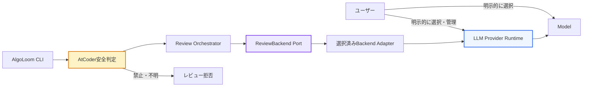
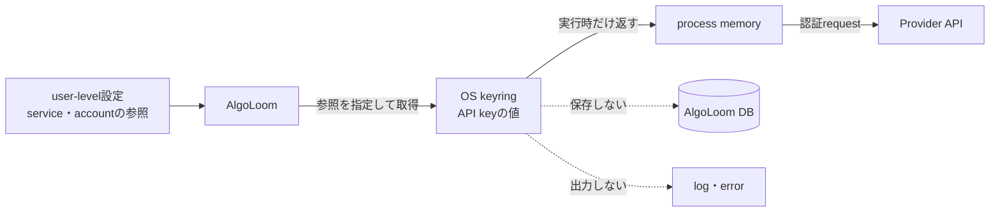
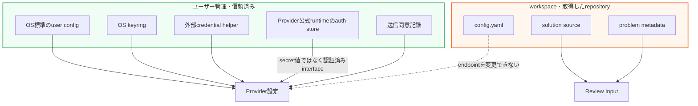
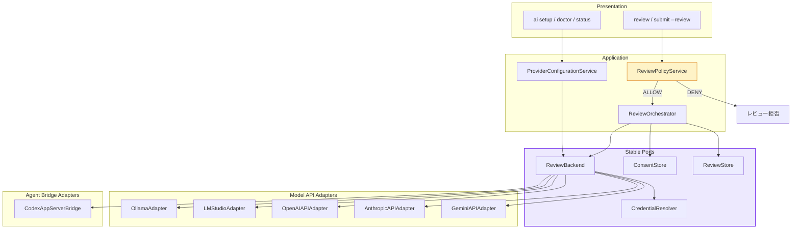
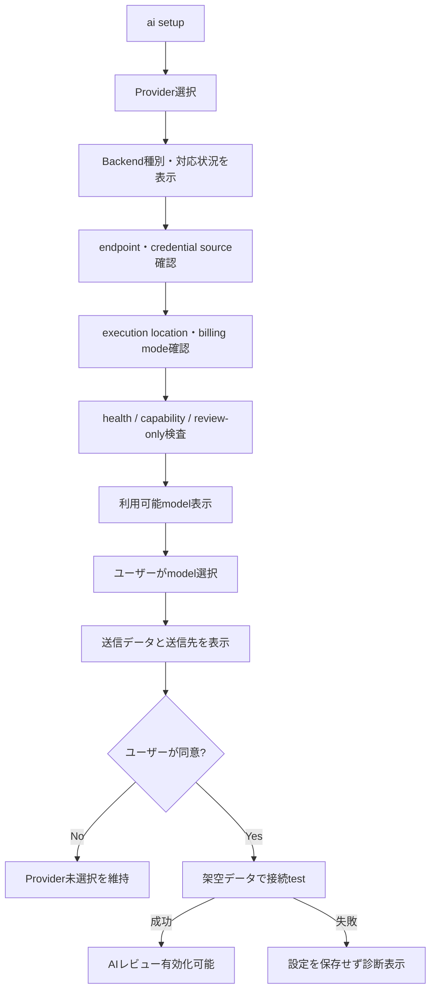
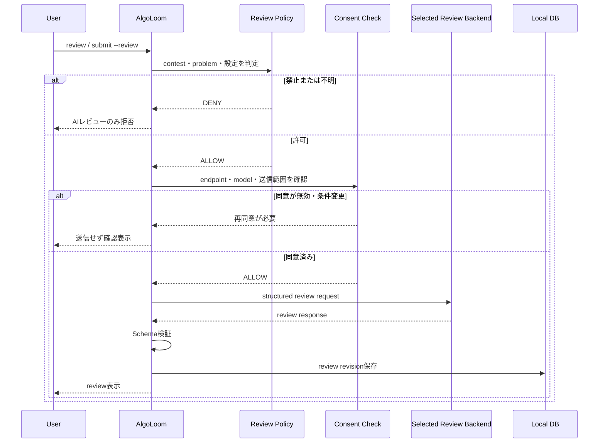
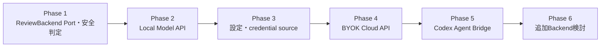

# AlgoLoom Review Backend・LLM Provider選択・実行基盤設計

> 対象: AlgoLoomのAIレビューで利用するModel API、Coding Agent、LLM Provider、実行基盤、モデル、接続先、認証・認可、セットアップUX
>
> 状態: 設計方針
>
> 作成日: 2026年7月16日
>
> 関連文書:
> - [プロジェクト草案](../concept.md)
> - [AlgoLoom AIレビュー安全設計](../distribution/ai-review-safety-design.md)
> - [AlgoLoom 配布方針ガイド](../distribution/algoloom-distribution.md)
> - [ローカル利用とCloud同期の段階的設計](../database/local-and-cloud-sync-design.md)
>
> 注意: Provider、API、モデル、ライセンス、料金、データ利用条件は変更される可能性がある。実装時とリリース前に各Providerの公式資料を再確認すること。

---

## 0. 結論

AlgoLoomは特定のLLM実行基盤を所有・管理せず、**ユーザーが明示的に選択して用意したReview Backendへ接続するAIレビュークライアント**として設計する。

Ollamaは初期対応Providerの有力候補であり、ローカル実行を重視するAlgoLoomと相性がよい。しかし、AlgoLoomの必須構成、暗黙の接続先、AlgoLoomが管理するランタイムにはしない。

Review Backendは、性質の異なる次の2種類へ分ける。

```text
Model API Backend
    = Ollama、LM Studio、OpenAI API、Anthropic API、Gemini API等
    = promptを送り、responseを受け取る
    = AlgoLoomからfilesystemやshellの権限を与えない

Agent Bridge Backend
    = Codex app-server等
    = 認証、session、agent event等を外部runtimeへ委譲する
    = tool、filesystem、shellの認可を追加で制限する
```

Claude CodeやGemini CLIのsubscription loginは、CLIで利用できることと、第三者applicationが利用者に代わって再利用できることを同一視しない。Providerが第三者利用を明示的に許可していないsubscription credentialはAlgoLoomから利用しない。Cloud APIはAPI key、公式credential chain、またはProviderが製品組み込み用に公開した認証境界だけを使用する。

中心となる不変条件は次のとおりである。

- 初期状態ではAIレビューをOFF、Providerを未選択にする。
- Provider、endpoint、モデル、実行場所はユーザーが明示的に選択する。
- subscription利用とAPI従量課金を別の認証・課金経路として表示する。
- AlgoLoomはProvider runtimeをインストール、更新、起動、停止、削除しない。
- AlgoLoomはOSのpackage managerやベンダーのinstallerを実行しない。
- モデルをレビュー実行中や初期設定中に暗黙でdownloadしない。
- 選択したProviderが失敗しても、別Providerへ自動fallbackしない。
- endpoint、モデル、実行場所が変わり、データ送信条件が変化する場合は再同意を求める。
- Provider設定をワークスペースや取得したリポジトリから上書きさせない。
- AlgoLoomはProviderのpassword、social login情報、OAuth token cacheを読み取らない。
- API keyはhash化して保存せず、環境変数、外部credential helper、OS keyring等から取得する。
- Coding Agentを利用する場合も、レビューに不要なfilesystem write、shell、MCP、plugin権限を与えない。
- AtCoderルールの安全判定をすべてのProviderより前に実行する。
- AIレビューを利用できなくても、AIを使わないAlgoLoomの主要機能を継続する。

```text
AlgoLoomの基本機能
    = AlgoLoom Core

AIレビュー利用
    = AlgoLoom Core
    + AI Review Capability
    + ユーザーが選択・管理するReview Backend
    + ユーザーが選択・管理するモデル
```



---

## 1. 目的と対象外

### 1.1. 目的

- ユーザーのマシンと既存環境に対するAlgoLoomの変更範囲を最小化する。
- Providerとモデルの選択権をユーザーへ残す。
- Ollama、LM Studio、Cloud Model API、公式Coding Agent bridgeを共通のreview workflowから選択できるようにする。
- ローカルProviderとCloud Providerを同じ安全境界の内側で扱う。
- Model APIとCoding Agentの権限差を明示し、同じ安全性だと誤認させない。
- 特定ベンダーのSDKやAPIをApplication層へ広げない。
- 将来Providerを追加しても、レビュー、安全判定、保存形式を維持する。
- 送信先と送信データをユーザーが理解・制御できるようにする。
- Provider障害をAlgoLoomの提出・テスト・履歴機能から隔離する。

### 1.2. 対象外

- LLM Provider runtimeの配布
- Ollama等の自動インストール
- GPU driver、CUDA、ROCm、Metal関連toolchainの導入
- OS service、daemon、login itemの登録
- モデルweightのAlgoLoom配布物への同梱
- モデルの自動選択、暗黙のdownload、暗黙のupgrade
- Provider accountの自動作成
- Provider利用規約への同意代行
- Provider API keyの発行代行
- Provider password、Google / Claude / ChatGPT等のsocial login情報の取得
- Provider CLIのcredential file、OAuth access token、refresh tokenの読み取り・copy・Cloud同期
- 公式に許可されていないsubscription credentialの第三者利用
- 独自OAuth clientの登録、callback、token refresh、account recovery
- ユーザーの許可を伴わないCloud送信
- Provider間の自動fallback
- AIによるコードの自動適用・自動提出・shell実行

---

## 2. 用語集

本設計では、credentialの「値」と、その値を取得するための「参照情報」を区別する。例えば、API keyそのものはcredential値であり、`ANTHROPIC_API_KEY`という環境変数名は参照情報である。

### 2.1. AIレビューとBackend

| 用語 | 本文書での意味 |
|---|---|
| API | application同士が決められた形式でrequestとresponseを交換する接続口 |
| CLI | terminalからcommandとして操作するapplication。Command Line Interfaceの略 |
| SDK | 特定ProviderのAPIや機能をapplicationへ組み込むためのlibraryや開発用tool一式 |
| app-server | 別applicationから接続できるように、agent機能をprotocol経由で提供するprocess |
| LLM Provider | AlgoLoomからレビュー要求を受け、LLM推論結果を返す実行基盤またはAPIサービス |
| Review Backend | AlgoLoomの共通review requestを受け、検証対象となるreview responseを返す接続先の総称。Model APIとAgent Bridgeを含む |
| Model API Backend | HTTP等でモデルへpromptを送りresponseを得るBackend。AlgoLoomからtool権限を付与しない |
| Agent Bridge Backend | 外部Coding Agentの公式CLI、SDK、app-server等へreviewを委譲するBackend。認証に加えてtoolの認可制御が必要 |
| Provider runtime | Ollama server等、モデルを読み込みAPIを提供するソフトウェアまたはサービス |
| Provider Adapter | Provider固有APIとAlgoLoom内部契約を相互変換する部品 |
| Agent Bridge Adapter | Coding Agent固有protocolとAlgoLoom内部契約を相互変換し、sandboxとtool制限を適用する部品 |
| Model | AIレビューを生成するモデル。Providerとは別にユーザーが選択する |
| endpoint | AlgoLoomが接続するProvider APIのURL |
| execution location | 推論と入力データ処理が行われる場所。`local`または`remote` |
| capability | structured output、streaming、model listing等、Providerが提供する能力 |
| structured output | 自由文ではなく、事前に決めたJSON Schema等の構造に従ってresponseを返す方式 |
| tool | Coding Agentが利用できる追加機能。file操作、shell、browser、MCP等を含む |
| sandbox | processが利用できるfile、command、network等を制限する隔離環境 |
| fallback | 選択したProviderが失敗したとき、別Providerへ切り替えて処理を続けること。本設計では暗黙のfallbackを禁止する |
| Provider未選択 | AlgoLoomがどのLLMにも接続せず、AIレビューを実行できない初期状態 |
| user-level設定 | OS標準のユーザー設定領域へ保存し、workspaceから変更できない信頼済み設定 |

Ollama、LM Studio、Codex等はReview Backendの例である。「AIレビュー」と特定Backendの連携を同義にせず、UI、設定、DB、Application層ではBackend非依存の用語を使用する。

### 2.2. credentialと認証

| 用語 | 平易な説明 |
|---|---|
| 認証 | 接続しようとしている利用者やapplicationが誰であるかを確認すること。Authentication |
| 認可 | 認証済みの主体に、どのAPI、file、tool、操作を許可するか決めること。Authorization |
| secret | 漏えいすると第三者に権限を使われる可能性がある情報。password、API key、session Cookie、token等 |
| credential | Providerへ「この利用者またはapplicationは接続を許可されている」と証明する情報の総称 |
| credential値 | API keyやtokenそのもの。設定画面、log、DB、Cloud同期へ出してはならない |
| credential参照 | credential値を取得する場所を示す情報。環境変数名、keyringのservice名・account名等 |
| credential owner | credentialの発行、保存、更新、失効に責任を持つ主体。ユーザー、外部runtime、OS keyring等 |
| credential source | AlgoLoomが実行時にcredentialを得る方法。`external_runtime`、`credential_helper`、`environment`、`keyring`等 |
| API key | APIの利用者や契約を識別する秘密の文字列。Providerへ元の値を送る必要がある |
| token | 認証済みであることや付与された権限を表す値。種類によって用途と有効期限が異なる |
| Bearer token | その値を提示した主体へ権限を与えるtoken。所持者として扱われるため、漏えい時の影響が大きい |
| OAuth | passwordを第三者applicationへ渡さず、Providerの認可画面を介して限定的な権限を委譲する仕組み |
| access token | OAuth等で発行され、API呼び出しに使う通常は有効期限付きの秘密情報 |
| refresh token | access tokenを再発行するための秘密情報。長期間利用できる場合があり、特に慎重な管理が必要 |
| scope | tokenやapplicationへ許可する操作範囲。必要最小限に限定する |
| session | login状態や一連のagent処理を関連付ける状態。永続sessionには入力codeが残る可能性がある |
| social login | Google等の外部accountを使ってProviderへloginする方式。AlgoLoomはlogin情報を受け取らない |
| subscription authentication | Claude、Gemini、ChatGPT等の定額契約やworkspace entitlementを利用する認証経路 |
| API authentication | API key、service account、Application Default Credentials等を利用するAPI・Cloud契約の認証経路 |
| service account | 人間ではなくapplicationやserverを表すCloud上のaccount。必要最小限の権限を付与する |
| Application Default Credentials | Google Cloudのlibraryが、環境に応じたcredential sourceを既定の順序で探索する仕組み。ADCとも呼ぶ |
| BYOK | Bring Your Own Key。ユーザーが自分のProvider API keyを用意する方式 |
| external runtime | Provider公式のCLIやapp-server等。AlgoLoomの外側でlogin、token保存、更新を管理するprocess |
| credential helper | 必要なときだけcredentialを返す外部command。AlgoLoomは返された値を永続化しない |
| environment | processへ渡される環境変数。AlgoLoomは指定された変数だけを読み、環境変数一覧を取得しない |
| OS keyring | OSが提供するcredential専用の保管領域。通常の設定fileやAlgoLoomのDBとは分離され、OSのaccess controlを介して利用する |

### 2.3. OS keyringとは何か

OS keyringは、passwordやAPI key等を一般の設定fileとは分けて保管する、OSのcredential管理機能である。代表例はmacOSのKeychain、WindowsのCredential Manager、Linux desktop環境のSecret Service互換keyringである。

AlgoLoomがkeyringを利用する場合、設定fileへ保存するのはcredential値ではなく、`service = algoloom`、`account = anthropic-default`等の参照情報だけである。実際のAPI keyはOS keyringから実行時に取得し、Providerへのrequestに必要な間だけmemory上で扱う。



keyringは平文fileより安全に扱いやすいが、credential値を端末へ**永続化する仕組み**である点は変わらない。また、keyringを使えば漏えいが絶対に起きないわけではない。OS accountへのaccess、applicationへの読取許可、端末のlock、credentialの失効・削除を適切に管理する必要がある。

したがって、永続化方針は次の2つを混同しない。

| 方針 | OS keyringの扱い |
|---|---|
| AlgoLoomの設定file・DBへsecretを保存しない | keyringへの保存は許可できる |
| AlgoLoomの操作によるcredential値の永続化を一切禁止する | keyringへの新規保存も禁止し、外部runtime、credential helper、環境変数だけを使う |

本文書の現行方針は前者であり、ユーザーが明示的に選択した場合に限ってOS keyringを許可している。後者を製品原則にする場合は、`keyring`をcredential sourceとセットアップUXから除外する必要がある。

### 2.4. 保存・暗号化に関する用語

| 用語 | 意味 | credentialへの適用 |
|---|---|---|
| 永続化 | process終了や端末再起動後も値が残る場所へ保存すること | 設定file、DB、keyring、外部runtimeのauth storeはいずれも永続化になり得る |
| memory上の一時保持 | 実行中のprocessだけで値を扱い、処理後に参照を破棄すること | API呼び出しに必要だが、logやcrash reportへの混入を防ぐ必要がある |
| 平文保存 | 暗号化せず、fileを読めば元の値が分かる形で保存すること | 禁止する |
| hash化 | 元の値へ戻せない一方向変換。password照合に利用される | Providerへ元の値を送るAPI keyやtokenの保存には利用できない |
| 暗号化 | 鍵を使って元の値へ戻せる形に変換すること | 復号鍵の管理が必要。application埋め込みの固定鍵だけでは十分な保護にならない |
| serialization | memory上の値をJSON、YAML、DB行等の保存・転送可能な形式へ変換すること | credential値を誤って設定fileやDBへ書き出さない |
| redaction | logやerrorからsecretを削除またはマスクすること | credential値、HTTP header、Providerのraw errorへ適用する |

---

## 3. 設計原則

### 3.1. ユーザー選択を優先する

選択対象を1つの`provider`文字列へまとめず、少なくとも次を独立して扱う。

| 選択項目 | 例 | 変更時の扱い |
|---|---|---|
| Provider | `ollama` | Adapterと送信条件を再確認する |
| endpoint | `http://127.0.0.1:11434` | hostが変わる場合は再同意する |
| Model | ユーザーが導入したmodel名 | local / cloudとlicenseを再確認する |
| execution location | `local` / `remote` | `remote`への変更時は必ず再同意する |
| credential | API key等 | OS keyring等で管理する |
| send policy | source、test結果等 | 追加データを送る場合は再同意する |

ユーザーがProviderを選択していない間、AlgoLoomはProvider探索のためにネットワークへ接続しない。

### 3.2. Provider runtimeのlifecycleを所有しない

AlgoLoomは次の操作を行わない。

```text
install
upgrade
start
stop
restart
register service
uninstall
```

このルールはProviderに依存しない。Ollamaだけでなく、将来追加するローカルserver、container、Cloud CLI、vendor SDKにも適用する。

AlgoLoomが行うのは次のread-onlyな診断と接続だけである。

- 設定済みendpointへhealth checkする。
- Provider API versionとcapabilityを確認する。
- 利用可能なmodel一覧を取得する。
- 選択したmodelが存在するか確認する。
- 架空データで明示的な接続testを行う。
- 問題がある場合、公式資料とユーザーが実行できる手順を表示する。

### 3.3. モデル管理をProviderへ残す

- AlgoLoom配布物へmodel weightを含めない。
- 初回起動やレビュー要求を契機にmodelをdownloadしない。
- modelがない場合は、Provider固有の公式commandまたは画面を案内する。
- modelのdownload、削除、保存場所、license同意はユーザーとProviderの責任範囲とする。
- AlgoLoomは選択済みmodelの名前、digest、capability等を検証・記録できる。

Ollamaの場合、AlgoLoomが`ollama pull`や`POST /api/pull`を自動実行せず、必要なcommandを表示する。

### 3.4. 暗黙のfallbackを禁止する

次の動作は禁止する。

```text
Local Ollamaが停止
    ↓
AlgoLoomが自動的にCloud APIへ送信
```

Providerが利用できない場合はAIレビューだけを失敗させる。

```text
AI review: Failed
Reason: Selected provider is unavailable.

No other provider was contacted.
Submission, tests, and local history were not affected.
```

ユーザーが別Providerを選び直した場合だけ、接続先を変更する。

### 3.5. AIなしの機能を止めない

次の処理はProvider未選択・停止・未認証でも利用可能にする。

- `get`
- `test`
- AIを要求しない`submit`
- 提出結果とコードの保存
- `log`
- `show`
- `diff`
- DB同期とbackup

`submit --review`でProvider呼び出しだけが失敗した場合、AtCoder提出とローカル保存の成功を維持する。

### 3.6. credentialを可能な限り所有しない

優先順位は次のとおりとする。

| 優先度 | credential source | AlgoLoomの扱い |
|---:|---|---|
| 1 | `external_runtime` | Provider公式runtimeがlogin、保存、refreshを所有する。AlgoLoomは認証状態だけを確認する |
| 2 | `credential_helper` | ユーザー管理の外部commandから実行時だけ取得し、memory上で短時間利用する |
| 3 | `environment` | 指定された1つの環境変数から実行時に取得する。環境変数一覧は読まない |
| 4 | `keyring` | OS credential storeへ保存し、設定にはservice / accountの参照だけを置く |
| 禁止 | project file / user DB / Cloud同期DB | credentialを保存しない |

API keyやBearer tokenはProviderへ元の値を送る必要があるため、passwordのようにhash化して保存できない。AlgoLoomへ固定の暗号鍵を埋め込んでfileを暗号化する方式も、鍵を配布物から取り出せるため既定の保護手段にしない。

- Provider passwordを受け取らない。
- social loginはProvider公式runtimeまたはbrowserへ委譲する。
- 外部runtimeのcredential cacheを探索、parse、copyしない。
- keyringを利用できない場合、平文fileへ黙ってfallbackしない。
- `ai disconnect`ではAlgoLoom所有のkeyring項目と設定参照だけを削除する。外部runtimeのlogin状態は変更しない。
- credentialの値、末尾文字、長さ、prefixをstatus、log、errorへ表示しない。

### 3.7. subscriptionとAPIを別の製品経路として扱う

同じ企業・同じmodel familyでも、subscriptionとAPIは料金、quota、規約、data policy、利用可能modelが異なり得る。

```text
Claude subscription != Anthropic API
Google AI subscription != Gemini API / Vertex AI
ChatGPT subscription != OpenAI Platform API
```

AlgoLoomは「同じアカウントだから利用可能」と推測しない。各Backend profileへ次を持たせる。

- `billing_mode`: `local` / `subscription` / `api_usage` / `cloud_contract`
- `auth_mode`: `none` / `external_oauth` / `api_key` / `adc` / `service_account`
- `credential_owner`: `external_runtime` / `algoloom_keyring` / `user_environment`
- `terms_status`: `supported` / `requires_confirmation` / `not_supported`
- `execution_location`: `local` / `remote` / `provider_dependent`

Providerの公式規約が第三者applicationによるsubscription credential利用を禁止している場合、技術的にCLIを呼び出せても公式Adapterとして提供しない。

### 3.8. Coding Agentはreview-onlyへ権限を縮小する

Coding AgentはModel APIと異なり、filesystem、shell、network、MCP、plugin等のtoolを持ち得る。source code中のPrompt injectionがagentのtool利用へ影響しないよう、Agent Bridge Backendでは次を要求する。

- 安全な一時directoryから起動する。
- workspace全体ではなく、対象codeのsnapshotと必要最小限のmetadataだけを渡す。
- filesystem writeを禁止する。
- shell、MCP、browser、external toolを禁止する。
- user / projectのplugin、rule、instructionを読み込ませない安全modeを使用する。
- approval promptへ依存せず、AlgoLoom側の固定policyで危険なtoolをdenyする。
- ephemeral sessionを優先し、agent sessionへ不要なcodeを残さない。
- structured responseをAlgoLoom側で再検証する。

安全なreview-only modeをProviderの公式interfaceで構成できない場合、そのAgent Bridge Adapterを有効化しない。

---

## 4. 信頼境界

### 4.1. 設定の保存場所

Provider endpoint、execution location、credentialはworkspace設定へ置かない。



| 設定 | 保存場所 | workspaceから変更 |
|---|---|:---:|
| Provider | user-level config | 不可 |
| endpoint | user-level config | 不可 |
| execution location | user-level config | 不可 |
| credential sourceの種類と参照 | user-level config | 不可 |
| API key / token | 環境変数、credential helper、OS keyring等 | 不可 |
| external runtimeのOAuth token | external runtimeが所有 | AlgoLoomからアクセス不可 |
| model | user-level config | 原則不可 |
| remote送信同意 | user-level config | 不可 |
| レビュー表示形式 | user-levelまたはworkspace | 可 |
| 対象languageの補助情報 | workspace | 可 |

第三者のrepositoryをcloneしてcommandを実行しても、そのrepositoryがAI送信先を変更できないことを保証する。

AlgoLoomは`~/.claude`、`~/.gemini`、`~/.codex`等のcredential fileを読む方式でsubscriptionを連携しない。Provider公式runtimeが製品組み込み用protocolを提供する場合だけ、そのprotocolを通じて認証状態とreview responseを扱う。

### 4.2. localとremoteをendpointだけで推測しない

`localhost`へ接続していても、ProviderがCloud modelをproxyする可能性がある。逆にLAN内の別端末でもユーザー自身が管理している場合がある。

そのため、次を別々に管理する。

```text
transport endpoint
provider type
selected model
execution location
data leaves device
```

初期版の`local_only` profileでは、次のすべてを要求する。

- loopback endpointである。
- Providerがlocal inferenceとして報告・設定されている。
- Cloud modelとして識別されるmodelを選択していない。
- API keyを使う外部Cloud APIではない。
- データ送信先のredirectが発生しない。

完全に検証できない場合は「ローカルである」と断定せず、ユーザーへ確認を求めるかレビューを拒否する。

### 4.3. remote Providerの条件

remote Provider対応時は、少なくとも次を満たす。

- 初回接続前に送信先hostを表示する。
- source code、test結果、problem metadata等の送信対象を表示する。
- HTTPSを必須にし、certificate検証を無効化しない。
- credentialをproject fileやlogへ出さない。
- hostをまたぐHTTP redirectを既定で拒否する。
- endpointまたは送信対象が変わった場合は再同意を求める。
- 利用規約、料金、data retentionの確認先を案内する。

LAN上のOllama等、標準APIに認証がないProviderを公開networkへ直接露出させる設定は推奨しない。remote対応は認証付きreverse proxy、VPN、SSH tunnel等の信頼できるtransportを前提とする。

---

## 5. 論理アーキテクチャ

### 5.1. レイヤー構成



### 5.2. Review Backend Port

概念的なinterfaceは次のとおりである。

```python
class ReviewBackend(Protocol):
    def health(self) -> ProviderHealth:
        ...

    def capabilities(self) -> ProviderCapabilities:
        ...

    def list_models(self) -> list[ModelInfo]:
        ...

    def inspect_model(self, model: str) -> ModelInfo:
        ...

    def review(self, request: ReviewRequest) -> ReviewResponse:
        ...
```

共通capabilityの例:

| Capability | 用途 |
|---|---|
| `chat` | 会話形式のレビュー要求 |
| `structured_output` | JSON Schemaに従う出力 |
| `streaming` | 逐次表示 |
| `model_listing` | 利用可能modelの確認 |
| `model_inspection` | digest、license、context等の確認 |
| `usage_metrics` | token数、処理時間等の取得 |
| `local_inference` | local executionとして明示できるか |
| `external_auth_owner` | 外部runtimeがlogin、token保存、refreshを所有するか |
| `review_only` | filesystem write、shell、MCP等を使わずreviewできるか |
| `ephemeral_session` | review sessionを永続化せず実行できるか |

Providerが必要なcapabilityを提供しない場合、Adapterが結果を捏造・推測せず、該当機能を利用不可として表示する。

### 5.3. Backend Adapterの責任

Adapterへ閉じ込めるもの:

- URL pathとrequest format
- 認証header
- Provider固有model metadata
- timeoutとstream protocol
- Provider固有errorの共通errorへの変換
- structured outputのrequest方法
- usage情報の変換
- credential値を含まない認証状態の変換
- Backend種別、billing mode、execution locationの報告

Agent Bridge Adapterへ追加で閉じ込めるもの:

- subprocessまたはapp-server protocol
- sandbox、working directory、tool deny policy
- sessionのephemeral化
- agent eventから最終review responseへの変換

Adapterへ任せないもの:

- AtCoderルール判定
- `contest_mode`
- 送信可能データの決定
- remote送信への同意
- レビュー内容の業務Schema検証
- DBへの保存
- Providerのinstallや起動
- secretの独自暗号化file保存
- Provider規約で禁止されたsubscription credential利用

### 5.4. Adapterの優先順位

初期対応は次の順序を推奨する。

1. Local Model API
   - `OllamaAdapter`
   - loopback上のlocal Ollamaを第一対象にする。
   - Ollama native APIでhealth、model一覧、model詳細、structured outputを扱う。
   - Ollama runtimeやmodelはユーザーが事前に用意する。
   - `LMStudioAdapter`
   - loopback上のLM Studio APIまたはOpenAI互換endpointを利用する。
   - API tokenを有効化している場合は環境変数またはkeyring参照を使う。
2. BYOK Cloud Model API
   - `OpenAIAPIAdapter`
   - `AnthropicAPIAdapter`
   - `GeminiAPIAdapter` / Vertex AI credential chain
   - 環境変数、credential helper、OS keyring等からcredentialを取得する。
3. 公式Agent Bridge
   - `CodexAppServerBridge`
   - Codex app-serverがChatGPT OAuthまたはAPI key authを所有する。
   - review-only、read-only、ephemeralな実行条件を満たす場合だけ有効化する。
4. その他Backend
   - 実需、license、料金、data retention、第三者認証ポリシー、tool認可を確認して追加する。

Ollamaを先に実装しても、設定名、Application Service、DB Schemaを`ollama_*`へ固定しない。OpenAI互換wire formatを利用する場合も、Provider profile、execution location、credential source、data policyまで同一だとは仮定しない。

### 5.5. Provider別の対応方針

> 2026年7月16日時点。Providerの規約、認証、quotaは変更されるため、Adapter実装時とrelease前に再確認する。

| Backend | 利用経路 | credential owner | 方針 |
|---|---|---|---|
| Ollama Local | loopback API | 原則なし | 初期対応。Cloud modelはlocal inferenceと表示しない |
| LM Studio Local | loopback API / OpenAI互換API | 原則なし。任意API tokenはユーザー | 初期対応候補 |
| OpenAI API | Platform API key | ユーザー環境またはAlgoLoom keyring | BYOK対応候補。ChatGPT subscriptionとは別経路 |
| Anthropic API | API key、Bedrock、Vertex等 | ユーザー環境または各Cloud credential chain | BYOK対応候補 |
| Claude Code subscription | Claude.ai OAuth | Claude Code | 第三者によるsubscription credential利用が明示的に許可されるまで非対応 |
| Gemini API / Vertex AI | API key、ADC、service account | ユーザー環境またはGoogle credential chain | BYOK対応候補 |
| Gemini CLI subscription | Google OAuth | Gemini CLI | OAuthへの第三者piggybackが明示的に許可されるまで非対応 |
| Codex | Codex app-server | Codex app-server | 後期候補。公式の組み込みprotocolとreview-only policyを使用 |

Claude CodeとGemini CLIにheadless modeが存在しても、技術的にsubprocess実行できることだけを根拠にsubscription Adapterを提供しない。Codexはapp-serverが製品組み込み用interfaceとして公開され、ChatGPT managed authをapp-server自身が所有するため、異なる扱いとする。

---

## 6. セットアップUX

### 6.1. 初期状態

```yaml
ai_review:
  enabled: false
  provider: null
  model: null
```

AlgoLoomの初回起動時にProvider選択を必須にしない。AIレビューを利用しないユーザーへProvider設定を繰り返し要求しない。

### 6.2. Provider選択

```text
$ aloom ai setup

AI review is optional. AlgoLoom will not install, start,
or update an LLM provider.

Select a provider you have already configured:
  1. Ollama (local API)
  2. LM Studio (local API)
  3. OpenAI API (usage-based)
  4. Anthropic API (usage-based)
  5. Gemini API / Vertex AI
  6. Codex app-server (experimental, external auth owner)
  7. Not now
```

セットアップは次の順序で行う。



### 6.3. Providerが未導入の場合

AlgoLoomはinstallを代行せず、選択したProviderの公式資料を表示する。

```text
Ollama was not found at http://127.0.0.1:11434.

AlgoLoom did not install or start Ollama.
Configure your provider using its official documentation, then run:
  aloom ai doctor
```

### 6.4. Modelがない場合

```text
Selected model was not found.

AlgoLoom will not download models automatically.
Install the model with your provider, then run:
  aloom ai doctor
```

必要に応じてProvider固有commandをcopy可能な例として表示できるが、AlgoLoom自身は実行しない。

### 6.5. CLI案

| Command | 目的 | runtime変更 |
|---|---|:---:|
| `aloom ai setup` | 既存Providerとの接続設定 | しない |
| `aloom ai doctor` | endpoint、capability、modelを診断 | しない |
| `aloom ai status` | 選択中Provider、model、送信場所を表示 | しない |
| `aloom ai providers` | 対応Adapterを表示 | しない |
| `aloom ai models` | Provider APIから利用可能modelを読む | しない |
| `aloom ai enable` | 検証済み設定でAIレビューを有効化 | しない |
| `aloom ai disable` | AIレビューを無効化 | しない |
| `aloom ai disconnect` | credentialと接続設定を削除 | Provider側は変更しない |

`ai disconnect`はAlgoLoom側の設定参照とAlgoLoomが作成したkeyring項目だけを削除し、Provider account、外部runtimeのOAuth login、server、modelを削除しない。

### 6.6. credential sourceの選択

Cloud Model APIを選択した場合、secret値を設定fileへ入力させず、参照方法を選択する。

```text
Select credential source:
  1. Environment variable
  2. External credential helper
  3. OS keyring
  4. Cancel
```

設定例:

```yaml
ai_review:
  backend: anthropic_api
  endpoint: https://api.anthropic.com
  credential_source:
    type: environment
    name: ANTHROPIC_API_KEY
```

keyringを利用する場合も設定fileへ保存するのは参照だけとする。

```yaml
credential_source:
  type: keyring
  service: algoloom
  account: anthropic-default
```

- `environment`では指定された変数だけを読む。
- `credential_helper`はuser-level設定で絶対pathまたは安全なargvとして登録し、workspaceから変更させない。
- `keyring`への入力時はterminal echoを無効化し、確認のためにsecretを再表示しない。
- keyringが利用不可の場合、平文fileへfallbackしない。
- `external_runtime`ではAlgoLoomがtoken値を要求せず、runtimeが返す認証状態だけを表示する。

### 6.7. 対応しないsubscriptionの表示

Claude CodeまたはGemini CLIのsubscription利用を選択しようとした場合、token fileの場所や回避手順を案内しない。

```text
This subscription authentication method is not supported by AlgoLoom.

AlgoLoom will not read or reuse the provider CLI's OAuth credentials.
Use the provider's supported API or cloud credential method instead.
```

Providerの公式資料と、対応可能なAPI経路だけを表示する。

---

## 7. レビュー実行フロー



実行順序は変更しない。

1. `ai_review_enabled`
2. `contest_mode`
3. AtCoderルールと問題IDの安全判定
4. Review Backend設定、credential source、capability確認
5. 送信先・送信データの同意確認
6. Review Backend呼び出し
7. response Schema検証
8. review revision保存

Backend Adapterを追加しても、1から5を迂回できない。Agent Bridge Backendでは、この順序に加えてreview-onlyの権限制約を呼び出し前に確認する。

---

## 8. データ送信と保存

### 8.1. 送信候補

送信する可能性があるデータは、レビュー品質に必要な最小限へ限定する。

| Data | 既定 | 補足 |
|---|:---:|---|
| 提出コード | 送信 | レビュー対象 |
| programming language | 送信 | prompt選択に利用 |
| compiler / runtime error | 送信 | 存在する場合 |
| local test結果 | 送信 | 公開sampleの結果等 |
| AtCoder verdict | 送信 | AC、WA、TLE等 |
| problem ID | 送信 | ルール判定済みの識別子 |
| AtCoder password | 送信しない | 禁止 |
| session Cookie | 送信しない | 禁止 |
| 環境変数全体 | 送信しない | secretを含み得る |
| workspace全体 | 送信しない | 初期版では対象外 |
| 未提出の他file | 送信しない | 初期版では対象外 |

remote Providerでは、初回同意画面に送信項目を表示する。送信項目を追加するversion updateでは同意を取り直す。

### 8.2. 保存するreview metadata

- Backend typeとadapter type
- billing modeとcredential owner
- execution location
- endpointの安全な識別情報。credentialやquery secretは除く
- model名
- model digestまたはversion
- prompt version
- response Schema version
- 対象code hash
- generation parameter
- generated at
- latencyと利用可能なusage情報
- 検証済みのreview本文

Providerのsecret、外部runtimeのOAuth token、raw HTTP header、内部reasoning traceは保存しない。

### 8.3. DB同期との関係

AIレビュー結果をTurso等へ同期する場合、LLM Providerへの送信とDB同期への送信は別の外部送信として説明する。

```text
LLM Providerへの送信
    = reviewを生成するための送信

Cloud DBへの送信
    = reviewと履歴を複数端末で共有するための送信
```

ローカルProviderを選択しても、Cloud DB同期を有効化していればreviewや提出コードがCloudへ保存され得る。ユーザーへ両者を混同させない。

---

## 9. エラーと状態表示

| 状況 | AIレビュー | 他機能 | 表示 |
|---|---|---|---|
| Provider未選択 | 実行しない | 継続 | setup方法を表示 |
| Provider停止 | 失敗 | 継続 | 選択先へ接続できない旨 |
| Model未導入 | 実行しない | 継続 | Provider側で導入する方法 |
| 認証失敗 | 実行しない | 継続 | credential更新を案内 |
| 対応外subscription | 実行しない | 継続 | 対応する公式API経路を表示 |
| 外部runtime未認証 | 実行しない | 継続 | runtime側の公式login方法を表示 |
| capability不足 | 実行しない | 継続 | 不足capabilityを表示 |
| review-onlyを保証できない | 実行しない | 継続 | Agent Bridgeを拒否し、不足制約を表示 |
| response不正 | 保存しない | 継続 | Schema検証失敗を表示 |
| remote同意なし | 送信しない | 継続 | 再同意を要求 |
| AtCoder安全判定拒否 | Providerを呼ばない | 継続 | 対象ルールと理由を表示 |

Provider固有errorにsource code、credential、response全文が含まれる場合があるため、そのままlogへ出力しない。ユーザー表示用errorとdebug情報を分離し、秘密情報をredactする。

---

## 10. パッケージ配布

### 10.1. AlgoLoomへ含めるもの

- `ReviewBackend` Port
- Model API AdapterとAgent Bridge Adapter
- Backend設定、credential参照、同意管理
- HTTP client処理
- prompt template
- structured output Schema
- response検証
- `ai setup / doctor / status`等のCLI
- 架空データを使ったcontract test

### 10.2. AlgoLoomへ含めないもの

- Provider runtime binary
- GUI application
- container image
- OS service definition
- model weight
- GPU runtimeとdriver
- Provider account
- API key
- password、social login情報、OAuth tokenと認証cache
- Provider固有のuser data

### 10.3. 依存関係

- 可能であれば共通HTTP clientでProvider APIを呼び、vendor SDKを必須依存にしない。
- vendor SDKが必要なAdapterはoptional dependencyとする。
- Adapterが未導入でもAlgoLoom Coreのinstallを成功させる。
- Provider pluginの自動downloadや自動実行は行わない。
- 第三者Adapterを将来許可する場合は、code executionを伴うpluginであることを明示する。

---

## 11. 段階的なReview Backend対応



### Phase 1: Backend非依存のCore

- `ReviewBackend` Portを定義し、Model APIとAgent Bridgeの差をcapabilityで表す。
- mock Backendでreview flowをtestする。
- AtCoder安全判定をProviderより前へ固定する。
- Provider未選択を正常状態として扱う。

### Phase 2: Local Model API

- OllamaとLM Studioのloopback endpointを初期対応する。
- health、model一覧、model詳細、structured outputを検証する。
- Provider runtimeとmodelを自動導入しない。
- Cloud modelを`local_only`として扱わない。

### Phase 3: 設定・credential source

- `ai setup / doctor / status / disconnect`を実装する。
- user-level設定へcredentialの値ではなく参照方法を保存する。
- external runtime、credential helper、環境変数、OS keyringを順に対応する。
- keyringを利用できない環境で平文fileへ自動fallbackしない。
- endpoint、model、execution location変更時の再同意を実装する。
- 選択Provider失敗時のno-fallbackをtestする。

### Phase 4: BYOK Cloud API

- OpenAI API、Anthropic API、Gemini API / Vertex等を個別Adapterとして評価する。
- APIの課金・認証を各社subscriptionとは別に説明する。
- HTTPS、認証、redirect、timeoutを検証する。
- 対応API fieldをcapability negotiationする。
- Providerごとのdata policyを案内する。

### Phase 5: Codex Agent Bridge

- 公式のapp-server interfaceを利用し、外部runtimeに認証を所有させる。
- 一時directoryと最小snapshotだけを渡し、write、shell、MCP、browser、pluginを許可しない。
- sessionをreviewごとに破棄し、structured responseをAlgoLoom側で再検証する。
- review-onlyを保証できないversionや構成ではfail closedとする。

### Phase 6: 追加Backend

- ユーザー需要を確認する。
- 公式の組み込み経路、利用規約、認証方式、料金、data retention、SDK依存を評価する。
- 同じcontract testとsecurity testを通過したAdapterだけを追加する。
- Claude Code subscriptionとGemini subscriptionのcredential再利用は、Providerが第三者組み込みを明示的に許可するまで対応しない。

---

## 12. 受け入れ基準

### Backend選択

- [ ] 初期状態でAIレビューがOFF、Providerが未選択である。
- [ ] ユーザーがBackend種別、Provider、endpoint、modelを明示的に選択できる。
- [ ] Provider未選択でもAlgoLoom Coreを利用できる。
- [ ] endpointやexecution location変更時に再同意を要求する。

### マシンへの非侵襲性

- [ ] OS package managerを実行しない。
- [ ] vendor installerやinstall scriptを実行しない。
- [ ] Provider serviceをstart、stop、restartしない。
- [ ] OS serviceやlogin itemを登録しない。
- [ ] modelを暗黙にdownload、upgrade、deleteしない。
- [ ] `ai disconnect`がProvider runtimeやmodelを削除しない。

### データ保護

- [ ] workspaceからProvider endpointを変更できない。
- [ ] credentialをproject file、log、DBへ保存しない。
- [ ] password、social login情報、外部runtimeのOAuth token・認証cacheを取得または複製しない。
- [ ] API keyをhash化して利用可能な保存形式であるかのように扱わない。
- [ ] keyringを利用できない場合に平文設定へ自動fallbackしない。
- [ ] credential sourceとcredential ownerを`ai status`で秘密値なしに確認できる。
- [ ] remote送信前にhostと送信項目を表示する。
- [ ] hostをまたぐredirectを既定で拒否する。
- [ ] Provider変更時に暗黙のデータ送信を行わない。
- [ ] local endpoint経由のCloud modelをlocal-onlyと誤表示しない。

### 安全性

- [ ] AtCoder安全判定をProvider呼び出しより前に行う。
- [ ] 拒否時にProviderへrequestを送らない。
- [ ] Provider Adapterから安全判定を迂回できない。
- [ ] 選択Provider失敗時に別Providerへfallbackしない。
- [ ] Provider失敗が提出、test、履歴保存を失敗させない。
- [ ] 対応外subscriptionを選択した場合、非公式なtoken転用手順を表示しない。
- [ ] Agent Bridgeへworkspace全体、write、shell、MCP、browser、plugin権限を渡さない。
- [ ] Agent Bridgeの一時sessionと一時directoryをreview後に破棄する。

---

## 13. 実装チェックリスト

### Architecture

- [ ] Application層がOllama固有typeを参照していない。
- [ ] DB columnと設定の共通部分を`ollama_*`で命名していない。
- [ ] Model APIとAgent Bridgeを同一の認証・実行方式として扱っていない。
- [ ] Provider AdapterへAPI固有処理を閉じ込めている。
- [ ] Agent Bridge Adapterへprotocol、session、sandbox処理を閉じ込めている。
- [ ] 共通contract testをすべてのAdapterへ適用する。

### UX

- [ ] ProviderのinstallをAlgoLoomの必須stepとして表示しない。
- [ ] AlgoLoomがinstallしないことをsetup画面で明示する。
- [ ] 不足runtimeとmodelについて公式手順だけを案内する。
- [ ] Provider、model、送信場所を`ai status`で確認できる。
- [ ] subscriptionとAPI従量課金の違いをsetup画面で確認できる。
- [ ] AIレビュー無効時にProviderへ接続しない。

### Operations

- [ ] timeoutとcancelを実装する。
- [ ] errorとlogからsecretをredactする。
- [ ] Provider API互換性をversion matrixでtestする。
- [ ] model名だけでlicenseやlocalityを断定しない。
- [ ] data policy変更時に再同意を要求できる。

---

## 14. 関連文書との責任分担

| 文書 | 主な責任 |
|---|---|
| 本文書 | Review Backend選択、credential境界、runtime非管理、接続先、同意、Adapter、no-fallback |
| [セキュリティ設計](./security-design.md) | secret管理、外部process、Agent Bridgeの権限制約、Prompt injection |
| [AIレビュー安全設計](../distribution/ai-review-safety-design.md) | AtCoderルール、開催中問題の判定、`contest_mode`、fail closed |
| [配布方針ガイド](../distribution/algoloom-distribution.md) | PyPI配布、第三者license、プライバシー、公開版の安全性 |
| [ローカル・Cloud同期設計](../database/local-and-cloud-sync-design.md) | DB同期、レビュー保存データの端末間共有 |

Providerを追加・変更しても、AIレビュー安全設計の判定は変更しない。DB同期を有効化・無効化しても、Provider選択とLLMへの送信同意は別に管理する。

---

## 15. 公式資料

- [Ollama API Introduction](https://docs.ollama.com/api/introduction)
- [Ollama API Authentication](https://docs.ollama.com/api/authentication)
- [Ollama OpenAI Compatibility](https://docs.ollama.com/api/openai-compatibility)
- [Ollama Structured Outputs](https://docs.ollama.com/capabilities/structured-outputs)
- [Ollama List Models](https://docs.ollama.com/api/tags)
- [Ollama Show Model Details](https://docs.ollama.com/api-reference/show-model-details)
- [Ollama Linux](https://docs.ollama.com/linux)
- [Ollama macOS](https://docs.ollama.com/macos)
- [Ollama Windows](https://docs.ollama.com/windows)
- [LM Studio REST API Quickstart](https://lmstudio.ai/docs/developer/rest/quickstart)
- [Anthropic Claude Code Authentication](https://code.claude.com/docs/en/authentication)
- [Anthropic Claude Code Legal and Compliance](https://code.claude.com/docs/en/legal-and-compliance)
- [Gemini CLI Authentication](https://geminicli.com/docs/get-started/authentication/)
- [Gemini CLI FAQ](https://geminicli.com/docs/resources/faq/)
- [Gemini CLI Quotas and Pricing](https://geminicli.com/docs/resources/quota-and-pricing/)
- [Codex Authentication](https://learn.chatgpt.com/docs/auth)
- [Codex App Server](https://learn.chatgpt.com/docs/app-server)
- [Codex Non-interactive Mode](https://learn.chatgpt.com/docs/non-interactive-mode)

---

## 16. 最終方針

AlgoLoomはLLM ProviderやCoding Agentを管理するapplicationではなく、ユーザーが選択したReview Backendへ安全に接続するAIレビューclientである。

```text
Providerの選択と管理     = ユーザー
Modelの選択と管理        = ユーザー
credentialの所有         = ユーザーまたは外部runtime
安全判定とreview workflow = AlgoLoom
Backend固有の変換と隔離   = Backend Adapter
```

- OllamaとLM Studioをlocal Model APIの初期候補とし、AlgoLoomの必須runtimeにはしない。
- remote APIはBYOKを基本とし、API認証と各社subscriptionを混同しない。
- Claude CodeとGemini CLIのsubscription credentialを第三者applicationから転用しない。
- Codexは公式app-serverを利用できる場合に限り、外部runtime所有の認証とreview-only制約の下で段階導入する。
- Provider runtimeとmodelはAlgoLoomへ同梱しない。
- AlgoLoomはそれらをinstall、update、start、stop、deleteしない。
- 初期状態ではProviderを選択せず、AIレビューを無効にする。
- Provider、endpoint、model、execution location、送信範囲はユーザーが決定する。
- 選択Providerが失敗しても別Providerへ自動fallbackしない。
- Provider設定はuser-levelの信頼済み領域で管理し、workspaceから変更させない。
- API keyはenvironment、credential helper、OS keyringから解決し、project、DB、Cloud同期へ保存しない。
- Coding Agentへwrite、shell、MCP、browser、pluginの権限を与えない。
- すべてのProviderをAtCoder安全判定と明示同意の後ろに置く。
- AIレビューを利用できない場合も、AlgoLoom Coreの操作を継続する。

この設計により、ユーザーのマシン、credential、データに対する非侵襲性を守りながら、local Model API、remote API、公式Agent Bridgeへ段階的に拡張できる。
