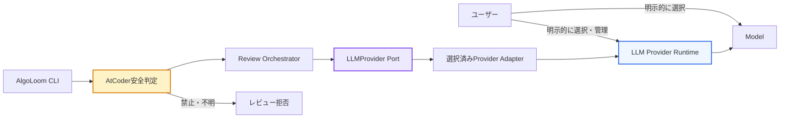
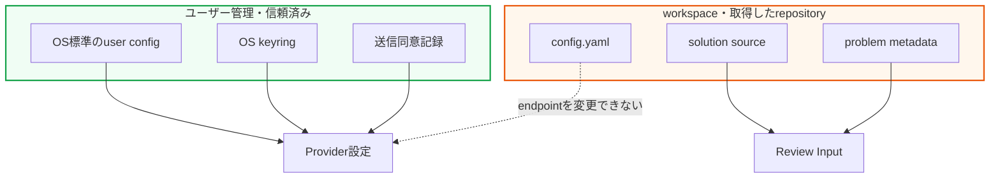
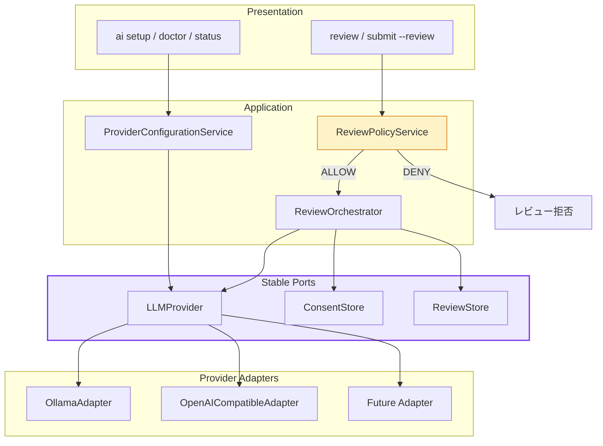
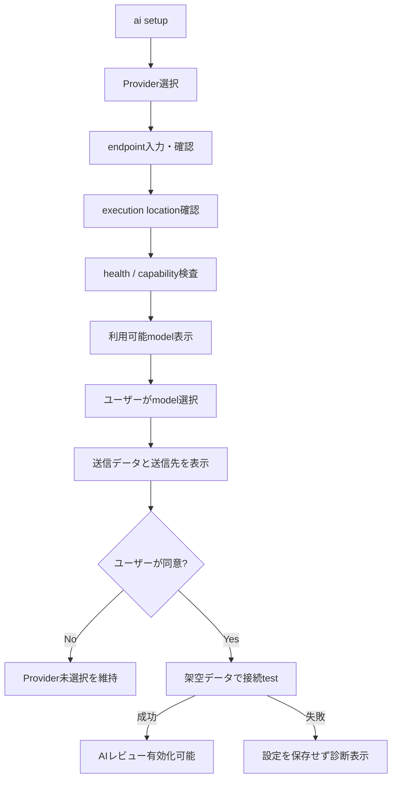
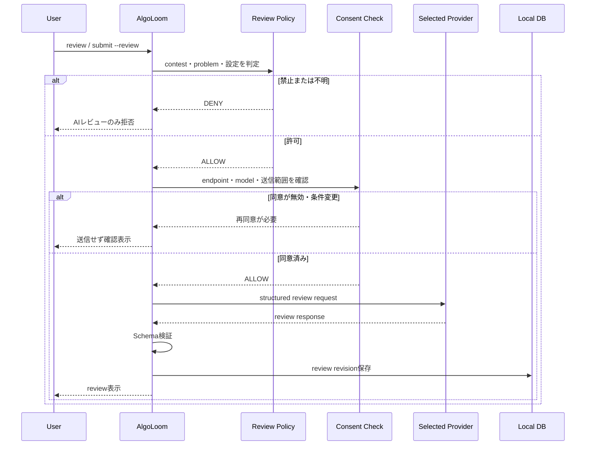
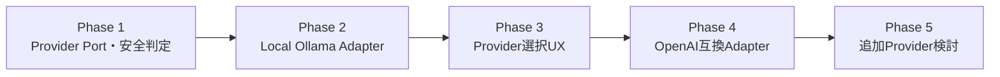

# AlgoLoom LLM Provider選択・実行基盤設計

> 対象: AlgoLoomのAIレビューで利用するLLM Provider、実行基盤、モデル、接続先、認証、セットアップUX
>
> 状態: 設計方針
>
> 作成日: 2026年7月16日
>
> 関連文書:
> - [プロジェクト草案](../concept.md)
> - [AlgoLoom AIレビュー安全設計](../distribution/ai-review-safety-design.md)
> - [AlgoLoom 配布方針ガイド](../distribution/algoloom-distribution.md)
> - [ローカル利用とCloud同期の段階的設計](../database/local-and-cloud-sync-design.md)
>
> 注意: Provider、API、モデル、ライセンス、料金、データ利用条件は変更される可能性がある。実装時とリリース前に各Providerの公式資料を再確認すること。

---

## 0. 結論

AlgoLoomは特定のLLM実行基盤を所有・管理せず、**ユーザーが明示的に選択して用意したLLM Providerへ接続するAIレビュークライアント**として設計する。

Ollamaは初期対応Providerの有力候補であり、ローカル実行を重視するAlgoLoomと相性がよい。しかし、AlgoLoomの必須構成、暗黙の接続先、AlgoLoomが管理するランタイムにはしない。

中心となる不変条件は次のとおりである。

- 初期状態ではAIレビューをOFF、Providerを未選択にする。
- Provider、endpoint、モデル、実行場所はユーザーが明示的に選択する。
- AlgoLoomはProvider runtimeをインストール、更新、起動、停止、削除しない。
- AlgoLoomはOSのpackage managerやベンダーのinstallerを実行しない。
- モデルをレビュー実行中や初期設定中に暗黙でdownloadしない。
- 選択したProviderが失敗しても、別Providerへ自動fallbackしない。
- endpoint、モデル、実行場所が変わり、データ送信条件が変化する場合は再同意を求める。
- Provider設定をワークスペースや取得したリポジトリから上書きさせない。
- AtCoderルールの安全判定をすべてのProviderより前に実行する。
- AIレビューを利用できなくても、AIを使わないAlgoLoomの主要機能を継続する。

```text
AlgoLoomの基本機能
    = AlgoLoom Core

AIレビュー利用
    = AlgoLoom Core
    + AI Review Capability
    + ユーザーが選択・管理するLLM Provider
    + ユーザーが選択・管理するモデル
```



---

## 1. 目的と対象外

### 1.1. 目的

- ユーザーのマシンと既存環境に対するAlgoLoomの変更範囲を最小化する。
- Providerとモデルの選択権をユーザーへ残す。
- ローカルProviderとCloud Providerを同じ安全境界の内側で扱う。
- 特定ベンダーのSDKやAPIをApplication層へ広げない。
- 将来Providerを追加しても、レビュー、安全判定、保存形式を維持する。
- 送信先と送信データをユーザーが理解・制御できるようにする。
- Provider障害をAlgoLoomの提出・テスト・履歴機能から隔離する。

### 1.2. 対象外

- LLM Provider runtimeの配布
- Ollama等の自動インストール
- GPU driver、CUDA、ROCm、Metal関連toolchainの導入
- OS service、daemon、login itemの登録
- モデルweightのAlgoLoom配布物への同梱
- モデルの自動選択、暗黙のdownload、暗黙のupgrade
- Provider accountの自動作成
- Provider利用規約への同意代行
- Provider API keyの発行代行
- ユーザーの許可を伴わないCloud送信
- Provider間の自動fallback
- AIによるコードの自動適用・自動提出・shell実行

---

## 2. 用語

| 用語 | 本文書での意味 |
|---|---|
| LLM Provider | AlgoLoomからレビュー要求を受け、LLM推論結果を返す実行基盤またはAPIサービス |
| Provider runtime | Ollama server等、モデルを読み込みAPIを提供するソフトウェアまたはサービス |
| Provider Adapter | Provider固有APIとAlgoLoom内部契約を相互変換する部品 |
| Model | AIレビューを生成するモデル。Providerとは別にユーザーが選択する |
| endpoint | AlgoLoomが接続するProvider APIのURL |
| execution location | 推論と入力データ処理が行われる場所。`local`または`remote` |
| capability | structured output、streaming、model listing等、Providerが提供する能力 |
| fallback | 選択したProviderが失敗したとき、別Providerへ切り替えて処理を続けること |
| Provider未選択 | AlgoLoomがどのLLMにも接続せず、AIレビューを実行できない初期状態 |
| user-level設定 | OS標準のユーザー設定領域へ保存し、workspaceから変更できない信頼済み設定 |

OllamaはProviderの一例である。「AIレビュー」と「Ollama連携」を同義にせず、UI、設定、DB、Application層ではProvider非依存の用語を使用する。

---

## 3. 設計原則

### 3.1. ユーザー選択を優先する

選択対象を1つの`provider`文字列へまとめず、少なくとも次を独立して扱う。

| 選択項目 | 例 | 変更時の扱い |
|---|---|---|
| Provider | `ollama` | Adapterと送信条件を再確認する |
| endpoint | `http://127.0.0.1:11434` | hostが変わる場合は再同意する |
| Model | ユーザーが導入したmodel名 | local / cloudとlicenseを再確認する |
| execution location | `local` / `remote` | `remote`への変更時は必ず再同意する |
| credential | API key等 | OS keyring等で管理する |
| send policy | source、test結果等 | 追加データを送る場合は再同意する |

ユーザーがProviderを選択していない間、AlgoLoomはProvider探索のためにネットワークへ接続しない。

### 3.2. Provider runtimeのlifecycleを所有しない

AlgoLoomは次の操作を行わない。

```text
install
upgrade
start
stop
restart
register service
uninstall
```

このルールはProviderに依存しない。Ollamaだけでなく、将来追加するローカルserver、container、Cloud CLI、vendor SDKにも適用する。

AlgoLoomが行うのは次のread-onlyな診断と接続だけである。

- 設定済みendpointへhealth checkする。
- Provider API versionとcapabilityを確認する。
- 利用可能なmodel一覧を取得する。
- 選択したmodelが存在するか確認する。
- 架空データで明示的な接続testを行う。
- 問題がある場合、公式資料とユーザーが実行できる手順を表示する。

### 3.3. モデル管理をProviderへ残す

- AlgoLoom配布物へmodel weightを含めない。
- 初回起動やレビュー要求を契機にmodelをdownloadしない。
- modelがない場合は、Provider固有の公式commandまたは画面を案内する。
- modelのdownload、削除、保存場所、license同意はユーザーとProviderの責任範囲とする。
- AlgoLoomは選択済みmodelの名前、digest、capability等を検証・記録できる。

Ollamaの場合、AlgoLoomが`ollama pull`や`POST /api/pull`を自動実行せず、必要なcommandを表示する。

### 3.4. 暗黙のfallbackを禁止する

次の動作は禁止する。

```text
Local Ollamaが停止
    ↓
AlgoLoomが自動的にCloud APIへ送信
```

Providerが利用できない場合はAIレビューだけを失敗させる。

```text
AI review: Failed
Reason: Selected provider is unavailable.

No other provider was contacted.
Submission, tests, and local history were not affected.
```

ユーザーが別Providerを選び直した場合だけ、接続先を変更する。

### 3.5. AIなしの機能を止めない

次の処理はProvider未選択・停止・未認証でも利用可能にする。

- `get`
- `test`
- AIを要求しない`submit`
- 提出結果とコードの保存
- `log`
- `show`
- `diff`
- DB同期とbackup

`submit --review`でProvider呼び出しだけが失敗した場合、AtCoder提出とローカル保存の成功を維持する。

---

## 4. 信頼境界

### 4.1. 設定の保存場所

Provider endpoint、execution location、credentialはworkspace設定へ置かない。



| 設定 | 保存場所 | workspaceから変更 |
|---|---|:---:|
| Provider | user-level config | 不可 |
| endpoint | user-level config | 不可 |
| execution location | user-level config | 不可 |
| API key / token | OS keyring等 | 不可 |
| model | user-level config | 原則不可 |
| remote送信同意 | user-level config | 不可 |
| レビュー表示形式 | user-levelまたはworkspace | 可 |
| 対象languageの補助情報 | workspace | 可 |

第三者のrepositoryをcloneしてcommandを実行しても、そのrepositoryがAI送信先を変更できないことを保証する。

### 4.2. localとremoteをendpointだけで推測しない

`localhost`へ接続していても、ProviderがCloud modelをproxyする可能性がある。逆にLAN内の別端末でもユーザー自身が管理している場合がある。

そのため、次を別々に管理する。

```text
transport endpoint
provider type
selected model
execution location
data leaves device
```

初期版の`local_only` profileでは、次のすべてを要求する。

- loopback endpointである。
- Providerがlocal inferenceとして報告・設定されている。
- Cloud modelとして識別されるmodelを選択していない。
- API keyを使う外部Cloud APIではない。
- データ送信先のredirectが発生しない。

完全に検証できない場合は「ローカルである」と断定せず、ユーザーへ確認を求めるかレビューを拒否する。

### 4.3. remote Providerの条件

remote Provider対応時は、少なくとも次を満たす。

- 初回接続前に送信先hostを表示する。
- source code、test結果、problem metadata等の送信対象を表示する。
- HTTPSを必須にし、certificate検証を無効化しない。
- credentialをproject fileやlogへ出さない。
- hostをまたぐHTTP redirectを既定で拒否する。
- endpointまたは送信対象が変わった場合は再同意を求める。
- 利用規約、料金、data retentionの確認先を案内する。

LAN上のOllama等、標準APIに認証がないProviderを公開networkへ直接露出させる設定は推奨しない。remote対応は認証付きreverse proxy、VPN、SSH tunnel等の信頼できるtransportを前提とする。

---

## 5. 論理アーキテクチャ

### 5.1. レイヤー構成



### 5.2. Provider Port

概念的なinterfaceは次のとおりである。

```python
class LLMProvider(Protocol):
    def health(self) -> ProviderHealth:
        ...

    def capabilities(self) -> ProviderCapabilities:
        ...

    def list_models(self) -> list[ModelInfo]:
        ...

    def inspect_model(self, model: str) -> ModelInfo:
        ...

    def review(self, request: ReviewRequest) -> ReviewResponse:
        ...
```

共通capabilityの例:

| Capability | 用途 |
|---|---|
| `chat` | 会話形式のレビュー要求 |
| `structured_output` | JSON Schemaに従う出力 |
| `streaming` | 逐次表示 |
| `model_listing` | 利用可能modelの確認 |
| `model_inspection` | digest、license、context等の確認 |
| `usage_metrics` | token数、処理時間等の取得 |
| `local_inference` | local executionとして明示できるか |

Providerが必要なcapabilityを提供しない場合、Adapterが結果を捏造・推測せず、該当機能を利用不可として表示する。

### 5.3. Provider Adapterの責任

Adapterへ閉じ込めるもの:

- URL pathとrequest format
- 認証header
- Provider固有model metadata
- timeoutとstream protocol
- Provider固有errorの共通errorへの変換
- structured outputのrequest方法
- usage情報の変換

Adapterへ任せないもの:

- AtCoderルール判定
- `contest_mode`
- 送信可能データの決定
- remote送信への同意
- レビュー内容の業務Schema検証
- DBへの保存
- Providerのinstallや起動

### 5.4. 初期Adapter

初期対応は次の順序を推奨する。

1. `OllamaAdapter`
   - loopback上のlocal Ollamaを第一対象にする。
   - Ollama native APIでhealth、model一覧、model詳細、structured outputを扱う。
   - Ollama runtimeやmodelはユーザーが事前に用意する。
2. `OpenAICompatibleAdapter`
   - localまたはremoteのOpenAI互換endpointを対象にする。
   - 対応fieldをcapability negotiationで判定する。
3. その他Provider
   - 実需、license、security、data policyを確認して追加する。

Ollamaを先に実装しても、設定名、Application Service、DB Schemaを`ollama_*`へ固定しない。

---

## 6. セットアップUX

### 6.1. 初期状態

```yaml
ai_review:
  enabled: false
  provider: null
  model: null
```

AlgoLoomの初回起動時にProvider選択を必須にしない。AIレビューを利用しないユーザーへProvider設定を繰り返し要求しない。

### 6.2. Provider選択

```text
$ algoloom ai setup

AI review is optional. AlgoLoom will not install, start,
or update an LLM provider.

Select a provider you have already configured:
  1. Ollama
  2. OpenAI-compatible endpoint
  3. Not now
```

セットアップは次の順序で行う。



### 6.3. Providerが未導入の場合

AlgoLoomはinstallを代行せず、選択したProviderの公式資料を表示する。

```text
Ollama was not found at http://127.0.0.1:11434.

AlgoLoom did not install or start Ollama.
Configure your provider using its official documentation, then run:
  algoloom ai doctor
```

### 6.4. Modelがない場合

```text
Selected model was not found.

AlgoLoom will not download models automatically.
Install the model with your provider, then run:
  algoloom ai doctor
```

必要に応じてProvider固有commandをcopy可能な例として表示できるが、AlgoLoom自身は実行しない。

### 6.5. CLI案

| Command | 目的 | runtime変更 |
|---|---|:---:|
| `algoloom ai setup` | 既存Providerとの接続設定 | しない |
| `algoloom ai doctor` | endpoint、capability、modelを診断 | しない |
| `algoloom ai status` | 選択中Provider、model、送信場所を表示 | しない |
| `algoloom ai providers` | 対応Adapterを表示 | しない |
| `algoloom ai models` | Provider APIから利用可能modelを読む | しない |
| `algoloom ai enable` | 検証済み設定でAIレビューを有効化 | しない |
| `algoloom ai disable` | AIレビューを無効化 | しない |
| `algoloom ai disconnect` | credentialと接続設定を削除 | Provider側は変更しない |

`ai disconnect`はAlgoLoom側の設定を削除するだけで、Provider account、server、modelを削除しない。

---

## 7. レビュー実行フロー



実行順序は変更しない。

1. `ai_review_enabled`
2. `contest_mode`
3. AtCoderルールと問題IDの安全判定
4. Provider設定とcapability確認
5. 送信先・送信データの同意確認
6. Provider呼び出し
7. response Schema検証
8. review revision保存

Provider Adapterを追加しても、1から5を迂回できない。

---

## 8. データ送信と保存

### 8.1. 送信候補

送信する可能性があるデータは、レビュー品質に必要な最小限へ限定する。

| Data | 既定 | 補足 |
|---|:---:|---|
| 提出コード | 送信 | レビュー対象 |
| programming language | 送信 | prompt選択に利用 |
| compiler / runtime error | 送信 | 存在する場合 |
| local test結果 | 送信 | 公開sampleの結果等 |
| AtCoder verdict | 送信 | AC、WA、TLE等 |
| problem ID | 送信 | ルール判定済みの識別子 |
| AtCoder password | 送信しない | 禁止 |
| session Cookie | 送信しない | 禁止 |
| 環境変数全体 | 送信しない | secretを含み得る |
| workspace全体 | 送信しない | 初期版では対象外 |
| 未提出の他file | 送信しない | 初期版では対象外 |

remote Providerでは、初回同意画面に送信項目を表示する。送信項目を追加するversion updateでは同意を取り直す。

### 8.2. 保存するreview metadata

- Provider type
- execution location
- endpointの安全な識別情報。credentialやquery secretは除く
- model名
- model digestまたはversion
- prompt version
- response Schema version
- 対象code hash
- generation parameter
- generated at
- latencyと利用可能なusage情報
- 検証済みのreview本文

Providerのsecret、raw HTTP header、内部reasoning traceは保存しない。

### 8.3. DB同期との関係

AIレビュー結果をTurso等へ同期する場合、LLM Providerへの送信とDB同期への送信は別の外部送信として説明する。

```text
LLM Providerへの送信
    = reviewを生成するための送信

Cloud DBへの送信
    = reviewと履歴を複数端末で共有するための送信
```

ローカルProviderを選択しても、Cloud DB同期を有効化していればreviewや提出コードがCloudへ保存され得る。ユーザーへ両者を混同させない。

---

## 9. エラーと状態表示

| 状況 | AIレビュー | 他機能 | 表示 |
|---|---|---|---|
| Provider未選択 | 実行しない | 継続 | setup方法を表示 |
| Provider停止 | 失敗 | 継続 | 選択先へ接続できない旨 |
| Model未導入 | 実行しない | 継続 | Provider側で導入する方法 |
| 認証失敗 | 実行しない | 継続 | credential更新を案内 |
| capability不足 | 実行しない | 継続 | 不足capabilityを表示 |
| response不正 | 保存しない | 継続 | Schema検証失敗を表示 |
| remote同意なし | 送信しない | 継続 | 再同意を要求 |
| AtCoder安全判定拒否 | Providerを呼ばない | 継続 | 対象ルールと理由を表示 |

Provider固有errorにsource code、credential、response全文が含まれる場合があるため、そのままlogへ出力しない。ユーザー表示用errorとdebug情報を分離し、秘密情報をredactする。

---

## 10. パッケージ配布

### 10.1. AlgoLoomへ含めるもの

- `LLMProvider` Port
- 初期Provider Adapter
- Provider設定と同意管理
- HTTP client処理
- prompt template
- structured output Schema
- response検証
- `ai setup / doctor / status`等のCLI
- 架空データを使ったcontract test

### 10.2. AlgoLoomへ含めないもの

- Provider runtime binary
- GUI application
- container image
- OS service definition
- model weight
- GPU runtimeとdriver
- Provider account
- API key
- Provider固有のuser data

### 10.3. 依存関係

- 可能であれば共通HTTP clientでProvider APIを呼び、vendor SDKを必須依存にしない。
- vendor SDKが必要なAdapterはoptional dependencyとする。
- Adapterが未導入でもAlgoLoom Coreのinstallを成功させる。
- Provider pluginの自動downloadや自動実行は行わない。
- 第三者Adapterを将来許可する場合は、code executionを伴うpluginであることを明示する。

---

## 11. 段階的なProvider対応



### Phase 1: Provider非依存のCore

- `LLMProvider` Portを定義する。
- mock Providerでreview flowをtestする。
- AtCoder安全判定をProviderより前へ固定する。
- Provider未選択を正常状態として扱う。

### Phase 2: Local Ollama Adapter

- loopback endpointだけを初期対応する。
- health、model一覧、model詳細、structured outputを検証する。
- Ollama runtimeとmodelを自動導入しない。
- Cloud modelを`local_only`として扱わない。

### Phase 3: Provider選択UX

- `ai setup / doctor / status / disconnect`を実装する。
- user-level設定とkeyringを導入する。
- endpoint、model、execution location変更時の再同意を実装する。
- 選択Provider失敗時のno-fallbackをtestする。

### Phase 4: OpenAI互換Adapter

- local / remoteを明示的に区別する。
- HTTPS、認証、redirect、timeoutを検証する。
- 対応API fieldをcapability negotiationする。
- Providerごとのdata policyを案内する。

### Phase 5: 追加Provider

- ユーザー需要を確認する。
- license、料金、data retention、SDK依存を評価する。
- 同じcontract testとsecurity testを通過したAdapterだけを追加する。

---

## 12. 受け入れ基準

### Provider選択

- [ ] 初期状態でAIレビューがOFF、Providerが未選択である。
- [ ] ユーザーがProvider、endpoint、modelを明示的に選択できる。
- [ ] Provider未選択でもAlgoLoom Coreを利用できる。
- [ ] endpointやexecution location変更時に再同意を要求する。

### マシンへの非侵襲性

- [ ] OS package managerを実行しない。
- [ ] vendor installerやinstall scriptを実行しない。
- [ ] Provider serviceをstart、stop、restartしない。
- [ ] OS serviceやlogin itemを登録しない。
- [ ] modelを暗黙にdownload、upgrade、deleteしない。
- [ ] `ai disconnect`がProvider runtimeやmodelを削除しない。

### データ保護

- [ ] workspaceからProvider endpointを変更できない。
- [ ] credentialをproject file、log、DBへ保存しない。
- [ ] remote送信前にhostと送信項目を表示する。
- [ ] hostをまたぐredirectを既定で拒否する。
- [ ] Provider変更時に暗黙のデータ送信を行わない。
- [ ] local endpoint経由のCloud modelをlocal-onlyと誤表示しない。

### 安全性

- [ ] AtCoder安全判定をProvider呼び出しより前に行う。
- [ ] 拒否時にProviderへrequestを送らない。
- [ ] Provider Adapterから安全判定を迂回できない。
- [ ] 選択Provider失敗時に別Providerへfallbackしない。
- [ ] Provider失敗が提出、test、履歴保存を失敗させない。

---

## 13. 実装チェックリスト

### Architecture

- [ ] Application層がOllama固有typeを参照していない。
- [ ] DB columnと設定の共通部分を`ollama_*`で命名していない。
- [ ] Provider AdapterへAPI固有処理を閉じ込めている。
- [ ] 共通contract testをすべてのAdapterへ適用する。

### UX

- [ ] ProviderのinstallをAlgoLoomの必須stepとして表示しない。
- [ ] AlgoLoomがinstallしないことをsetup画面で明示する。
- [ ] 不足runtimeとmodelについて公式手順だけを案内する。
- [ ] Provider、model、送信場所を`ai status`で確認できる。
- [ ] AIレビュー無効時にProviderへ接続しない。

### Operations

- [ ] timeoutとcancelを実装する。
- [ ] errorとlogからsecretをredactする。
- [ ] Provider API互換性をversion matrixでtestする。
- [ ] model名だけでlicenseやlocalityを断定しない。
- [ ] data policy変更時に再同意を要求できる。

---

## 14. 関連文書との責任分担

| 文書 | 主な責任 |
|---|---|
| 本文書 | Provider選択、runtime非管理、接続先、同意、Adapter、no-fallback |
| [AIレビュー安全設計](../distribution/ai-review-safety-design.md) | AtCoderルール、開催中問題の判定、`contest_mode`、fail closed |
| [配布方針ガイド](../distribution/algoloom-distribution.md) | PyPI配布、第三者license、プライバシー、公開版の安全性 |
| [ローカル・Cloud同期設計](../database/local-and-cloud-sync-design.md) | DB同期、レビュー保存データの端末間共有 |

Providerを追加・変更しても、AIレビュー安全設計の判定は変更しない。DB同期を有効化・無効化しても、Provider選択とLLMへの送信同意は別に管理する。

---

## 15. 公式資料

- [Ollama API Introduction](https://docs.ollama.com/api/introduction)
- [Ollama API Authentication](https://docs.ollama.com/api/authentication)
- [Ollama OpenAI Compatibility](https://docs.ollama.com/api/openai-compatibility)
- [Ollama Structured Outputs](https://docs.ollama.com/capabilities/structured-outputs)
- [Ollama List Models](https://docs.ollama.com/api/tags)
- [Ollama Show Model Details](https://docs.ollama.com/api-reference/show-model-details)
- [Ollama Linux](https://docs.ollama.com/linux)
- [Ollama macOS](https://docs.ollama.com/macos)
- [Ollama Windows](https://docs.ollama.com/windows)

---

## 16. 最終方針

AlgoLoomはLLM Providerを管理するapplicationではなく、ユーザーが管理するProviderへ安全に接続するAIレビューclientである。

```text
Providerの選択と管理     = ユーザー
Modelの選択と管理        = ユーザー
安全判定とreview workflow = AlgoLoom
Provider固有API変換       = Provider Adapter
```

- Ollamaは初期対応Providerであり、AlgoLoomの必須runtimeではない。
- Provider runtimeとmodelはAlgoLoomへ同梱しない。
- AlgoLoomはそれらをinstall、update、start、stop、deleteしない。
- 初期状態ではProviderを選択せず、AIレビューを無効にする。
- Provider、endpoint、model、execution location、送信範囲はユーザーが決定する。
- 選択Providerが失敗しても別Providerへ自動fallbackしない。
- Provider設定はuser-levelの信頼済み領域で管理し、workspaceから変更させない。
- すべてのProviderをAtCoder安全判定と明示同意の後ろに置く。
- AIレビューを利用できない場合も、AlgoLoom Coreの操作を継続する。

この設計により、ユーザーのマシンとデータに対する非侵襲性を恒久的に守りながら、ローカル・remoteを含む複数Providerへ拡張できる。
