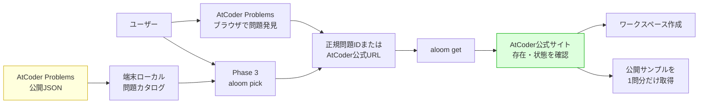
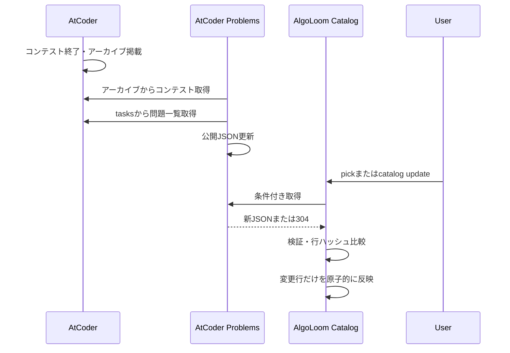
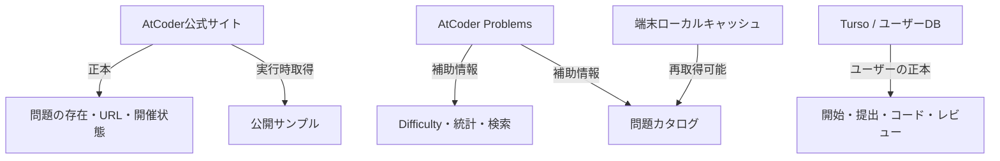
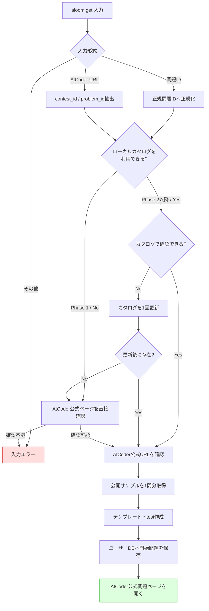
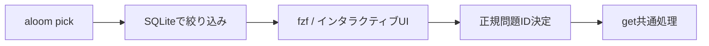
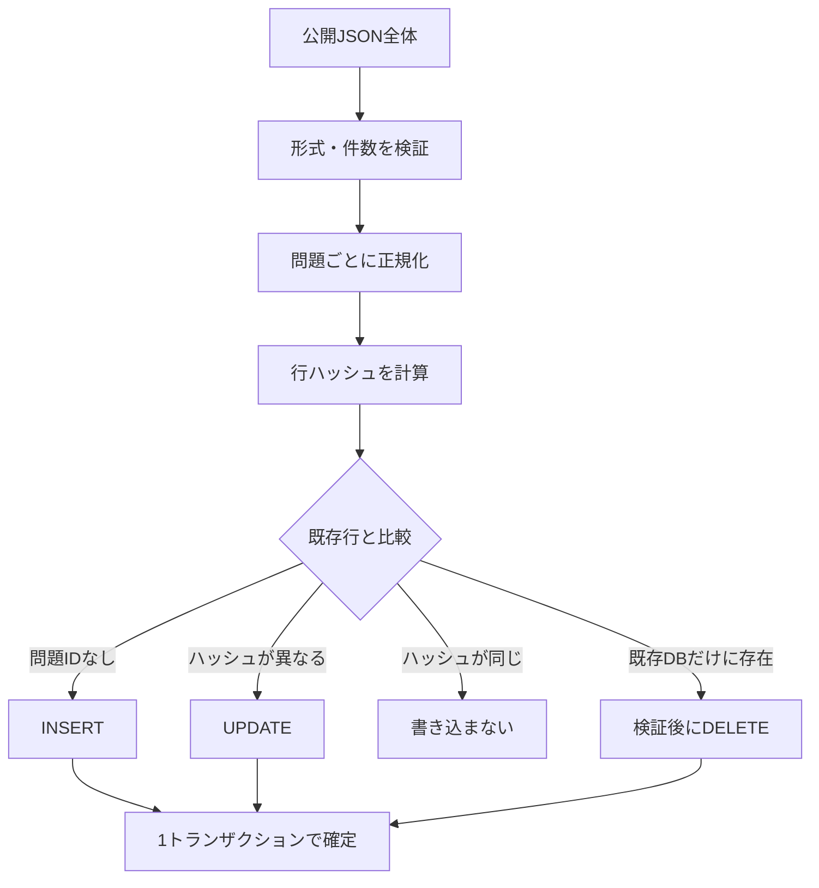
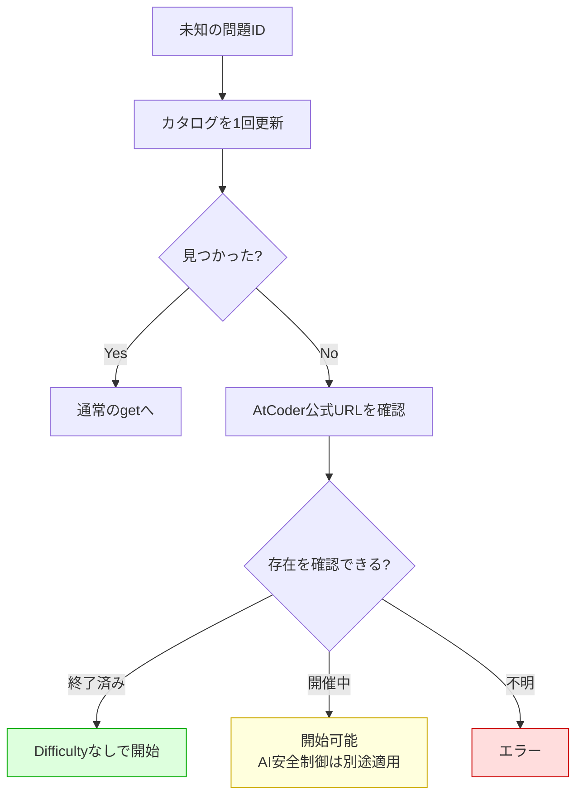
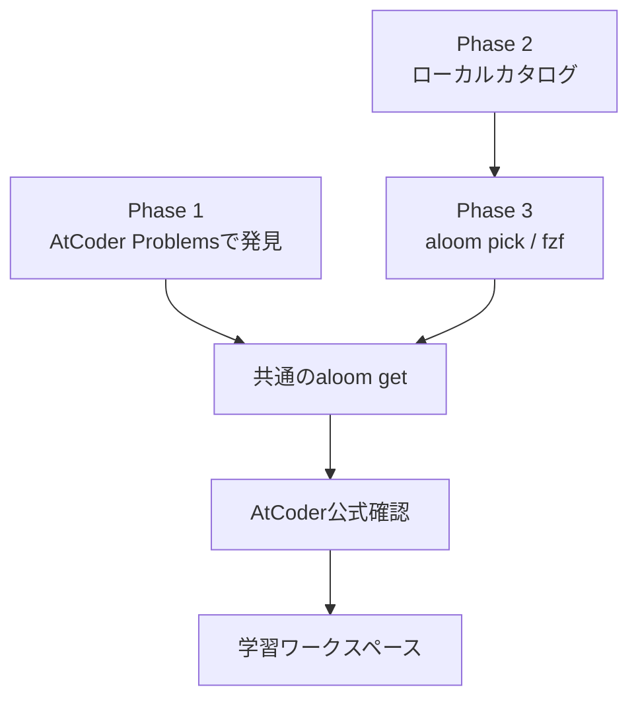

# AlgoLoom 問題選択・カタログ設計

> 対象: ユーザーがAtCoderの問題を探し、AlgoLoomで学習を開始するまでの導線
>
> 状態: 設計方針
>
> 作成日: 2026年7月15日
>
> 更新日: 2026年7月16日
>
> 関連文書:
> - [プロジェクト草案](../concept.md)
> - [AlgoLoom 配布方針ガイド](../distribution/algoloom-distribution.md)
> - [AlgoLoom AIレビュー安全設計](../distribution/ai-review-safety-design.md)
>
> 注意: AtCoder ProblemsはAtCoder社とは別の有志が運営する非公式サービスである。API、データ形式、更新間隔は将来変更される可能性がある。

---

## 0. 結論

AlgoLoomの問題選択は、**初期版ではAtCoder ProblemsのブラウザUIを主な問題発見手段とし、AlgoLoom CLIを問題開始の入口にする**。

Phase 2ではAtCoder Problemsの公開JSONを端末ごとにキャッシュする。Phase 3では、そのカタログを使う`aloom pick`を追加し、ターミナル内でも問題を選べるようにする。

中心方針は次のとおりである。

1. 問題を探す主経路は、初期版ではAtCoder Problemsとする。
2. 問題を開始する正式な入口は`aloom get`とする。
3. `get`は正規問題IDまたはAtCoder公式問題URLを受け付ける。
4. 問題の存在、問題文、公開サンプル、開催時刻の正本はAtCoder公式サイトとする。
5. AtCoder Problemsは、Difficulty、AC状況、検索等の補助情報源とする。
6. 全問題カタログは端末ごとのローカルキャッシュとし、Tursoへ同期しない。
7. カタログはアプリのリリースと独立して更新する。
8. 新問題がカタログにない場合、1回だけ更新し、それでもなければAtCoder公式ページから確認する。
9. Difficulty等の補助情報は欠ける可能性があるため、必須項目にしない。
10. 問題選択カタログと、開催中コンテストのAI安全判定は別系統にする。
11. 通常更新では問題ごとの行ハッシュを比較し、追加・変更・削除された行だけをSQLiteへ書き込む。



---

## 1. 目的と対象外

### 1.1. 目的

- ユーザーが自分に合う過去問を見つけられるようにする。
- 問題選択から作業ディレクトリ作成までの手順を一貫させる。
- AtCoder Problemsへ新しい問題が追加されたとき、AlgoLoomの再リリースなしで反映する。
- AtCoder Problemsが停止・遅延しても、既知の問題やAtCoder公式URLから開始できるようにする。
- 問題カタログとユーザーの提出履歴を混同しない。
- AtCoderとAtCoder Problemsへのアクセスを必要最小限にする。

### 1.2. 初期版の対象外

- AtCoder Problemsの全検索機能をCLIへ再実装すること
- AtCoder ProblemsのWeb UIをAlgoLoom内へ複製すること
- 問題文、画像、解説、公開サンプルをカタログへ保存・再配布すること
- AtCoder ProblemsのユーザーアカウントやGitHub OAuthトークンを管理すること
- CLIのローカル履歴だけでAtCoderアカウント全体のAC状況を断定すること
- 開催中問題の安全判定を、AtCoder Problemsへの掲載有無だけで行うこと

---

## 2. 用語

| 用語 | この文書での意味 |
|---|---|
| AtCoder公式サイト | 問題、コンテスト、提出等を提供するAtCoder本体のサイト |
| AtCoder Problems | 有志が運営するAtCoder過去問の復習支援サイト。AtCoder社の公式サービスではない |
| 問題発見 | Difficulty、AC状況、コンテスト種別等から、次に解く問題を探すこと |
| 問題開始 | 問題を決定し、テンプレート・テスト・作業ディレクトリを準備すること |
| 正規問題ID | AtCoder上で問題を識別する文字列。例: `abc300_a` |
| コンテストID | AtCoder上でコンテストを識別する文字列。例: `abc300` |
| 問題カタログ | 問題ID、タイトル、Difficulty等を検索するためのローカルデータ |
| 補助メタデータ | Difficulty、solver count、推定値等、問題を選びやすくする情報 |
| ユーザーデータ | ユーザーが開始した問題、提出、コード、判定、レビュー等 |
| Difficulty | AtCoder Problemsが推定する問題難易度。すべての問題に存在するとは限らない |
| local status | AlgoLoomが保存した履歴だけから判断した挑戦・AC状態 |
| remote status | AtCoder上の提出履歴を取得して判断した状態。初期版では扱わない |
| ETag | HTTPリソースの版を識別し、変更がないときに本体の再取得を避けるための値 |
| 条件付き取得 | ETagやLast-Modifiedを送り、更新がなければ`304 Not Modified`を受け取る取得方法 |
| TTL | キャッシュを再確認せず利用できる期間 |
| stale cache | 更新期限は過ぎているが、障害時の代替として読み取り可能な旧カタログ |
| last-known-good | 形式検証に成功した、最後に正常だったカタログ |
| 行ハッシュ / row hash | 問題1件の検索用メタデータを決められた形式で並べ、ハッシュ関数で得た値。前回から内容が変わったかを判定するために使う |
| 差分更新 | 全件を比較したうえで、追加・変更・削除された行だけをDBへ書き込む更新方法 |
| 原子的更新 | すべての変更を1トランザクションで確定し、更新前または更新後のどちらか一方だけを見せる更新方法 |
| Catalog Provider | AtCoder Problems等からカタログを取得する処理を隠蔽するアダプター |

---

## 3. 調査で確認したこと

### 3.1. AtCoder Problemsの位置づけ

AtCoder公式の説明では、AtCoder ProblemsはAtCoder社とは別の有志が運営する問題復習支援サイトであり、非公式APIも提供している。

問題選択に役立つ主な機能は次のとおりである。

- 問題を一覧表示する。
- AtCoderユーザー名からAC状況を表示する。
- 推定Difficultyを使って問題を選べる。
- AC数等を使って学習状況を確認できる。
- トレーニングやバーチャルコンテスト等を利用できる。

一方、次の注意点がある。

- 有志運営であり、稼働が保証されていない。
- AtCoder側の仕様変更への追従が遅れる可能性がある。
- APIは非公式である。
- 古いAPIが廃止される可能性がある。
- APIへ高頻度にアクセスしてはならない。

### 3.2. 利用できる公開データ

AtCoder Problemsの公開資料には、次のJSONリソースが掲載されている。

| リソース | 主な内容 | AlgoLoomでの用途 |
|---|---|---|
| `problems.json` | 問題ID、コンテストID、問題番号、名前 | 基本問題一覧 |
| `contests.json` | 開始時刻、開催時間、タイトル、Rated範囲 | 終了時刻・コンテスト情報 |
| `problem-models.json` | Difficulty、実験的推定かどうか等 | 難易度検索 |
| `merged-problems.json` | 得点、solver count等を含む詳細情報 | 将来の高度な絞り込み |
| `contest-problem.json` | コンテストと問題の対応 | 再利用問題等の補助確認 |

Phase 2のCLIカタログでは、次の3つを基本とする。

1. `problems.json`
2. `contests.json`
3. `problem-models.json`

`merged-problems.json`はsolver countや得点での検索が必要になった段階で追加する。

### 3.3. 2026年7月15日の観測値

以下は設計定数ではなく、実装規模を判断するための調査時スナップショットである。

| リソース | 件数 | 非圧縮レスポンスのおおよそのサイズ |
|---|---:|---:|
| `problems.json` | 9,187問題 | 約1.15 MB |
| `contests.json` | 6,199コンテスト | 約0.99 MB |
| `problem-models.json` | 5,031問題分 | 約1.13 MB |
| `merged-problems.json` | 9,187問題 | 約4.45 MB |

この規模であれば、端末ごとのSQLiteカタログとして保持できる。ただし、全問題にDifficultyがあるわけではないことも分かるため、Difficultyはnullableにする。

### 3.4. 更新とHTTPキャッシュ

調査時、公開JSONは次のHTTPヘッダーを返した。

- `ETag`
- `Last-Modified`
- `Content-Length`

`If-None-Match`を送る条件付きリクエストでは、更新がない場合に`304 Not Modified`が返った。

ただし、API資料にETagの永続的な保証は明記されていない。そのため、AlgoLoomは次のように扱う。

- ETagがあれば利用する。
- Last-Modifiedがあれば併用する。
- どちらも使えない場合は通常取得へフォールバックする。
- HTTPキャッシュ機能そのものを正しさの前提にしない。

### 3.5. 新問題が追加される流れ

AtCoder Problemsの実装は、AtCoderのコンテストアーカイブを収集し、各コンテストのtasksページから問題を取得して、公開JSONを生成する構造になっている。



この更新には保証されたSLAがない。AlgoLoomは「コンテスト終了後、必ず何分以内に追加される」と仮定しない。

---

## 4. 方式比較

### 4.1. 候補

| 方式 | 利点 | 欠点 | 判定 |
|---|---|---|---|
| AtCoder Problemsブラウザのみ | 豊富な検索・Difficulty・AC状況をそのまま利用できる | ブラウザとCLIの往復、サービス停止の影響 | 初期版の主経路 |
| CLI一覧のみ | ターミナルで完結し、fzfと相性がよい | AtCoder Problemsの機能を多く再実装する必要がある | 初期版では過剰 |
| ブラウザ＋CLIカタログ | 豊富なWeb UIと高速なCLI操作を両立できる | 2つの導線とカタログ更新処理が必要 | 最終的な採用方式 |

### 4.2. CLI一覧だけにしない理由

AtCoder Problemsが持つDifficulty、全提出ベースのAC状況、カテゴリ、比較、トレーニング等をCLIへ完全に再実装すると、AlgoLoomの中心機能より問題検索UIの開発が大きくなる。

また、AlgoLoomのローカルDBだけでは、AlgoLoomを使う前にAtCoder上で解いた問題を把握できない。その状態で単に「未AC」と表示すると誤解を招く。

初期版はAtCoder ProblemsのブラウザUIを活用し、CLIの一覧はlocal statusであることを明示できるPhase 3で追加する。

### 4.3. ブラウザだけに固定しない理由

- 問題IDが分かっている場合までブラウザ検索を要求する必要はない。
- 日常的な難易度指定や最近の問題選択はCLIとfzfに向いている。
- AtCoder Problemsが停止しても、ローカルキャッシュから問題を選べる。
- 将来的にAlgoLoom独自の復習候補や学習履歴を使った推薦へ拡張できる。

---

## 5. 責任分担

### 5.1. 情報の権威



| 情報 | 正本 | AlgoLoomでの扱い |
|---|---|---|
| 問題の存在 | AtCoder公式 | `get`時に公式URLで確認 |
| 問題文・公開サンプル | AtCoder公式 | ユーザー操作時に1問分だけ取得 |
| コンテスト開始・終了 | AtCoder公式 | AI安全判定では公式情報を優先 |
| Difficulty | AtCoder Problems | 欠損・更新を許容する補助値 |
| solver count等 | AtCoder Problems | 検索用の補助値 |
| ユーザーの提出・コード | ユーザーDB | 共有・同期対象 |
| 全問題カタログの元データ | AtCoder Problems | 端末ごとにキャッシュし、公式サイトで存在を確認 |

### 5.2. 問題カタログは安全判定の正本ではない

AtCoder Problemsカタログに問題があることは、現在どのコンテストで再利用されているかを完全には表さない。また、新しい開催中問題が未掲載である可能性もある。

したがって、次の判定にはカタログだけを使わない。

- 開催中コンテストか
- AIレビューが許可されるか
- 個別コンテストルールが何か
- ADTやAWC等で現在出題されているか

これらは[AIレビュー安全設計](../distribution/ai-review-safety-design.md)に従い、実行時に別系統で確認する。

---

## 6. 初期版のユーザーフロー

### 6.1. AtCoder Problemsから探す

```bash
aloom browse
```

AtCoderユーザー名が設定されている場合:

```bash
aloom browse --user hiroaki
```

`browse`はAtCoder Problemsの一覧画面をデフォルトブラウザで開く。基本的な一覧の閲覧に、AtCoder ProblemsのログイントークンをAlgoLoomが扱う必要はない。

### 6.2. 問題を開始する

問題IDを指定する。

```bash
aloom get abc300_a
```

または、AtCoder公式問題URLを指定する。

```bash
aloom get https://atcoder.jp/contests/abc300/tasks/abc300_a
```

### 6.3. `get`の処理



`get`は問題を開始する唯一の共通処理とする。将来の`pick`も、独自にワークスペースを作らず、選択後にこの処理を呼ぶ。

Phase 1にはローカルカタログがないため、正規化後はAtCoder公式ページを直接確認する。カタログ確認と1回だけの更新はPhase 2で追加する最適化であり、`get`の成立条件ではない。

---

## 7. Phase 3のCLI問題選択

### 7.1. `pick`コマンド

```bash
aloom pick
```

絞り込み例:

```bash
aloom pick \
  --difficulty 800..1199 \
  --contest abc \
  --status local-unsolved \
  --lang cpp
```

表示例:

```text
ID          Difficulty  Contest  Local status  Title
abc300_d    1124        ABC300   Not started   A-ex
abc298_e    1180        ABC298   WA            Unfair Sugoroku
abc297_f    1195        ABC297   Not started   Minimum Bounding Box 2
```

選択後は内部で`get`と同じ開始処理を呼ぶ。

### 7.2. ステータス名

初期のCLI一覧で表示するステータスは、AlgoLoomの履歴だけに基づく。

| 表示 | 意味 |
|---|---|
| `Not started` | AlgoLoom上で開始履歴がない |
| `In progress` | 開始済みだが、AlgoLoom上にACがない |
| `WA` / `TLE`等 | AlgoLoomが保存した最新提出結果 |
| `AC` | AlgoLoomが保存した提出にACがある |

`Unsolved`とだけ表示せず、`Local status`または`local-unsolved`と明示する。AtCoderアカウント全体の状態と誤解させないためである。

将来、AtCoder Problemsのsubmission API等を使って全提出を同期する場合は、明示的な別機能として設計する。

### 7.3. fzf連携



fzfがない環境では、次のいずれかへフォールバックする。

- Rich等による番号選択
- 一覧だけ表示し、問題IDをコピーして`get`する
- `--no-interactive`で候補を標準出力へ出す

---

## 8. カタログ更新設計

### 8.1. 更新トリガー

| 状況 | 動作 |
|---|---|
| 初回の`catalog update` | カタログを取得する |
| `pick`時にカタログがない | カタログを取得する |
| `pick`時に前回確認から24時間以上経過 | 条件付き更新する |
| `catalog update` | ユーザー操作で即時更新する |
| `get`で未知の問題ID | 1回だけ強制更新する |
| `browse` | カタログを使わないため更新しない |
| 既知問題の`get` | 原則として更新せず、公式ページを確認する |

常駐デーモンや定期ポーリングは実装しない。CLI操作時に必要な範囲だけ更新する。

### 8.2. 更新手順

```text
1. catalog_stateからETag / Last-Modifiedを読む
2. 公開JSONを1秒以上の間隔を空けて順番に条件付き取得する
3. 304のリソースは既存データを使用する
4. 200のリソースは一時領域へ保存する
5. JSON型、必須キー、件数の急減等を検証する
6. 全リソースから問題ごとの正規化済みレコードと行ハッシュを作る
7. SQLiteトランザクションを開始する
8. 既存の行ハッシュと比較し、追加行をINSERTする
9. 行ハッシュが変わった行だけをUPDATEする
10. 新データから消えた行を、件数検証に成功した場合だけDELETEする
11. catalog_sourcesのlast_success_at、ETag等を更新する
12. 整合性チェック後にCOMMITする
13. 失敗した場合はROLLBACKし、last-known-goodを維持する
```

初回作成、スキーマ変更、キャッシュ破損からの復旧では全件再構築する。通常更新では既存DBを差分更新し、全件再構築を行わない。

### 8.3. レコードレベルの差分更新

AtCoder Problemsの公開JSONは全体スナップショットであるため、変更があったJSONの取得と全レコードの解析は必要になる。一方、SQLiteへの書き込みは問題ごとの差分に限定できる。



行ハッシュは、次の検索用フィールドを固定順序・固定形式で直列化して計算する。

- `problem_id`
- `contest_id`
- `problem_index`
- `title`
- `difficulty`
- `difficulty_is_experimental`
- `contest_start_at`
- `contest_end_at`
- `rate_change`
- `source`

実装規約は次のとおりとする。

- 文字コード、フィールド順、`null`の表現を固定する。
- SHA-256等の安定したハッシュ関数を使用する。
- 行ハッシュは改ざん検知ではなく、変更検知のために使う。
- 取得確認時刻はハッシュの入力に含めない。
- 同じハッシュの行には`UPDATE`を発行しない。
- JSON全体の件数が異常に減った場合は、削除を適用せず更新全体を中止する。
- INSERT、UPDATE、DELETE、更新状態の保存を同じSQLiteトランザクションで行う。

この方式では、問題数を`N`、実際に変わった問題数を`Δ`とすると、JSONの解析・比較は`O(N)`、カタログ行の書き込みは`O(Δ)`になる。

### 8.4. リクエスト間隔

AtCoder ProblemsのAPI資料は、アクセス間に1秒より長い待ち時間を設けるよう求めている。

- 複数JSONを並列取得しない。
- リソース間に1秒を超える間隔を設ける。
- エラー時に即時再試行しない。
- 429や5xxではバックオフする。
- CLIプロセスごとではなく、端末全体の最終アクセス時刻を共有する。
- `--no-rate-limit`等の解除オプションを設けない。

### 8.5. 更新失敗時

| 状況 | 動作 |
|---|---|
| ネットワーク切断 | 既存カタログを使い、最終成功時刻を表示 |
| AtCoder Problems停止 | stale cacheで検索可能にする |
| 304 | ダウンロードせず、確認時刻だけ更新 |
| JSON形式変更 | 新データを拒否し、トランザクション開始前のカタログを維持 |
| 件数が異常に減少 | 警告して差分更新と削除を停止 |
| Difficultyだけ取得失敗 | 既存スナップショットがあれば前回値を維持する。初回取得なら基本問題一覧をDifficultyなしで利用する |
| 初回取得に完全失敗 | `pick`は利用不可。`get`の公式URL指定は利用可能 |

### 8.6. Providerの分離

AtCoder ProblemsのURLやJSON構造をCLI全体へ直接埋め込まない。

```python
class CatalogProvider(Protocol):
    def fetch(self, previous_state: CatalogState) -> CatalogSnapshot:
        ...

    def validate(self, snapshot: CatalogSnapshot) -> ValidationResult:
        ...
```

初期実装:

```text
CatalogProvider
└── AtCoderProblemsCatalogProvider
```

将来、公式APIや別のデータ源が利用可能になった場合もProviderを差し替えられる。

---

## 9. 新問題・未知の問題の扱い

### 9.1. フォールバック



### 9.2. Difficultyは必須にしない

新しい問題、特殊コンテスト、提出数が少ない問題等ではDifficultyがない可能性がある。

```text
abc466_a  Difficulty: -
```

問題開始をDifficultyの有無で止めない。後日の更新で利用可能になった場合にupsertする。

### 9.3. AtCoder Problemsの遅延をエラーと断定しない

未知の問題について、直ちに「存在しない問題」と表示しない。

表示例:

```text
問題 abc999_a はローカルカタログにありません。
AtCoder Problemsの更新遅延の可能性があるため、カタログを更新します。
```

更新後も不明な場合:

```text
AtCoder Problemsでは確認できませんでした。
AtCoder公式問題URLを確認します。
```

---

## 10. 保存場所とデータモデル

### 10.1. カタログ保存場所

```text
<OSの標準キャッシュディレクトリ>/algoloom/catalog/
├── catalog.sqlite
├── catalog-state.json
└── downloads/
    ├── problems.json
    ├── contests.json
    └── problem-models.json
```

`downloads/`は更新中の検証・デバッグ用であり、保持期間を制限できる。カタログを削除してもユーザーの提出履歴は失われない。

実際の基点はOSの規約に従う。例としてLinuxではXDG Cache Home、macOSではユーザーのCachesディレクトリを使用し、固定の`~/.cache`を全OSへ強制しない。

### 10.2. カタログテーブル案

```sql
CREATE TABLE catalog_problems (
    problem_id TEXT PRIMARY KEY,
    contest_id TEXT NOT NULL,
    problem_index TEXT,
    title TEXT,
    difficulty INTEGER,
    difficulty_is_experimental INTEGER NOT NULL DEFAULT 0,
    contest_start_at TEXT,
    contest_end_at TEXT,
    rate_change TEXT,
    source TEXT NOT NULL,
    row_hash TEXT NOT NULL,
    metadata_changed_at TEXT NOT NULL
);
```

`row_hash`は問題ごとの内容変更を検知するために使用する。`metadata_changed_at`は、その行の検索用メタデータを実際にINSERTまたはUPDATEした時刻であり、単に公開JSONを確認しただけでは変更しない。

カタログ全体またはリソースごとの確認時刻は、全問題行ではなく`catalog_sources.last_checked_at`で管理する。これにより、更新確認だけで全問題行が書き換わることを防ぐ。

```sql
CREATE TABLE catalog_sources (
    resource_name TEXT PRIMARY KEY,
    url TEXT NOT NULL,
    etag TEXT,
    last_modified TEXT,
    last_checked_at TEXT,
    last_success_at TEXT,
    schema_version INTEGER NOT NULL,
    last_error TEXT
);
```

### 10.3. ユーザーDBとの分離

| データ | 保存先 | Turso同期 |
|---|---|---:|
| 全問題カタログ | 端末ローカルキャッシュ | しない |
| カタログETag・更新状態 | 端末ローカルキャッシュ | しない |
| ユーザーが開始した問題 | ユーザーDB | する |
| 提出・コード・判定 | ユーザーDB | する |
| AIレビュー | ユーザーDB | 設定に従う |

既存の`PROBLEMS`論理テーブルには、ユーザーが実際に開始した問題だけを保存する。9,000件以上の全問題カタログを同じテーブルへ入れない。

開始時には、カタログから必要なメタデータだけをユーザーDBへコピーする。

```text
catalog_problems              user DB: PROBLEMS
----------------             -----------------
abc300_a       ── get ──>    atcoder:abc300_a
9,000件以上                   開始した問題だけ
```

別DB間の外部キーは作らない。ユーザーDBは、カタログを削除しても独立して履歴を表示できるようにする。

---

## 11. コマンド設計

### 初期版

| コマンド | 役割 |
|---|---|
| `aloom browse` | AtCoder Problemsの問題一覧をブラウザで開く |
| `aloom browse --user USER` | 指定ユーザーの一覧を開く |
| `aloom get PROBLEM_ID` | 問題IDから開始する |
| `aloom get ATCODER_URL` | AtCoder公式URLから開始する |

### Phase 2

| コマンド | 役割 |
|---|---|
| `aloom catalog status` | 最終確認・更新時刻、件数、エラーを表示する |
| `aloom catalog update` | カタログを明示更新する |
| `aloom catalog clear` | ユーザー履歴を残してカタログだけ削除する |
| `aloom catalog doctor` | スキーマ、件数、ETag、SQLite整合性を診断する |

### Phase 3

| コマンド | 役割 |
|---|---|
| `aloom pick` | インタラクティブに問題を選んで開始する |
| `aloom pick --difficulty MIN..MAX` | Difficultyで絞り込む |
| `aloom pick --contest abc` | コンテスト種別で絞り込む |
| `aloom pick --status local-unsolved` | AlgoLoomの履歴上で未ACの問題に絞る |

### `catalog status`表示例

```text
Provider:          AtCoder Problems (unofficial)
Problems:          9,187
With difficulty:   5,031
Last checked:      2026-07-15 20:06 JST
Last updated:      2026-07-15 20:01 JST
State:             fresh
```

---

## 12. AI安全設計との接続

問題選択とAIレビュー安全判定は次のように分離する。


- AtCoder Problemsに掲載済みでも、ADT等で再利用中の可能性がある。
- AtCoder Problemsに未掲載でも、開催中問題として存在する可能性がある。
- カタログの更新日時と、コンテストの現在状態は別の情報である。
- `get`できることと、AIレビューできることは同義ではない。
- 開催中問題を`get`して通常のテスト・提出を行うことと、AI利用の可否は別々に判定する。

---

## 13. アクセス・配布上の方針

- AtCoder ProblemsのJSONをPyPIやGitHubリリースへ同梱しない。
- インストール後、ユーザー操作に応じて実行時取得する。
- 問題文、画像、解説、公開サンプルを問題カタログへ入れない。
- AtCoder公式からの取得は、ユーザーが開始した1問だけに限定する。
- AtCoder ProblemsのAPI注意事項に従い、1秒を超えるアクセス間隔を設ける。
- AtCoder Problemsが非公式サービスであることをUIとドキュメントへ表示する。
- Providerの仕様変更時に、カタログ機能だけを停止・更新できるようにする。
- カタログ更新失敗を理由に、既存のローカル作業・テスト・履歴閲覧を止めない。

---

## 14. エラー表示

| エラー | 表示・動作 |
|---|---|
| AtCoder Problemsへ接続不能 | stale cacheを使用。最終成功時刻を表示 |
| 初回カタログ取得不能 | `pick`を停止し、AtCoder Problemsブラウザまたは公式URL指定を案内 |
| JSONスキーマ不一致 | 旧カタログを維持し、AlgoLoom更新を案内 |
| 問題IDがカタログにない | 1回更新後、AtCoder公式ページを確認 |
| AtCoder公式でも確認不能 | 入力したID / URLを表示して停止 |
| Difficultyなし | `-`として表示し、問題開始は許可 |
| fzfなし | Rich番号選択または非インタラクティブ一覧へフォールバック |
| キャッシュ破損 | `catalog doctor`と再取得を案内。ユーザーDBは変更しない |

---

## 15. テスト方針

### 15.1. カタログ更新

- [ ] 初回取得でカタログを構築できる。
- [ ] ETag一致時の304で本体を再ダウンロードしない。
- [ ] ETagがない場合も通常取得できる。
- [ ] リソース間に1秒を超える間隔を設ける。
- [ ] JSON破損時にlast-known-goodを維持する。
- [ ] 件数の異常減少時に差分更新と削除を止める。
- [ ] 更新途中でプロセスが終了しても旧カタログが壊れない。
- [ ] 同一内容の問題にはUPDATEを発行しない。
- [ ] 新規問題だけをINSERTできる。
- [ ] Difficulty等が変わった問題だけをUPDATEできる。
- [ ] 消えた問題を、件数検証に成功した場合だけDELETEできる。
- [ ] `last_checked_at`の更新だけで全問題行が変更されない。
- [ ] 差分更新の途中で失敗した場合、トランザクション全体をROLLBACKできる。
- [ ] Difficulty取得失敗時も基本一覧を利用できる。
- [ ] stale cacheの最終成功時刻を表示できる。

### 15.2. `get`

- [ ] 正規問題IDを受け付ける。
- [ ] AtCoder公式問題URLを受け付ける。
- [ ] 不正なドメインのURLを拒否する。
- [ ] 未知の問題IDでカタログ更新を1回だけ行う。
- [ ] カタログ未掲載でも公式ページで確認できれば開始できる。
- [ ] Difficultyなしでも開始できる。
- [ ] 取得するサンプルは指定された1問だけである。
- [ ] カタログ情報と公式URLの問題IDが矛盾する場合は公式情報を優先する。

### 15.3. `pick`

- [ ] Difficulty範囲で絞り込める。
- [ ] Difficultyがない問題を意図どおり含める・除外できる。
- [ ] local statusであることを表示する。
- [ ] 選択後に`get`共通処理を呼ぶ。
- [ ] fzfがない場合にフォールバックできる。
- [ ] カタログ障害がユーザーDBを変更しない。

### 15.4. AI安全性

- [ ] AtCoder Problems掲載済みだけを理由にAIレビューを許可しない。
- [ ] カタログ未掲載だけを理由に現在問題ではないと判断しない。
- [ ] 開催中問題は別の安全判定へ渡す。
- [ ] `contest_mode`の挙動が問題選択経路によって変わらない。

---

## 16. 段階的な実装

### Phase 1: ブラウザ選択＋共通`get`

- `aloom browse`を追加する。
- `get`で問題IDとAtCoder公式URLを受け付ける。
- 問題ID・contest IDの正規化を実装する。
- AtCoder公式ページを1問単位で確認する。
- ユーザーが開始した問題だけをユーザーDBへ保存する。

### Phase 2: ローカルカタログ

- AtCoder Problems Providerを実装する。
- `catalog update / status / clear / doctor`を追加する。
- ETag、Last-Modified、last-known-goodを実装する。
- 問題ごとの行ハッシュとトランザクションによる差分更新を実装する。
- 全問題カタログを端末ローカルに分離する。
- Difficulty欠損を許容する。

### Phase 3: `pick`とfzf

- Difficulty・コンテスト・local statusの絞り込みを追加する。
- fzfまたはRichの選択UIを追加する。
- 選択後に`get`共通処理を呼ぶ。
- 復習候補や直近のWA問題等、AlgoLoom独自フィルターを追加する。

### Phase 4: 任意のremote status

- AtCoderアカウント全体の提出履歴同期が本当に必要か再評価する。
- 導入する場合はlocal statusとremote statusを明確に分離する。
- API負荷、更新間隔、プライバシー、ユーザー同意を別途設計する。

---

## 17. 実装チェックリスト

### 責任分担

- [ ] AtCoder公式を問題の正本としている。
- [ ] AtCoder Problemsを補助情報源としている。
- [ ] 問題カタログをAI安全判定の正本にしていない。
- [ ] ユーザーデータと全問題カタログを分離している。

### ユーザー導線

- [ ] 初期版の主経路が`browse` → `get`になっている。
- [ ] 問題IDとAtCoder公式URLの両方を受け付ける。
- [ ] `pick`が独自の開始処理を持たず、`get`を再利用する。
- [ ] local statusをAtCoder全体の状態と誤認させない。

### 更新

- [ ] カタログはアプリのリリースと独立して更新できる。
- [ ] 24時間TTLと明示更新を用意する。
- [ ] 未知IDでは1回だけ更新する。
- [ ] 条件付き取得とlast-known-goodを実装する。
- [ ] 問題ごとの行ハッシュを比較し、同一行への不要な書き込みを行わない。
- [ ] 通常更新は差分反映、初回・スキーマ変更・破損復旧は全件再構築としている。
- [ ] Providerの変更をCLI本体から分離する。
- [ ] 高頻度アクセスや並列取得を行わない。

### 障害・安全

- [ ] AtCoder Problems停止時も既知問題と公式URLを扱える。
- [ ] Difficultyなしを正常状態として扱う。
- [ ] カタログ破損がユーザーDBへ影響しない。
- [ ] 開催中判定はAIレビュー安全設計へ委譲する。
- [ ] カタログや問題データを配布物へ同梱しない。

---

## 18. 参照資料

### AtCoder

- [AtCoder Problemsって何？](https://info.atcoder.jp/more/contents/problems)
- [AtCoder コンテスト一覧](https://atcoder.jp/contests/?lang=ja)

### AtCoder Problems

- [AtCoder Problems](https://kenkoooo.com/atcoder/)
- [AtCoder Problems GitHubリポジトリ](https://github.com/kenkoooo/AtCoderProblems)
- [API / Datasets](https://github.com/kenkoooo/AtCoderProblems/blob/main/doc/api.md)
- [フロントエンドの公開JSON利用箇所](https://github.com/kenkoooo/AtCoderProblems/blob/main/atcoder-problems-frontend/src/api/APIClient.ts)
- [コンテスト・問題の収集処理](https://github.com/kenkoooo/AtCoderProblems/blob/main/atcoder-problems-backend/src/crawler_utils.rs)
- [AtCoder取得クライアント](https://github.com/kenkoooo/AtCoderProblems/blob/main/atcoder-problems-backend/crawler/src/client.rs)
- [JSON生成処理](https://github.com/kenkoooo/AtCoderProblems/blob/main/atcoder-problems-backend/src/bin/dump-json.rs)
- [Problems Information](https://kenkoooo.com/atcoder/resources/problems.json)
- [Contests Information](https://kenkoooo.com/atcoder/resources/contests.json)
- [Estimated Difficulties](https://kenkoooo.com/atcoder/resources/problem-models.json)

---

## 19. 最終方針

AlgoLoomは、問題検索サイトそのものを目指さない。初期版ではAtCoder Problemsの優れた検索UIを活用し、AlgoLoomは選ばれた問題を確実に開始する役割へ集中する。



守るべき原則は次のとおりである。

1. 発見と開始を分ける。
2. 初期版ではAtCoder Problemsで発見し、AlgoLoomで開始する。
3. AtCoder公式を問題情報の正本とする。
4. AtCoder Problemsのデータは補助情報・ローカルキャッシュとして扱う。
5. カタログ更新をAlgoLoomのリリースから分離する。
6. 新問題やDifficulty欠損を正常に扱う。
7. AtCoder Problems停止時のフォールバックを用意する。
8. 全問題カタログをTursoへ同期しない。
9. CLIのlocal statusをAtCoder全体のAC状況と混同しない。
10. AI安全判定は問題カタログから独立させる。
11. 通常更新では行ハッシュを比較し、変更された問題だけをSQLiteへ書き込む。
