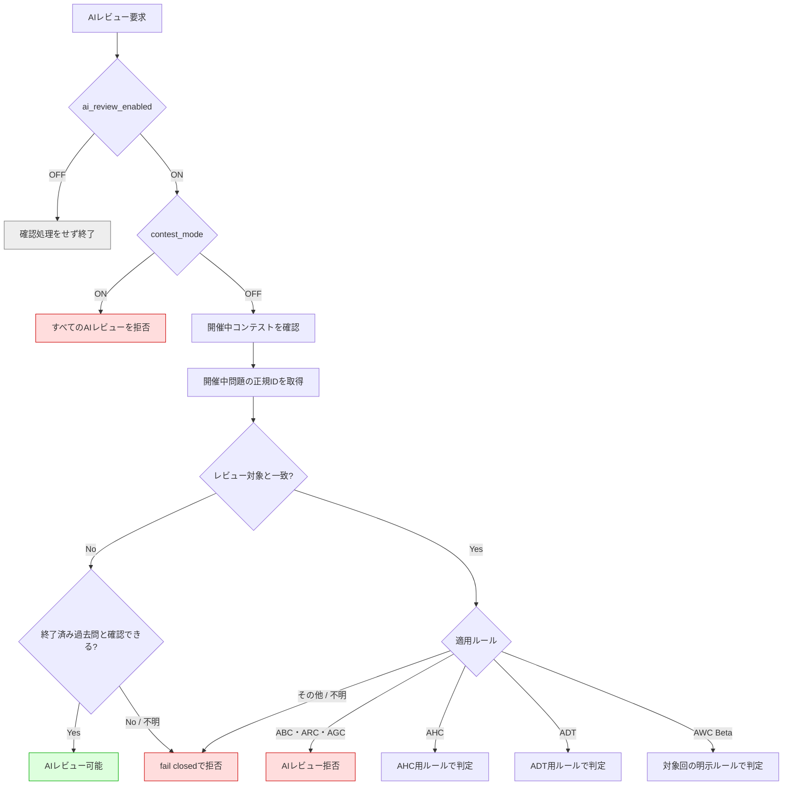
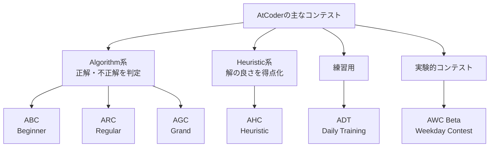
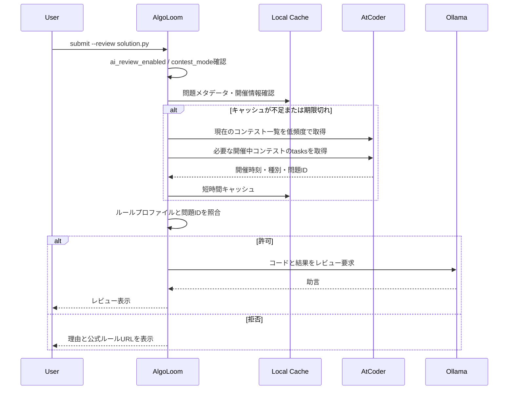
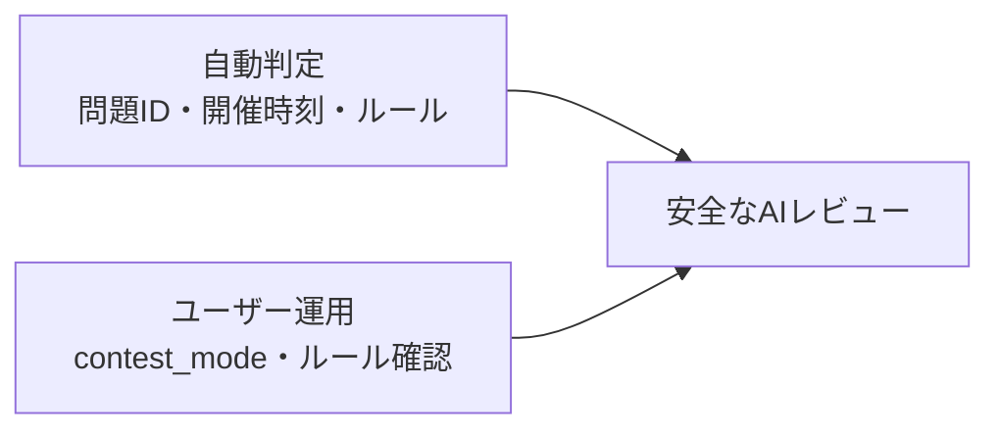
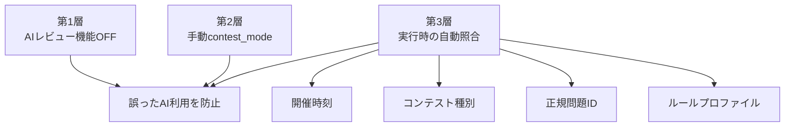

# AlgoLoom AIレビュー安全設計

> 対象: AtCoder学習用ローカルCLI「AlgoLoom」のAIレビュー機能
>
> 状態: 設計方針
>
> 作成日: 2026年7月15日
>
> 関連文書: [AlgoLoom 配布方針ガイド](./algoloom-distribution.md)
>
> 注意: AtCoderの規約やコンテストルールは変更される可能性がある。実装時・公開時には必ず最新版を再確認する。

---

## 0. 結論

AlgoLoomは、**AIレビュー要求時にだけ開催中コンテストと問題IDを確認し、禁止対象の問題と一致した場合にレビューを拒否する**。

中心となる方針は次のとおりである。

- ABC・ARC・AGCの開催中問題に対するAIレビューは拒否する。
- 開催中問題とは異なる、終了済みの過去問はAIレビュー対象にできる。
- 問題、コンテスト、現在時刻、適用ルールのいずれかを安全に確認できない場合は、AIレビューを拒否する。
- AHC、AtCoder Daily Training（ADT）、AtCoder Weekday Contest（AWC）、企業コンテスト等をABC・ARC・AGCと同じルールで処理しない。
- 常時監視はせず、AIレビュー要求時に必要な情報だけを低頻度で取得する。
- `ai_review_enabled = false`なら、コンテスト確認もOllama呼び出しも行わない。
- `contest_mode = true`なら、問題照合を行う前にすべてのAIレビューを拒否する。
- AIレビューを拒否しても、AIを使わない`test`や`submit`まで自動的に拒否しない。
- 利用者が現在参加しているコンテストや、別名で保存されたコードの内容まで完全に推測できるとは考えない。



---

## 1. 用語

| 用語 | この文書での意味 |
|---|---|
| AIレビュー | ユーザーのコード、実行結果、問題情報等をOllamaなどの生成AIへ渡し、助言を生成する機能 |
| 生成AI | 学習データをもとに文章やコード等を生成するAI。ローカルで動くOllamaも含む |
| `ai_review_enabled` | AlgoLoomのAIレビュー機能全体を有効・無効にする設定 |
| `contest_mode` | ユーザーがコンテスト参加中であることを明示し、すべてのAI機能を停止する手動の安全装置 |
| レビュー拒否 | AIレビュー部分だけを実行しないこと。ローカルテストや通常の提出を禁止する意味ではない |
| 開催中コンテスト | 現在時刻がコンテストの開始以上、終了より前にあるコンテスト |
| 終了済み過去問 | 元のコンテストが終了し、練習対象として公開されている問題 |
| コンテストID | AtCoder上でコンテストを識別する文字列。例: `abc467` |
| 正規問題ID | 問題そのものを識別する文字列。例: `abc244_a`。表示名やURL全体ではなく、このIDで照合する |
| 問題の再利用 | 過去問がADTなど別のコンテスト枠で再出題されること |
| 個別コンテストルール | 特定のコンテストだけに適用されるルール。一般的なルールと異なる場合がある |
| ルールプロファイル | コンテスト種別とルール版に対応するAlgoLoom内の判定定義 |
| fail closed | 安全だと確認できない場合に、AIレビューを許可せず停止する設計 |
| 実行時確認 | 常時監視せず、AIレビューが要求された時点で開催状況を確認する方式 |
| キャッシュ | 取得済みのコンテスト情報を短時間再利用し、AtCoderへのアクセス回数を減らす仕組み |
| TTL | キャッシュを有効とみなす時間 |
| 安全マージン | 時計のずれや通信遅延を考慮し、開始・終了時刻の前後に追加する保護時間 |

### 1.1. 2つのモードを区別する

| 設定 | OFF | ON |
|---|---|---|
| `ai_review_enabled` | AIレビュー機能を使わない。開催確認もOllama起動も不要 | AIレビュー要求を受け付け、安全判定へ進む |
| `contest_mode` | 自動判定を利用する | 問題にかかわらず、すべてのAIレビューを拒否する |

`ai_review_enabled`は機能全体のスイッチ、`contest_mode`はコンテスト参加時の誤操作を防ぐスイッチである。役割が異なるため、同じ設定に統合しない。

設定例:

```yaml
ai_review:
  enabled: false
  contest_mode: false
  contest_cache_ttl_seconds: 300
  time_safety_margin_seconds: 120
```

CLI例:

```bash
# AIレビュー機能全体を無効化
algoloom config set ai-review off

# AIレビュー機能を有効化
algoloom config set ai-review on

# コンテスト参加前に、すべてのAI機能を停止
algoloom contest-mode on

# コンテスト終了後に通常状態へ戻す
algoloom contest-mode off
```

### 1.2. AtCoderの主なコンテスト名

以下は2026年7月15日時点の公式情報に基づく。**頻度、開始時刻、制限時間、問題数、Rated範囲は将来変更される可能性があり、個別コンテストページの記載が優先される**。



#### 全体比較

| 略称 | 正式名称 | 主な対象 | Rated範囲 | 開催頻度の公式目安 | 時間の目安 | AIレビュー上の分類 |
|---|---|---|---|---|---|---|
| ABC | AtCoder Beginner Contest | 初心者～中級者 | 0～1999 | 毎週、主に土曜21時 | 近年は100分が標準的 | 開催中の対象問題は拒否 |
| ARC | AtCoder Regular Contest | 中級者～上級者 | 難度帯により異なる | 月1回ほど、主に日曜21時 | 近年は120分が標準的 | 開催中の対象問題は拒否 |
| AGC | AtCoder Grand Contest | 上級者～世界上位者 | 回によって異なる | 年5～6回ほど、主に日曜21時 | 回による。直近例は180分 | 開催中の対象問題は拒否 |
| AHC | AtCoder Heuristic Contest | 最適化問題に取り組む参加者 | 通常All。Algorithmとは別のHeuristic Rating | 短期・長期合わせて月1回ほど | 短期4時間、長期は約11日が公式目安 | AHC専用ルールで判定 |
| ADT | AtCoder Daily Training | ABC過去問の練習者 | Rating変動なし | 月～金の16時・18時に各コース | 60分 | ADT専用ルールで判定 |
| AWC | AtCoder Weekday Contest | 平日の実験的なAlgorithm練習 | Rating変動なし | Beta版は日次開催 | 基本60分。回によって変更例あり | 個別ページの明示ルールで判定 |

「主に」「目安」「標準的」とした項目は固定規則ではない。例えばスポンサー付きABC、ARCの難度帯、長期AHC等では、名称や時間が変わることがある。AlgoLoomは略称だけから終了時刻やRated範囲を決めず、コンテストごとのメタデータを利用する。

#### ABC: AtCoder Beginner Contest

ABCは、初心者でも参加しやすいAlgorithm系コンテストであり、AtCoderで最も頻繁に開催される主要コンテストである。

- 前半は比較的取り組みやすく、後半には難しい問題も含まれる。
- 現在のRated範囲は0～1999である。
- Ratingが範囲外でもUnratedとして参加できる。
- 公式案内上の頻度は毎週、開始時刻の目安は土曜21時である。
- 2026年7月の開催例では、制限時間100分、誤答ペナルティ5分である。
- 正解した問題の合計点を競い、同点では提出時間と誤答ペナルティが順位に影響する。
- 開催中は、Unrated参加者を含め、限定された翻訳用途等を除いて生成AIの使用が原則禁止される。

「Beginner」は全問題が易しいという意味ではない。初心者も前半問題から参加でき、中級者も後半問題を楽しめる構成を意味する。

#### ARC: AtCoder Regular Contest

ARCは、ABCより難度が高く、問題に応じた発想や考察が強く求められるAlgorithm系コンテストである。2026年7月時点では、次の3つの難度帯がある。

| 名称 | Rated範囲 | 位置づけ |
|---|---:|---|
| ARC-- | 800～2399 | 3種類の中では低い難度帯 |
| ARC | 1200～2799 | 標準の難度帯 |
| ARC++ | 1600～2999 | 3種類の中では高い難度帯 |

- 公式案内上の頻度は月1回ほど、開始時刻の目安は日曜21時である。
- 2026年7月の開催例では、制限時間120分、誤答ペナルティ5分である。
- Ratingが範囲外でもUnratedとして参加できる。
- ABCより最初の問題から難しい可能性がある。
- `--`や`++`はプログラム上の演算子ではなく、ARCの難度帯を表す名称である。
- 開催中はDivisionやRated / Unratedにかかわらず、限定された翻訳用途等を除いて生成AIの使用が原則禁止される。

#### AGC: AtCoder Grand Contest

AGCは、世界上位の競技者を主な対象とする最高難度のAlgorithm系コンテストである。

- 典型問題よりも、高度で独創的な問題が中心となる。
- Rated範囲は回ごとに異なるため、個別ページを確認する。
- 公式案内上の頻度は年5～6回ほど、開始時刻の目安は日曜21時である。
- 直近のAGC077は180分だったが、時間は固定値として扱わない。
- レーティング上限のないコンテストだけが、AtCoderランキング上の「優勝数」に数えられる。
- 開催中は、限定された翻訳用途等を除いて生成AIの使用が原則禁止される。

#### AHC: AtCoder Heuristic Contest

AHCは、唯一の正解を求めるのではなく、**どれだけ良い解を作れたかをスコアで競う**Heuristic系コンテストである。

- 最適解を現実的な時間で求めることが難しい最適化問題が中心となる。
- 有効な出力なら得点を得られ、より良い解ほど高得点になる形式が基本である。
- Algorithm Ratingとは別のHeuristic Ratingが使われる。
- 公式案内では、短期コンテストは4時間、長期コンテストは約11日が目安である。
- 短期・長期を合わせた開催頻度は月1回ほどである。
- 焼きなまし法、ビームサーチ、局所探索などが使われることがある。
- ABC・ARC・AGCの生成AIルールは適用されず、AHC専用の生成AIルールが適用される。
- 現行AHCルールではAI利用を一律禁止していないが、多数のAI出力を自動生成し、スコア等で評価・選別する利用は禁止される。

#### ADT: AtCoder Daily Training

ADTは、過去のABC問題を使って本番に近い雰囲気で練習するバーチャルコンテストである。

| コース | 主な対象 | 問題構成 | 問題数 |
|---|---|---|---:|
| EASY | 初参加者・灰色ユーザー | AABBC | 5問 |
| ALL | 茶・緑・水・青色ユーザー | AABBCCDEF | 9問 |

- 制限時間は60分である。
- 2026年7月時点では、月～金の16時と18時にEASY・ALLがそれぞれ開催される。
- 過去のABCから出題され、現在はABC214以降が対象とされている。
- Ratingは変動せず、プロフィールのコンテスト成績表にも載らない。
- 過去の自分の提出からのコピー＆ペーストは禁止される。
- 通常の本番コンテストと異なり、開催中の解法・感想投稿や配信が認められている。
- ADTページに生成AI利用を直接許可する記載は確認できないため、AlgoLoomでは公開情報からの判断として扱う。

#### AWC: AtCoder Weekday Contest

AWCは、2026年7月時点でBeta版として日次開催されている実験的なAlgorithm系コンテストである。

- Ratingは変動しない。
- 通常は60分だが、150分で開催された回もあり、制限時間や問題数を固定値として扱えない。
- 日次開催のため、開催中の質問対応は行われない。
- Beta版では、AI利用、開催中の配信、SNS投稿が明示的に許可されている。
- コンテストページには、Beta終了後にルールが変更される可能性が高いと明記されている。

したがってAlgoLoomは、`awc`というIDだけで恒久的にAIレビューを許可しない。対象回のコンテストページからAI利用の明示許可とBeta状態を確認できた場合だけ、注意表示付きで許可する。記載が消えた場合や解析できない場合はfail closedで拒否する。

#### 関連する参加・採点用語

| 用語 | 意味 |
|---|---|
| Algorithm系 | 問題ごとに正解条件があり、通常はACした問題の合計点とペナルティで順位を決めるコンテスト。ABC・ARC・AGC・AWC Beta等 |
| Heuristic系 | 有効な解の良さをスコア化し、より良いスコアを競うコンテスト。AHC等 |
| Rated参加 | 成績がパフォーマンスとRatingの計算対象になる参加方法。対象Rating範囲内でリアルタイム参加する必要がある |
| Unrated参加 | コンテストには参加するがRatingは変動しない参加方法。AIや情報共有等の開催中ルールが免除されるとは限らない |
| Rated範囲 | そのコンテストでRatingが変動する対象範囲。参加可能範囲そのものではない |
| AC | Accepted。提出コードが正解と判定された状態 |
| WA | Wrong Answer。提出コードの出力が正解条件を満たさない状態 |
| TLE | Time Limit Exceeded。制限時間内に実行が終わらなかった状態 |
| ペナルティ | Algorithm系コンテストで、得点獲得までの時間に誤答回数等に応じて加算される時間 |
| リアルタイム参加 | 本来の開催時刻中に参加すること。Rated参加にはリアルタイム参加が必要 |
| バーチャルコンテスト | 過去問等を使い、本番に近い制限時間で練習する形式。通常はRatingへ影響しない |

---

## 2. ルール上の事実とAlgoLoomの判断

公開情報から確認できた事実と、AlgoLoomが採用する安全設計を分けて扱う。

| 論点 | 公開情報から確認できた内容 | AlgoLoomの設計判断 |
|---|---|---|
| ABC・ARC・AGC | 開催中は生成AIの使用が限定された翻訳用途等を除き原則禁止 | 開催中問題へのAIレビューを拒否する |
| 過去問 | ABC・ARC・AGC向け生成AIルールには、過去問練習には適用されないと明記 | 開催中問題と異なる終了済み過去問はレビュー可能とする |
| Unrated参加 | ABC・ARC・AGC向け生成AIルールはUnrated参加者にも適用 | Rated / Unratedで判定を分けない |
| ローカルLLM | 生成場所ではなく、文章やコード等を生成するAIかどうかが問題 | Ollamaも生成AIとして同じ制限を適用する |
| AHC | AI利用を一律禁止せず、多数候補の自動生成・評価・選別等を制限 | ABC系とは別のルールプロファイルで扱う |
| ADT | 過去のABC問題を使う練習用バーチャルコンテストで、通常コンテストとは異なるルールが掲載 | ABC系の「問題ID一致なら拒否」をそのまま適用せず、ADT用に判定する |
| AWC Beta | 個別ページでAI利用を明示的に許可する一方、Beta終了後のルール変更可能性を明記 | 対象回の明示許可を確認できた場合だけ注意表示付きで許可する |
| その他のコンテスト | 個別ルールが適用される場合がある | 対応ルールを特定できない開催中問題は拒否する |

重要な境界:

- 「ABC等が開催中」という事実だけで、すべての終了済み過去問レビューを一律停止しない。
- 「レビュー対象が、その開催中コンテストの問題か」を正規問題IDで照合する。
- ただし、ユーザーがコンテストへ参加中なら、意図しない利用を避けるため`contest_mode`を使う。
- 現在問題のコードを過去問の名前で保存するなど、入力を偽装したケースは完全には検出できない。

---

## 3. コンテスト種別ごとの判定方針

### 3.1. 判定表

| 開催中コンテスト | レビュー対象 | 初期版の判定 | 理由・補足 |
|---|---|---|---|
| ABC・ARC・AGC | そのコンテストの問題 | 拒否 | 開催中の生成AI利用ルールに抵触するため |
| ABC・ARC・AGC | 別の終了済み過去問 | 許可 | 過去問練習は対象外と明記されているため |
| AHC | そのAHCの問題 | 原則拒否 | AHCルールは異なるが、初期版では個別条件を安全に検証しきれないため |
| AHC | 別の終了済み過去問 | 許可 | 対象問題が現在のAHCと無関係であることを確認できる場合 |
| ADT | ADTで再利用中の過去問 | 許可・注意表示 | 現行の過去問除外規定等からの判断。公平な自主練習には`contest_mode`を推奨 |
| ADT | ADTと無関係な終了済み過去問 | 許可 | 開催中の禁止対象問題ではないため |
| AWC Beta | そのAWCの問題 | 明示許可を確認できれば許可・注意表示 | Beta版の個別ページでAI利用を許可。変更可能性が高いため毎回確認する |
| 企業・その他 | そのコンテストの問題 | 対応ルールを確認できなければ拒否 | 個別ルールを誤判定しないため |
| 任意 | 問題IDまたは状態が不明 | 拒否 | fail closed |

### 3.2. AHCを初期版で保守的に扱う理由

AHCの現行ルールでは、AI利用そのものは一律禁止されていない。一方、次のような境界がある。

- 多数のAI出力を自動生成すること
- 複数候補をスコア等で評価・選別すること
- 個別コンテストで追加ルールが指定されること

AlgoLoomの単発レビューが許容範囲に収まる可能性は高いが、初期版では開催中AHCを拒否する。将来、次の条件を実装・確認できた場合に、AHC専用プロファイルを有効化する。

- 1回の明示操作につき1回だけレビューする。
- 自動再生成を行わない。
- 複数候補の自動評価・選別を行わない。
- 対象AHCの個別ルールを確認する。

### 3.3. ADTをABC系と同一扱いしない理由

ADTは過去のABC問題を再利用する。そのため、問題IDが開催中ADTの一覧と一致することがある。

ADTのページには通常コンテストと異なるルールが掲載され、ABC・ARC・AGC向け生成AIルールでは過去問練習が対象外とされている。一方、ADTページに「生成AIレビューを許可する」という直接の記載があるわけではない。そのため、初期版の「許可・注意表示」は公開情報を組み合わせたAlgoLoomの判断として扱い、公開前にAtCoderへ確認する。

例:

```text
ADT上のURL:
https://atcoder.jp/contests/adt_easy_20260715_1/tasks/abc244_a

正規問題ID:
abc244_a
```

単純に「開催中の問題IDと一致したら常に拒否」とすると、ADTもABC本番と同じ扱いになってしまう。したがって、**最初にコンテスト種別と適用ルールを特定し、その後に問題IDを照合する**。

ただし、ADTをAIなしで解きたいユーザーには次の運用を推奨する。

```bash
algoloom contest-mode on
```

### 3.4. AWC Betaは対象回の明示ルールを確認する

AWC BetaはAI利用を明示的に許可しているため、ABC・ARC・AGCのように開催中問題を自動拒否する必要はない。ただし、この許可はBeta版の個別ページに書かれた暫定ルールである。

AlgoLoomは次のすべてを確認できた場合だけ、開催中AWCのAIレビューを注意表示付きで許可する。

- コンテストIDと対象問題IDが確認できる。
- 対象回がAWC Betaである。
- 対象回のコンテストページにAI利用を許可する明示的な記載がある。
- 取得したルールが有効なキャッシュ期限内にある。

いずれかを確認できなければ、他の不明コンテストと同様にfail closedで拒否する。

---

## 4. データと識別子

### 4.1. ワークスペースへ保存する情報

問題取得時に、少なくとも次のメタデータを保存する。

| 項目 | 例 | 用途 |
|---|---|---|
| `platform` | `atcoder` | 他サービスとの区別 |
| `source_contest_id` | `abc244` | 元コンテストの識別 |
| `problem_id` | `abc244_a` | 問題照合の主キー |
| `source_url` | AtCoder問題URL | ユーザーへの確認表示 |
| `source_contest_start_at` | ISO 8601日時 | 元コンテスト状態の確認 |
| `source_contest_end_at` | ISO 8601日時 | 過去問かどうかの確認 |
| `metadata_fetched_at` | ISO 8601日時 | 情報の鮮度確認 |

### 4.2. 問題照合の優先順位

1. AtCoderの正規問題ID
2. 保存済みの元コンテストIDと問題IDの組
3. 正規化したAtCoder問題URLから抽出した問題ID

次の情報だけでは照合しない。

- ファイル名
- 問題タイトル
- A、B、C等の表示上の問題番号
- ユーザーが自由入力した説明
- コード内容の類似度

問題タイトルは重複する可能性があり、ADTではコンテストURLが元のURLと異なるためである。

---

## 5. 実行時確認の設計

### 5.1. 常時監視を行わない

AlgoLoomはバックグラウンドでAtCoderを監視しない。次の場合だけ確認する。

- `submit --review`が実行されたとき
- 独立した`review`コマンドが将来追加されたとき
- 有効なキャッシュがなく、AIレビュー可否の判定に必要なとき

これにより、不要なアクセス、常駐プロセス、監視機構の複雑化を避ける。

### 5.2. 確認する情報



### 5.3. キャッシュ方針

| データ | 推奨TTL | 追加条件 |
|---|---:|---|
| コンテスト予定一覧 | 最大5分 | 次の開始時刻より前に必ず期限切れにする |
| 開催中コンテストの問題ID一覧 | コンテスト終了まで | 取得に失敗した結果は長時間キャッシュしない |
| 終了済みコンテストのメタデータ | 長期保存可能 | ルール判定とは別に更新日時を持つ |
| ルールプロファイル | リリース単位 | 更新確認日と参照URLを記録する |

次の開始時刻が5分以内の場合、単純な5分TTLを使うとコンテスト開始後も古い一覧を使う可能性がある。実際の有効期限は次の早い方とする。

```text
cache_expires_at = min(
    fetched_at + 5 minutes,
    next_contest_start_at - safety_margin
)
```

### 5.4. 時刻判定

- 日時は内部でUTCとして保持する。
- 表示時だけユーザーのタイムゾーンへ変換する。
- AtCoderから取得できる時刻を基準にする。
- ローカル時計のずれを考慮し、開始・終了前後に安全マージンを設ける。
- 安全マージン中に問題一覧を取得できなければレビューを拒否する。

初期値として120秒の安全マージンを推奨する。

---

## 6. 判定アルゴリズム

### 6.1. 判定順序

```text
1. ai_review_enabled が false
   -> SKIP: 開催確認もOllama呼び出しもしない

2. contest_mode が true
   -> DENY: すべてのAIレビューを拒否

3. レビュー対象の正規問題IDを取得できない
   -> DENY: 問題を確認できない

4. 元コンテストが終了済みか確認できない
   -> DENY: 過去問と確認できない

5. 現在のコンテスト一覧を取得または有効なキャッシュで確認する
   -> 失敗: DENY

6. 開催中コンテストの種別と問題ID一覧を取得する
   -> 失敗: DENY

7. レビュー対象が開催中問題と一致しない
   -> ALLOW: 終了済み過去問としてレビュー可能

8. 一致する
   -> ルールプロファイルで判定
      ABC / ARC / AGC: DENY
      AHC: 初期版ではDENY
      ADT: ALLOW_WITH_NOTICE
      AWC Beta: 対象回の明示許可を確認できた場合だけALLOW_WITH_NOTICE
      その他 / 不明: DENY
```

### 6.2. 擬似コード

```python
def decide_ai_review(problem, settings, now):
    if not settings.ai_review_enabled:
        return Skip("AIレビュー機能が無効です")

    if settings.contest_mode:
        return Deny("コンテストモード中はAIレビューを利用できません")

    if not problem.canonical_problem_id:
        return Deny("問題IDを確認できません")

    if not problem.is_confirmed_past_problem(now):
        return Deny("終了済み過去問であることを確認できません")

    active_contests = load_active_contests_or_fail_closed(now)

    matches = find_active_problem_matches(
        active_contests,
        problem.canonical_problem_id,
    )

    if not matches:
        return Allow("開催中問題とは異なる終了済み過去問です")

    decisions = [rule_registry.decide(match) for match in matches]

    if any(decision.is_denied for decision in decisions):
        return Deny("禁止対象の開催中問題と一致しました")

    if any(decision.requires_notice for decision in decisions):
        return AllowWithNotice("個別コンテストのルールを確認してください")

    return Allow("対応ルールでAIレビューが許可されています")
```

同じ正規問題IDが複数の開催中コンテストに現れた場合は、1つでも拒否判定があれば拒否する。

### 6.3. `submit --review`で拒否された場合

AIレビューの可否と、AIを使わない提出の可否は分離する。

| 処理 | AIレビュー拒否時の動作 |
|---|---|
| ローカルテスト | 通常どおり利用可能 |
| AtCoderへの提出 | 提出自体の安全確認と個別ルールに問題がなければ利用可能 |
| 判定結果の保存 | 通常どおり保存 |
| Ollamaへの送信 | 実行しない |
| AIによる助言の保存 | 実行しない |

`submit --review`でレビューだけが拒否された場合は、提出を続けるかをユーザーに明示する。既に提出済みであれば、提出結果を保存したうえで「AIレビューのみ停止した」と表示する。

---

## 7. エラー時の扱い

| 状況 | 動作 | ユーザーへの表示 |
|---|---|---|
| AtCoderへ接続できない | 拒否 | 開催状況を確認できないためレビューを停止した旨 |
| HTML構造変更で解析できない | 拒否 | AlgoLoomの更新が必要な可能性と参照URL |
| 問題IDがない | 拒否 | 正規の問題取得操作をやり直す案内 |
| コンテスト種別が不明 | 一致問題なら拒否 | 個別ルールを判定できない旨 |
| ローカル時計の異常を検出 | 拒否 | 時計設定の確認案内 |
| Ollama停止中 | 安全判定後にレビュー失敗 | Ollamaの起動確認。AtCoderへ再アクセスしない |
| ルールプロファイルが古い | 拒否または更新要求 | 最終確認日と最新版ルールへのリンク |

安全判定を回避する`--force-review`や`--ignore-contest-rule`は設けない。

---

## 8. ユーザー表示

### 8.1. 拒否例

```text
AIレビューを実行できません。

理由:
  レビュー対象 abc467_c は、現在開催中の ABC467 の問題です。

終了予定:
  2026-07-18 22:40 JST

ルール:
  https://info.atcoder.jp/entry/llm-rules-ja

コンテスト終了後にもう一度実行してください。
```

### 8.2. 別の過去問を許可する例

```text
AIレビューを開始します。

対象:
  abc300_d

確認結果:
  終了済み過去問であり、開催中コンテストの問題とは一致しません。
```

### 8.3. コンテストモードの例

```text
AIレビューを実行できません。

理由:
  contest_mode が有効です。

コンテスト終了後、次のコマンドで解除できます。
  algoloom contest-mode off
```

拒否理由は、単なるエラーコードではなく、問題ID、コンテストID、終了予定時刻、参照ルールを表示する。

---

## 9. アクセス負荷への配慮

- AIレビュー要求がないときは確認アクセスを行わない。
- 同じ情報を短時間に繰り返し取得しない。
- コンテスト一覧を取得した後、開催中の候補だけに対象を絞る。
- 各コンテストの問題一覧を無差別に巡回しない。
- HTTP 429や5xxではバックオフし、安全判定は拒否とする。
- CAPTCHAやBot対策を回避しない。
- AtCoder Problemsのデータだけを開催中判定の唯一の根拠にしない。

AtCoder Problemsは過去問管理に有用だが非公式サービスであり、開催中問題の即時判定を保証する公式APIではない。開催中判定にはAtCoder側のコンテスト一覧と問題一覧を使い、AtCoder Problemsは補助メタデータとして扱う。

---

## 10. 責任分界と限界

自動判定で防げること:

- 正規問題IDが一致する開催中ABC・ARC・AGCのレビュー
- コンテスト状態不明時の不用意なAI利用
- コンテスト参加中の誤操作（`contest_mode`使用時）
- ADTで再利用された問題を元の正規問題IDとして認識すること

自動判定だけでは完全に防げないこと:

- 開催中問題のコードを過去問ファイルとして偽装すること
- 問題文を与えず、一般質問に見せかけて現在問題の解法を聞くこと
- ユーザーがどのコンテストへ参加登録しているかの確実な判定
- 公開直後に変更されたルールを、古いAlgoLoomが自動的に理解すること
- 個別コンテストルールの自然言語を完全に機械判定すること

したがって、次の両方が必要である。



---

## 11. テスト方針

実際のAtCoderページへ大量アクセスするテストは行わず、作者が作成したfixtureで判定ロジックをテストする。

### 11.1. 必須テストケース

- [ ] `ai_review_enabled = false`ではネットワークもOllamaも呼ばれない。
- [ ] `contest_mode = true`では対象問題にかかわらず拒否される。
- [ ] 開催中ABCの同一問題は拒否される。
- [ ] 開催中ABCとは別の終了済み過去問は許可される。
- [ ] Unrated参加の設定でも開催中ABCの同一問題は拒否される。
- [ ] 開催中AHCの同一問題は初期版では拒否される。
- [ ] 開催中ADTで再利用された過去問は注意表示付きで許可される。
- [ ] 開催中AWC Betaは、対象回にAI利用の明示許可がある場合だけ注意表示付きで許可される。
- [ ] AWCからAI許可の記載が消えた場合は拒否される。
- [ ] 不明なコンテストの同一問題は拒否される。
- [ ] 問題ID不明は拒否される。
- [ ] 開催情報の取得失敗は拒否される。
- [ ] 次のコンテスト開始前にキャッシュが失効する。
- [ ] 開始・終了の安全マージン中は拒否される。
- [ ] 同じ問題が複数コンテストに一致し、1件が拒否なら全体も拒否される。
- [ ] 拒否時にコードやCookieをログ出力しない。

### 11.2. HTML解析テスト

- 保存した架空HTML fixtureでコンテスト一覧を解析する。
- 保存した架空HTML fixtureで問題ID一覧を解析する。
- 要素欠落、未知の種別、時刻形式変更を再現する。
- 解析不能時に許可へ倒れないことを確認する。

---

## 12. 段階的な実装

### Phase 1: 手動安全装置

- `ai_review_enabled`を実装する。
- `contest_mode`を実装する。
- 両方の短絡処理をテストする。

### Phase 2: 過去問確認

- 問題取得時に正規問題IDと元コンテスト時刻を保存する。
- 終了済み過去問だけをAIレビュー候補にする。
- 不明な問題をfail closedで拒否する。

### Phase 3: 開催中問題の照合

- 実行時に現在のコンテスト一覧を取得する。
- 必要なコンテストの問題IDだけを取得する。
- ABC・ARC・AGCの同一問題を拒否する。
- 短時間キャッシュと開始時刻前の失効を実装する。

### Phase 4: 種別ごとのルール

- ADT用プロファイルを実装する。
- AWC Beta用プロファイルは対象回の明示許可を毎回確認する。
- AHC用プロファイルの解禁条件を検討する。
- 個別コンテストルールへの対応方法を追加する。
- ルール更新日と対応版をユーザーへ表示する。

---

## 13. 実装チェックリスト

### 判定

- [ ] ファイル名や問題タイトルではなく正規問題IDで照合する。
- [ ] コンテスト種別を確認してからルールを適用する。
- [ ] 開催中問題と異なる終了済み過去問を一律拒否しない。
- [ ] ABC・ARC・AGCの開催中問題を拒否する。
- [ ] AHC、ADT、AWC、その他をABC系と同じルールで処理しない。
- [ ] AWC Betaは固定許可せず、対象回の明示ルールを確認する。
- [ ] 判定不能時はfail closedにする。

### モード

- [ ] AIレビューOFFでは開催確認とOllama呼び出しを行わない。
- [ ] コンテストモードONではすべてのAIレビューを拒否する。
- [ ] 安全判定を強制的に回避するオプションを設けない。

### 通信

- [ ] AIレビュー要求時だけ開催状況を確認する。
- [ ] キャッシュは次のコンテスト開始前に失効する。
- [ ] 問題一覧を無差別に巡回しない。
- [ ] 429と5xxにバックオフする。
- [ ] Bot対策を回避しない。

### 表示・保守

- [ ] 拒否理由と公式ルールURLを表示する。
- [ ] 対応ルールの版と最終確認日を管理する。
- [ ] AtCoderルール変更時にAIレビューを停止できる。
- [ ] リリース前に最新版ルールを確認する。

---

## 14. 参照資料

- [AtCoderのはじめかた](https://info.atcoder.jp/overview/contest/intro)
- [Algorithm Contest](https://info.atcoder.jp/overview/contest/algorithm)
- [Heuristic Contest](https://info.atcoder.jp/overview/contest/heuristic)
- [レーティングのしくみ](https://info.atcoder.jp/overview/contest/rating)
- [AtCoder生成AI対策ルール - 20251003版](https://info.atcoder.jp/entry/llm-rules-ja)
- [AtCoder Heuristic Contest 生成AI利用ルール - 20250616版](https://info.atcoder.jp/entry/ahc-llm-rules-ja)
- [コンテスト中のルールについて](https://info.atcoder.jp/overview/contest/rules)
- [AtCoder コンテスト一覧](https://atcoder.jp/contests/?lang=ja)
- [AtCoder Daily Training](https://atcoder.jp/contests/adt_top?lang=ja)
- [AtCoder Weekday Contest 0109 Beta](https://atcoder.jp/contests/awc0109)
- [AtCoder Weekday Contest 0100 Beta（150分開催例）](https://atcoder.jp/contests/awc0100)
- [ADTで再利用された問題の例: abc244_a](https://atcoder.jp/contests/adt_easy_20260715_1/tasks/abc244_a)
- [AtCoder Problemsの説明](https://info.atcoder.jp/more/contents/problems)

---

## 15. 最終方針

AlgoLoomのAIレビュー安全設計は、次の3層で構成する。



最終的な原則は以下とする。

1. AIレビューがOFFなら、確認処理自体を行わない。
2. コンテストモードがONなら、すべてのAIレビューを拒否する。
3. 通常時は、レビュー要求時だけ開催中コンテストを確認する。
4. 禁止対象の開催中問題と正規問題IDが一致した場合は拒否する。
5. 開催中問題とは異なる終了済み過去問はレビュー可能とする。
6. AHC、ADT、AWC、その他のコンテストには、それぞれのルールを適用する。
7. 安全と確認できない場合はfail closedで拒否する。
8. 自動判定とユーザーの`contest_mode`を組み合わせ、片方だけに依存しない。
