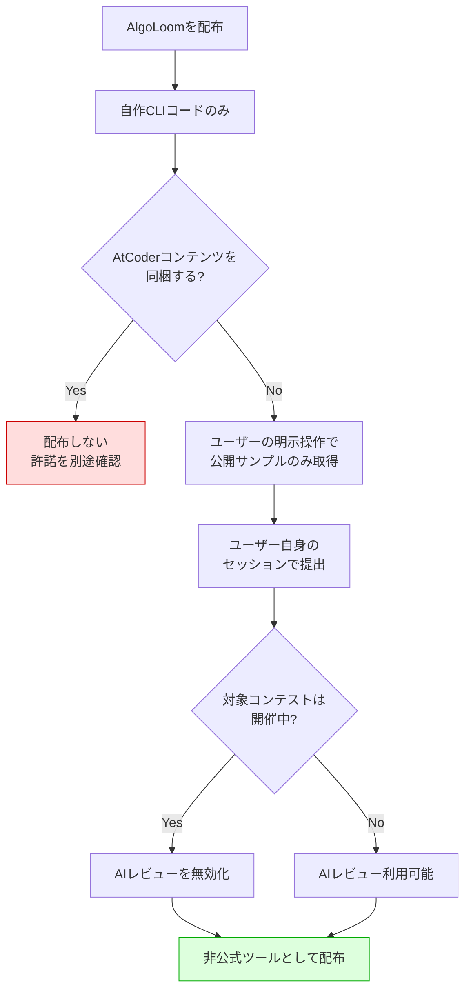
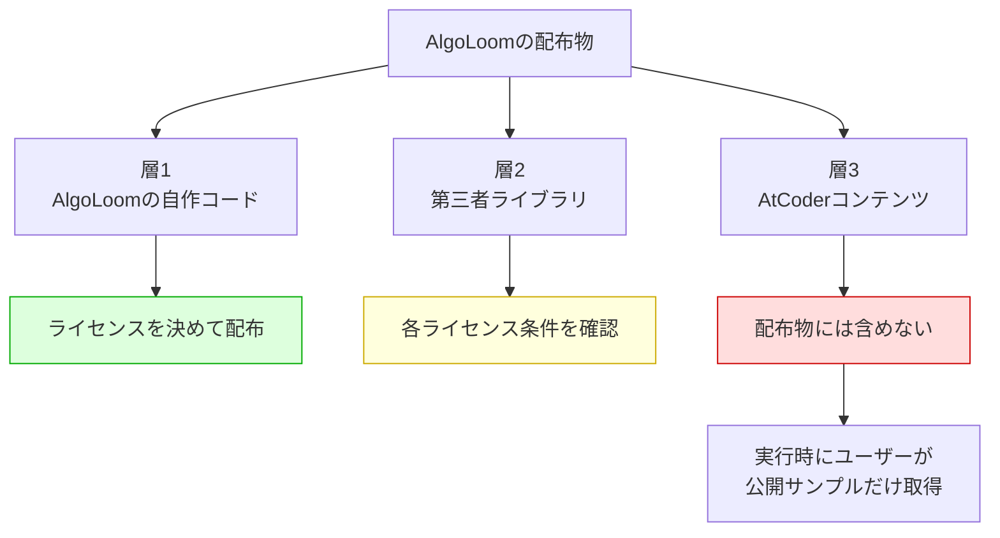
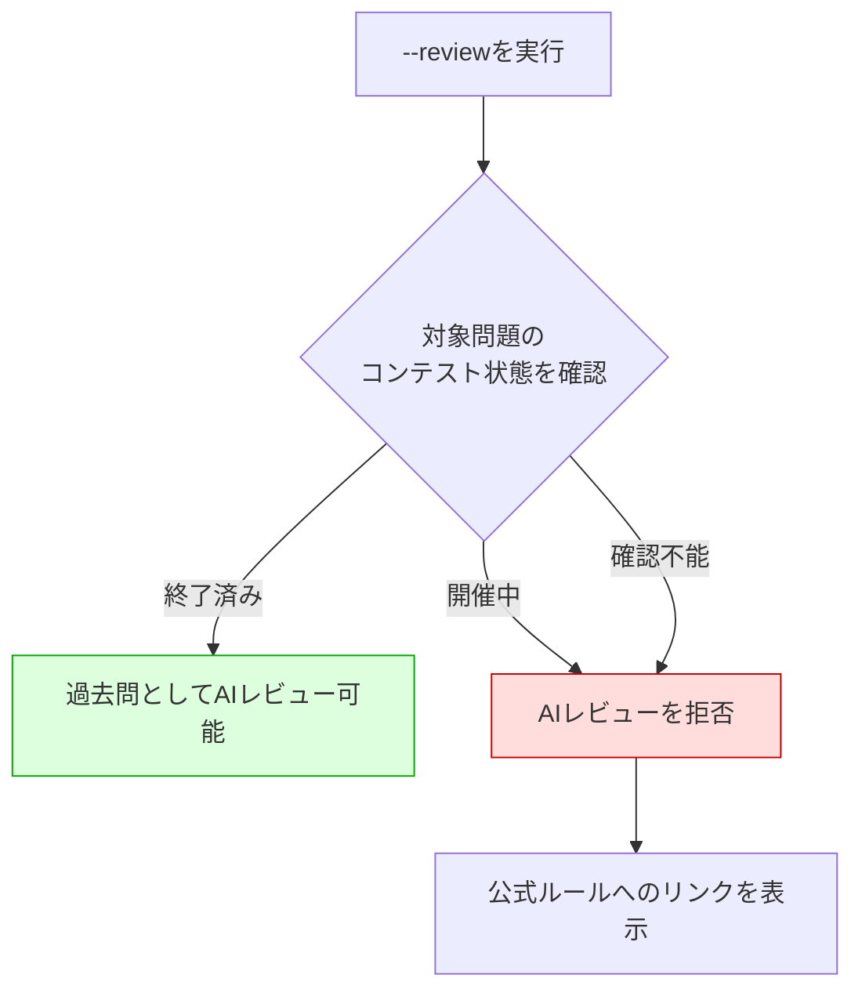
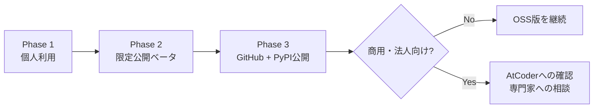

# AlgoLoom 配布方針ガイド

> 対象: AtCoder学習用ローカルCLI「AlgoLoom」の公開・配布
>
> 主な機能: 公開サンプル入出力の取得、ローカルテスト、ユーザー操作による提出、履歴保存、OllamaによるAIレビュー
>
> 作成日: 2026年7月15日
>
> 重要: 本文書は法的助言ではなく、公開情報に基づく設計・配布上の判断材料である。規約やコンテストルールは変更されるため、公開前に最新版を確認し、必要に応じてAtCoderまたは法律の専門家へ相談すること。

---

## 0. 結論

AlgoLoomは、次の条件を守ることで、**AtCoderの非公式な補助CLIとして配布することが現実的**である。

- AtCoderの問題文、画像、公開サンプル入出力を配布物へ同梱しない。
- ユーザーが指定した問題だけを、ユーザー自身の操作で取得する。
- 取得対象は問題ページで公開されているサンプル入出力に限定する。
- 隠しシステムテストの取得、一括クロール、Bot対策の回避を実装しない。
- 提出にはユーザー自身のAtCoderアカウントとセッションを使う。
- コンテスト開催中の対象問題ではAIレビューを機能的に無効化する。
- リクエスト間隔、再試行、提出確認などの安全策を既定で有効にする。
- AtCoder公式またはAtCoder公認のツールだと誤解されない表示にする。
- 公開版ではTurso同期を任意機能とし、各ユーザーが自分のDBと認証情報を用意する。

ただし、これはAtCoderからAlgoLoomへ個別の許諾が与えられたことを意味しない。安全性を高めるため、公開ベータ前にAtCoderへ設計内容を説明し、書面で確認することを推奨する。



---

## 1. 用語

### 1.1. 法律・規約に関する用語

| 用語 | 意味 |
|---|---|
| 著作物 | 思想や感情を創作的に表現したもの。文章、画像、プログラムなどが該当し得る |
| 著作権 | 著作物を複製、公衆送信、翻案などすることについて著作者等が持つ権利 |
| 複製 | データをPCへ保存するなど、著作物を再製すること。インターネットからのダウンロードも含まれ得る |
| 再配布 | 入手したデータを、自分以外の第三者へさらに配ること |
| 公衆送信 | Webサイトや公開リポジトリなどを通じて、不特定または多数の人が受信できる状態にすること |
| 私的使用 | 個人や家庭内などの限られた範囲で、仕事以外の目的に使用すること |
| 引用 | 報道、批評、研究などのため、必要性や主従関係などの条件を満たして他人の著作物を利用すること |
| 利用規約 | サービス提供者とユーザー間の利用条件。法律上可能な行為でも、契約上制限される場合がある |
| 個別コンテストルール | 一般利用規約とは別に、特定のコンテストへ適用されるルール。一般規約より具体的なルールが優先され得る |
| 免責 | 損害等について責任範囲を説明すること。免責を書くだけで許諾を得たり、規約違反を解消したりはできない |

### 1.2. 技術に関する用語

| 用語 | 意味 |
|---|---|
| 公開サンプル入出力 | 問題ページ上で例として公開されている入力と期待出力 |
| 隠しシステムテスト | ジャッジに使われる非公開のテストデータ。公開サンプルとは異なる |
| スクレイピング | Webページをプログラムで取得し、必要な情報を抽出すること |
| 自動提出 | CLI等がユーザーのコードをAtCoderへ送信すること |
| セッション | ログイン済み状態を識別するための情報。Cookieやトークン等を含み、パスワードと同様に慎重な管理が必要 |
| レート制限 | 短時間に大量のアクセスを送らないよう、リクエスト頻度を制限する仕組み |
| バックオフ | エラー発生時、待ち時間を徐々に長くしながら再試行する仕組み |
| fail closed | 状況を安全と確認できない場合、危険な可能性がある機能を許可せず停止する設計 |
| fixture | テスト用に用意する固定データ。AlgoLoomでは架空の問題データを使用する |
| wheel / sdist | Pythonパッケージの配布形式。PyPI等からインストールするために使う |
| SBOM | 配布物に含まれるソフトウェア部品や依存関係の一覧 |

---

## 2. 確認できた事実とAlgoLoomの判断

法的・規約上の事実と、AlgoLoomが安全側で採る設計方針を混同しないことが重要である。

| 論点 | 確認できた事実 | AlgoLoomの判断 |
|---|---|---|
| AtCoder上の文章・画像等 | 権利はAtCoderまたは第三者に帰属すると利用規約に記載 | 問題文、画像、公開サンプルを配布物へ同梱しない |
| ユーザーの提出コード | 作成ユーザーに所有権・著作権が帰属すると利用規約に記載 | 自分のコードをDBへ保存し、`show` / `diff`で閲覧できる |
| スクレイピング | 一般利用規約には名指しの禁止を確認できない | 明示許諾とは考えず、1問単位・低頻度・ユーザー操作限定にする |
| 自動提出 | 一般利用規約には名指しの禁止を確認できない | 確認付き、連続提出防止、自動ループなしで提供する |
| アカウント共有 | 利用規約で禁止 | 各ユーザーが自分のセッションだけを使う |
| サービスへの損害 | 損害を与える、またはその恐れのある行為を禁止 | 大量取得、過度なポーリング、Bot対策回避を実装しない |
| AI利用 | ABC・ARC・AGC開催中は原則禁止。AHCは別ルール | 対象コンテスト開催中はAIレビューをfail closedで停止する |
| 企業・団体での利用 | 採用試験・査定等への過去問利用に制限がある | AlgoLoomを採用試験・査定用途に使用しない旨を明記する |

参照:

- [AtCoder利用規約](https://atcoder.jp/tos?lang=ja)
- [コンテスト中のルール](https://info.atcoder.jp/overview/contest/rules)
- [AtCoder生成AI対策ルール](https://info.atcoder.jp/entry/llm-rules-ja)
- [AHC生成AI利用ルール](https://info.atcoder.jp/entry/ahc-llm-rules-ja)
- [企業・団体におけるAtCoderの利用](https://info.atcoder.jp/utilize/school/riyou)

---

## 3. 配布物を3層に分ける



### 層1: AlgoLoomの自作コード

- CLI、DB処理、設定、同期処理、Ollama連携などはAlgoLoom作者の著作物である。
- MITまたはApache-2.0等、明示的なOSSライセンスを付ける。
- AtCoder公式ツールと誤認される説明やデザインにしない。

### 層2: 第三者ライブラリ

- online-judge-tools、CLIフレームワーク、Turso SDK等が該当する。
- 配布方法によっては、ライセンス本文や著作権表示の同梱が必要になる。
- `THIRD_PARTY_NOTICES.md`と依存関係一覧を用意する。
- Ollama本体やモデルを同梱する場合は、それぞれのライセンスを別途確認する。初期版では同梱せず、ユーザーに導入してもらう。

online-judge-toolsはMITライセンスであり、コピーまたは実質的部分を配布する場合は、著作権表示と許諾表示を保持する必要がある。

- [online-judge-tools](https://github.com/online-judge-tools/oj)
- [online-judge-tools LICENSE](https://raw.githubusercontent.com/online-judge-tools/oj/master/LICENSE)

### 層3: AtCoderコンテンツ

次のものは配布物へ入れない。

- 問題文
- 問題画像、図、PDF
- 公開サンプル入力・出力
- 解説本文や解説画像
- 隠しシステムテスト
- AtCoderロゴ
- 実際のAtCoder問題を使ったスクリーンショット

READMEや自動テストには、AlgoLoom作者が作成した架空の問題とfixtureを使用する。

---

## 4. 問題文・サンプル入出力の扱い

### 4.1. 権利についての正確な表現

AtCoder利用規約には、サービスを構成する文章、画像、プログラム、その他のデータ等の権利が、ユーザー自身の作成物を除き、AtCoderまたは権利者に帰属すると記載されている。

ただし、この条項だけから「すべての数値や単純な入出力例が個別に著作物である」と断定することはできない。著作物に該当するかは、創作的な表現かどうか等によって個別に判断される。

AlgoLoomには個別判断を行う利益がないため、**公開サンプルも含めてAtCoderコンテンツとして非同梱にする**。

### 4.2. 実行時取得

実行時にユーザー自身のPCへ保存する行為は、AlgoLoomの配布物に問題データを含める「再配布」とは異なる。ただし、ローカルへの保存は複製に当たり得る。

個人的な過去問学習では、私的使用のための複製が成立する可能性がある。一方、業務・採用・査定などの用途は同じ前提で扱えない。

- [文化庁 著作権テキスト](https://www.bunka.go.jp/seisaku/chosakuken/seidokaisetsu/pdf/94215301_01.pdf)
- [文化庁 著作権施策に関する総合案内](https://www.bunka.go.jp/seisaku/chosakuken/index.html)

### 4.3. 実装ルール

- `get`はユーザーが指定した1問だけを処理する。
- 問題文は保存せず、公式問題ページをブラウザで開く。
- 保存対象は公開サンプル入出力だけにする。
- `oj download --system`相当の隠しテスト取得を使用しない。
- 全問題・全コンテストの一括取得機能を提供しない。
- 取得済みサンプルのキャッシュはユーザー端末内だけに置く。
- キャッシュやDB dumpをGitへ誤ってコミットしないよう`.gitignore`を用意する。
- 問題が開催中コンテストに属する場合は、取得・表示に関する個別ルールも確認する。

### 4.4. スクリーンショットと引用

引用の条件を満たせば利用できる可能性はあるが、READMEの装飾目的の転載が当然に引用になるわけではない。権利判断を単純にするため、初期版では実際の問題文・画像・サンプルをREADMEやデモ動画へ載せない。

デモでは次を使用する。

- 架空の問題ID
- 作者が作成した短い問題文
- 作者が作成したサンプル入出力
- AtCoderのロゴや画面を含まないターミナル画面

---

## 5. スクレイピングとアクセス負荷

### 5.1. 現在確認できること

2026年7月15日時点のAtCoder一般利用規約には、「スクレイピング」や「自動提出」を名指しした禁止条項は確認できない。一方で、次の包括的な禁止事項がある。

- AtCoderまたは第三者へ著しい不利益をもたらす行為
- AtCoderまたはサービスへ損害を与える、またはその恐れのある行為
- AtCoderが不適切と判断する行為

したがって、「明示的に禁止されていない」ことを「許可されている」と読み替えてはならない。

### 5.2. 他ツールの存在について

online-judge-tools、atcoder-cli、AtCoder Problems等が利用されていることは、周辺ツールが実際に存在することの参考にはなる。しかし、AlgoLoomに対する許諾や、すべてのアクセス方法に対する黙認の証拠にはならない。

AtCoder自身もAtCoder Problemsを非公式サービス・非公式APIと説明している。

- [AtCoder Problemsの説明](https://info.atcoder.jp/more/contents/problems)

### 5.3. AlgoLoomのアクセス方針

| 操作 | 方針 |
|---|---|
| 問題取得 | ユーザーが指定した1問だけ |
| 一括取得 | 実装しない |
| キャッシュ | ローカルキャッシュを優先し、同じページを繰り返し取得しない |
| リクエスト間隔 | 既定で間隔を設け、無効化オプションを提供しない |
| 429応答 | 指示された待機時間を尊重し、即時再試行しない |
| 5xx・通信失敗 | 上限付きの指数バックオフを使う |
| 判定ポーリング | 間隔と最大待機時間を設定する |
| User-Agent | ツール名、バージョン、連絡先の記載可否をAtCoderへ確認する |
| Bot対策 | 回避や迂回を実装しない |

---

## 6. 自動提出

### 6.1. 基本方針

- ユーザーが明示的に`submit`を実行した場合だけ提出する。
- 提出先URL、問題ID、言語、ファイル名を表示して確認を求める。
- 短時間の重複提出を検知する。
- 自動再提出ループを実装しない。
- テスト成功を理由に無条件で自動提出しない。
- AtCoderの応答が不明な場合、同じコードを即座に再送しない。

online-judge-toolsにも提出待機や確認を外す機能は存在するが、プロジェクト自身が安全装置を外すことを推奨していない。AlgoLoomは安全側の既定値を維持する。

### 6.2. 特別なコンテスト

企業コンテストや業務直結型コンテスト等には、一般利用規約以外の個別規約が適用されることがある。

- 提出前にコンテストトップページの個別規約を確認できるリンクを表示する。
- 個別規約を機械的に完全判定できるとは考えない。
- 対応可否が不明なコンテストでは警告し、必要に応じてブラウザからの手動提出を案内する。

---

## 7. AIレビューとコンテストルール

### 7.1. 過去問と開催中コンテストを分ける



2026年7月15日時点では、開催中のABC・ARC・AGCにおいて、生成AIの使用は限定された翻訳用途等を除いて原則禁止されている。Unrated参加者にも適用され、コード補完、バグ診断、コード変換も禁止例に含まれる。過去問練習にはこのルールは適用されない。

AHCには別の生成AIルールがあり、個別コンテストによって変更される可能性もある。

### 7.2. AlgoLoomの実装方針

- 対象問題のコンテストが開催中なら`--review`を拒否する。
- Rated / Unratedを区別しない。
- 初期版ではABC・ARC・AGC・AHCを含む全AtCoderコンテストで、開催中レビューを一律に拒否する。
- コンテスト状態や終了時刻を確認できない場合も拒否する。
- ローカルOllamaであっても生成AI利用であることに変わりはない。
- ユーザーが自己責任を選択するだけの安易な上書きオプションは設けない。
- ルールページへのリンクと、レビューを利用できない理由を表示する。
- コンテスト終了後は過去問としてレビューを利用できる。

### 7.3. 免責だけでは不十分

「各自でルールを確認してください」と表示するだけでは、安全な既定値にならない。AlgoLoomは技術的に判定できる範囲でAI機能を停止し、規約違反を誘発しにくい設計にする。

参照:

- [AtCoder生成AI対策ルール](https://info.atcoder.jp/entry/llm-rules-ja)
- [AHC生成AI利用ルール](https://info.atcoder.jp/entry/ahc-llm-rules-ja)
- [コンテスト中のルール](https://info.atcoder.jp/overview/contest/rules)

---

## 8. 認証とCloudflare等のBot対策

### 8.1. 基本方針

- AlgoLoom独自のログイン処理を原則として持たない。
- 認証はonline-judge-toolsの正規の仕組みに委譲する。
- ユーザー自身が取得したセッションだけを利用する。
- パスワードを保存しない。
- セッションCookieやトークンをAlgoLoomのDBへコピーしない。
- セッション情報をTurso、ログ、バックアップ、クラッシュレポートへ含めない。
- 複数人で同じAtCoderセッションを共有しない。

### 8.2. Bot対策への対応

AtCoderの認証方式やBot対策の変更により、online-judge-toolsのログインが動作しなくなる可能性がある。これはAtCoderがAlgoLoom向けに保証するAPIではないため、互換性リスクとして扱う。

次の機能は実装しない。

- CAPTCHAやTurnstileの自動突破
- ブラウザ指紋の偽装
- 他人のCookieの取得・共有
- ブロック回避のためのプロキシ切り替え
- AtCoderが意図したアクセス制限の迂回

認証できない場合はエラーとして停止し、公式サイトまたはonline-judge-tools側の対応を待つ。

- [online-judge-tools Cloudflare関連Issue](https://github.com/online-judge-tools/oj/issues/934)

---

## 9. 推奨する配布方法

### 9.1. 第1段階: GitHub + PyPI

初期公開は、ソースコードとPythonパッケージとして配布する。

| 項目 | 方針 |
|---|---|
| ソース | GitHubで公開 |
| Python配布 | PyPIでwheel / sdistを公開 |
| インストール | `pipx install algoloom`または`uv tool install algoloom` |
| AlgoLoomのライセンス | MITまたはApache-2.0を選択 |
| 第三者表示 | `THIRD_PARTY_NOTICES.md`を同梱 |
| 依存関係 | バージョン範囲またはlock fileで管理 |
| AtCoderデータ | 一切同梱しない |
| デモデータ | 作者が作成した架空fixtureだけを同梱 |
| クラウド同期 | 任意機能。既定はローカルのみ |

### 9.2. 第2段階: GitHub Releases / Homebrew

PyPI版の動作とライセンス監査が安定した後に追加する。

- GitHub Releasesでハッシュ付き成果物を公開する。
- Homebrew tapを用意する。
- 対応Python、OS、online-judge-toolsのバージョンを記載する。
- 単一実行ファイルへ依存コードをバンドルする場合、該当ライセンスを成果物へ含める。
- 可能であればSBOMを生成する。

### 9.3. 商用・法人向け配布

有料配布、法人研修、採用関連機能を提供する場合は、無料OSS版と同じ判断で進めない。

- AtCoderへ事前に利用形態を説明して確認する。
- AtCoder過去問を採用試験、査定、採用活動に利用させない。
- 必要に応じて法律の専門家へ相談する。
- AtCoderから書面で確認を得るまでは、採用・査定用途をサポート対象外にする。

---

## 10. 非公式表示とブランド

AlgoLoomはAtCoder公式または公認と誤認されないようにする。

README、PyPI、Webサイトには次の趣旨を記載する。

> AlgoLoomは非公式の第三者製ツールであり、AtCoder株式会社とは提携しておらず、AtCoder株式会社による保証・公認を受けていません。

### 表示ルール

- 製品名にAtCoderを含めない。
- AtCoderロゴをアプリアイコンやロゴとして使用しない。
- 「AtCoder対応」は事実を説明する通常の文章として用い、公式性を示唆しない。
- AtCoderサイトのデザインを模倣しない。
- AtCoderロゴを将来使用する場合は、公式ガイドラインに従い、必要な連絡を行う。

- [AtCoderロゴ利用ガイドライン](https://info.atcoder.jp/logoguide)

---

## 11. Turso・Ollama・プライバシー

### 11.1. 公開版のTurso

公開配布物へ、開発者所有のTurso URLやトークンを埋め込んではならない。

- 既定はローカルDBのみとする。
- Turso同期はユーザーが明示的に有効化する。
- 各ユーザーが自分のTurso DBとトークンを設定する。
- 提出コード、判定結果、レビューがCloudへ保存されることを設定時に説明する。
- Cloud同期を無効に戻す方法と、データexport方法を用意する。
- AtCoderのセッションCookieやパスワードは同期対象外にする。

### 11.2. Ollama

- Ollamaへの入力内容をREADMEに説明する。
- 既定ではローカルOllamaだけを対象とする。
- リモートOllamaエンドポイントへ送る場合、提出コードが外部送信されることを明示する。
- Ollama本体やモデルをAlgoLoomへ同梱しない。
- ユーザーが選ぶモデルごとのライセンスは、ユーザー側でも確認が必要である。

### 11.3. 保存してはいけない情報

- AtCoderパスワード
- AtCoderセッションCookie
- Tursoトークン
- ローカル環境変数の全内容
- ブラウザプロファイル
- 不要な個人情報

---

## 12. リポジトリと配布物の除外設定

`.gitignore`とビルド設定で、次のファイルを除外する。

```text
# AtCoderから取得した公開サンプル
algoloom_workspace/**/test/

# ローカルDBと同期情報
*.db
*.db-wal
*.db-shm
*.db-journal

# 認証・設定
.env
*.cookie
cookie.jar
credentials.*

# バックアップ・dump
*.dump
*.backup

# ユーザーの解答コードを含むワークスペース
algoloom_workspace/
```

除外設定だけに依存せず、リリース前に成果物の内容を一覧表示して検査する。

---

## 13. 配布版の安全機能

| 機能 | 必須動作 |
|---|---|
| `get` | 1問ずつ、公開サンプルのみ、ローカルキャッシュ優先 |
| `test` | ローカルだけで実行 |
| `submit` | 提出内容を表示して確認、連続提出を抑止 |
| `--review` | 対象コンテスト開催中または状態不明なら拒否 |
| 判定確認 | 間隔付きポーリング、最大待機時間あり |
| 認証 | ユーザー自身のonline-judge-toolsセッションを使用 |
| 同期 | 認証情報を除外し、ユーザー自身のTursoへ送る |
| エラーログ | コード、Cookie、トークンをマスク |
| 更新確認 | AtCoder規約・AIルールのリンクを表示可能にする |

---

## 14. 配布前チェックリスト

### AtCoderコンテンツ

- [ ] 問題文、画像、公開サンプル、解説を配布物に含めていない。
- [ ] テストfixtureはすべて作者が作成した架空データである。
- [ ] 隠しシステムテスト取得を実装していない。
- [ ] 一括問題取得を実装していない。
- [ ] READMEやスクリーンショットにAtCoder問題を転載していない。

### アクセス・提出

- [ ] レート制限を既定で有効にしている。
- [ ] レート制限を簡単に無効化できない。
- [ ] 429と5xxへ適切にバックオフする。
- [ ] 提出前確認がある。
- [ ] 自動再提出ループがない。
- [ ] 判定ポーリングに間隔と上限がある。

### AI

- [ ] 開催中の対象問題ではAIレビューを拒否する。
- [ ] コンテスト状態を確認できない場合もAIレビューを拒否する。
- [ ] Rated / Unratedにかかわらず同じ制限を適用する。
- [ ] 現行のABC・ARC・AGC・AHCルールへのリンクがある。

### 認証・プライバシー

- [ ] AtCoderパスワードを保存しない。
- [ ] セッションCookieをDBやTursoへ保存しない。
- [ ] トークンをログへ出力しない。
- [ ] Cloudflare等のBot対策回避を実装していない。
- [ ] Turso同期がオプトインになっている。

### ライセンス・表示

- [ ] AlgoLoom自身のLICENSEがある。
- [ ] `THIRD_PARTY_NOTICES.md`がある。
- [ ] バンドルする全依存関係のライセンスを確認した。
- [ ] online-judge-toolsのMIT表示を保持している。
- [ ] 非公式・非公認であることをREADMEとPyPIへ記載した。
- [ ] AtCoderロゴを無断で製品ロゴとして使用していない。

### リリース

- [ ] wheel / sdistの中身を一覧で確認した。
- [ ] `.gitignore`対象ファイルが混入していない。
- [ ] Cookie、トークン、実ユーザーコードをsecret scanした。
- [ ] 対応バージョンと既知の制約を記載した。
- [ ] AtCoderの最新規約とコンテストルールを再確認した。

---

## 15. AtCoderへ確認したい事項

公開ベータ前に、次の設計を簡潔に説明して問い合わせる。

1. ユーザー操作により、公開サンプル入出力を1問ずつローカル保存するCLIの配布可否
2. ユーザー自身のセッションを使った提出補助の可否
3. 推奨されるアクセス間隔と再試行方法
4. User-Agentへ記載すべき情報
5. 公開サンプルのローカルキャッシュ可否
6. 開催中コンテストではAIレビューを無効化する設計で問題ないか
7. READMEやPyPIで「AtCoder対応」と文章表記する場合の注意点
8. 無料OSS版と有料版で確認事項が異なるか

問い合わせ時は、「スクレイピングしてよいか」という抽象的な質問ではなく、1操作あたりのリクエスト数、保存内容、認証方式、AI制限を具体的に示す。

---

## 16. 段階的な配布計画



### Phase 1: 個人利用

- ローカルDBを既定にする。
- 過去問の公開サンプル取得と手動提出を検証する。
- 開催中AIブロックを実装する。
- 実データがリポジトリへ混入しないことを確認する。

### Phase 2: 限定公開ベータ

- AtCoderへ設計内容を問い合わせる。
- 少人数で認証、取得、提出、規約表示を検証する。
- アクセス数とエラーを、秘密情報を含めずに確認する。
- online-judge-toolsの互換性問題を整理する。

### Phase 3: GitHub + PyPI公開

- LICENSEと第三者ライセンスを同梱する。
- 非公式表示を明記する。
- セキュリティ・プライバシー説明を公開する。
- 規約変更時に機能を停止・更新できる保守体制を用意する。

### Phase 4: 商用・法人向け

- OSS公開とは別の判断を行う。
- 採用試験・査定用途を禁止する。
- AtCoderから必要な確認を得る。
- 利用規約、プライバシーポリシー、サポート範囲を整備する。

---

## 17. 公式・一次資料

### AtCoder

- [AtCoder利用規約](https://atcoder.jp/tos?lang=ja)
- [コンテスト中のルール](https://info.atcoder.jp/overview/contest/rules)
- [AtCoder生成AI対策ルール](https://info.atcoder.jp/entry/llm-rules-ja)
- [AHC生成AI利用ルール](https://info.atcoder.jp/entry/ahc-llm-rules-ja)
- [企業・団体におけるAtCoderの利用](https://info.atcoder.jp/utilize/school/riyou)
- [AtCoderロゴ利用ガイドライン](https://info.atcoder.jp/logoguide)
- [AtCoder Problemsの説明](https://info.atcoder.jp/more/contents/problems)
- [業務直結型コンテスト標準著作権等取扱規約](https://atcoder.jp/posts/384?lang=ja)

### 著作権

- [文化庁 著作権施策に関する総合案内](https://www.bunka.go.jp/seisaku/chosakuken/index.html)
- [文化庁 著作権テキスト](https://www.bunka.go.jp/seisaku/chosakuken/seidokaisetsu/pdf/94215301_01.pdf)

### 依存ツール

- [online-judge-tools](https://github.com/online-judge-tools/oj)
- [online-judge-tools LICENSE](https://raw.githubusercontent.com/online-judge-tools/oj/master/LICENSE)
- [online-judge-tools Cloudflare関連Issue](https://github.com/online-judge-tools/oj/issues/934)

---

## 18. 最終方針

AlgoLoomは、AtCoderの問題を配布するアプリではなく、**ユーザーが自分の権限と責任で公式サイトを利用する際のローカル作業を補助する非公式CLI**として設計・配布する。

守るべき中心原則は次のとおりである。

- AtCoderコンテンツを配布物へ含めない。
- 公開サンプルだけを、ユーザー操作で1問ずつ取得する。
- 隠しテスト、大量取得、アクセス制限回避を実装しない。
- 提出はユーザー自身のセッションで、確認付きで行う。
- 開催中コンテストの対象問題ではAIレビューを停止する。
- 認証情報を保存・同期・ログ出力しない。
- 非公式・非公認であることを明記する。
- 第三者ライセンスを守る。
- 規約変更へ継続的に追従する。
- 商用・法人用途はAtCoderへの確認なしに拡大しない。

この方針はリスクを大きく下げるが、法的な保証やAtCoderからの許諾そのものではない。公開前の問い合わせと、公開後の継続的な規約確認を配布プロセスの一部として扱う。
