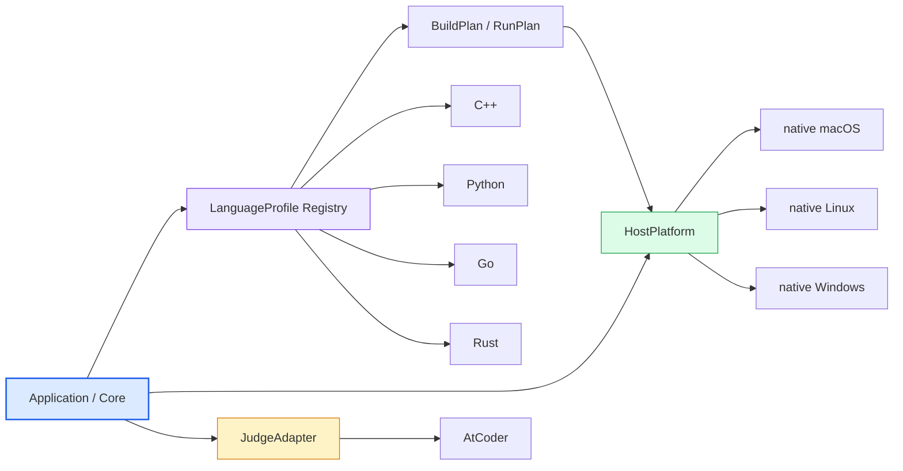
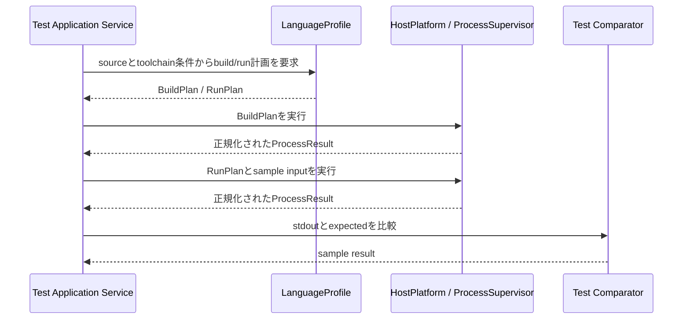
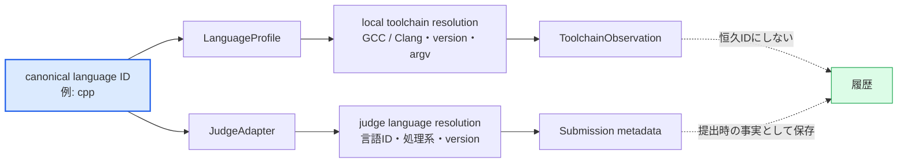
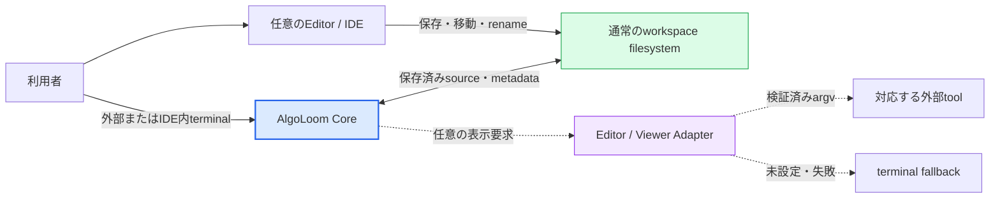
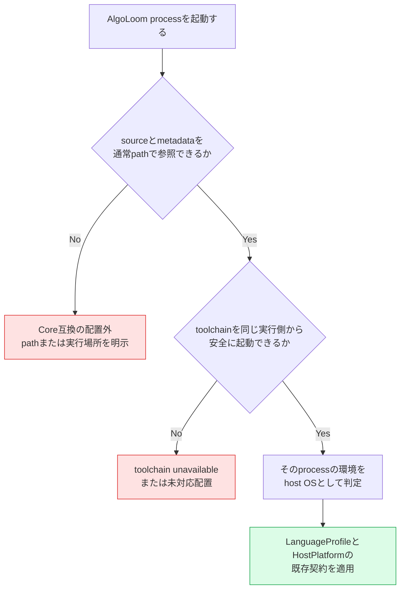

# AlgoLoom 言語・実行環境の可搬性設計

> 対象: 解答言語、host OS、process実行、workspace layout、Editor / IDE非依存性、異なる環境間での履歴可搬性
>
> 状態: MVPの対応環境を実装するための設計方針
>
> 作成日: 2026年7月19日
>
> 更新日: 2026年7月20日
>
> 関連文書:
> - [製品ビジョン](../product/vision.md)
> - [MVPスコープ](../product/mvp.md)
> - [アーキテクチャ概要](overview.md)
> - [Core契約](core-contracts.md)
> - [ストレスフリーUX設計](../quality/stress-free-ux-design.md)
> - [パフォーマンスと待機体験の設計](../quality/performance-and-waiting-design.md)
> - [セキュリティ設計ガイド](../quality/security-design.md)
> - [ローカル利用とCloud同期の段階的設計](../features/local-and-cloud-sync-design.md)

---

## ドキュメント概要

本書は、MVPで対応する解答言語とhost OSを定め、言語・OS・Editor / IDEの差異を分離する契約、workspace UX、異なる環境間での履歴可搬性を定義します。

## 0. 結論

MVPの解答言語は**C++、Python、Go、Rust**、製品対象OSは**native macOS、native Linux、native Windows**とする。WSLはLinux版またはnative Windows版と同一の保証範囲とはみなさず、MVPの正式対象へ含めない。

言語とOSの追加が既存実装を壊さないよう、差異を次の直交した境界へ分ける。



- `LanguageProfile`は、言語固有のtemplate、toolchain診断、build/run計画を担う。
- `HostPlatform`は、OS固有のprocess起動・終了、path、terminal、原子的file操作を担う。
- `JudgeAdapter`は、sample取得、提出、判定、judge上の提出言語への対応付けを担う。
- Editor / IDEは新たなCoreの実装軸にせず、通常のworkspace fileをAlgoLoomと共有する外部所有環境として扱う。外部toolをAlgoLoomから起動する場合だけ、任意のEditor / Viewer Adapterへ閉じ込める。
- Coreの各commandへ言語名やOS名の条件分岐を散在させない。
- 対応言語、OS、利用するEditor / IDEを変更しても、既存command、履歴、snapshot、提出の意味を変更しない。
- Coreの論理モデルは特定のcompiler/runtimeの種類とversionに依存させない。ただし、実際のbuild、run、性能、judge結果まで環境差異がないとは保証せず、利用時に解決した環境を観測情報として扱う。

ここでいうversion非依存は「任意のversionで同じ挙動を保証する」ことではない。言語の論理的な識別、local toolchain、judge上の提出環境を分離し、具体的なversionの変更が履歴とCoreの意味を壊さないことを指す。

---

## 1. 本書の責任

### 1.1. 本書で決めること

- MVPで正式に保証する解答言語とOS
- 言語差異とOS差異を閉じ込める境界
- 各言語の初期対応範囲
- 複数言語sourceが存在する場合のworkspace UX
- Editor / IDEに依存しないCore互換性の境界と保証水準
- IDE内terminal、task runner、Remote Editor等を含む実行配置の判定原則
- 異なるOS間で履歴とsource snapshotを可搬にする原則
- 追加言語・追加OS・開発環境差異の契約テストと受け入れ条件

### 1.2. 本書で決めないこと

- compiler、runtime、OS release、CPU architectureの最終version matrix
- 各OSにおけるcompiler/runtimeの具体的な導入command
- build artifact用directoryの最終名称
- metadata fileの最終形式
- 個別Editor / IDE、plugin、task runnerのversion matrixと具体的な設定手順
- 外部Editor / Diff Viewer AdapterをMVP後にどのtoolから正式対応するか
- machine-readable出力とEditor plugin APIの最終形式
- MVP後のCargo project、Go module、CMake等のproject build対応
- WSLを将来正式対応する時期

---

## 2. 用語

| 用語 | 本書での意味 |
|---|---|
| canonical language ID | `cpp`、`python`、`go`、`rust`等、toolchain名やjudge上のversionに依存しないAlgoLoom内の言語識別子 |
| language profile | 言語固有の拡張子、template、toolchain診断、安全なbuild/run計画を提供する組み込み定義 |
| host OS | AlgoLoom processが直接動作し、filesystemと子processを制御するOS |
| native Windows | WSLを介さず、Windows上のPython processとしてAlgoLoomを実行する環境 |
| HostPlatform | host OS固有のprocess、path、terminal、file操作を閉じ込める境界 |
| BuildPlan | shell文字列ではなくargv、working directory、入力、生成物、timeout区分等で表すbuild計画 |
| RunPlan | argv、working directory、stdin、実行対象、resource上限区分等で表す実行計画 |
| toolchain observation | compiler/runtimeの種類、version、診断結果等、その端末で観測した実行環境情報 |
| judge language resolution | canonical language IDを、対象contestで利用可能なjudge固有の言語ID、処理系、versionへ提出時に解決した結果 |
| logical source name | snapshotやexportでsourceを説明するための、絶対pathではない可搬な名称 |
| Core互換 | Editor固有のplugin、project設定、Adapterなしで、通常fileとCLIからAlgoLoomの主要操作を利用できる状態 |
| 公式連携 | AlgoLoomから特定の外部toolを起動するAdapterや、将来のplugin等について、対象versionとcapabilityを個別検証した状態 |
| 実行配置 | Editorの画面、AlgoLoom process、workspace filesystem、toolchainがlocal、remote host、container、WSL等のどこに存在するかという配置 |

---

## 3. MVPの対応範囲

### 3.1. 解答言語

MVPでは、次の4言語に組み込みlanguage profileを提供する。

| 言語 | canonical ID | 初期実行モデル | MVPで保証する範囲 | MVPで保証しない範囲 |
|---|---|---|---|---|
| C++ | `cpp` | sourceをcompileし、生成binaryを実行 | 単一source file、標準toolchain、標準library | CMake、複数translation unit、外部library管理 |
| Python | `python` | runtimeでsourceを実行 | 単一source file、標準runtime、標準library | virtual environment作成、外部package導入・lock管理 |
| Go | `go` | 単一packageをbuildし、生成binaryを実行 | 単一source file、標準toolchain、標準library | 複数package、外部module取得、`go.mod`管理 |
| Rust | `rust` | 単一sourceをcompileし、生成binaryを実行 | 単一source file、標準toolchain、標準library | Cargo project、外部crate取得、workspace管理 |

この4言語は、利用者が設定fileへ任意commandを書かなくても最初のlocal testへ進める組み込みprofileとする。個別profileの内部事情を他のprofileへ継承させず、共通の契約と値objectだけを共有する。

### 3.2. host OS

| 環境 | MVPでの状態 | 意味 |
|---|---|---|
| native macOS | 正式対象 | macOS上のPython processとして実行し、実機またはCIで検証する |
| native Linux | 正式対象 | Linux上のPython processとして実行し、実機またはCIで検証する |
| native Windows | 正式対象 | Windows上のPython processとして実行し、PowerShell等から利用できることを検証する |
| WSL | 対象外 | Linux kernelで動作しても、Windows filesystem・実行file・browser・credentialとの相互運用を未検証のまま保証しない |

WSL上で偶然動作することを妨げないが、native Windows対応またはLinux対応の検証結果を根拠に「WSL対応済み」と表示しない。

### 3.3. 保証matrix

正式対応を表示する前に、少なくとも4言語と3 OSの12組み合わせで、代表的な単一sourceのtoolchain診断、build、run、公開sample比較を確認する。

詳細な障害テストはすべてを12回複製せず、責任ごとの契約テストへ分ける。

| テスト層 | 主な対象 | 組み合わせ |
|---|---|---|
| LanguageProfile契約 | template、toolchain診断、BuildPlan、RunPlan | 4 profile |
| HostPlatform契約 | 起動、取消、timeout、process tree終了、path、出力上限 | 3 OS |
| Judge言語mapping契約 | canonical language IDとAtCoder提出言語の対応 | 4言語と対応version |
| End-to-End smoke | `get → test`と代表的な提出前検証 | 4言語 × 3 OS |
| Core回帰 | workspace、snapshot、履歴、error構造 | 言語・OS非依存fixture |
| 開発環境非依存契約 | 保存済みsource、移動・rename、TTY有無、Editor設定非変更 | Editor名に依存しないfixture |
| 公式連携契約 | argv、capability、起動失敗、terminal fallback | 提供するAdapterごと |

---

## 4. 依存方向と責任境界

### 4.1. 言語とOSを組み合わせたclassを作らない

次のような組み合わせ別実装を基本構造にしない。

```text
CppWindowsAtCoderRunner
PythonLinuxAtCoderRunner
RustMacAtCoderRunner
```

代わりに、Applicationが選択したlanguage profileからOS非依存の計画を受け取り、現在のHostPlatformへ実行を依頼する。



### 4.2. 境界ごとの責任

| 境界 | 含める責任 | 含めない責任 |
|---|---|---|
| `LanguageProfile` | 拡張子、template、toolchain要件、build/run計画、生成物種別 | process tree終了、AtCoder通信、DB保存、任意shell実行 |
| `HostPlatform` | process起動・取消・終了、path、temp、terminal capability、原子的file操作 | 言語template、judge提出言語、sample比較 |
| `JudgeAdapter` | 問題取得、認証、提出、判定、canonical language IDからjudge言語への解決 | local compilerの探索、OS process制御、履歴Schema |
| `HistoryStore` | SolveAttempt、milestone、snapshot、言語ID、toolchain観測、提出と判定の永続化 | sourceのbuild/run、host pathを恒久IDにすること |
| workspace context | 問題metadata探索、source候補解決、曖昧性の検出 | compiler実行、暗黙のsource選択、別directoryの自動merge |
| workspace filesystem境界 | 保存済みsourceの読み取り、宣言済みfileの安全な作成、command開始時のcontext再検証 | 未保存buffer、Editor project設定、plugin API、file watcherによるEditor操作の追跡 |
| Editor / Viewer Adapter | 検証済みcapabilityからの安全なargv生成、任意の表示先の一時起動 | Coreの編集・test・提出、外部toolのinstall、plugin追加、永続設定変更 |

### 4.3. 許可する依存方向

- Applicationは抽象化された`LanguageProfile`、`HostPlatform`、`JudgeAdapter`、`HistoryStore`を利用できる。
- 個別language profileは共通のplan/result型へ依存できるが、別の個別profileへ依存しない。
- 個別HostPlatform Adapterは共通契約へ依存できるが、別OS Adapterへ依存しない。
- `JudgeAdapter`はcanonical language IDをjudge上の言語へ解決できるが、workspace内の実行commandを変更しない。
- Domainと履歴の論理モデルは、compiler executable名、path separator、signal番号等のOS詳細へ依存しない。
- CoreはEditor / IDE名、plugin API、project設定形式へ依存せず、Editor / Viewer AdapterだけがCoreの安定した表示要求と一時file契約へ一方向に依存する。
- Editor / Viewer Adapterが未導入、設定不正、起動失敗であっても、workspace編集、test、checkpoint、提出、履歴取得を停止させない。

### 4.4. 条件分岐の配置

`if windows`、`if rust`、`if vscode`等の条件分岐を各commandやDomainへ散在させない。個別Adapterの選択は起動時のcomposition rootまたはregistryで行い、その後は共通interfaceを使う。Editor / IDEを単に編集へ使う場合はAdapter自体を選択せず、通常のworkspace filesystem境界を使う。

共通化できる処理は共有してよい。ただし、共有実装の変更が全profile・全OSへ影響するため、共通契約テストを必ず実行する。

---

## 5. LanguageProfile契約

### 5.1. 概念interface

最終的なclass名とmethod名を確定するものではないが、責任は概ね次のように分ける。

```python
class LanguageProfile(Protocol):
    language_id: str

    def source_conventions(self) -> SourceConventions:
        ...

    def render_template(self, context: TemplateContext) -> bytes:
        ...

    def probe_toolchain(self, host: HostPlatform) -> ToolchainObservation:
        ...

    def plan_build(self, request: BuildRequest) -> BuildPlan | None:
        ...

    def plan_run(self, request: RunRequest) -> RunPlan:
        ...
```

- planはargv配列で表し、shell command文字列を返さない。
- source path、artifact path、working directoryを文字列連結でcommandへ埋め込まない。
- toolchainがない場合は、profile ID、欠けているtool、影響を受ける操作を含む正規化された診断を返す。
- compiler/runtimeのraw errorを業務状態として保存せず、共通分類と必要に応じてredactした詳細へ変換する。
- toolchain executableの絶対pathは端末上の観測情報であり、共有履歴の恒久IDにしない。

### 5.2. 組み込みprofileと信頼境界

MVPの4 profileはAlgoLoom配布物に含め、version管理する。workspace metadataへcompile/run commandを保存しない。

将来user-level設定で実行fileや引数の変更を許可する場合も、次を守る。

- workspaceから変更できない端末所有の設定として扱う。
- 利用者が既に導入したexecutableの参照とAlgoLoom child processのargvだけを変更対象とし、compiler / runtimeのinstall、update、設定file、永続的な`PATH`・環境変数を変更しない。
- safe argvとして検証し、shell文字列を許可しない。
- 組み込みprofileと同じprocess、resource、secret分離契約を通す。
- 設定変更が他言語profileへ波及しない。

### 5.3. 言語・compiler・version非依存の境界

Coreは言語を`canonical language ID`で扱い、local testと提出の時点で具体的な環境を別々に解決する。



| 識別・観測 | 例 | 責任と保存方針 |
|---|---|---|
| canonical language ID | `cpp` | snapshot、履歴、CLIが使う安定した論理識別子 |
| LanguageProfile ID / version | 組み込みC++ profileのrevision | templateとbuild/run計画を再現・診断するためのAlgoLoom側metadata |
| local toolchain observation | GCC / Clang、version、診断結果 | test時に観測する。snapshotや問題の恒久IDにしない |
| local executable path | `/usr/bin/g++`等 | 端末固有。共有DB、export、同期対象へ原則含めない |
| judge language resolution | AtCoder固有言語ID、表示名、処理系、version | 提出直前に対象contestで解決し、実際に送った提出の事実として保存する |

#### 保証すること

- compiler/runtimeの種類またはversionが変わっても、問題、SolveAttempt、snapshot、checkpoint、submissionの論理的な関連を失わない。
- 利用者へ特定versionのinstall、update、`PATH`変更を通常操作から強制しない。
- 未導入または未検証のtoolchainは、利用できない操作と影響範囲を診断し、履歴参照等の無関係なCore操作を止めない。
- 対応matrixで検証した組み合わせと、検出できたが未検証の組み合わせを同じ「正式対応」と表示しない。
- local testで解決した環境とjudge提出環境が異なることを隠さず、必要時に両方を確認できるようにする。

#### 保証しないこと

- 同じcanonical language IDなら、すべてのcompiler、runtime、version、library、compile optionで同じ結果または性能になること。
- local sample通過が、異なるjudge環境でのcompile成功、AC、実行時間を保証すること。
- 未検証versionを、近いversionの結果だけから正式対応とみなすこと。

`JudgeAdapter`はmappingを永久固定値として扱わず、対象contestで利用できる言語とversionを確認して解決する。外部仕様を取得できず安全に一意なmappingを決められない場合は、推測して別versionへ提出せず、影響する提出だけを停止する。

---

## 6. HostPlatform契約

### 6.1. 主なOS差異

| 領域 | macOS / Linux | native Windows | 閉じ込める境界 |
|---|---|---|---|
| process tree | process group、session、signalを利用可能 | process groupの意味が異なり、Job Object等の検証が必要 | `ProcessSupervisor` |
| 取消・異常終了 | signalを分類できる | Console Control Eventやexit code等を分類する | `ProcessSupervisor`、共通`ProcessResult` |
| executable | 通常は拡張子なし | `.exe`、`PATHEXT`、`.cmd`等 | `ToolchainLocator` |
| path | POSIX rootとseparator | drive、UNC、予約名、case差、separator | `HostPathPolicy` |
| file lock・削除 | open中fileの扱いが比較的緩い場合がある | open中fileのrename/delete制約が異なる | `AtomicFileOperations` |
| terminal | POSIX terminal | PowerShell、cmd、Windows Terminal等 | `TerminalCapabilities` |
| symlink | 一般的に利用可能 | 作成条件や権限が異なる | path/context契約 |
| resource制限 | POSIX APIを利用できる場合がある | Job Object等、別方式が必要 | `ProcessSupervisor` |

### 6.2. 正規化するprocess結果

利用者向けの基本分類はOSで変えない。

- success
- compile error
- runtime error
- timeout
- output limit exceeded
- cancelled
- abnormal termination
- toolchain unavailable
- process state unknown

signal番号等のOS固有詳細は診断情報へ残せるが、Domainの状態遷移や通常表示の主分類にはしない。

### 6.3. native Windowsの検証

- 子processと孫processをtimeout後に残さない。
- space、quote、先頭hyphen等を含むpathでも追加commandを実行しない。
- source、artifact、sample pathをWindows上で安全に扱う。
- compiler/runtime未導入時に、他の言語や履歴機能を停止しない。
- PowerShell等から基本commandと取消操作を実行できる。
- SQLite lock、atomic write、temp cleanupを実機または同等環境で確認する。

---

## 7. workspaceと複数言語UX

### 7.1. 既定は一つの問題directoryに一つのsource

4言語を正式対応しても、`get`で4言語分のsourceを同時生成しない。利用者が選んだ1言語のtemplateだけを作る。

```text
algoloom_workspace/
└── abc300_a/
    ├── <problem-metadata>
    ├── main.cpp
    └── test/
```

この既定により、問題directoryを通常の単一言語projectに近い状態へ保ち、Editor、LSP、toolchainの曖昧性を減らす。

### 7.2. 同じ問題を別言語で解く場合

既定では別directoryを推奨する。

```text
algoloom_workspace/
├── abc300_a/
│   ├── <problem-metadata>
│   └── main.cpp
└── abc300_a-python/
    ├── <problem-metadata>
    └── main.py
```

- directory名は恒久IDにせず、両方を同じ正規問題IDへ関連付ける。
- AlgoLoomは別directoryを自動merge、rename、削除しない。
- 履歴では問題ID、snapshot ID、canonical language IDにより比較できる。
- directory名の付け方をAlgoLoom固有規則として強制しない。

### 7.3. 同じdirectoryへ複数sourceを置いた場合

利用者が自分で複数言語sourceを置くことは禁止しない。

- sourceを明示した`test`、checkpoint、`submit`を許可する。
- 引数省略時に候補が1つだけなら、その候補と言語を表示して利用できる。
- 複数候補がある場合は、先頭file、更新時刻、hiddenなactive language等から暗黙に選ばない。
- 対象source、解決したlanguage profile、問題IDを外部作用前に確認できるようにする。
- workspace全体へ恒久的な「現在の言語」modeを設けない。

---

## 8. Editor / IDE・開発環境の可搬性

### 8.1. Core互換性の基本契約

AlgoLoomの編集体験は、特定のEditor / IDEをCoreへ組み込むことで成立させない。利用者が選んだ外部toolとAlgoLoomは、保存済みの通常fileと宣言的な問題metadataを境界として協調する。



Core互換性として保証するのは次の範囲である。

- `get`、`test`、checkpoint、`submit`、`log`、`show`、`diff`、exportに、Editor plugin、専用project file、Editor / Viewer Adapterを要求しない。
- 編集中sourceの権威はworkspaceへ保存された通常fileとする。Editor上の未保存buffer、仮想document、Editor内部の履歴をAlgoLoomから推測または取得しない。
- `.vscode`、`.idea`等のEditor固有fileを生成・要求せず、存在しても問題metadata、source候補、実行commandとして解釈しない。
- sourceやdirectoryの移動・renameをfile watcherやEditor APIで追跡せず、各command開始時に現在のfilesystemとmetadataからcontextを再検証する。
- Editorによる自動format、改行・文字コード変換、未保存変更、pluginやmodelineの挙動は外部toolの責任とする。AlgoLoomは読み取ったsource bytesをsnapshot時に暗黙変換しない。
- AlgoLoomのCore互換性をEditor製品名やversionの列挙で制限しない。通常fileを同じfilesystem namespaceへ保存できるEditor / IDEは、公式Adapterの有無にかかわらず編集手段として利用できる。

### 8.2. 差異を閉じ込める境界

| 開発環境の差異 | AlgoLoomが依存する共通契約 | 境界外または別途検証すること |
|---|---|---|
| source編集、保存、rename | workspace上の通常file、問題metadata、command開始時のcontext解決 | 未保存buffer、Editor独自履歴、plugin API |
| 外部terminalとIDE内terminal | 同じCLI argv、working directory、環境変数、`TerminalCapabilities` | IDE固有のkeybinding、terminal profile、shell設定 |
| 非TTYのtask runner | 人向けCLIの意味、安定した終了状態、明示引数による非対話実行 | version付きmachine-readable Schemaとtask定義はMVP後に別途設計 |
| `show`、`diff`の外部表示 | Coreのsnapshot取得、terminal上のplain text / unified diff | 外部tool起動は任意のEditor / Viewer Adapter |
| Editor plugin / extension | 将来のversion付きCLIまたはquery契約からCoreへの一方向依存 | plugin固有UI、配布、Editor API互換性 |
| Remote SSH、container、WSL | AlgoLoom processから見えるhost OS、filesystem、toolchain | client側URIの変換、remote agent導入、未検証の境界越し起動 |

terminal capabilityの差によってCore commandの意味を変えない。色だけで状態を示さず、terminal幅、対話入力、pager、外部Viewerが利用できない場合も、通常表示または明示引数による回復経路を持つ。ただし、scriptやplugin向けのversion付きmachine-readable出力はMVP後の独立した契約とし、人向け表示を非公式にparseすることを公式連携の前提にしない。

### 8.3. 実行配置の判定

Editor / IDEの製品名ではなく、AlgoLoom process、workspace、toolchainがどこにあるかで対応環境を判定する。



- local Editorと外部terminalが同じlocal workspaceを参照する場合、通常のnative hostとして扱う。
- Remote SSHやdev containerでは、原則としてsourceとtoolchainが存在する側でAlgoLoomを実行し、その実行側をhost OSとして扱う。client UIのOSをhost OSと誤認しない。
- clientと実行側でfilesystem namespaceが異なり、Editor独自URIや同期機構による変換が必要な構成は、通常のEditor非依存契約だけを根拠に正式対応と表示しない。
- WSLはEditorから接続できるかにかかわらず、MVPでは未対応host環境とする。native WindowsまたはLinuxのEditor smoke testをWSL対応の根拠にしない。
- Remote Editor、container、共有folder等を将来正式対応する場合は、path、取消、process tree、credential、browser、外部Viewer起動の境界を実行配置ごとに検証する。

### 8.4. 互換性表示の水準

| 表示 | 意味 | 必要な検証 |
|---|---|---|
| Core互換 | 通常fileとCLIから主要操作を利用でき、Editor固有機能を必要としない | Editor名に依存しないworkspace・CLI契約テスト |
| 利用例あり | 特定Editor / IDEでterminalを開き、Coreを使う手順や設定断片を案内する | 文書の手順確認。Coreの保証をEditor固有に分岐させない |
| 公式連携対応 | AlgoLoomから起動するAdapterまたは将来pluginの対象versionとcapabilityを明示する | tool・versionごとの契約テストとsmoke test |

公式連携がないEditorを「AlgoLoom非対応」と表現しない。反対に、Core互換であることを根拠に、そのEditor固有のViewer起動、diff mode、task runner、pluginまで検証済みと表示しない。

### 8.5. 開発環境差異の受け入れ条件

- Editor / IDEとEditor / Viewer Adapterを一切導入していない環境で、MVPのCore導線とterminal fallbackが成立する。
- 外部操作を模したfixtureでsourceの編集、保存、file rename、問題directoryの移動・階層化を行った後も、同じcontext解決規則で利用できる。
- 未保存bufferを参照できると誤認させず、commandが読み取る保存済みsourceと送信対象を外部作用前に確認できる。
- TTYの有無、色の有無、狭いterminal幅によって、成功・失敗の分類、履歴、snapshot、提出の意味が変わらない。
- Core commandの前後で、Editor、plugin、shell、task runnerの設定fileに差分がない。
- Editor / Viewer Adapterが未設定、設定不正、起動失敗の場合も、履歴取得成功を維持し、安全なterminal表示へfallbackする。
- 公式連携を追加する場合は、検証済みAdapter ID、対象tool/version、argv、wait / detach、read-only、diff、起動失敗のcapabilityを個別に定義する。
- Remote Editorやcontainer等は実行配置を記録したsmoke testに合格するまで、その配置を正式対応と表示しない。

---

## 9. 異なるOS間の可搬性

### 9.1. 共有可能な論理データと端末固有データ

| データ | 可搬・同期可能 | 端末ローカル | 理由 |
|---|:---:|:---:|---|
| problem ID、judge ID | Yes | No | pathに依存しない識別子 |
| snapshot ID、source bytes、code hash | Yes | No | 履歴の不変記録 |
| canonical language ID | Yes | No | compiler名やjudge versionと分離する |
| profile ID / version、toolchainの種類・version | 条件付き | Yes | 診断・再現性の補助情報。恒久IDにせず、共有・export時はprivacyと必要性を確認する |
| logical source name | Yes | No | 絶対pathではない表示・復元用metadata |
| workspaceの絶対path | No | Yes | OS・端末ごとに異なるlocator |
| compiler/runtimeの絶対path | No | Yes | 端末固有toolchain |
| Editor / Viewerの選択・呼出設定 | No | Yes | 端末固有UX。外部tool本体の設定は含めない |
| build artifact、cache、temp file | No | Yes | 現在OSで再生成する |
| credential、session | No | Yes | secret ownerから取得する |

### 9.2. 絶対pathの扱い

- 絶対pathを問題、解答、snapshot、提出、履歴の恒久IDにしない。
- 共有DB、Cloud、exportへ不要な絶対pathを含めない。
- workspace探索を高速化するため絶対pathを保持する場合は、端末専用sidecarまたはlocal indexへ保存する。
- local indexは同期せず、別端末ではmetadataから再構築する。
- sourceの関連付けには安定ID、正規問題ID、canonical language ID、code hashを使う。

### 9.3. snapshotからworkspaceを再構築する将来機能

Cloud同期は履歴を共有する機能であり、編集中workspaceの自動同期・mergeではない。別OSで編集を再開する場合は、同期済みsnapshotを利用者が選んだlocal directoryへ安全にmaterializeする独立機能として設計する。

materialize時は次を守る。

- 元端末の絶対pathを再現しない。
- 現在OSで無効な予約名、separator、case衝突を検証する。
- `..`、絶対path、symlink等による復元先外への書き込みを防ぐ。
- 既存fileを無断で上書きしない。
- file名を変更した場合は、元のlogical nameとの対応を表示する。
- source bytesとcode hashを検証し、改行や文字コードを暗黙に正規化しない。
- build artifactは移送せず、現在OSのprofileとtoolchainで再生成する。

このmaterialize / restore UXはMVP対象外であり、MVPではversion付きexportからAlgoLoomなしでもsourceを回収できる契約を優先する。

---

## 10. 追加時の回帰防止

### 10.1. 新しい言語

新しいlanguage profileは次を満たすまで正式対応と表示しない。

- 既存profileを変更せずregistryへ追加できる。
- language profile契約テストへ合格する。
- 対応OSでtoolchain診断、build、run、timeout、出力上限を確認する。
- JudgeAdapterの提出言語mappingを確認する。
- 既存snapshot、履歴Schema、CLIの意味を変えない。
- 未導入時に他言語と履歴機能を停止しない。

### 10.2. 新しいOSまたはWSL

新しいHostPlatform Adapterは次を満たすまで正式対応と表示しない。

- 既存OS Adapterを変更せず選択できる。
- process、path、terminal、file操作の契約テストへ合格する。
- 対応言語のEnd-to-End smoke testへ合格する。
- unsupportedなtoolchainや機能を明示し、推測して続行しない。
- 既存OSのCIと実機確認を再実行する。

### 10.3. 新しいEditor / Viewer公式連携

新しい公式連携は次を満たすまで「公式連携対応」と表示しない。

- CoreへEditor固有module、plugin API、設定形式の依存を追加せず、任意AdapterまたはCore外のpluginとして追加できる。
- 連携が未導入、無効、設定不正、起動失敗でも、Core互換の導線とterminal fallbackが利用できる。
- 対応toolとversion、read-only、diff、wait / detach、path、option終端等のcapabilityを明示し、未対応optionを推測しない。
- Editor本体、plugin、ユーザー設定をinstall、update、変更せず、必要な場合は設定断片、差分、利用者が実行できる手順を提供する。
- Adapter契約テストと、対象toolを使う代表的なsmoke testへ合格する。

### 10.4. Architectureテスト

- Domainから個別language profile moduleを直接importしない。
- DomainからWindows、macOS、Linux固有moduleを直接importしない。
- 個別profile同士、個別HostPlatform Adapter同士のimportを禁止する。
- DomainとApplicationからEditor固有module、plugin API、project設定形式を直接importしない。
- Editor / Viewer Adapterをすべて除いてもCore commandとterminal fallbackが起動することを確認する。
- optional featureの追加によってCore packageへ逆向き依存を作らない。
- registryからprofileまたはplatformを1つ除いても、無関係なCore commandが起動することを確認する。

---

## 11. 実装チェックリスト

### LanguageProfile

- [ ] C++、Python、Go、Rustが同じprofile契約を実装している。
- [ ] build/runをshell文字列ではなくargv計画として返す。
- [ ] workspace metadataへ任意commandを保存しない。
- [ ] toolchain未導入が他言語とCore機能を止めない。
- [ ] canonical language IDとjudge上の言語/versionを分離している。
- [ ] local toolchainの種類/versionと、提出時に解決したjudge言語ID/versionを別々の観測として扱っている。
- [ ] 未検証versionを正式対応と表示せず、version差異を理由に履歴や無関係なCore機能を停止していない。
- [ ] user-level実行設定が既存toolの参照とchild processのargvに限定され、toolchainやhost設定を書き換えない。

### HostPlatform

- [ ] macOS、Linux、Windowsが同じprocess結果分類を返す。
- [ ] timeoutと出力量超過で子孫processが残らない。
- [ ] path、temp、atomic writeのOS差異がAdapter外へ漏れていない。
- [ ] WSLを未検証のまま対応済みと表示しない。

### Workspace UX

- [ ] `get`が選択した1言語のsourceだけを作る。
- [ ] 同一問題の別directoryを自動mergeしない。
- [ ] 複数source候補があるとき暗黙に一つを選ばない。
- [ ] source、言語、問題contextを外部作用前に確認できる。

### Editor / IDE・開発環境

- [ ] Coreの利用にEditor plugin、専用project file、Editor / Viewer Adapterを要求していない。
- [ ] 保存済みの通常fileをsourceの権威とし、未保存bufferやEditor内部状態を推測していない。
- [ ] file watcherやEditor APIなしで、移動・rename後のcontextをcommand開始時に再認識できる。
- [ ] Editor固有fileを生成・要求せず、外部toolの設定を変更していない。
- [ ] TTYや外部Viewerが利用できなくても、Coreの意味を維持したfallbackがある。
- [ ] Remote EditorやcontainerをEditor名ではなく、AlgoLoom process、filesystem、toolchainの実行配置で判定している。
- [ ] 公式連携の有無をCore互換性の有無と混同して表示していない。

### 可搬性

- [ ] 絶対pathを履歴の恒久IDにしていない。
- [ ] source snapshotがpathなしで`show`、`diff`、exportできる。
- [ ] 端末固有path、toolchain参照、Editor / Viewerの選択・呼出設定を共有DBへ同期しない。
- [ ] source bytesを改行・文字コードの暗黙変換なしで保持する。

---

## 12. 最終方針

AlgoLoomの拡張性は、すべてを動的設定へすることではなく、変更理由の異なる差異を別々の境界へ閉じ込めることで確保する。

```text
解答言語を追加する  → LanguageProfileを追加する
host OSを追加する   → HostPlatform Adapterを追加する
Editor / IDEで編集する → Adapterを追加せず、通常のworkspace fileを共有する
外部表示連携を追加する → 任意のEditor / Viewer Adapterを追加する
judgeを追加する     → JudgeAdapterを追加する
AIを追加する        → Coreの安定した参照契約を利用する任意Capabilityを追加する
Cloud同期を追加する → local-firstの保存契約を利用する任意Capabilityを追加する
```

いずれの追加でも、既存command、履歴、snapshot、提出、offline参照の意味を変更しない。Editor / IDEは通常の編集手段としてCoreから認識せず、公式連携が必要な場合だけ任意境界を追加する。共通部分の変更が必要な場合は、局所的な都合で広げず、Core契約と全既存Adapterの回帰テストを先に確認する。
