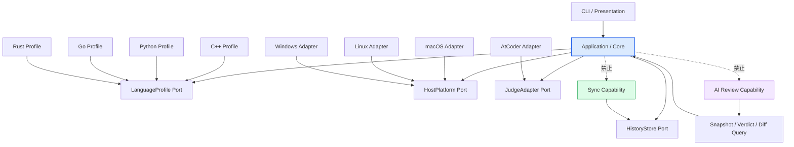

# AlgoLoom アーキテクチャ概要

## ドキュメント概要

本書は、AlgoLoom全体の技術構成、依存方向、解答言語・host OS・開発環境の境界、workspace構成、設定管理、CLI構成を定義します。

## 1. 用語

| 用語 | 本書での意味 |
|---|---|
| Core | AI review、Cloud同期、外部Viewer等の任意機能に依存しないAlgoLoomの中核機能。 |
| Judge Adapter | sample取得、提出、判定確認等のjudge固有処理をCoreから分離する接続境界。 |
| LanguageProfile | 言語ごとの拡張子、template、toolchain診断、安全なBuildPlan / RunPlanを提供する組み込み境界。 |
| HostPlatform | OS固有のprocess起動・終了、path、terminal、file操作をCoreとlanguage profileから分離する境界。 |
| optional Capability | AI reviewやCloud同期等、Coreの安定した契約を利用して後から追加でき、未導入でもCoreを変化・停止させない機能。 |
| workspace | 問題directoryを配置し、AlgoLoomが作業対象として認識する通常のdirectory。 |
| problem metadata | 正規問題ID等、問題directoryの識別に使う宣言的な情報。 |
| source snapshot | checkpointや提出の時点で保存するsource codeの不変記録。 |
| SolveAttempt | ある問題へ一度取り組む開始から終了までを表し、時間とmilestoneを関連付ける学習記録。 |
| FocusInterval | SolveAttempt内でpauseを除いて能動的に取り組んだ一つの時間区間。 |
| context | commandが処理対象とするworkspace、問題、sourceの組み合わせ。 |

## 2. システムアーキテクチャ・技術スタック

| 構成要素 | 方針 |
|---|---|
| CLIツール開発言語 | Python (Typer または Click を想定) |
| コア機能補助 | online-judge-tools (スクレイピング、入出力例の取得、提出処理の代行) |
| AIレビュー連携 | ユーザーが明示的に選択するReview Backend。初期候補のlocal Model APIはOllamaとLM Studioとし、将来はBYOKのCloud APIや、公式interfaceを持つCoding Agent Bridgeへ段階的に拡張する。AlgoLoomはProvider本体やモデルをインストール・起動しない。 |
| データベース | ローカルSQLiteを履歴の通常の読み書き先として使用する。基本構成ではPython標準`sqlite3`を使用する。 |
| データ同期・インフラ | 複数端末利用を望むユーザーだけが、Turso Cloudを介した任意の同期機能を有効化できる。Cloudは履歴表示の必須経路ではなく、端末間共有のために使用する。Google Drive等のファイル同期領域へSQLite DBファイルを置かない。 |
| 開発環境・エディタ連携 | AlgoLoom Coreは保存済みの通常fileを境界とし、Editor / IDE、plugin、専用project fileに依存しない。閲覧や差分表示で外部toolを起動する場合だけ、ユーザーが既に導入したEditor / Viewerを任意Adapter経由で一時起動する。Editor本体、plugin、ユーザー設定は変更しない。 |

### 2.1. 依存方向

Core、言語、OS、judge、任意機能の依存方向を次のように固定する。



- CoreはAI Provider、review設定、同期SDK、同期状態を知らない。
- AI reviewはCoreの不変snapshot、verdict、diffの読み取り契約へ一方向に依存できる。
- Cloud同期はCoreの論理レコードと保存契約へ一方向に依存できる。
- language profileは別の個別profileへ依存せず、HostPlatform Adapterも別OS Adapterへ依存しない。
- Editor / Viewer AdapterはCoreの安定した表示要求へ一方向に依存できるが、CoreはEditor名、plugin API、project設定形式を知らない。
- 個別実装の選択は起動時のcomposition rootまたはregistryへ閉じ込める。
- 任意機能の失敗は、Coreで確定した成功状態を変更しない。

AI reviewを将来追加する場合、submissionやsnapshotへAI固有のnullable列を加えず、安定IDを参照する追記型review revisionとして保存する。`submit --review`等の複合UXを設ける場合も、Presentation / Application orchestrationがCoreの提出結果と独立したreview結果を組み合わせ、Coreの提出ServiceからReview Backendを呼び出さない。

## 3. 解答言語・host OS・開発環境・設定管理

MVPはC++、Python、Go、Rustを正式な解答言語とし、安全なtemplate、toolchain診断、build/run計画をAlgoLoomの組み込み`LanguageProfile`として提供する。初期保証は単一sourceと標準toolchainに限定し、Cargo、Go module、CMake、外部package管理等のproject buildを暗黙に対応済みと扱わない。

製品対象OSはnative macOS、native Linux、native Windowsとする。OS固有のprocess tree終了、path、terminal、file lock等は`HostPlatform`の後ろへ置く。WSLはMVP対象外とし、Linux版またはnative Windows版の検証結果をそのままWSL対応の根拠にしない。

言語profileはOSを直接分岐せず、argv、working directory、入力source、生成artifact、timeout区分等からなる`BuildPlan` / `RunPlan`を返す。現在OSの`HostPlatform`がplanを実行し、success、compile error、runtime error、timeout、出力量超過、取消等の共通結果へ正規化する。AtCoder上の提出言語とversionへの対応付けは`JudgeAdapter`の責任とする。

Core、履歴、snapshotは、特定のcompiler/runtimeの種類とversionではなく`cpp`、`python`等のcanonical language IDを使用する。これは任意versionで同じ実行結果を保証する意味ではない。local test時に解決したtoolchainと、提出時に`JudgeAdapter`が解決したAtCoder固有の言語ID・処理系・versionを別々の観測として扱い、具体的な環境変更によって問題、SolveAttempt、snapshot、提出の論理的な関連を失わないようにする。

将来、user-level設定から拡張子、template、AlgoLoomが利用する既存compiler / runtimeのexecutableと安全なargvを変更できる構成を検討する。この設定は呼出対象と一時的な実行方法を選ぶものであり、toolchainのinstall、update、設定file、永続的な`PATH`や環境変数を変更するものではない。MVPではworkspace内の設定に任意commandの実行権限を与えない。問題directoryと一緒に移動するmetadataは、問題ID等の宣言的情報だけを持つ。設定と外部所有環境の正確な契約は[Core契約](core-contracts.md)を正とする。

Editor / IDEは第三のCore実装軸にせず、保存済みの通常source fileと宣言的metadataを共有する外部所有環境として扱う。Core互換性にEditor固有のplugin、project file、Adapterを要求しない。Remote SSHやdev container等はEditor名ではなく、AlgoLoom process、workspace filesystem、toolchainの実行配置からhost環境を判定する。外部Editor / Viewerの起動はMVP後の任意連携であり、未導入・失敗時もterminal fallbackとCore操作を維持する。

言語・OS・開発環境ごとの差異、依存規則、実行配置、検証matrixは[言語・実行環境の可搬性設計](language-and-platform-portability.md)を正とする。

## 4. ディレクトリ構成（ハイブリッド型）

コンテキストスイッチを防ぐため、`get`は既定でworkspace直下に「問題ごとのフォルダ」を1階層だけ作成する。この構成は開始時の推奨layoutであり、利用者が維持し続けなければならない実行時制約ではない。

```text
algoloom_workspace/
└── abc300_a/                 # aloom get で自動生成
    ├── <problem-metadata>    # 名称と形式は機能設計で決定
    ├── main.cpp              # 選択した1言語のprofileからだけ作成
    └── test/                 # Judge Adapterが取得した公開sample
```

4言語へ対応しても、`get`はC++、Python、Go、Rustのsourceを同時生成しない。利用者が選んだ1言語のsourceだけを作り、問題directoryを通常の単一言語projectに近い状態へ保つ。

同じ問題を別言語で解く場合、既定では問題directoryを分ける。各directoryは同じ正規問題IDへ関連付けられるため、履歴上は同一問題の異なる実装として比較できる。利用者が同じdirectoryへ複数sourceを置くことは禁止しないが、複数候補がある場合はhiddenなactive languageや先頭fileから暗黙に一つを選ばず、明示sourceを要求する。

作成後は、利用者がOS、shell、file manager、Editor / IDEの標準操作でworkspace全体や問題directoryを移動・rename・整理できることを基本契約とする。

- workspace全体を移動しても、workspace内の相対的な構成から再認識できるようにする。
- 問題directoryは、workspace内でrenameまたは下位directoryへ移動しても、directory名ではなく保存済みの正規問題IDを含むmetadataから識別する。
- 問題metadataは問題directoryと一緒に移動できる通常fileとして保存し、絶対pathを問題や履歴の恒久的な識別子にしない。
- commandは現在directoryまたは明示されたsourceから親方向へcontextを探索し、安全に一意に決まる場合だけworkspace、問題、sourceを推測する。
- sourceだけを問題context外へ移動した場合等、一意に判断できない状態では勝手に関連付けず、必要なcontextと明示指定方法を説明する。
- 複数の同一問題directoryが存在する場合は、暗黙に先頭候補を選んだりmerge・削除したりしない。

## 5. CLIコマンド構成

本節は、現時点で想定している機能と責任の整理であり、最終的なsubcommand名、引数、optionを確定するものではない。具体的なCLIは、シンプルさとユーザーの自由を優先して後の設計段階で決定する。

AlgoLoomの日常操作では、短く入力でき、製品名との関係も識別しやすい`aloom`を正式command名とする。Python package名や内部module名、保存directory名は`algoloom`を維持でき、command名と一致させる必要はない。

| 区分 | 名前 | 方針 |
|---|---|---|
| 製品名 | AlgoLoom | UI、文書、配布時の正式名称 |
| 正式command | `aloom` | README、help、利用例で優先して使用する |
| 互換command | `algoloom` | `aloom`と同じentry pointを呼び、既存scriptや明示的な正式名入力を支える |
| 任意alias | `al` | ユーザーが望む場合だけshell側で設定する。AlgoLoomから自動登録しない |

```bash
aloom get abc300_a
aloom attempt start
aloom test main.cpp
aloom submit main.cpp
```

`loom`は他のCLIと衝突しやすいため使用しない。AlgoLoomはshellの設定fileを無断で変更せず、`al`のaliasとcompletionを設定する手順だけを案内する。

反復入力を短くするaliasは、まず利用者が所有するshellのaliasまたはfunctionへ委ねる。将来AlgoLoom内のaliasを検討する場合も、canonicalなAlgoLoom commandとargv prefixへの短縮に限定し、組み込みcommandの上書き、aliasの再帰、raw shell構文、pipe・redirect、AlgoLoom外のcommand実行を許可しない。展開後のcanonical commandをhelpと診断から確認できるようにし、aliasがない環境でも同じ機能と意味を利用できる状態を維持する。

| コマンド | 引数 / オプション | 実行される処理 |
| :--- | :--- | :--- |
| **get** | [問題ID]<br>--lang [言語] | ①Judge Adapter経由で公開sampleをtest/へ取得<br>②宣言的な問題metadataを保存<br>③組み込みlanguage profileから雛形fileを作成。再実行時は編集済みsourceを上書きしない |
| **attempt** | start / pause / resume / status / finish / abandon | 利用者の明示操作で、現在の問題に対するSolveAttemptとFocusIntervalをローカル履歴へ保存する。`get`や最初の`test`だけでは暗黙に開始せず、時間計測なしでも他のCore操作を利用できる。action名は暫定案とする。 |
| **test** | [ファイル名] | 組み込みlanguage profileに基づきbuild（C++等）を行い、test/内の公開sampleとの一致をlocalで確認する。AtCoderでのACを保証する判定とは表現しない。 |
| **checkpoint** | [ファイル名] | 提出前のsource snapshotを、利用者の明示操作によってローカル履歴へ保存する。外部通信は行わない。 |
| **submit** | [ファイル名]<br>--review（MVP後） | ①問題contextとAtCoder accountを確認<br>②送信する正確なsource snapshotと提出操作をローカルSQLiteへ耐久保存<br>③Judge Adapter経由でAtCoderへ提出<br>④submission IDを保存し、判定をpolling<br>⑤中断時は状態を保持し、同じ提出の判定だけを再確認<br>⑥将来の同期とAI reviewは、Coreの提出Serviceへ組み込まず、成功状態を変更しない独立したCapabilityとして追加 |
| **log** | なし | ローカルSQLiteからSolveAttempt、active duration、milestone、checkpoint、提出操作、判定を取得し、通信を待たずにterminalへ一覧表示する。時間を利用者間rankまたは単一skill scoreとして表示しない。 |
| **show** | [問題IDまたは履歴ID] | ローカルDBから選択したsource snapshotを取得する。MVPはterminal上のplain textで表示し、外部Editor / Viewer連携はMVP後とする。 |
| **diff** | [問題IDまたは履歴ID] | ローカルDBから利用者が振り返る2つのsource snapshotを取得し、MVPはunified diffで表示する。初回提出と最新AC等を既定候補にしても、比較対象を確認・指定できるようにする。 |
| **export** | [保存先] | SolveAttempt、FocusInterval、milestone、checkpoint、提出、判定、source snapshotを、credentialを含まないversion付き形式で持ち出す。 |

一般的なfile・directory操作はこのcommand体系へ含めない。例えば問題directoryの移動には、macOS / Linuxの`mv`、PowerShellの`Move-Item`、各OSのfile manager、Editor / IDEのfile操作等をそのまま利用できるようにする。
