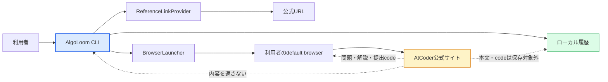
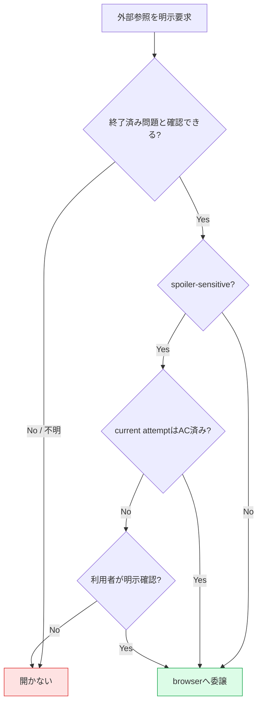

# AlgoLoom 外部学習資料参照設計

> 対象: AtCoder公式問題ページ、問題別解説ページ、他ユーザーの提出codeへの外部参照導線
>
> 状態: 公式問題・解説ページへの参照はMVP設計、他ユーザーの提出一覧はMVP後の近接拡張
>
> 作成日: 2026年7月20日
>
> 関連文書:
> - [製品ビジョン](../product/vision.md)
> - [MVPスコープ](../product/mvp.md)
> - [Core契約](../architecture/core-contracts.md)
> - [問題選択・カタログ設計](problem-selection-and-catalog.md)
> - [解き直しworkflow設計](revisit-workflow.md)
> - [ストレスフリーUX設計](../quality/stress-free-ux-design.md)
> - [配布方針ガイド](../operations/algoloom-distribution.md)
>
> 重要: 本書は法的助言ではない。規約、個別contest rule、ページ構造は変更され得るため、実装時と公開前に公式資料を再確認する。

---

## ドキュメント概要

本書は、AlgoLoomからAtCoder上の問題、解説、他ユーザーの提出codeを学習資料として参照する際のUX、著作権上の境界、保存禁止範囲、browser委譲、障害分離、段階的な実装方針を定義します。

## 0. 結論

AlgoLoomは、外部学習資料の**所在を示して公式ページをbrowserで開く**が、解説本文や他ユーザーのcodeを取得、保存、再表示しない。

| 資料 | 製品上の扱い | 導入段階 |
|---|---|---|
| AtCoder公式問題ページ | `get`後または明示操作で公式ページをbrowser表示する | MVP |
| AtCoder問題別解説ページ | 明示操作でAtCoderの解説一覧をbrowser表示する。公式・ユーザー解説の区別は公式ページ上の表示を正とする | MVP |
| 他ユーザーの提出code | 問題・AC・現在言語等で絞り込んだAtCoder提出一覧をbrowser表示する | MVP後のPhase 2候補 |
| 解説本文・画像・動画・PDF・sample code | AlgoLoomへ取得、保存、preview、exportしない | 対象外 |
| 他ユーザーのcode本文 | AlgoLoomへ取得、保存、preview、diff、clipboard転送、実行、提出しない | 対象外 |

AtCoder利用規約では、投稿されたプログラムの所有権と著作権は作成ユーザーに帰属し、サービスを構成する文章、画像、プログラム等の権利はAtCoderまたは権利を持つ第三者に帰属するとされている。一方、AtCoderの公式入門資料は、contest終了後の復習として解説や他ユーザーの提出codeを見ることを案内している。AlgoLoomは、この学習行動を公式サイトへの導線として支援し、第三者コンテンツを自ら提供するapplicationにはしない。

---

## 1. 目的と非目標

### 1.1. 目的

- 現在の問題contextから、問題、解説、提出一覧を探し直す入力を減らす。
- 他者の解法を順位や優劣ではなく、algorithm、表現、trade-offを学ぶ資料として扱う。
- 著作権、認証、ページ表示の責任をAtCoder公式サイトとbrowserへ残す。
- 外部資料が利用不能でも、test、checkpoint、submit、履歴参照を継続できるようにする。
- 問題発見用の`browse`と、現在の問題に関する資料を開く操作を区別する。

### 1.2. 非目標

- AtCoderの解説viewerまたは提出code viewerをterminal内へ再実装すること
- 解説、画像、動画、PDF、他ユーザーのcodeをDB、cache、temp、log、telemetry、export、Cloud同期へ保存すること
- 他ユーザーのAC codeを「模範解答」「最良実装」と評価すること
- 他ユーザーのcodeを自動取得して利用者のcodeとdiffすること
- 他ユーザーのcodeを実行、修正、提出、AI reviewすること
- AtCoderのlogin、Cookie、browser profileをAlgoLoomが管理すること
- 開催中contest、参加中のvirtual contest、ADT等で答えを参照するための機能を提供すること

---

## 2. 用語

| 用語 | 本書での意味 |
|---|---|
| 外部学習資料 | AtCoderまたは外部権利者が提供する問題、解説、提出code等、AlgoLoomが内容の権威・所有者にならない資料 |
| 外部参照 | 内容をAlgoLoomへ取り込まず、公式URLを利用者のbrowserで開く操作 |
| browser委譲 | AlgoLoomがURLと起動要求だけをOSの標準browserへ渡し、認証、取得、rendering、downloadをbrowserへ任せること |
| spoiler-sensitive | 未ACまたは解答途中の利用者に、解法や完成codeを明らかにし得る資料 |
| reference kind | `problem`、`editorial`、`submissions`等、開く資料の論理種別 |
| browser起動成功 | OSへURLを開く要求を渡せた状態。ページ取得、login、表示完了を保証する意味ではない |

---

## 3. 責任境界

### 3.1. 内容を通さない経路



AlgoLoomは、URLを構成するために既存の正規問題ID、contest ID、言語等を利用できる。ただし、外部資料の本文を取得してURLや表示内容を決めない。ページ構造の解析が必要な設計は採用しない。

### 3.2. 境界ごとの責任

| 境界 | 担当すること | 担当しないこと |
|---|---|---|
| Core / Application | 問題context解決、明示操作、spoiler確認、結果分類 | HTML取得、browser login、code解析 |
| `ReferenceLinkProvider` | judge固有の問題・解説・提出一覧URLを構成する | HTTP取得、ページ内容の正しさの断定 |
| `BrowserLauncher` | OSへURLを開く要求を渡し、起動可否を返す | ページload完了、login成功、表示内容の取得 |
| browser | AtCoderとの通信、Cookie、login、rendering、download | AlgoLoom履歴の更新 |
| AtCoder | 問題、解説、提出code、権利表示、アクセス制御の正本 | AlgoLoomのlocal履歴 |

AtCoder固有URLをCLI commandへ散在させず、`ReferenceLinkProvider`相当のAdapterへ閉じ込める。URL形式が変わった場合も、SolveAttempt、snapshot、提出、履歴Schemaを変更しない。

---

## 4. 資料別のUX

### 4.1. 公式問題ページ

`get`成功後は、作成または再利用したworkspaceを主結果として返し、その補助動作として公式問題ページを開ける。browser起動失敗はworkspace作成失敗にしない。

明示操作の概念例:

```bash
aloom open problem
```

### 4.2. AtCoder解説ページ

問題別解説ページを開く概念操作をMVPへ含める。

```bash
aloom open editorial
```

AtCoderの問題別解説ページには公式解説、解説放送、ユーザー解説等が併記される場合がある。そのため、AlgoLoomの表示は「公式解説を取得しました」ではなく、**「AtCoderの解説ページを開きます」**とする。どの項目が公式か、解説が存在するかはAtCoder上の表示を正とする。

| 状態 | 動作 |
|---|---|
| 終了済み問題・明示操作 | 解説ページをbrowserで開く |
| 未ACのcurrent SolveAttempt | spoilerを含み得ることを確認する。非interactive実行では明示optionがなければ開かない |
| contest開催中または終了確認不能 | 開かず、確認できない理由を示す |
| 解説未掲載・古いPDF形式 | AtCoderの問題別またはcontest解説ページを開き、以降のfallbackは公式ページへ任せる |
| browser起動失敗 | URLとOS側の確認方法を示し、Core履歴を変更しない |

### 4.3. 他ユーザーの提出code

MVP後のPhase 2では、AtCoderの提出一覧を問題単位で開く近接拡張を検討する。

```bash
aloom open submissions --verdict AC --language current
```

名称とoptionは暫定案である。`solutions`ではなく`submissions`と表現し、ACが模範性、可読性、計算量上の最適性を保証するかのように見せない。

| 観点 | 方針 |
|---|---|
| 既定filter | current problem、AC。可能ならcurrent canonical languageをAtCoderのfilterへ解決する |
| 認証 | browserが所有するAtCoder sessionを使う。AlgoLoomはCookieを取得しない |
| 未AC | spoiler確認を必須とし、非interactiveでは`--reveal`相当の明示指定がなければ開かない |
| AC済み | 明示commandだけで開く。提出後に自動表示しない |
| code選択 | AtCoderの一覧UIへ任せ、AlgoLoomがrandom、最短、最速等を選ばない |
| 保存 | 他ユーザーのcode本文・author・submission ID・個別提出URLを履歴へ保存しない |
| 利用 | AlgoLoom内でcopy、diff、実行、提出しない |

### 4.4. 問題発見との区別

`aloom browse`はAtCoder Problems等で**問題を探す**導線である。`open`相当の操作は、解決済みのcurrent problem contextから**関連資料を開く**導線である。同じcommand名へ異なる意味を混在させない。

---

## 5. spoilerとcontest rule

外部参照は、ネットワーク送信ではなくても学習状態へ不可逆な影響を与え得る。毎回の確認疲れを避けながら、答えを意図せず開かない契約を設ける。



- `get`、test失敗、WA、timeoutを契機に解説または提出一覧を自動表示しない。
- contest中、virtual contest中、ADT参加中等の利用者文脈をAlgoLoomが完全に推測できるとはみなさない。
- MVPの正式対象を終了済み過去問の個人学習に限定し、参加中contestで外部参照を使わない旨をhelpへ明記する。
- 既知の開催中contestとの一致または終了状態の判定不能時はfail closedとする。
- 過去問がADT等で再利用されている可能性を完全に検出できない段階では、その限界と個別contest ruleの確認責任を初回利用時に説明する。

---

## 6. 保存とprivacy

### 6.1. 保存してよいもの

| データ | 保存 | 理由 |
|---|---|---|
| 正規問題ID・contest ID | Yes | 既存の問題context |
| reference kind | 将来opt-in | 利用者自身の学習文脈として有用な可能性がある |
| `opened_at` | 将来opt-in | 「読んだ」ではなく「起動要求を行った」時点としてのみ扱う |
| 生成可能な公式URL | 原則No | 問題IDから再構成でき、恒久IDにする必要がない |

### 6.2. 保存しないもの

- 解説本文、title、画像、PDF、動画、sample code、要約
- 他ユーザーのcode、code hash、author、submission ID、個別提出URL
- browserのCookie、履歴、profile、download、login状態
- ページHTML、response header、screenshot
- clipboard内容

MVPでは外部資料を開いたevent自体を学習履歴へ自動保存しない。将来、hint・解説利用等をSolveAttemptの任意文脈として記録する場合はopt-inとし、利用有無を善悪、rank、skill scoreへ変換しない。browser起動要求の成功を、資料を実際に閲覧または理解した事実として記録しない。

---

## 7. 成功、部分失敗、error

| 状態 | 表示と履歴 |
|---|---|
| URL構成成功・browser起動要求成功 | 開いた資料種別を短く示す。ページload完了とは表示しない |
| URL構成成功・browser起動失敗 | 公式URLと次の手動操作を示す。Coreの成功状態を変えない |
| 問題context不明 | 候補を勝手に選ばず、問題またはsourceの明示方法を示す |
| URL形式未対応 | Adapter未対応として局所errorにし、test・履歴を止めない |
| AtCoder側でlogin要求・404・未掲載 | browser側の結果とし、AlgoLoomが成功を推測しない |
| contest状態不明 | spoiler-sensitiveな資料は開かず、確認不能を示す |

---

## 8. 段階的な実装

### Phase 1: MVPの公式ページ参照

- `ReferenceLinkProvider`と`BrowserLauncher`の最小契約を定義する。
- 問題ページと問題別解説ページのURLを構成する。
- `get`のbrowser補助動作と、明示的な`open problem / editorial`相当を共通化する。
- browser起動失敗をworkspace作成、test、履歴の失敗から分離する。
- 外部本文を取得していないことをnetwork testと依存関係testで確認する。

### Phase 2: 他ユーザーの提出一覧

- AtCoderへ具体的なURL生成・browser委譲設計を説明し、公開前確認へ含める。
- current problem、AC、current languageのfilter mappingを検証する。
- 未AC時のspoiler確認とnon-interactive契約を検証する。
- loginをbrowserへ完全に委譲し、CookieをAlgoLoomが読まないことを確認する。
- URL変更時のfallbackを、contest提出一覧または公式問題ページへの遷移として設計する。

### Phase 3以降: 任意の学習文脈

- 解説等を開いたeventの記録に実需があるか利用者検証する。
- 採用する場合も、外部本文と他ユーザーのauthor・submission IDを保存しない最小Schemaとopt-inを維持する。
- [解き直しworkflow](revisit-workflow.md)で、参照前後のSolveAttemptを本人が任意に振り返れるようにする。

---

## 9. 実装チェックリスト

### 外部コンテンツ

- [ ] 解説本文や他ユーザーのcodeをAlgoLoom processへ取得していない。
- [ ] DB、cache、temp、log、telemetry、export、Cloud同期へ外部本文を保存していない。
- [ ] 他ユーザーのcodeをclipboardへ自動転送していない。
- [ ] AC提出を模範解答または最良実装と表示していない。

### Browserと認証

- [ ] URL構成とbrowser起動を別の境界としている。
- [ ] browser Cookie、profile、login情報を読取・複製していない。
- [ ] browser起動成功とページ表示成功を混同していない。
- [ ] browser起動失敗がCore履歴を変更していない。

### UXと安全

- [ ] すべての外部参照が利用者の明示操作から始まる。
- [ ] 未AC時のspoiler確認とnon-interactive時の明示optionがある。
- [ ] contest終了を確認できない場合にspoiler-sensitiveな資料を開いていない。
- [ ] `browse`による問題発見と`open`による関連資料参照を区別している。
- [ ] 提出後、WA後、test失敗後に解説やcodeを自動表示していない。

### 回帰

- [ ] URL形式の変更がSolveAttempt、snapshot、提出、履歴Schemaへ波及しない。
- [ ] `ReferenceLinkProvider`またはbrowserが利用不能でもtest、submit、履歴参照が成立する。
- [ ] AtCoder以外のjudgeを追加しても、外部参照を未対応として局所化できる。

---

## 10. 公式資料

- [AtCoder利用規約](https://atcoder.jp/tos?lang=ja)
- [AtCoderのコンテスト中のルール](https://info.atcoder.jp/overview/contest/rules)
- [AtCoder Daily Training](https://atcoder.jp/contests/adt_top?lang=ja)
- [AtCoder公式入門資料](https://img.atcoder.jp/file/introduction_atcoder.pdf)
- [AtCoder問題別解説ページの例](https://atcoder.jp/contests/abc416/tasks/abc416_a/editorial)

---

## 11. 最終方針

外部資料はAlgoLoomの学習体験を補うが、AlgoLoomが所有する学習履歴ではない。Coreは利用者自身のsource、SolveAttempt、snapshot、提出を扱い、AtCoderの問題、解説、他ユーザーの提出codeは公式サイトを権威とする。

```text
自分のcodeを保存・比較する       → AlgoLoom Core
問題や解説を読む                 → AtCoder公式ページをbrowserで開く
他ユーザーのAC提出を参考にする   → MVP後にAtCoder提出一覧をbrowserで開く
外部本文を取得・再表示・再配布する → 行わない
```

この境界により、AlgoLoomは他者のコンテンツを集約するserviceではなく、利用者が自分の学習履歴を中心に、必要な外部資料へ安全に移動できるlocal-first CLIであり続ける。
