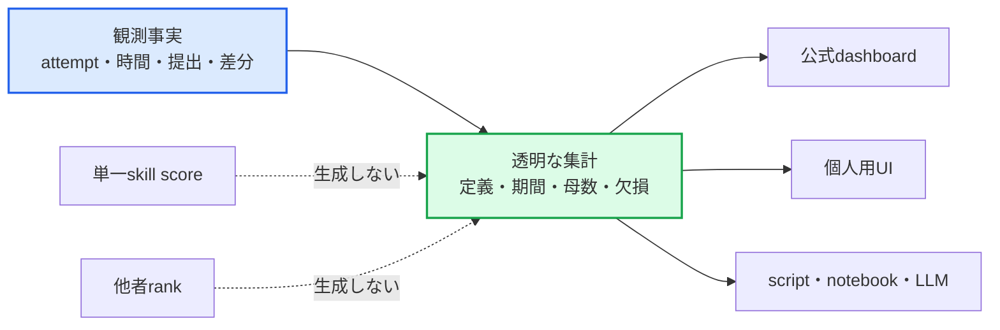
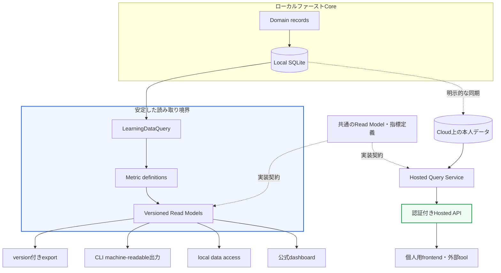

# AlgoLoom 学習データアクセス・可視化API将来設計

> 対象: AlgoLoomに蓄積した本人の学習履歴を、CLI、個人用UI、公式dashboard、外部toolから安全に参照するためのデータアクセス基盤
>
> 状態: 長期構想・MVP対象外
>
> 作成日: 2026年7月20日
>
> 関連文書:
> - [製品ビジョン](../product/vision.md)
> - [MVPスコープ](../product/mvp.md)
> - [ロードマップ](../product/roadmap.md)
> - [アーキテクチャ概要](../architecture/overview.md)
> - [Core契約](../architecture/core-contracts.md)
> - [ローカル利用とCloud同期の段階的設計](local-and-cloud-sync-design.md)
> - [セキュリティ設計ガイド](../quality/security-design.md)
> - [未決事項一覧](../project/unresolved-decisions.md)

---

## ドキュメント概要

本書は、AlgoLoomが将来提供を検討する学習データアクセス基盤について、製品上の位置付け、dashboardとの関係、段階的な公開方法、指標の意味、privacy・security・無料提供の境界を定義します。

本書の「API」は、AI reviewで利用するModel APIやAtCoder連携ではなく、**利用者本人の学習データを読み取るためのinterface**を指します。具体的なendpoint、protocol、認証製品、料金上限は未決であり、本書は実装や公開を確約するものではありません。

## 0. 結論

AlgoLoomは、長期的に「公式dashboardだけが履歴を表示できるapplication」ではなく、**利用者が自分の学習データを、自分に合ったUI、script、LLM、分析toolから利用できる学習データ基盤**を目指す。

ただし、提供するものを「コーディング能力を断定するAPI」とは位置付けない。AlgoLoomが提供するのは、本人のSolveAttempt、時間、milestone、提出、判定、snapshot等の観測事実と、定義・対象範囲・欠損を説明できる自己振り返り指標である。

```text
提供するもの:
    本人の学習履歴
    根拠を追跡できる集計
    条件と欠損を伴う複数の振り返り指標

提供しないもの:
    人間の能力を断定する単一score
    他者との順位
    採用・選抜に使う公開評価
```

実装順序は「dashboardを作った後に、その内部処理を外部公開する」と固定しない。先に安定したQuery・Analytics契約を設け、CLIのmachine-readable出力、個人用UI、公式dashboard、将来のHosted APIを、その同じ契約の利用者として扱う。

ローカルのexport、machine-readable出力、将来のlocal data accessは、Cloud accountなしで無料利用できる方針とする。Hosted APIも本人が自分のデータを参照する基本機能は無料提供を目指すが、継続運用のためrate limit、pagination、response size、fair-use等の上限を設けられる。無料と無制限または無期限のSLAを同一視しない。

---

## 1. 目的と対象外

### 1.1. 目的

- 利用者が、自分の学習履歴をAlgoLoom公式UI以外からも利用できるようにする。
- LLM等を用いて作成した個人用frontend、local script、notebook、Editor連携等へ、安定したデータ契約を提供する。
- 公式dashboardと外部clientが、同じ指標定義と読み取り規則を共有できるようにする。
- DB tableや保存方式を外部契約にせず、SQLite、同期方式、managed serviceの変更からclientを分離する。
- 自己比較中心、ローカルファースト、データ持ち出し可能というAlgoLoomの原則を、将来のUIにも維持する。
- 利用者が特定のfrontend、Cloud、LLMへ囲い込まれないようにする。

### 1.2. 対象外

- 利用者間leaderboard、他者平均との差、公開skill score
- 時間、提出回数、継続日数等を合成した単一の能力score
- 採用、査定、試験、不正検知等のために本人を自動評価するAPI
- API経由のAtCoder提出、code実行、AI review実行、履歴変更
- SQLiteへの任意SQL実行、table・columnの直接公開
- AtCoderの解説本文、画像、動画、他ユーザーのcode・author・submission IDの再配布
- AtCoder Cookie、Turso token、Provider credential、絶対path等の端末固有・秘密情報の返却
- Hosted APIをMVPまたはCloud同期Betaの必須条件にすること

---

## 2. 用語

| 用語 | 本書での意味 |
|---|---|
| 学習データアクセス基盤 | 本人の学習履歴を、保存方式に依存しない安定した読み取り契約で提供する機能群。 |
| 観測事実 | SolveAttempt、FocusInterval、milestone、submission、verdict等、AlgoLoomまたは外部judgeから得た記録。 |
| 派生指標 | 複数の観測事実を、明示した定義に基づいて集計・比較した値。 |
| Read Model | clientの用途に合わせて構成した読み取り専用のデータ表現。DB Schemaそのものとは分離する。 |
| Query・Analytics契約 | 観測事実と派生指標の意味、filter、欠損、versionを共通化する内部境界。 |
| machine-readable出力 | 人向けterminal表示をparseさせず、JSON等のversion付き形式で返すCLI出力。 |
| local data access | 利用者の端末内にある履歴を、Cloudへ送信せずに参照するinterface。CLI出力、library、localhost API等を含む候補。 |
| Hosted API | AlgoLoomまたは関連serviceが運用し、認証済みclientへnetwork経由で本人の同期済みデータを返す将来候補。 |
| 公式dashboard | AlgoLoomが提供する標準の可視化UI。データ契約の唯一の利用者または唯一の正しい表示とはしない。 |
| coverage | 指標の対象となり得る記録のうち、実際に必要な値が揃っている割合または件数。 |

---

## 3. 製品原則

### 3.1. データの所有と表示方法の自由

AlgoLoomが記録した自分のsource、試行、提出、時間、振り返りは、利用者自身の学習資産として扱う。利用者はversion付きexportで持ち出せるだけでなく、将来は安定した読み取りinterfaceを通じて、好みの表示方法を選べるようにする。

EditorをAlgoLoomが固定しないのと同様に、学習データのfrontendもAlgoLoomが一つに固定しない。ただし自由な表示を可能にすることと、保存DBの内部構造を無期限に公開契約とすることは分ける。

### 3.2. 観測と解釈を分ける

時間や提出回数は、問題、言語、toolchain、hint、解説、AI利用、中断等の条件を含む観測であり、利用者の能力そのものではない。



外部clientが独自の可視化やscoreを作ることまでは禁止しない。ただし、その値をAlgoLoom公式指標と誤認させないため、公式の観測field・派生指標・第三者生成値を識別できるmetadataと名称を提供する。

### 3.3. ローカルファーストを維持する

- APIを使わない利用者のCore導線を変更しない。
- Cloud同期またはHosted APIを、`test`、`submit`、`log`、`show`、`diff`の必須経路にしない。
- ローカルで回答できるqueryは、無関係なCloud通信を待たない。
- Hosted API障害を、ローカル履歴の欠損またはCore操作の失敗として扱わない。
- Hosted APIがなくても、exportとmachine-readable出力によってデータを利用できる状態を先に成立させる。

### 3.4. 公式dashboardはreference clientとする

公式dashboardには、設定不要の標準UI、指標の説明、accessibility、API契約の実利用検証という役割がある。外部frontendが作りやすくなっても、この役割は失われない。

一方、公式dashboardだけがDBへ直接接続する特別な経路を持たない。可能な範囲で外部clientと同じRead Model・指標定義を利用し、非公開の内部SQL結果と公開APIの意味が乖離しないようにする。

---

## 4. 論理アーキテクチャ

### 4.1. 共通Query契約



`LearningDataQuery`は、Application / Domainの安定したqueryと`HistoryStore`を利用する。clientはSQLite table、Turso固有Schema、内部join、filesystem pathを知らない。

Hosted Query Serviceは、本人が明示的に同期したデータだけを対象とする。BYOC DBへbrowserからDB tokenで直接接続させる方式を、公式のHosted APIとは扱わない。Web clientへTurso tokenや管理credentialを配布せず、認証・認可とuser ownershipを検証するbackendを介する。

### 4.2. 書き込みとの分離

初期の学習データアクセスはread-onlyとする。

| 操作 | 初期APIでの扱い | 理由 |
|---|---|---|
| 履歴・集計の参照 | 対象 | 中心価値であり、外部作用を伴わない |
| source snapshotの参照 | 独立した明示scopeの候補 | code漏えい時の影響が集計情報より大きい |
| export生成 | localでは対象候補 | 本人による持ち出しを支援する |
| 履歴の作成・修正・削除 | 初期対象外 | 同期競合、監査、誤操作回復の契約が必要 |
| `test`・code実行 | 対象外 | 未信頼code実行serviceへ責任が拡大する |
| AtCoder提出 | 対象外 | account確認、重複送信、外部作用の安全契約が必要 |
| AI review実行 | 対象外 | contest rule、送信同意、費用、Provider権限が必要 |

将来mutation APIを検討する場合も、read-only APIのscopeや障害境界へ暗黙に追加せず、独立した採用判断と脅威モデルを必要とする。

---

## 5. 提供するデータと指標

### 5.1. 観測事実

| 領域 | 主なデータ | 注意 |
|---|---|---|
| 問題 | 正規問題ID、judge、利用可能な宣言的metadata | 外部本文や解説内容を含めない |
| 試行 | SolveAttempt、状態、開始・終了時刻 | 解き直しを別attemptとして保つ |
| 学習時間 | FocusInterval、active duration、算出状態 | wall elapsed、process duration、judge timeと区別する |
| milestone | 最初のsample通過、初回提出、初ACと到達時active duration | 後から試行全体が延びても到達時値を上書きしない |
| 実装 | checkpoint、submission snapshot、code hash、差分対象ID | source本文は機微度の高い別scopeとする |
| 提出 | submission、verdict、judge execution time・memory | 欠損を`0`で補わず、取得元と時刻を伴う |
| 分類 | 将来の問題タグ、SolveAttempt解法タグと出典 | user、external curated、AI suggestionを区別する |
| 利用文脈 | 将来のhint・解説・AI利用に関するopt-in記録 | 利用有無を善悪または自立度scoreに変換しない |

### 5.2. 派生指標

派生指標は、単一の能力評価ではなく、異なる観点を別々に振り返るために提供する。

| 観点 | 指標例 | 必ず伴う文脈 |
|---|---|---|
| 正確さ | 初ACまでの提出回数、verdict構成、同種errorの再観測 | 対象問題、期間、母数、未AC attempt |
| 時間 | sample通過・初回提出・初ACまでのactive duration分布 | 計測済み件数、pause、欠損、言語等のfilter |
| 定着 | 同一問題の再挑戦間隔、再挑戦時のmilestone変化 | attemptの対応、fresh / snapshot開始等の条件 |
| 実装の変化 | checkpoint・提出間の差分、解法タグの変化 | 比較対象snapshot、言語、差分の定義 |
| 学習範囲 | 問題・解法タグ別のattempt件数と最終実施時期 | tag出典、spoiler制御、未分類件数 |
| 継続 | 期間ごとのactive attempt・完了attempt件数 | timezone、期間境界、未計測利用を含まないこと |

速さだけ、AC数だけ、連続利用日数だけを「成長」と表示しない。問題難度や外部ratingを利用する場合も、出典、取得時点、欠損、変更可能性を示し、AlgoLoomが観測した本人の記録と混同しない。

### 5.3. 指標responseの説明可能性

派生指標は、少なくとも次の情報を返せる形にする。

```json
{
  "metric_id": "first_ac_active_duration",
  "definition_version": "1",
  "value": 2640,
  "unit": "seconds",
  "sample_size": 12,
  "coverage": {
    "eligible": 18,
    "included": 12,
    "missing": 6
  },
  "filters": {
    "language": "python",
    "period_start": "2026-01-01T00:00:00Z",
    "period_end": "2026-06-30T23:59:59Z"
  }
}
```

このJSONは概念例であり、field名や形式を確定するものではない。重要なのは、値だけを返さず、定義version、単位、母数、coverage、filterを追跡できることである。

---

## 6. データ契約と互換性

### 6.1. versionの分離

| version | 対象 | 変更例 |
|---|---|---|
| DB Schema version | 内部保存形式 | table分割、index、migration |
| export format version | 持ち出しfile | manifest、record表現、archive構造 |
| Read Model / API version | clientとの契約 | field名、型、必須性、endpoint意味 |
| metric definition version | 集計の意味 | 対象record、欠損処理、算出式 |

これらを一つのversionへまとめない。DB migrationだけでAPI versionを変更せず、指標の算出定義を変更した場合に過去と同じ名前で意味を黙って変えない。

### 6.2. 基本契約

- 人向けCLI出力を外部clientにparseさせない。
- responseへ契約version、生成時刻、data freshnessまたは最終同期状態を含める。
- 日時はUTCの明確な形式で返し、日単位集計では適用timezoneを示す。
- 欠損、不明、未対応を`0`、空文字、推測値へ変換しない。
- listはpaginationと安定した並び順を持ち、過大responseを一括返却しない。
- additive changeとbreaking changeの規則、deprecation、support期間を公開前に定義する。
- OpenAPI等の機械可読なinterface記述と、人間向けの指標説明を併せて提供する。
- 公式dashboardも契約testの対象とし、非公開fieldへ無断で依存させない。

---

## 7. Privacy、認証、Security

### 7.1. データ分類とscope

| 分類 | 例 | 既定の扱い |
|---|---|---|
| 集計 | 期間別attempt件数、判定構成、時間分布 | 本人の基本read scope候補 |
| 履歴metadata | 問題ID、言語、時刻、verdict、milestone | 本人の基本read scope候補 |
| source・review本文 | snapshot、checkpoint、AI review本文 | 独立した機微scope。既定で外部clientへ許可しない |
| 端末固有情報 | workspace path、executable path、Editor設定 | API対象外 |
| secret | Cookie、token、password、環境変数 | API対象外 |
| 外部所有本文 | AtCoder解説、他ユーザーのcode | API対象外 |

scope名、認可画面、token形式は未決とする。ただし、「学習集計を読む権限」と「source code本文を読む権限」を同じ包括権限へ暗黙にまとめない。

### 7.2. local data access

- local interfaceは既定でloopbackまたは同一process内に限定する。
- localhost APIを採用する場合も、他hostからlistenせず、DNS rebinding、CSRF、無関係なWeb pageからの読取を考慮する。
- 長時間動作するdaemonをCoreの必須要件にしない。
- local DB fileを直接開く方法を公式APIとして推奨しない。
- source本文を返す場合は明示option、短命token、client確認等の必要性を検討する。

### 7.3. Hosted API

- 認証済み主体と、すべてのrecordのuser ownershipをqueryごとに検証する。
- browserへDB token、Turso Platform API token、管理credentialを配布しない。
- source scopeは最小権限、明示同意、失効可能な認可として設計する。
- request size、pagination、rate limit、同時実行数、timeout、response sizeを制限する。
- CORS、OAuth等の認証方式、session、token保管は、個人作成frontendからの利用を前提に脅威モデルを作成して決める。
- source、履歴、tokenを通常のaccess log、error log、analyticsへ記録しない。
- API利用状況のtelemetryは、目的、収集field、保持期間、無効化または同意を別途定義する。
- account停止、token失効、全端末logout、data export、Cloud削除の回復導線を持つ。

---

## 8. 無料提供と運用境界

本人が自分の学習データを利用する基本経路は無料とすることを目標にする。ただし、実行場所により運用責任が異なる。

| 提供形態 | 無料方針 | 運用上の境界 |
|---|---|---|
| export | Coreの無料機能 | 利用者が保存先と実行頻度を選ぶ |
| machine-readable CLI | 無料 | local resourceだけを使用する範囲 |
| local data access | 無料 | Cloud accountやHosted APIを要求しない |
| Hosted APIの本人read | 無料提供を目標 | rate limit、pagination、response size、fair-useを適用できる |
| 大量取得・高頻度集計 | 基本readと分離して判断 | cache、非同期export、利用上限等を検討する |
| AI生成・重い分析処理 | データreadとは別Capability | Provider費用、計算資源、同意を別途扱う |

「無料」は、無制限request、無制限保存、永続的な無変更、可用性SLAを意味しない。Hosted APIの公開前に、運用費、abuse対策、上限変更の通知、service終了時のexport経路を定義する。

---

## 9. 段階的な導入

| 段階 | 提供するもの | 次へ進む条件 |
|---|---|---|
| Phase A: MVP export | credentialを含まないversion付きの完全な学習履歴export | Coreの履歴・関連付け・migration・export契約が安定する |
| Phase B: machine-readable CLI | `log`、`show`、分析query等のversion付き構造化出力 | 人向け表示と分離した契約test、欠損・exit status・pagination方針を定義する |
| Phase C: 共通Query・Analytics | 公式dashboardと外部clientが共有できるRead Model・指標定義 | 指標の意味、母数、coverage、versionを説明できる |
| Phase D: local data access | libraryまたはread-only localhost API | accountなし、offline、最小権限、daemon非必須で安全に利用できる |
| Phase E: 公式dashboard | 共通契約を利用する標準可視化UI | accessibility、XSS対策、自己比較原則、指標説明を検証する |
| Phase F: Hosted API | 認証付きで本人の同期済みデータを提供 | Cloud・managed service、ownership、認証、privacy、運用費、rate limitを検証する |

Phase C以降は厳密な直列実装を意味しない。共通Query契約を先に定義した後、local data accessと公式dashboardは実需に応じて前後または並行できる。Hosted APIだけは、Cloud上のデータ権威、認証、managed serviceの運用責任が成立した後に公開する。

---

## 10. 正式採用の判断条件

次を満たすまでは、Hosted APIを正式な製品範囲へ昇格させない。

- [ ] exportとmachine-readable出力への実需があり、外部clientの代表的な利用例を確認できている。
- [ ] Coreの履歴ID、snapshot、SolveAttempt、milestone、verdictの意味が安定している。
- [ ] DB Schemaを公開せずに必要なqueryを表現できる。
- [ ] 観測事実、派生指標、第三者生成値を区別できる。
- [ ] 各公式指標について定義、単位、母数、coverage、欠損、versionを説明できる。
- [ ] 単一skill scoreや他者rankを導入せず、自己比較中心の価値を利用者検証で確認できる。
- [ ] local-only利用者のCore導線、privacy、性能を弱めない。
- [ ] source本文を別scopeとして保護し、secret・path・外部所有本文を返さない。
- [ ] 認証、ownership、失効、rate limit、監査、incident対応を検証できる。
- [ ] 無料提供の運用費とfair-use上限を継続可能な形で説明できる。
- [ ] 公式dashboardが同じ契約をreference clientとして利用できる。
- [ ] serviceを終了または変更する場合も、利用者がversion付きexportでデータを回収できる。

---

## 11. 現時点で確定しないこと

- local data accessをlibrary、subprocess protocol、localhost HTTP APIのどれで提供するか
- REST、GraphQL等のHosted API形式と具体的なendpoint
- OpenAPI version、SDK生成、client libraryの対応言語
- 認証方式、OAuth flow、scope名、token lifetime、CORS policy
- API versionのsupport期間とdeprecation通知期間
- source・review本文への既定scopeと認可画面
- 指標ごとの最小母数、統計手法、外れ値、timezoneの既定
- 無料Hosted APIのrequest、保存量、帯域、集計costの具体的上限
- 公式dashboardをlocal、static、hostedのどの形で提供するか
- AlgoLoom CloudとHosted APIを同時提供するか、別serviceとして判断するか
- 第三者clientの登録、名称表示、利用規約、abuse対応

これらは、MVPのCore Schemaへ先回りしたfieldや抽象化を追加する理由にしない。まずMVPのexportと履歴契約を完成させ、実際の外部利用例から必要なRead Modelを確定する。

---

## 12. 参考資料

- [OpenAPI Specification](https://spec.openapis.org/oas/)
- [GitHub REST API versions](https://docs.github.com/en/rest/about-the-rest-api/api-versions)
- [GitHub REST API rate limits](https://docs.github.com/en/rest/using-the-rest-api/rate-limits-for-the-rest-api)
- [OAuth 2.0 Security Best Current Practice (RFC 9700)](https://datatracker.ietf.org/doc/html/rfc9700)

