# AlgoLoom ローカル利用とCloud同期の段階的設計

> 対象: AlgoLoomをローカルだけで利用する構成と、複数端末同期を追加する構成の関係、導入UX、保存・同期状態、パッケージ配布
>
> 状態: 設計方針
>
> 作成日: 2026年7月16日
> 更新日: 2026年7月20日
>
> 関連文書:
> - [製品ビジョン](../product/vision.md)
> - [MVPスコープ](../product/mvp.md)
> - [Core契約](../architecture/core-contracts.md)
> - [AlgoLoom配布方針ガイド](../operations/algoloom-distribution.md)
> - [AlgoLoom Turso設計ガイド](../integrations/turso-design-guide.md)
> - [AlgoLoom Turso移行互換性設計](../integrations/turso-migration-compatibility-design.md)
> - [AlgoLoom LLM Provider選択・実行基盤設計](llm-provider-design.md)
>
> 注意: TursoのSDK、同期方式、対応OS、料金、制約は変更される可能性がある。実装開始時とリリース前に公式資料と配布wheelを再確認すること。

---

## ドキュメント概要

本書は、ローカル利用を基盤としてCloud同期を追加する構成、データの権威と保存・同期状態、導入・障害時のUX、依存関係と段階的な採用方針を定義します。

## 0. 結論

AlgoLoomでは、ローカル利用と同期利用を別々の製品や独立したシステムとして設計しない。

**同期利用は、ローカル利用を土台としてCloud同期機能を追加した上位構成である。**

```text
ローカル利用 = AlgoLoom Core + ローカルDB

同期利用       = AlgoLoom Core + ローカルDB + Cloud同期機能
```

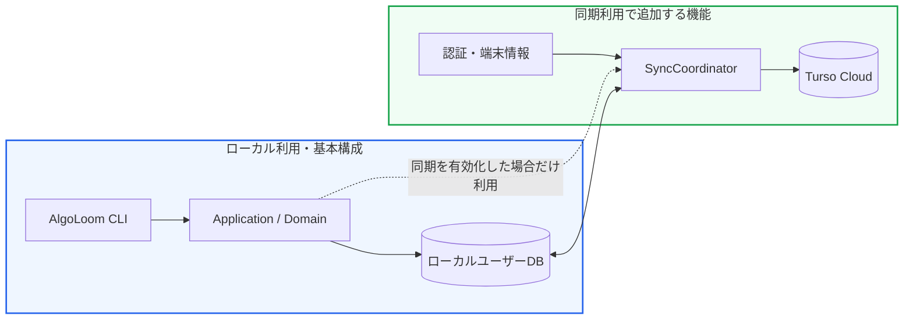

この構成で守る中心原則は次のとおりである。

- `pip install algoloom`後、Tursoアカウントなしで主要機能を利用できる。
- 履歴は同期の有無にかかわらず、最初にローカルへ永続保存する。
- 同期を有効化しても、主要コマンドと論理データモデルを変更しない。
- Cloud障害や未認証を理由に、ローカルで可能な操作を止めない。
- 同期の有効化・無効化・再有効化・データexportを安全に行える。
- Cloudへ送信するデータと認証処理は、ユーザーの明示的な同意後にだけ有効化する。

この方針はTurso Syncの「ローカルでcommitし、後から`push()` / `pull()`する」方式と自然に一致する。Embedded Replicaを利用する場合も同じ製品UXを保つが、Cloud primaryへの書き込みとoutboxの統合が必要になるため、内部実装は複雑になる。

---

## 1. 目的と対象外

### 1.1. 目的

- OSS利用者がCloudサービスを契約せず、短時間でAlgoLoomを使い始められるようにする。
- 複数端末同期を、既存のローカル環境へ後から追加できるようにする。
- macOS、Linux、Windows等、異なるhost OS間でもpathに依存せず共有履歴を参照できるようにする。
- ローカル利用と同期利用で、CLI、論理スキーマ、業務ルールを共通化する。
- 同期機能の依存パッケージや認証障害を、基本機能から隔離する。
- 同期を無効化しても、ユーザーがローカル履歴へアクセスできるようにする。
- 将来Turso SDKや同期方式を変更しても、上位層のUXを維持する。

### 1.2. 対象外

- Cloudアカウントをユーザーに無断で作成すること
- 開発者所有のTurso URLや管理トークンを配布物へ埋め込むこと
- 大人数によるリアルタイム共同編集
- 同期をバックアップの代わりにすること
- 異なる端末の編集中ワークスペースを自動マージすること
- AtCoderの認証情報やセッションCookieをCloudへ同期すること
- Python、コンパイラ、Ollama、LLMモデル等を無断でシステムへインストールすること

---

## 2. 用語

| 用語 | 本文書での意味 |
|---|---|
| ローカル利用 | Cloud同期を有効化せず、ユーザーデータを利用端末内へ保存する構成 |
| 同期利用 | ローカル利用の全機能に、Turso Cloudを介した複数端末共有を追加した構成 |
| AlgoLoom Core | CLI、Application、Domain、ローカル保存等、同期の有無にかかわらず利用する機能 |
| ローカルユーザーDB | 提出履歴、コード、レビュー等を端末内へ永続保存するDB |
| 同期機能 | `push`、`pull`、bootstrap、認証、同期状態管理、再試行等をまとめた任意機能 |
| 共有確定 | ローカルの変更がCloudへ反映され、別端末から取得可能になった状態 |
| pending | ローカルへ永続保存済みだが、Cloudへの共有が完了していない状態 |
| bootstrap | 新しい端末へCloud上の共有済みデータを取り込み、ローカルDBを初期構築すること |
| BYOC | Bring Your Own Cloud。各ユーザーが自分のTursoアカウント、DB、トークンを用意する方式 |
| AlgoLoom Cloud | 将来候補。AlgoLoom側のサービスが認証とユーザー用DBの払い出しを代行するマネージド方式 |

「non-sync」と「sync」は実装名として固定せず、ユーザー向けには原則として「ローカル利用」「Cloud同期有効」と表現する。同期を無効化した状態が機能不足に見えないようにし、ローカル利用を正式な完成形の1つとして扱う。

---

## 3. 構成の包含関係

### 3.1. 同期利用でも変わらないもの

| 領域 | ローカル利用 | 同期利用 |
|---|---|---|
| `get` / `test` / `submit` | 利用する | 同じものを利用する |
| `log` / `show` / `diff` | ローカルDBから読む | 同じローカルDBアクセス境界から読む |
| 論理データモデル | 共通 | 共通 |
| UUID・一意制約・冪等性 | 共通 | 共通 |
| ローカル永続化 | 必須 | 必須 |
| ワークスペース | 端末ごと | 端末ごと。原則として同期対象外 |
| 問題カタログ | ローカルキャッシュ | 同じ。Cloud同期対象外 |

### 3.2. 同期利用で追加するもの

| 追加要素 | 役割 |
|---|---|
| `SyncCoordinator` | `push`、`pull`、再試行、状態取得を統一する |
| Turso Adapter | ローカルDBとTurso Cloudの同期を実装する |
| Cloud認証 | DB URL、DB専用トークン、端末登録を管理する |
| 同期状態 | 最終成功時刻、pending件数、最終エラー等を保持する |
| bootstrap | 新しい端末へ共有済み履歴を復元する |
| 同期コマンド | `sync enable/status/run/retry/disable`を提供する |

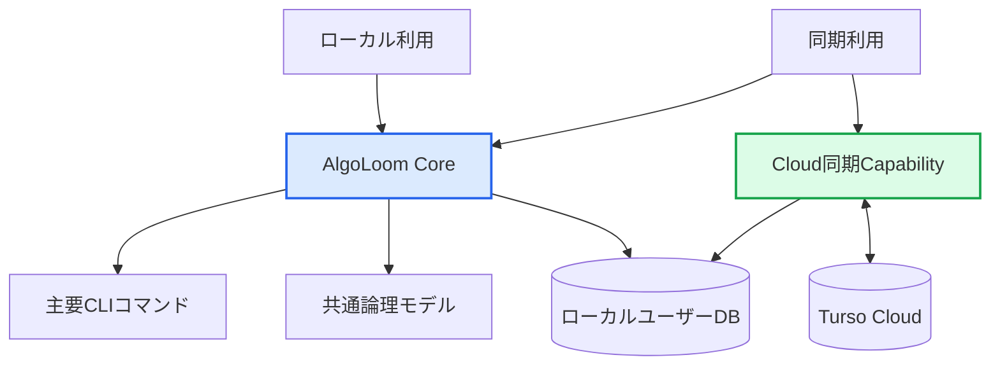

### 3.3. 重要な不変条件

同期有効化の前後で、次の操作結果を変えない。

- `submit`後、ローカル保存に成功した履歴は直ちに`log`へ表示される。
- `show`と`diff`は、Cloud接続の成否にかかわらずローカルに存在するコードを扱える。
- `log`、`show`、`diff`は通常の実行で同期完了を待たず、ローカルDBから結果を返す。
- Cloud同期失敗をAtCoderへの提出失敗として表示しない。
- 同期を無効化しても、ローカル履歴を削除しない。
- 同じAtCoder submission IDを複数回取得しても重複登録しない。
- 共有履歴をworkspaceの絶対pathへ依存させず、異なるOSの端末でも`log`、`show`、`diff`できる。

---

## 4. 論理アーキテクチャ

### 4.1. レイヤー構成

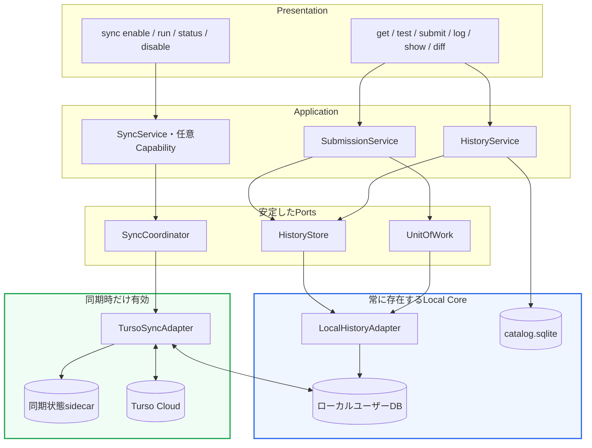

Presentation、SubmissionService、HistoryServiceは、Turso SDK、DB URL、認証トークン、`push()`、`pull()`を知らない。同期固有処理は`SyncService`、`SyncCoordinator`、Adapterへ閉じ込める。

### 4.2. Portの概念

```python
class HistoryStore(Protocol):
    def save_submission(self, submission: Submission) -> WriteReceipt:
        ...

    def list_submissions(self, query: SubmissionQuery) -> list[SubmissionView]:
        ...

    def get_submission(self, submission_id: str) -> SubmissionView | None:
        ...


class SyncCoordinator(Protocol):
    def enable(self, settings: SyncSettings) -> SyncEnableResult:
        ...

    def run(self) -> SyncResult:
        ...

    def status(self) -> SyncStatus:
        ...

    def disable(self, keep_local: bool = True) -> SyncDisableResult:
        ...
```

`HistoryStore`は常にローカル永続化を提供する。`SyncCoordinator`は任意Capabilityであり、無効時に主要コマンドから呼び出す必要はない。

---

## 5. データの権威と保存状態

### 5.1. データの権威と複製の境界

「ローカルを真にする」は、同じ論理データへローカルDBとCloud DBという二つの独立した正本を作る意味ではない。**データごとに権威を1つ、論理レコードごとに安定IDを1つ、書き込み手順を1つだけ持たせる。** 同期は、その不変レコードを別端末へ複製する処理である。

| データ | 権威を決める主体 | ローカル利用 | 同期利用 |
|---|---|---|---|
| 編集中のコード | 各端末のワークスペース | workspace file | 同じ。原則としてCloud同期しない |
| 提出履歴・source snapshot | AlgoLoomがUUID・code hash付きで保存する不変レコード | ローカルユーザーDBへ保存 | 先にローカルDBへ保存し、同じレコードをCloudへ複製 |
| SolveAttempt・FocusInterval・learning milestone | 利用者の明示操作とAlgoLoomが観測し、安定IDと状態遷移を持つ学習記録 | ローカルユーザーDBへ保存 | 同期を有効化した場合だけ、同じ安定IDと関連をCloudへ複製 |
| AIレビュー・ユーザーメモ | AlgoLoomのrevision record | ローカルDBへ追記 | 同じrevisionをCloudへ複製。上書きしない |
| AtCoder提出ID・判定 | AtCoder | 取得値を保存 | 同じ。AlgoLoomは権威を置き換えない |
| AtCoderの解説・他ユーザーの提出code | AtCoder公式サイトと各権利者 | 公式URLをbrowserで開くだけで本文を保存しない | Cloud同期対象外。本文・author・submission IDを取り込まない |
| 問題カタログ・補助metadata | AtCoder Problems等の取得元 | 再取得可能なローカルcache | 同じ。Cloud同期対象外 |
| 同期状態・再送状態 | その端末 | `DISABLED`またはローカル状態 | sidecarまたはSDK統計。共有業務データにしない |
| credential | OS keyring等のcredential owner | DB外に保持 | Cloud同期対象外 |
| バックアップ | 正本ではない | 独立した世代別コピー | 同じ。同期とは別に保持 |

提出履歴では、ローカルDBとCloudは同じUUID、AtCoder submission ID、code hashを持つ1つの論理レコードの保存場所である。ローカルcommitは「この端末で回復・参照可能」、push成功は「共有済みで別端末から取得可能」という保証を追加する。Cloudとローカルが同じ行を独立に更新して真偽を競う設計にはしない。

共有する問題、SolveAttempt、FocusInterval、learning milestone、snapshot、submission、review等の業務recordは、workspaceやcompilerの絶対pathを識別子にしない。端末上のworkspaceを見つけるために絶対pathを保存する場合は、同期対象外のlocal sidecarまたはlocal indexへ置き、別端末では共有metadataと利用者が選んだlocal rootから再構築する。

problem checkoutの現在path、解説本文、画像、PDF、動画、他ユーザーのcode・author・submission ID・個別提出URL、browser Cookie・profile・historyは同期対象にしない。将来、解説等を開いたreference eventをopt-inで記録する場合も、本文を含めず、browser起動と実際の閲覧・理解を混同しない最小recordとして別途採否を決める。

同期利用では、ローカルとCloudの役割を次のように分ける。

- ローカルcommit成功は「この端末から回復できる」ことを意味する。
- push成功は「別端末から取得できる」ことを意味する。
- 未push変更がある間、Cloudだけを唯一の最新状態とはみなさない。
- Cloudは複数端末間の共有確定状態を集約する。

この境界により、通常のTurso Sync構成ではユーザー履歴用の論理DBは1つで足りる。未push変更も同じローカルDBに残るため、outboxを別の履歴正本として持たない。Embedded Replicaを暫定採用する場合だけoutboxが必要になるが、それは輸送・復旧用の一時記録であり、`HistoryStore`がUUIDで統合して同じ論理履歴として扱う。

### 5.2. 共通の保存・同期状態

| 状態 | 意味 | 同期無効時 | 同期有効時 |
|---|---|---:|---:|
| `LOCAL_SAVE_FAILED` | ローカル永続化に失敗 | 使用する | 使用する |
| `LOCAL_ONLY` | ローカル保存済みで同期対象ではない | 通常状態 | 同期対象外データに使用 |
| `SYNC_PENDING` | ローカル保存済み、Cloud未反映 | 使用しない | 使用する |
| `SYNCED` | Cloudへ反映済み | 使用しない | 使用する |
| `SYNC_FAILED_RETRYABLE` | ローカルデータを保持し、再送が必要 | 使用しない | 使用する |

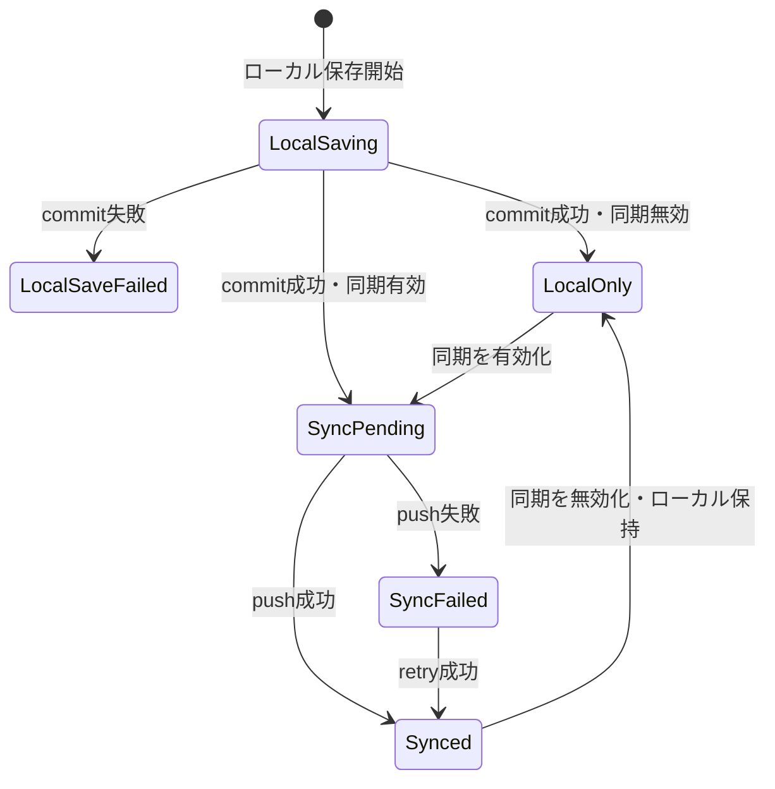

### 5.3. `submit`の表示例

ローカル利用:

```text
AtCoder submission: Accepted
Local history:      Saved
Cloud sync:         Disabled
```

同期利用・成功:

```text
AtCoder submission: Accepted
Local history:      Saved
Cloud sync:         Synced
```

同期利用・Cloud障害:

```text
AtCoder submission: Accepted
Local history:      Saved
Cloud sync:         Pending (retry: aloom sync retry)
```

Cloud同期の結果は、AtCoder提出とローカル保存の結果から分離して表示する。

---

## 6. ローカルファイルと物理DB

### 6.1. 推奨配置

```text
<OSの標準データディレクトリ>/algoloom/
├── user.sqlite              # ユーザー履歴のローカルDB
├── device.json              # device ID等。秘密情報は置かない
└── sync-state.sqlite        # 同期有効時のみ。最終同期時刻・エラー等

<OSの標準設定ディレクトリ>/algoloom/
└── config.toml              # 秘密を除く設定

<OSの標準キャッシュディレクトリ>/algoloom/
└── catalog.sqlite           # 再取得可能な問題カタログ
```

認証トークンは平文の`config.toml`やワークスペースへ保存せず、OS keyring等の秘密情報ストアを優先する。

### 6.2. 標準SQLiteとTurso管理DBの関係

理想は、同期の有効化前後で同じローカルDBファイルと同じドライバーを使うことである。しかし、OSSの基本インストールでは、Tursoのネイティブ依存を必須にしない方が導入成功率を高められる。

そのため初期版では、次の設計を許容する。

| 構成 | ローカルDB実装 |
|---|---|
| ローカル利用 | Python標準`sqlite3` |
| 同期利用 | 検証済みのTurso Sync対応ドライバー |

同期有効化時に物理DBの変換が必要な場合は、次の条件を守る。

1. 変換前に整合したバックアップを作成する。
2. 新しい一時DBへ共通マイグレーションを適用する。
3. UUID、件数、コードハッシュ、一意制約を検証する。
4. 初回pushとCloud側の検証が成功するまで旧DBを保持する。
5. 失敗時は旧DBへ戻し、ローカル利用を継続できるようにする。
6. 変換後も`HistoryStore`とCLIの契約を変えない。

この内部変換は「別システムへの移行」ではなく、同期Capabilityを追加するためのストレージAdapter切り替えとして扱う。

### 6.3. 履歴参照の性能契約

ローカルファーストは、Cloudを待たないだけでなく、履歴量が増えても必要な行だけを読むことを意味する。`HistoryStore`はCloud SDKや同期状態を経由せず、ローカルDBへ直接問い合わせる。

| 操作 | ローカル問い合わせの方針 | 必要な索引・制約の例 |
|---|---|---|
| `log` | 一覧用のmetadataだけをページ単位で取得し、source code本文を読まない | `submitted_at`、問題・言語など主要filterに対応する複合索引 |
| `show` | 問題IDと判定で最新の1件を特定してから、その1件のsource codeを取得する | `(problem_id, verdict, submitted_at DESC)` |
| `diff` | 比較対象の2 snapshotだけを主キーまたは問題ID・時刻で取得する | `id`の主キー、`(problem_id, submitted_at)` |
| 再取得・再送 | AtCoder submission IDまたは冪等キーで既存行を判定する | `judge_submission_id`の一意制約 |

索引名や正確なSQLは論理スキーマ確定後に決めるが、上記のアクセスパターンを満たすことをマイグレーションとAdapter契約テストで検証する。巨大なコード本文をアプリケーションの常駐メモリへキャッシュすることは初期版の要件にしない。SQLiteのローカル読み取りと必要行だけの取得を先に測定し、必要になった場合だけ追加最適化を検討する。

---

## 7. ユーザーフロー

### 7.1. インストールからローカル利用開始まで

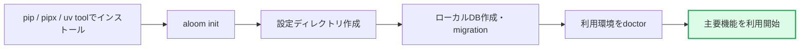

初回起動時のルール:

- Tursoアカウントを要求しない。
- 同期設定を必須質問にしない。
- デフォルト値で安全に作成できる項目は自動作成する。
- 不足している外部ツールは、必要な機能と影響を説明する。
- Ollamaや各言語コンパイラがなくても、無関係なコマンドを利用可能にする。

### 7.2. 既存端末で同期を有効化する

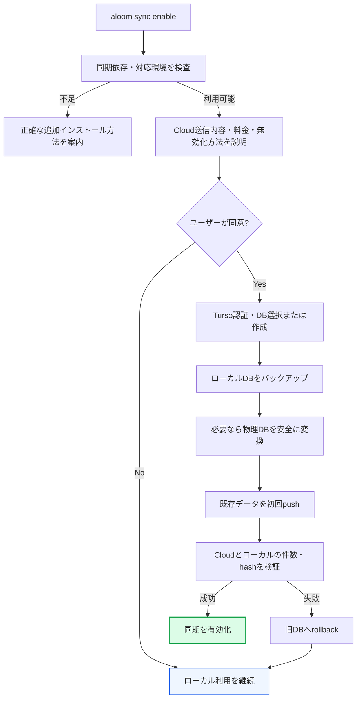

有効化は、すべて完了した場合だけcommitする。途中失敗で「同期は有効だがDB変換は未完了」のような中間状態を残さない。

### 7.3. 同期有効時の通常処理

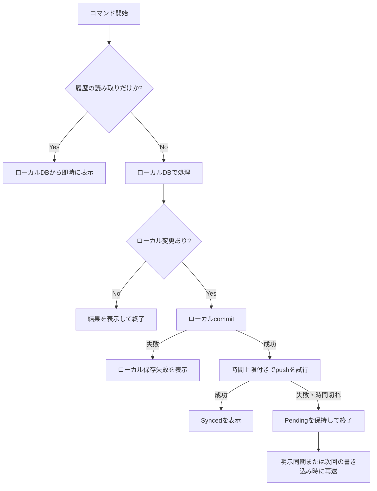

`log`、`show`、`diff`は、Cloudへの接続、pull、認証、名前解決を通常の表示経路へ入れない。表示するのはその端末が保持する最新状態であり、他端末の直近変更まで含むことを暗黙に約束しない。

別端末の変更まで取得したい場合は、利用者が`aloom sync run`を実行してから履歴を参照する。同期処理は必要なだけ待機・再試行してよい明示操作とし、通常の読み取りを遅くしない。

`submit`などローカル変更を生む操作では、ローカルcommit後に短い時間上限でpushを試みる。失敗または時間切れでも、ローカル保存済みの履歴を失敗扱いにせず、`Pending`と再送方法を表示する。通常コマンドでは、ネットワーク障害によってローカルで可能な処理まで止めない。詳細な診断と復旧は同期コマンドへ分離する。

### 7.4. 新しい端末を追加する

1. 新端末へAlgoLoomと同期依存をインストールする。
2. `aloom sync connect`を実行する。
3. 既存のTurso DBへ認証する。
4. Cloudから新しいローカルDBへbootstrapする。
5. 件数、主キー、コードハッシュ、スキーマバージョンを検証する。
6. 端末固有のdevice IDを登録する。
7. ローカルDBから`log`、`show`、`diff`を実行する。

このbootstrapが復元するのは共有済みの履歴とsource snapshotであり、元端末のworkspace directory、未提出かつ未checkpointの編集file、build artifact、toolchain、Editor設定、credentialではない。

### 7.5. 異なるOSの端末を追加する

例えばmacOSからnative Windowsへ移る場合も、Cloudから取得する論理recordと検証手順は同じにする。

| データ | 新しいWindows端末での扱い |
|---|---|
| problem、SolveAttempt、FocusInterval、learning milestone、checkpoint、submission、verdict | 同じUUIDと業務IDでbootstrapする |
| source snapshot | 正確なbytesとcode hashを保持し、`show`、`diff`、exportから参照できる |
| macOSのworkspace絶対path | 取得・再利用しない |
| 未提出・未checkpointのworkspace file | 同期されない |
| build artifact、cache | 同期せず、Windows上で再生成する |
| compiler/runtime、Editor設定 | Windows端末側で診断・設定する |
| credential | Windows端末側のcredential ownerから取得する |

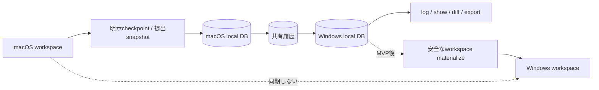

異なるOSで編集を再開する将来機能は、同期済みsnapshotを利用者が選んだlocal directoryへ安全にmaterializeする独立Capabilityとして設計する。元端末の絶対pathを再現せず、現在OSの予約名、separator、case衝突、path traversal、既存file上書きを検査する。file名を変更した場合はlogical source nameとの対応を表示し、source bytes、改行、文字コードを暗黙に正規化しない。

workspace materialize / restore UXはMVP対象外である。MVPではversion付きexportによりsourceをpath非依存で回収できることを保証し、Cloud同期を編集中workspaceの自動同期やmergeとして説明しない。

### 7.6. 同期を無効化する

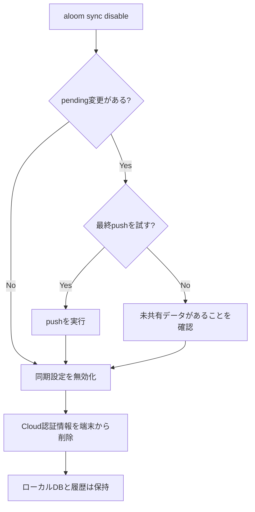

- 同期無効化とCloud上のデータ削除は別操作にする。
- オフラインでも、確認後に同期を無効化できるようにする。
- デフォルトではローカルデータを保持する。
- Cloudデータ削除には再認証と明示確認を要求する。

---

## 8. CLI設計

| コマンド案 | 同期無効時 | 同期有効時 | 目的 |
|---|---|---|---|
| `aloom init` | ローカルDBを初期化 | 既存設定を維持 | 利用開始 |
| `aloom doctor` | Python・外部ツール・DBを診断 | 同期依存も追加診断 | 問題の切り分け |
| `aloom sync enable` | 同期を追加 | 設定済みと表示 | 既存端末で同期開始 |
| `aloom sync connect` | Cloudからbootstrap | 接続先を表示 | 新端末追加 |
| `aloom sync run` | 同期無効を表示 | push / pullを完了まで実行 | 他端末の変更を取得する明示同期 |
| `aloom sync status` | `Disabled / Local only` | pending、最終成功、エラーを表示 | 状態確認 |
| `aloom sync retry` | 同期無効を表示 | pendingを再送 | 障害復旧 |
| `aloom sync disable` | 変更なし | Cloud同期だけを停止 | ローカル利用へ戻す |
| `aloom export` | ローカルデータをexport | 共有済み・pendingを含めてexport | 可搬性・退避 |
| `aloom backup` | 整合バックアップを作成 | 同期とは独立して作成 | 復元手段の確保 |

`sync enable`の対話例:

```text
$ aloom sync enable

Cloud sync adds multi-device sharing to your existing local history.

Data sent to Turso Cloud:
  - submission history and source code
  - verdicts and AI review records

Never sent:
  - AtCoder passwords or session cookies
  - workspace files that have not been submitted

Local history will remain available if sync is disabled.
Continue? [y/N]
```

通常コマンドでCloud同期を繰り返し宣伝しない。ユーザーが複数端末利用を求めたとき、`sync`コマンドを実行したとき、または明示的にヘルプを開いたときに案内する。

---

## 9. パッケージ配布と依存関係

### 9.1. 配布単位

```text
pip install algoloom
    └── ローカル利用に必要な依存だけを導入

pip install "algoloom[sync]"
    └── 上記 + 検証済みのTurso同期依存を導入
```

Pythonパッケージのoptional dependenciesを使用し、Cloud同期を利用しないユーザーへネイティブSDKを強制しない。

| 依存 | 基本パッケージ | `sync` extra |
|---|:---:|:---:|
| CLIフレームワーク | 必須 | 共通 |
| 表示・設定ライブラリ | 必須 | 共通 |
| online-judge-tools連携 | 必須または機能単位で整理 | 共通 |
| Python標準`sqlite3` | Python同梱 | 共通 |
| Turso Python SDK | 含めない | 含める |
| OS keyring連携 | 最小構成を検討 | 原則として含める |
| Turso CLI | 自動同梱しない | 既存インストールを利用可能 |

### 9.2. インストール時の原則

- アプリ実行中に、自分自身のPython環境へ勝手に`pip install`しない。
- 同期依存がない場合は、使用中の導入方法に合った正確なコマンドを表示する。
- 対応wheelがないOS・Python・CPUでは、同期機能だけを利用不可にし、基本インストールを失敗させない。
- `pip`、`pipx`、`uv tool`のそれぞれでインストール・upgrade・uninstallをCI検証する。
- sdistからの暗黙ビルドへ依存せず、リリース対象ではwheelによる導入成功を確認する。
- 初期版で対応しない環境は、曖昧にせず明示する。

### 9.3. 将来の単一インストーラー

Python自体の導入障壁も下げる場合は、PyPI配布とは別に次を検討する。

- Homebrew tap
- GitHub Releasesのstandalone executable
- OS別インストーラー
- ハッシュ検証付きの公式bootstrap script

単一実行ファイル化しても、Tursoアカウント作成、Cloud送信への同意、認証はユーザーの明示操作として残す。

---

## 10. Turso接続方式への含意

### 10.1. 方式比較

| 評価軸 | Turso Sync | Embedded Replica |
|---|---|---|
| ローカル利用への機能追加として説明しやすい | **高い** | 中程度 |
| 通常の書き込み先 | ローカルDB | Cloud primary |
| Cloud障害時のローカル書き込み | 可能 | outboxによる補完が必要 |
| 同期有効化前後のUX一貫性 | **高い** | Adapterで吸収が必要 |
| 競合処理 | last-push-wins等の設計が必要 | primaryで直列化しやすい |
| Python SDK・耐久性検証 | 必須 | 必須 |

### 10.2. 本文書から導かれる方針

「同期利用はローカル利用への追加機能」という製品モデルには、Turso Syncがより自然に適合する。

したがって、実装順序は次を推奨する。

1. 標準SQLite Adapterでローカル利用を完成させる。
2. 共通論理スキーマとPortを固定する。
3. Turso Sync Adapterを試作する。
4. wheel、commit、push、pull、競合、強制終了、bootstrapを検証する。
5. 合格すればTurso Syncを同期Capabilityとして採用する。
6. 不合格の場合だけ、Embedded Replica + outboxを暫定Adapterとして検討する。

Embedded Replicaを暫定採用する場合も、ユーザーへ「Cloud版のAlgoLoomへ切り替わった」と見せてはならない。`HistoryStore`がローカルレプリカとoutboxを統合し、ローカル利用へ同期機能を追加した同じUXを提供する。

既存のTurso設計ガイドに記載された最終的な方式選択は、試作結果を反映して別途更新する。本文書は方式選択より上位にある製品構造とUX契約を定義する。

---

## 11. 障害時の動作

| 状況 | ローカル利用 | 同期利用 |
|---|---|---|
| インターネット切断 | ローカル機能を継続 | ローカル機能を継続し、変更をpendingにする |
| Turso障害 | 影響なし | ローカルcommitを維持し、後で再送する |
| 認証期限切れ | 影響なし | ローカル機能を継続し、再認証を案内する |
| 同期依存のimport失敗 | 影響なし | 同期だけを停止し、修復方法を表示する |
| ローカルDB commit失敗 | 保存失敗 | Cloudへ送らず保存失敗を表示する |
| push成功後の強制終了 | 該当なし | 冪等キーまたは同期統計で重複を避ける |
| pull中の強制終了 | 該当なし | 元の整合状態を維持し、次回再試行する |
| Cloud上の誤削除 | 影響なし | 同期で波及し得るため、独立バックアップから復元する |

障害表示では、少なくとも次を区別する。

- AtCoderへの提出結果
- ローカルDBへの保存結果
- Cloudへの同期結果
- バックアップの状態

---

## 12. セキュリティとプライバシー

### 12.1. 同期有効化前の同意

同期を有効化する前に、次を表示する。

- Cloudへ送るデータ
- Cloudへ送らないデータ
- 利用する外部サービス名
- 無料枠と課金可能性を確認する場所
- 同期を無効化する方法
- ローカルおよびCloudデータをexport・削除する方法

### 12.2. 認証情報

- 開発者所有のTurso管理トークンを配布物へ含めない。
- BYOCではユーザーごとにDB専用・必要最小権限のトークンを使う。
- Platform APIトークンをCLIへ保存しない。
- DBトークンをGit、ログ、クラッシュレポート、shell履歴へ出さない。
- OS keyringを利用できない場合は、保存方法とリスクを明示する。
- `sync disable`時に、端末上の認証情報を削除できるようにする。

### 12.3. 同期対象外

- AtCoderパスワード
- AtCoderセッションCookie
- ブラウザプロファイル
- 環境変数の全内容
- 未提出のワークスペースファイル
- workspaceとsourceの絶対path
- compiler/runtime executableとbuild artifactのpath
- コンパイラやエディタの個人設定
- Turso Platform APIトークン

AlgoLoomが利用する既存Editor / Viewerの選択とprocess-localな呼出設定は端末固有設定として扱い、共有DBへ同期しない。これは表示先を参照・起動するためのAlgoLoom側の設定であり、Editor / Viewer本体、plugin、ユーザー設定を変更するものではない。`show`と`diff`が取得する論理データは全端末で共通にするが、その表示先は各端末のユーザーが自由に選択できる。共有テーブルへworkspace・source・compiler・エディタ固有の絶対path、URI、plugin設定等を保存せず、特定OSやEditorの有無によって履歴参照の可否を変えない。

端末内のworkspace探索を高速化するため絶対pathが必要な場合は、同期対象外のlocal sidecarへ`device_id`、論理workspaceまたは問題の安定ID、local root、最終確認時刻を保存できる。この情報はlocatorであり業務履歴の権威ではない。pathが失効しても共有snapshotを失ったとは扱わない。

---

## 13. BYOCと将来のマネージド同期

### 13.1. 初期OSS版: BYOC

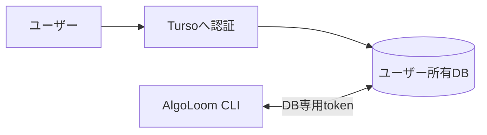

#### 利点

- AlgoLoom開発者がユーザーデータを預からない。
- 運用費とサービス障害責任を抑えられる。
- ユーザーがDB、料金、export、削除を管理できる。

#### 課題

- Tursoアカウント作成が必要になる。
- DB作成と認証の導線を整える必要がある。
- Turso CLIまたは公式ダッシュボードとの連携が必要になる。

### 13.2. 将来候補: AlgoLoom Cloud

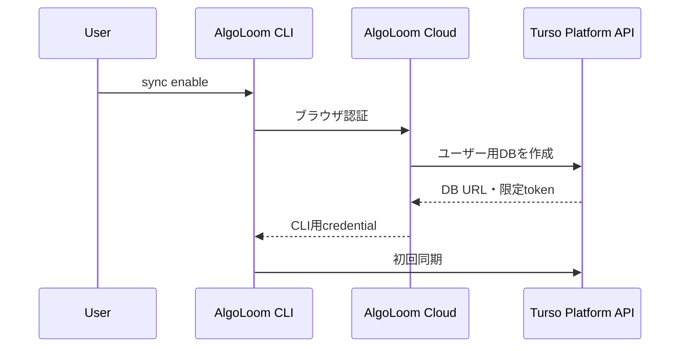

この方式はワンクリックに近いUXを提供できるが、次の責任を新たに持つ。

- 認証サービスの運用
- 利用規約とプライバシーポリシー
- Turso Platform APIトークンの保護
- 不正利用、課金、障害、退会処理
- ユーザーごとのexport・削除

初期OSS版の必須要件にはせず、BYOCの利用状況を確認した後に別サービスとして判断する。

---

## 14. 段階的な実装計画

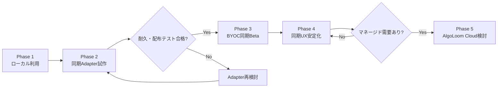

### Phase 1: ローカル利用

- 標準SQLiteで共通論理スキーマを実装する。
- [MVPスコープ](../product/mvp.md)と[Core契約](../architecture/core-contracts.md)に従い、SolveAttempt、FocusInterval、learning milestone、checkpoint、`submit`、`log`、`show`、`diff`、exportを完成させる。
- マイグレーションと、復旧可能なローカル退避を実装する。自動backupと完全なrestore UXはMVP後とする。
- `HistoryStore`、`UnitOfWork`、`WriteReceipt`の契約テストを作る。
- Tursoなしのクリーン環境でインストールと初回起動を検証する。

### Phase 2: 同期Adapter試作

- `SyncCoordinator`を定義する。
- Turso Sync Adapterを第一候補として実装する。
- 標準SQLiteから同期対応DBへの安全な有効化手順を試作する。
- 2端末、オフライン、競合、強制終了、bootstrapを検証する。
- 対応OS・Python・CPUでwheelインストールを検証する。

### Phase 3: BYOC同期Beta

- `sync enable/connect/status/run/retry/disable`を提供する。
- 同期有効化時の同意、認証、keyring保存を実装する。
- 同期失敗時もローカル機能が継続することを確認する。
- 限定ユーザーでセットアップ時間と失敗箇所を計測する。

### Phase 4: 同期UX安定化

- 認証・DB作成の案内を自動化する。
- upgrade、再認証、token失効、端末削除を整備する。
- import/exportとCloud削除を整備する。
- 対応環境を拡大し、インストールCIを強化する。

### Phase 5: AlgoLoom Cloud検討

- BYOC離脱理由を調査する。
- 運用費、認証、法務、プライバシーを評価する。
- OSS版とマネージド版の責任範囲を分離する。

---

## 15. 受け入れ基準

### 15.1. ローカル利用

- [ ] Tursoアカウントなしで`pip install algoloom`が成功する。
- [ ] Turso SDKなしで`aloom init`が成功する。
- [ ] 初回起動時にローカルDBとスキーマが自動作成される。
- [ ] Cloud未設定でも主要コマンドが利用できる。
- [ ] Cloud同期を有効化するよう繰り返し要求しない。
- [ ] exportとbackupから別環境へ復元できる。

### 15.2. 同期の追加

- [ ] 既存ローカルデータを失わず同期を有効化できる。
- [ ] 同期有効化前後でUUID、件数、コードハッシュが一致する。
- [ ] Cloud障害時もローカルへ保存し、履歴を参照できる。
- [ ] 新端末へbootstrapできる。
- [ ] SolveAttempt、FocusInterval、learning milestoneのID、順序、関連、durationがbootstrap前後で一致する。
- [ ] macOS、Linux、Windowsの異なるOS間でbootstrapし、絶対pathなしで`log`、`show`、`diff`、exportを実行できる。
- [ ] 元端末のworkspace、compiler、Editorの絶対pathが共有DBへ含まれない。
- [ ] source bytesとcode hashが異なるOSへのbootstrap前後で一致する。
- [ ] 同じsubmission IDを重複登録しない。
- [ ] pending件数と最終同期時刻を確認できる。
- [ ] 同期を無効化してもローカル履歴を利用できる。
- [ ] 認証情報が設定ファイル、ログ、Gitへ漏れない。

### 15.3. インストール

- [ ] `pip`、`pipx`、`uv tool`で基本パッケージを導入できる。
- [ ] 対応環境で`algoloom[sync]`をwheelだけから導入できる。
- [ ] 同期非対応環境でも基本パッケージのインストールは成功する。
- [ ] 同期依存不足時に、利用中の導入方法に合った修復手順を表示する。
- [ ] ネイティブビルドツールがないクリーン環境でテストする。

### 15.4. UX目標

初期目標値として次を計測する。

| 指標 | 目標 |
|---|---:|
| 基本インストールから`aloom --version`成功まで | 2分以内 |
| `aloom init`完了までの必須質問 | 3問以下 |
| Tursoなしで主要機能を開始できたユーザー | 100% |
| 対応環境での基本インストール成功率 | 99%以上 |
| BYOC同期の有効化 | 5分以内 |
| 同期有効化失敗時のローカルデータ消失 | 0件 |
| ローカル履歴の`log`表示（p95） | 100ms以内 |
| `show`のローカルコード取得・表示開始（p95） | 150ms以内 |
| `diff`のローカルsnapshot取得・差分生成開始（p95） | 250ms以内 |

時間だけでなく、ユーザーが外部ドキュメントを何ページ開いたか、秘密情報を何回コピーしたか、失敗から自己回復できたかも計測する。

---

## 16. 実装チェックリスト

### 境界

- [ ] 同期利用をローカル利用への追加Capabilityとして実装している。
- [ ] 主要コマンドがTurso SDKを直接呼んでいない。
- [ ] 論理スキーマとRepository契約が同期の有無で共通である。
- [ ] 同期依存のimportを同期機能の境界まで遅延できる。

### データ

- [ ] すべての履歴をCloud送信前にローカルへ永続化する。
- [ ] UUIDとjudge submission IDで冪等化している。
- [ ] 同期状態を共有業務テーブルへ直接保存していない。
- [ ] DB変換時に件数・主キー・コードハッシュを検証する。
- [ ] 同期とは別のバックアップを用意している。
- [ ] 端末固有pathを保存する場合、同期対象外のlocal sidecarへ分離している。

### UX

- [ ] 初回利用でCloud設定を要求しない。
- [ ] Cloud送信前にデータ範囲を説明して同意を得る。
- [ ] AtCoder提出、ローカル保存、Cloud同期を別々に表示する。
- [ ] `log`、`show`、`diff`がCloud接続や同期完了を待たない。
- [ ] 全端末の最新状態が必要な操作を、明示的な`sync run`へ分離している。
- [ ] 同期無効化後もローカル履歴を保持する。
- [ ] pendingと再送方法を明確に表示する。

### 配布

- [ ] Turso SDKを基本パッケージの必須依存にしていない。
- [ ] 対応wheelがある環境をCIで検証している。
- [ ] unsupported環境を明記している。
- [ ] CLIが無断で外部バイナリやPython依存をインストールしない。

---

## 17. 関連文書との責任分担

| 文書 | 主な責任 |
|---|---|
| [製品ビジョン](../product/vision.md) | 製品目的、主要機能、基本的な利用体験 |
| [配布方針ガイド](../operations/algoloom-distribution.md) | PyPI公開、ライセンス、AtCoder規約、公開版の安全性 |
| 本文書 | ローカル利用と同期利用の包含関係、導入UX、追加Capabilityとしての同期設計 |
| [Turso設計ガイド](../integrations/turso-design-guide.md) | Turso方式、データの権威、outbox、競合、バックアップ |
| [Turso移行互換性設計](../integrations/turso-migration-compatibility-design.md) | Adapter境界、方式変更、契約テスト、移行手順 |
| [言語・実行環境の可搬性設計](../architecture/language-and-platform-portability.md) | OS・言語差異、Editor / IDE非依存境界、実行配置、絶対path、workspace layout、snapshot materializeの境界 |

本文書は「同期機能を使うか」という製品・UX上の選択を扱う。Turso設計ガイドと移行互換性設計は「同期機能をどのSDK・方式で実現するか」という内部実装の選択を扱う。

---

## 18. 公式資料

- [Python Packaging User Guide: `pyproject.toml`](https://packaging.python.org/en/latest/guides/writing-pyproject-toml/)
- [pip Dependency Resolution](https://pip.pypa.io/en/latest/topics/dependency-resolution/)
- [Turso Python Quickstart](https://docs.turso.tech/sdk/python/quickstart)
- [Turso CLI Authentication](https://docs.turso.tech/cli/authentication)
- [Turso Sync Usage](https://docs.turso.tech/sync/usage)
- [Turso Sync Conflict Resolution](https://docs.turso.tech/sync/conflict-resolution)
- [Turso Platform API](https://docs.turso.tech/api-reference/introduction)
- [pyturso on PyPI](https://pypi.org/project/pyturso/)

---

## 19. 最終方針

AlgoLoomの基本単位は、常にローカルで動作するAlgoLoom Coreである。

```text
同期なし: AlgoLoom Core + Local DB
同期あり: AlgoLoom Core + Local DB + Sync Capability + Turso Cloud
```

- ローカル利用だけでも完成した学習体験を提供する。
- 同期利用はローカル利用を置き換えず、複数端末共有を追加する。
- データは最初にローカルへ保存し、その後Cloudへ共有する。
- 同期の有無でCLI、論理モデル、ローカル履歴の見え方を変えない。
- 同期有効化は明示的、段階的、検証可能、ロールバック可能にする。
- 同期方式はTurso Syncを第一候補として検証し、製品上の包含関係をAdapter内部の都合で崩さない。
- インストールの容易さを守るため、Turso SDKは同期用の任意依存として配布する。
- 共有履歴は絶対pathへ依存せず、異なるOSでも同じUUID、source bytes、code hashから参照できる。
- workspaceは端末ごとに管理し、将来のmaterialize機能を履歴同期や自動workspace mergeと混同しない。

この設計により、初めて使うユーザーには最短の導入体験を提供し、複数端末を必要とするユーザーには、既存データと操作方法を維持したままCloud同期を追加できる。
