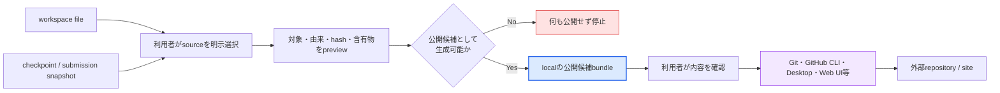
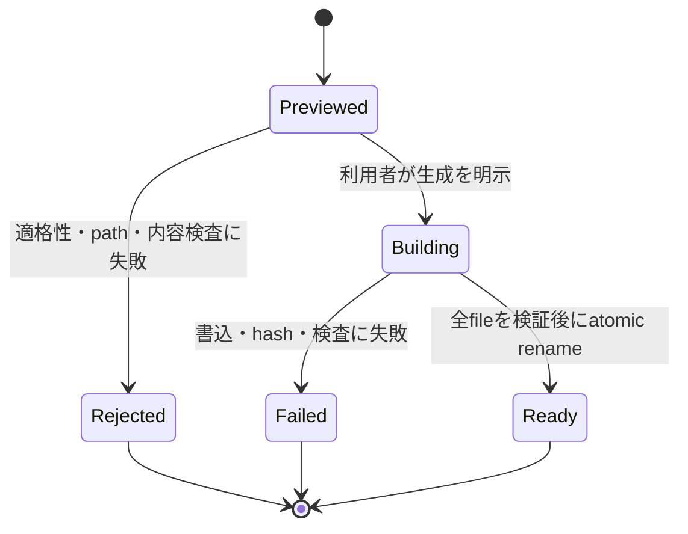

# 公開用solution bundle将来設計

> 本機能はMVP対象外の将来候補であり、実装や正式採用を確約しない。MVPの範囲は[AlgoLoom MVPスコープ](../product/mvp.md)、完全な学習履歴を持ち出す`export`契約は[Core契約](../architecture/core-contracts.md)を正本とする。

## ドキュメント概要

本書は、AlgoLoomで作成・保存した自分の解答codeを、GitHub等の外部公開先へ利用者自身が安全に持ち込めるようにする将来候補について、AlgoLoomが担う公開候補bundleの生成と、Git・GitHub等の標準toolへ委ねる公開操作の境界を定義します。

## 0. 結論

AlgoLoomは、GitHub等へのrepository作成、認証、commit、push、visibility変更を行わない。将来、実需と安全性を確認できた場合に限り、**利用者が明示的に選んだ自作sourceを、公開候補として最小構成のlocal directoryへ取り出すprovider非依存の機能**を検討する。

この機能は「安全な公開を保証する機能」ではない。AlgoLoomは既知の除外対象と異常を検査できるが、source commentに含まれるsecret、第三者codeのlicense、公開後の複製等を完全には判定・制御できない。最終確認と外部公開は利用者が行う。

| 能力 | AlgoLoomの責任 | AlgoLoomが行わないこと |
|---|---|---|
| 公開対象の選択 | 保存済みsourceまたはsnapshotを明示的に選ばせ、問題ID、由来、hashを示す | 更新時刻や先頭fileから暗黙に選ぶ |
| 公開候補の構成 | allowlistに基づく最小bundleをlocalに生成する | workspace、履歴DB、完全版exportを丸ごと複製する |
| 事前検査 | contest状態、path、file種別、既知のsecret形式、含有物を確認する | 公開の合法性、安全性、license適合を保証する |
| 外部公開 | 公式手順と生成先を案内する | GitHub API、GitHub App、GitHub CLI、Git command等による外部変更を実行する |
| 公開後 | source hash等、localで確認できる事実を保持できる | remote状態、visibility、fork、削除、同期を追跡する |

## 1. 用語

| 用語 | 本書での意味 |
|---|---|
| 完全版export | SolveAttempt、時間、milestone、checkpoint、submission、verdict、source snapshot等をversion付き形式で欠損なく持ち出すMVP Core機能。私的な可搬性・退避を主目的とする。 |
| 公開候補bundle | 利用者が明示的に選択したsourceと、公開に必要な最小metadataだけから構成するlocal directory。公開済みであることや安全性を意味しない。 |
| publish | 外部siteまたはremote repositoryへdataを送信し、他者が参照可能な状態にする操作。AlgoLoomの責任外とする。 |
| provider非依存 | GitHub、GitLab等の特定serviceのAPI、認証、repository modelをbundle契約へ含めない性質。 |
| allowlist | bundleへ含めてよいfileとfieldを列挙し、列挙されていないものを既定で除外する方式。 |
| source origin | workspace file、checkpoint、submission snapshot等、選択したsource bytesの由来。 |

## 2. `export`、公開候補bundle、publishの分離

完全版`export`と公開候補bundleは、どちらもlocal fileを生成し得るが、目的とdata最小化の方向が逆である。同じcommandの出力profileやGitHub向けoptionとして安易に統合しない。

| 観点 | 完全版export | 公開候補bundle | publish |
|---|---|---|---|
| 主目的 | 学習資産の可搬性・退避 | 外部公開前の最小構成作成 | 外部siteへの公開 |
| data方針 | 契約対象を欠損なく含める | 明示選択とallowlistで最小化する | 外部providerの契約に従う |
| 主な内容 | 履歴、時間、判定、全対象snapshot | 選択したsource、問題ID、公式URL等 | repository、commit、remote上のfile |
| network | 不要 | 不要 | 必要になり得る |
| credential | 含めない | 読み取らない・含めない | 外部toolまたはproviderが所有する |
| MVP | 含む | 含めない | 含めない |



AlgoLoomの成功条件は、検証済みのlocal bundleを指定先へ生成し、その内容とhashを利用者が確認できることである。外部toolの操作、network送信、remote反映を成功条件へ含めない。

## 3. 対象範囲と非目標

### 3.1. 初期候補の対象

初期候補は、終了済みAtCoder Algorithm問題について、次の条件を満たす一問・一sourceのbundleに限定する。

- 利用者がsource fileまたは保存済みsnapshotを明示している。
- source origin、canonical problem ID、canonical language IDを一意に確認できる。
- contestが終了済みであり、個別ruleを含めて公開候補生成を拒否すべき状態でない。
- sourceが通常fileかつ許容sizeであり、対応するtext形式としてそのまま複製できる。
- 生成先が利用者の明示したlocal directoryである。

初期候補では、一つのrepositoryに全解答を集約するlayout、問題別repository、branch構成等をAlgoLoomが決めない。複数問題の一括bundleは、一問単位の安全契約と利用者需要を確認した後の別判断とする。

### 3.2. 非目標

- Git repositoryの初期化・管理・状態追跡。意図しない既存repository内への生成を警告するread-onlyなpath確認は除く
- `git add`、commit、tag、branch、remote追加、push、pull
- GitHub等のrepository作成、visibility変更、release作成
- GitHub OAuth、personal access token、SSH key、credential helperの管理
- GitHub Actions等のCI設定生成
- remote上のfileとAlgoLoom snapshotの継続同期
- 公開後の削除、fork、clone、cache、検索indexからの消去保証
- 問題文、公開sample、解説、他ユーザーcodeを含む教材repositoryの生成
- sourceの品質、正解性、独創性、license適合性の保証

## 4. source選択とデータの権威

公開候補生成では、同じ問題に複数sourceやsnapshotが存在することを通常状態として扱う。`latest`、最終更新時刻、最初に見つかったfile等から暗黙に一つを選ばない。

| source候補 | bytesの権威 | 表示する由来 | 注意 |
|---|---|---|---|
| 現在のsource | workspace上の保存済み通常file | `workspace` | Editorの未保存bufferは取得・推測しない |
| checkpoint | AlgoLoomの不変snapshot | `checkpoint` | checkpoint ID等の内部識別子を公開bundleへ既定で含めない |
| 提出時source | AlgoLoomの不変submission snapshot | `submission` | AtCoder submission ID、個別提出URL、usernameを既定で含めない |

生成前のpreviewでは、少なくとも次を人が確認できる形式で示す。

- canonical problem ID
- canonical language ID
- source origin
- source file名
- source byte size
- code hash
- bundleへ含めるfileとfield
- 除外する主なdata区分
- contest状態と判定根拠
- warningと停止理由

## 5. bundle内容契約

### 5.1. 既定で含められるもの

初期候補はallowlist方式とし、次の範囲から必要最小限だけを生成する。

| 内容 | 既定 | 条件 |
|---|---|---|
| 選択したsource file | 含める | 選択したbytesと生成後のhashが一致すること |
| canonical problem ID | 含められる | 内部IDやdirectory名ではなく公開可能な正規IDを使う |
| AtCoder公式問題URL | 含められる | 正規IDから構成した公式URLだけとし、本文を取得しない |
| canonical language ID | 含められる | local compiler pathやversionを混入させない |
| 最小README | 任意 | 問題ID、公式URL、言語等の事実だけから生成し、問題文や解法説明を自動転載しない |
| version付きbundle manifest | 任意 | format version、作成時刻、AlgoLoom version、source hash等の非機微情報に限定する |

生成したREADMEやmanifestも公開対象である。sourceだけを確認して補助fileを未確認のまま公開させない。

### 5.2. 既定で含めないもの

| data区分 | 例 | 除外理由 |
|---|---|---|
| AtCoderコンテンツ | 問題文、title、画像、公開sample、解説、PDF、動画 | 権利者が異なり、公開用の再配布判断をAlgoLoomが代行できない |
| 他者の情報 | 他ユーザーcode、author、submission ID、個別提出URL | 自分の学習資産・公開対象ではない |
| 学習履歴 | SolveAttempt、FocusInterval、milestone、WA履歴、review | 公開目的に不要で、本人の行動・時間を過剰に公開し得る |
| 内部data | 問題metadata、DB、WAL、cache、backup、完全版export | 内部Schema、取得content、複数snapshot等を混入させ得る |
| 端末固有情報 | workspace絶対path、username、Editor、compiler path | privacyと可搬性を損なう |
| secret | Cookie、token、password、`.env`、環境変数、credential | accountや外部serviceへの不正アクセスにつながる |
| 生成物 | executable、object file、local test出力 | source公開の最小目的に不要で、OS・toolchain依存を持ち込む |

workspace全体のcopy後にdenylistで不要fileを消す方式は採用しない。新しいdata区分がworkspaceへ追加されたときに自動的に公開対象となるためである。

## 6. contest状態と外部rule

公開候補bundleはnetwork送信を行わないが、その目的は外部公開の準備である。したがって、開催中または終了を確認できないcontestのsourceについて、単なるlocal copyと同じ扱いで生成してはならない。

| 状態 | 初期候補の動作 |
|---|---|
| 終了済みの対応対象である | 他の検査を継続する |
| 開催中である | 生成を拒否する |
| contest状態を確認できない | fail closedとし、通常file操作を利用者へ委ねる |
| 個別contest ruleを安全に解釈できない | 生成を拒否し、公式ruleの確認先を示す |
| AlgoLoomの対応対象外である | 安全を推測せず対象外と表示する |

MVPが終了済み過去問だけを対象とすることは、この候補の安全な前提になる。一方、将来AlgoLoomの問題対象を広げても、公開候補生成の適格性を自動的に広げない。

## 7. privacy、secret、license

### 7.1. privacyとsecret検査

既知のsecret file名、秘密鍵header、対応可能なcredential pattern、異常に大きなfile等は事前検査できる。ただし、検出できなかったことを「secretが存在しない保証」と表示しない。

```text
適切な表示:
  既知の除外対象と対応patternは検出されませんでした。
  source comment、文字列、補助fileを含め、公開前に内容を確認してください。

不適切な表示:
  このbundleは安全に公開できます。
```

外部providerのsecret scanningやpush protectionは追加の防御層になり得るが、AlgoLoomの検査を置き換えるもの、または完全性の根拠として扱わない。

### 7.2. 著作権とlicense

利用者自身が作成したsourceであっても、第三者snippet、library、生成AI出力、問題文の引用等を含む可能性がある。AlgoLoomはsourceの来歴やlicense適合を自動認定しない。

- AtCoderの規約上、自分が作成・投稿したprogramに関する権利と、問題文・画像・他者code等の権利を分けて案内する。
- public repositoryであることと、第三者へ改変・再配布を許諾するlicenseがあることを同一視しない。
- MIT等のLICENSEをAlgoLoomが既定で付与しない。
- license選択支援を将来検討する場合も、公開候補bundle生成とは別の明示選択とする。
- 実装開始時と公開前に、AtCoderおよび対象providerの現行規約とcontest ruleを公式資料から再確認する。

## 8. 外部toolとの責任境界

AlgoLoomは公開候補bundleの生成先と、GitHub等が提供する公式手順へのlinkを案内できる。しかし、外部commandを独自実装、代行、連鎖実行しない。

remote repositoryがprivateであっても、端末外のproviderへの送信であることは変わらない。privateを安全性の保証またはdata最小化を省略する理由にせず、publicと同じlocal bundle境界を適用する。

| 外部操作 | 担当 |
|---|---|
| local bundleの内容確認・編集 | 利用者が選んだEditor / file viewer |
| version管理 | Gitまたは利用者が選んだVCS |
| repository作成 | GitHub、GitLab等のproviderまたは公式client |
| 認証 | provider、OS credential helper、公式client |
| commit・push | Git、GitHub CLI、GitHub Desktop等 |
| visibilityとaccess control | remote provider |

- AlgoLoomはGitHub credential、SSH key、Git credential helper、login cacheを探索・読取・保存しない。
- Git executableやGitHub CLIの存在をCoreまたはbundle生成の前提にしない。
- 外部toolの失敗をbundle生成の失敗へ遡及させない。
- 外部tool用の設定file、hook、CI、repository ruleを既存workspaceへ自動配置しない。
- provider固有の連携が将来提案されても、local bundleだけで目的を達成できない実需を確認してから別Capabilityとして再評価する。

## 9. filesystem、安全な生成、回復

### 9.1. 生成先

- 利用者が明示したlocal directoryだけへ書き込む。
- 既存の非empty directoryへ暗黙にmergeしない。
- 既存fileを上書きしない。
- pathを`resolve()`して許可された生成先境界を確認する。
- symlinkを既定で追跡しない。
- 親に既存Git repositoryがあることをread-onlyに確認できる場合は、意図しない追跡対象になり得ることをwarningとして示せる。ただしGit操作は行わない。

### 9.2. 原子性と再実行

一時directoryで全fileの生成、hash検証、最終検査を完了し、成功時だけ最終directoryへ移す。途中失敗時に、一部fileだけを公開候補として残さない。



同じ入力から再生成する場合も、既存bundleを暗黙に更新・削除しない。新しい生成先を選ぶか、利用者が標準file操作で既存bundleを整理した後に再実行する。

## 10. CLIとUXの原則

具体的なcommand名とoptionは未決とする。採用する場合も、日常のCore commandへGitHub公開の案内を繰り返し表示しない。

- 利用者が公開候補生成を明示的に求めたときだけ導線を表示する。
- GitHub accountやGitの知識をAlgoLoom利用開始の前提にしない。
- `submit`成功後に自動生成せず、公開を促すnotificationも既定で出さない。
- 確認画面では、抽象的な「公開可能」ではなく、source origin、含有file、除外data、warningを示す。
- 生成成功時は、local生成が完了したことだけを表示し、外部公開済みと表現しない。
- machine-readable出力を提供する場合も、外部commandを自動実行するinstructionやcredentialを含めない。

概念上の成功出力:

```text
公開候補bundleをローカルに生成しました。
source: main.cpp (submission snapshot, sha256: ...)
problem: abc300_a
included: main.cpp, README.md
excluded: samples, history, submission ID, local paths, credentials

外部には送信していません。公開前にすべてのfileを確認してください。
```

## 11. 段階的な採用判断

| 段階 | 行うこと | 次へ進む条件 |
|---|---|---|
| MVP | 完全版exportを完成させ、公開候補bundleやGitHub連携を実装しない | Coreのsnapshot、export、Security契約が安定する |
| 利用者検証 | 手動公開時の誤混入、反復作業、必要なmetadataを調査する | AlgoLoom固有の切り出し支援が実際に必要と確認できる |
| local試作 | 一問・一source、networkなし、allowlist方式で試作する | 内容、失敗回復、contest判定、path、secret検査に合格する |
| 採用判断 | provider非依存の近接拡張として正式採用するか決める | Coreを複雑にせず、公開事故を増やさず、継続保守できる |
| 将来拡張 | 複数問題bundle等を個別に検討する | 一問単位の利用実績と追加需要がある |

GitHub APIや自動pushは、この段階表の到達点ではなく、AlgoLoomの製品範囲へ含めない。local bundleだけでは満たせない需要が確認された場合も、公式の外部toolと手順で満たすか、AlgoLoomとは別applicationにすべきかを検討する。

## 12. 受け入れ条件

正式採用前に、少なくとも次を検証する。

### 内容とprivacy

- [ ] 選択したsourceと生成後sourceのbytesおよびhashが一致する。
- [ ] 公開sample、問題文、解説、他ユーザーcodeを含まない。
- [ ] 履歴DB、完全版export、時間、内部ID、絶対pathを含まない。
- [ ] Cookie、token、password、環境変数、credentialを読み取らず、含めない。
- [ ] READMEとmanifestも含めて全生成fileをpreviewまたは一覧確認できる。

### 対象とrule

- [ ] 開催中、状態不明、対象外contestでfail closedになる。
- [ ] source候補が複数の場合に暗黙選択しない。
- [ ] workspace file、checkpoint、submission snapshotの由来を区別する。
- [ ] Editorの未保存bufferを公開対象とみなさない。

### filesystemと回復

- [ ] 非empty directory、既存file、symlink、path traversalを安全に拒否する。
- [ ] shell記号、先頭`-`、Unicodeを含むfile名をcommandとして解釈しない。
- [ ] 生成途中の強制終了で部分bundleを最終生成先へ残さない。
- [ ] 再実行で既存bundle、workspace、snapshotを変更しない。

### 外部境界

- [ ] Git、GitHub CLI、GitHub account、networkなしでbundleを生成できる。
- [ ] GitHub credential、SSH key、login cacheを探索しない。
- [ ] repository作成、commit、push、visibility変更を行わない。
- [ ] 外部公開の成否をAlgoLoomの成功状態として保存しない。

## 13. 未決事項

- 公開候補bundleを正式採用するか。
- 最終command名と、完全版`export`から独立させる具体的なCLI階層。
- workspace file、checkpoint、submission snapshotのどれを最初の既定候補として示すか。ただし暗黙選択はしない。
- READMEとversion付きmanifestを既定生成するか、明示optionとするか。
- 既知secret patternをAlgoLoom内部でどこまで検査し、外部scannerの案内をどこまで行うか。
- contest終了状態と個別ruleを、保存済み情報と実行時確認のどちらから判定するか。
- 一問・一source以外の複数問題bundleを将来提供するか。
- source公開時にlicense選択の案内をどの程度提供するか。

## 14. 公式資料

実装開始時と公開前に、最新版を再確認する。

- [AtCoder利用規約](https://atcoder.jp/tos?lang=ja)
- [AtCoder コンテスト中のルールについて](https://info.atcoder.jp/overview/contest/rules)
- [GitHub: Adding locally hosted code to GitHub](https://docs.github.com/en/migrations/importing-source-code/using-the-command-line-to-import-source-code/adding-locally-hosted-code-to-github)
- [GitHub: Ignoring files](https://docs.github.com/en/get-started/git-basics/ignoring-files)
- [GitHub: Push protection](https://docs.github.com/en/code-security/concepts/secret-security/push-protection)
- [GitHub: Setting repository visibility](https://docs.github.com/en/repositories/managing-your-repositorys-settings-and-features/managing-repository-settings/setting-repository-visibility)

## 15. 最終方針

AlgoLoomは、利用者の学習資産を外へ持ち出せる自由を尊重する。一方、その自由をGitHub等への自動公開、credential管理、Git操作の再実装として提供しない。

公開支援を採用する場合は、AlgoLoomだけが理解できるsnapshotと学習dataの境界を使い、選択した自作sourceを最小のlocal bundleへ切り出すところまでを担う。公開先、repository構成、認証、commit、push、visibility、公開後の管理は、利用者と標準tool・外部providerへ委ねる。
