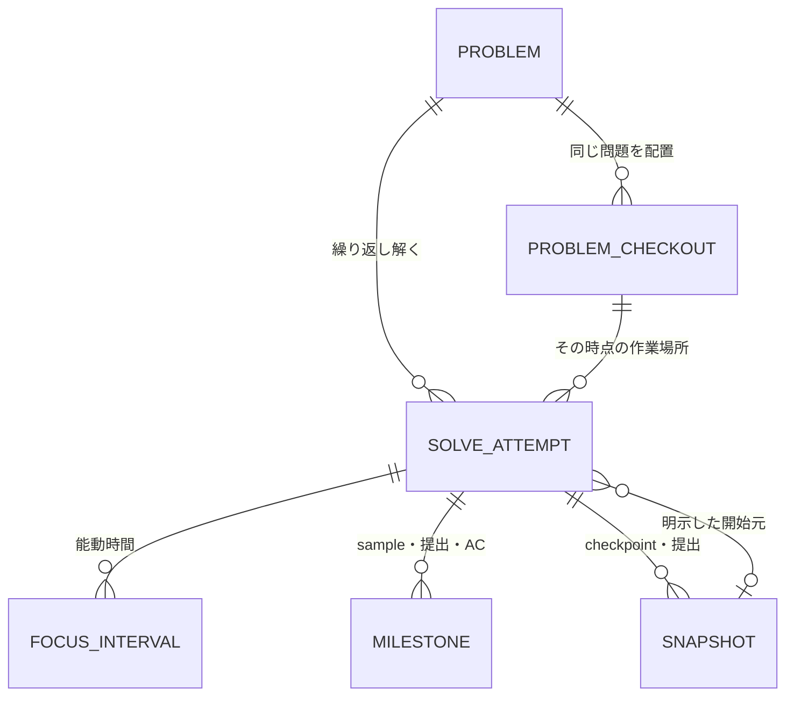
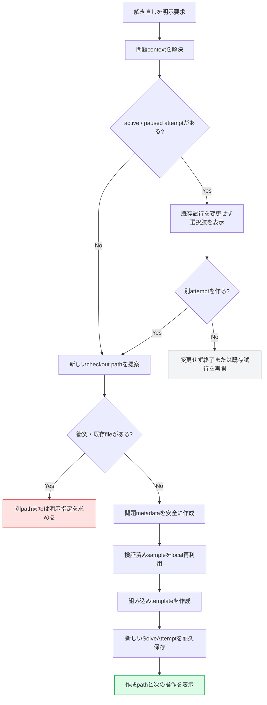

# AlgoLoom 解き直しworkflow設計

> 対象: 同じ問題をもう一度解くSolveAttempt、fresh workspace、過去snapshotとの比較、部分失敗からの回復
>
> 状態: MVP機能設計
>
> 作成日: 2026年7月20日
>
> 関連文書:
> - [製品ビジョン](../product/vision.md)
> - [MVPスコープ](../product/mvp.md)
> - [Core契約](../architecture/core-contracts.md)
> - [アーキテクチャ概要](../architecture/overview.md)
> - [言語・実行環境の可搬性設計](../architecture/language-and-platform-portability.md)
> - [外部学習資料参照設計](external-learning-resources.md)
> - [ストレスフリーUX設計](../quality/stress-free-ux-design.md)

---

## ドキュメント概要

本書は、同じ問題を白紙から解き直す操作を、過去のsource、時間、milestoneを壊さない新しいSolveAttemptとして扱うためのworkspace、履歴、CLI、冪等性、比較UXを定義します。

## 0. 結論

同じ問題の解き直しは**新しいSolveAttempt**として保存する。白紙からの解き直しでは、既存sourceを上書きせず、同じ正規問題IDを持つ新しいsibling directoryを既定で作る。

```text
algoloom_workspace/
├── abc300_a/          # 初回の作業directory
│   ├── <problem-metadata>
│   ├── main.cpp
│   └── test/
└── abc300_a--02/      # freshな解き直し用directory
    ├── <problem-metadata>
    ├── main.cpp
    └── test/
```

`--02`等のdirectory名は利用者の便宜であり、問題、履歴、SolveAttemptの恒久IDにはしない。両directoryはmetadata内の同じ正規問題IDから同一問題へ関連付け、DB内の別々のSolveAttempt、snapshot、milestoneとして比較する。

---

## 1. 目的と非目標

### 1.1. 目的

- 前回の完成codeを見ず、freshなtemplateから同じ問題へ再挑戦できるようにする。
- 初回と解き直しの時間、sample通過、提出、AC、source差分を上書きせず比較できるようにする。
- 別言語での再実装、過去snapshotからのrefactor、未完了問題の再挑戦を同じ履歴契約で扱う。
- filesystem上の整理方法と、DB上のSolveAttemptを分離する。
- workspace作成またはDB保存の途中失敗から、既存sourceを壊さず再実行できるようにする。

### 1.2. 非目標

- directory名をattempt番号または履歴IDとして解釈すること
- 前回のAC codeをfreshな解き直しへ自動copyすること
- 新しいSolveAttemptの開始時に既存のactive / paused attemptを暗黙に終了、pause、mergeすること
- 過去source、directory、snapshotを自動削除すること
- directory階層を利用者へ恒久的に強制すること
- すべての編集、test、file保存を自動versioningすること
- 解き直し回数や時間短縮だけからskill scoreを作ること

---

## 2. 用語

| 用語 | 本書での意味 |
|---|---|
| SolveAttempt | ある問題へ一度取り組む開始から終了までの論理的な学習記録。同じ問題の解き直しは別recordにする |
| problem checkout | ある問題のsourceを編集する一つの物理directory。移動・renameでき、同じ問題に複数存在できる |
| fresh revisit | 過去sourceをcopyせず、選択言語の組み込みtemplateから始める解き直し |
| snapshot-based revisit | 利用者が明示した自分の過去snapshotを新しいdirectoryへmaterializeして始める解き直し |
| in-place new attempt | 現在のdirectoryとsourceを使って新しいSolveAttemptを開始すること。fresh revisitとは区別する |
| origin snapshot | snapshot-based revisitの開始元として利用者が明示した不変snapshot |
| display ordinal | 同じ問題の`2回目`等を人へ説明する表示値。恒久IDではない |

---

## 3. 論理履歴と物理workspace

### 3.1. 関係



この図は論理関係を示すものであり、table名やcolumn名を確定しない。

### 3.2. データの権威

| データ | 権威 | 注意 |
|---|---|---|
| 編集中source | problem checkout上の通常file | DBは現在の編集bufferを管理しない |
| 問題の同一性 | judge + 正規問題ID | directory名や絶対pathを使わない |
| SolveAttempt状態・時間 | ローカル履歴DB | 前回recordを更新して再利用しない |
| checkpoint・提出source | 不変snapshot | checkout削除後も履歴として残る |
| checkoutの現在path | filesystemと端末local index | 共有・同期する恒久IDにしない |
| origin snapshot | 利用者が明示したsnapshot ID | fresh revisitでは存在しない |

### 3.3. directoryとSolveAttemptを1対1に固定しない

fresh revisitでは新しいdirectoryと新しいSolveAttemptを同時に用意するが、概念上は同一ではない。

- 一つのcheckoutを使って、後日新しいin-place attemptを始めてもよい。
- 一つのSolveAttemptの途中でdirectoryをrenameまたは移動しても、同じ試行として継続できる。
- checkoutを削除しても、保存済みSolveAttemptとsnapshotを削除しない。
- 同じ問題のcheckoutが複数ある場合、current directoryまたは明示pathから一意に解決し、勝手に一つを選ばない。

---

## 4. 開始方法

### 4.1. 開始mode

| mode | sourceの開始点 | directory | 主な用途 | 既定 |
|---|---|---|---|---|
| fresh revisit | 選択言語の組み込みtemplate | 新しいsibling checkout | 定着確認、白紙からの再挑戦 | Yes |
| snapshot-based revisit | 明示した自分のsnapshot | 新しいsibling checkout | refactor、別案、過去版からの再開 | No |
| in-place new attempt | 現在の保存済みsource | 現在のcheckout | 同じ実装の再検討、時間を分けた記録 | No |
| resume | 既存source | 既存checkout | paused attemptの継続 | 新規attemptではない |

fresh revisitを`redo`等の短い入口として提供できる。最終command名はCLI設計で決める。

```bash
# 概念例
aloom redo abc300_a
aloom redo abc300_a --language python
aloom redo abc300_a --from snapshot:<id>
aloom attempt start --in-place
```

### 4.2. fresh revisitの処理



実装順はtransaction境界とfileのatomic writeを考慮して機能設計で確定する。ただし、各段階を識別でき、再実行で既存sourceを上書きしないことを不変条件とする。

### 4.3. snapshot-based revisit

- 開始元は利用者自身の保存済みsnapshotに限定する。
- materialize前に問題、言語、logical source name、snapshot時刻を表示する。
- snapshot bytesを暗黙にformat、文字コード変換、改行変換しない。
- 元snapshotを変更せず、新しいcheckoutの通常fileとしてcopyする。
- 新しいSolveAttemptへ`origin snapshot`の関係を持たせても、元attemptの子として状態遷移させない。
- 他ユーザーのcodeまたは外部解説のsample codeを開始元としてimportする機能には流用しない。

---

## 5. directory layout

### 5.1. sibling directoryを既定にする

```text
algoloom_workspace/
├── abc300_a/
│   ├── <problem-metadata>
│   ├── main.cpp
│   └── test/
├── abc300_a--02/
│   ├── <problem-metadata>
│   ├── main.cpp
│   └── test/
└── abc300_a-python/
    ├── <problem-metadata>
    ├── main.py
    └── test/
```

| 選択肢 | 利点 | 欠点 | 判断 |
|---|---|---|---|
| 同じdirectoryのsourceをreset | directoryが増えない | 既存sourceの上書き・退避が必要で、fresh性と回復が曖昧 | 既定にしない |
| `problem/attempts/01`階層 | 問題単位で見た目をまとめやすい | metadata階層、context探索、working directoryが複雑になり、DB構造をfilesystemへ強制する | MVPでは採用しない |
| sibling checkout | 既存の1問題directory・1source契約を維持し、移動・renameしやすい | directoryとsampleが増える | MVPの既定 |

### 5.2. 命名

- 初回の推奨名は正規問題IDとする。
- fresh revisitでは`abc300_a--02`等、衝突しない候補を提示できる。
- 別言語では`abc300_a-python`、その再挑戦では`abc300_a-python--02`等を候補にできる。
- suffix、ordinal、directory名を履歴ID、問題ID、attempt IDにしない。
- 利用者が`review/abc300/a-second`等へrename・移動してもmetadataから認識する。
- 候補pathが存在する場合はmerge、rename、削除、上書きをせず、別候補または明示pathを求める。

### 5.3. sampleの再利用

- 同じ問題について、取得元と内容が検証できるlocal sampleを優先して再利用する。
- MVPでは可搬性と単純さを優先し、新しいcheckoutの`test/`へ安全にcopyできる。
- symlink、hard linkはOS、移動、削除の意味が変わるため既定にしない。
- local sampleが欠損・不整合なら、通常の`get`契約に従って1問分だけ再取得する。
- sample再利用または再取得の失敗は、既存checkoutと履歴を変更しない。

---

## 6. SolveAttemptと学習履歴

### 6.1. 保存契約

新しい解き直しでは、少なくとも次を前回から分離する。

- SolveAttempt ID、開始・終了状態
- FocusIntervalとactive duration
- 最初の公開sample通過
- 初回提出
- 初AC
- checkpointと提出snapshot
- submission operation、submission ID、verdict observation
- 使用したcanonical language ID
- 任意のorigin snapshot

前回のstarted_at、ended_at、duration、milestone、snapshotを上書きまたは新しいattemptへ付け替えない。

### 6.2. 比較

| 既定候補 | 比較するもの | 注意 |
|---|---|---|
| 前回のSolveAttempt vs 今回 | active duration、milestone、提出回数、snapshot差分 | 時間短縮だけを成長と断定しない |
| 初回AC vs 今回AC | algorithm、data structure、可読性、言語差 | 「最良版」を自動選定しない |
| 同じalgorithmの別言語 | canonical language、toolchain観測、source差分 | 実行時間を言語能力scoreにしない |
| origin snapshot vs 今回 | 明示した開始点からの変更 | fresh revisitには適用しない |

時間、hint、解説利用、使用言語、toolchain等の条件が異なるため、単一scoreへ縮約しない。履歴は本人が選んだSolveAttemptを中心に表示する。

### 6.3. 外部資料との関係

解説または他ユーザーの提出一覧を開く操作は、[外部学習資料参照設計](external-learning-resources.md)に従う。

- 外部本文または他ユーザーのcodeをSolveAttempt snapshotへ保存しない。
- 解説を見た後にfresh revisitすることを許容するが、利用有無を善悪として評価しない。
- 将来、参照eventを任意記録する場合も、browser起動と実際の閲覧・理解を混同しない。

---

## 7. active / paused attemptとの競合

新しいattemptを開始するとき、既存のactiveまたはpaused attemptを暗黙に変更しない。

| 既存状態 | 新しい解き直し要求 | 動作 |
|---|---|---|
| なし | fresh revisit | 続行できる |
| completed / abandonedのみ | fresh revisit | 続行できる |
| 同じ問題のactive | fresh revisit | resume、pause、finish、abandon、別attempt作成の選択を明示する |
| 別問題のactive | fresh revisit | 現在のactive attemptを示し、変更せず選択を求める |
| paused | fresh revisit | pausedを自動finishせず、残る状態を確認する |
| 状態破損・時計異常 | fresh revisit | 既存履歴を推測修正せず、診断と回復を先に示す |

複数attemptの同時activeを将来許可するかは別のCLI・状態設計事項とする。MVPでは「一度に主として一つの問題」という利用前提を維持する。

---

## 8. 冪等性と部分失敗

### 8.1. 段階

| 段階 | 耐久状態 | 再実行時の扱い |
|---|---|---|
| path提案のみ | file・DB変更なし | 再計算できる |
| directory作成済み | 空またはAlgoLoom所有の途中状態 | 所有markerと内容を検証して再開する |
| metadata保存済み | problem contextあり | 同じ問題・schemaと確認できれば再利用する |
| sample保存済み | test dataあり | 取得元とhashを検証して再利用する |
| template保存済み | sourceあり | 一度でも作成済みなら無断上書きしない |
| SolveAttempt保存済み | stable attempt IDあり | 同じ操作の再実行で重複attemptを作らない |
| browser / Editor起動失敗 | checkoutとattemptは利用可能 | 補助動作の失敗として表示する |

### 8.2. 不変条件

- 既存sourceを空file、template、snapshotで上書きしない。
- 同じfresh revisit操作の再実行で、複数directoryまたは複数SolveAttemptを無断作成しない。
- file作成に成功しDB保存に失敗した場合、認識可能な途中状態を残し、次回にrepairまたは安全なcleanupを案内する。
- DB保存に成功しfile作成が未完了の場合、attemptを通常開始済みと誤表示せず、checkout準備中または回復必要として区別する。
- cleanupが必要でも、利用者fileを自動削除しない。
- 別directoryに同じ問題metadataが存在しても、mergeまたは重複削除しない。

---

## 9. 成功表示とerror

### 9.1. 成功例

```text
新しい解き直しを開始できます。
問題: abc300_a
言語: cpp
場所: /path/to/algoloom_workspace/abc300_a--02
開始点: fresh template
```

内部のDB ID、transaction、sample copy等を通常成功出力へ列挙しない。詳細診断では、checkout、SolveAttempt、開始元を確認できるようにする。

### 9.2. 回復可能error例

```text
解き直し用のsourceは作成済みですが、SolveAttemptを開始できませんでした。
既存sourceは変更していません。
場所: /path/to/algoloom_workspace/abc300_a--02
次: 同じcommandを再実行して状態を確認してください。
```

出力順序は、主結果、追加失敗、影響を受けないもの、次の行動とする。

---

## 10. 段階的な実装

### Phase 1: MVPのfresh revisit

- problem checkoutの宣言的metadataとstable local identityを設計する。
- 同じ問題を持つsibling checkoutの安全な生成を実装する。
- fresh templateと検証済みlocal sampleの再利用を実装する。
- 新しいSolveAttemptを前回と分離して保存する。
- file / DBの各途中状態から再実行できるfault injection testを用意する。

### Phase 2: 比較UX

- 同じ問題の前回attempt、初回AC、最新AC等を比較候補として表示する。
- 言語、時間、milestone、snapshot差分を別の観点として示す。
- directory pathが変わってもproblem IDとstable recordから比較できることを確認する。

### Phase 3: 明示的な開始元

- 自分のsnapshotから新しいcheckoutをmaterializeする。
- origin snapshotと新しいSolveAttemptの関係をexport・同期契約へ追加する。
- 外部code importとは異なる権限・データ境界であることを維持する。

---

## 11. 実装チェックリスト

### Workspace

- [ ] fresh revisitが既存sourceを上書きしていない。
- [ ] 一つのcheckoutに選択した1言語のsourceだけを既定生成している。
- [ ] directory名、suffix、絶対pathをproblemまたはattemptの恒久IDにしていない。
- [ ] sibling checkoutを移動・renameしてもmetadataから再認識できる。
- [ ] 同じ問題の複数checkoutを勝手にmerge、rename、削除していない。
- [ ] symlink / hard linkをsample再利用の既定にしていない。

### 履歴

- [ ] 解き直しを新しいSolveAttemptとして保存している。
- [ ] 前回の時間、milestone、snapshot、verdictを上書きしていない。
- [ ] checkout削除を履歴削除として扱っていない。
- [ ] fresh revisitとsnapshot-based revisitを区別できる。
- [ ] 外部codeをorigin snapshotとしてimportしていない。

### 状態と回復

- [ ] active / paused attemptを暗黙に変更していない。
- [ ] 同じ操作の再実行で重複checkout・attemptを作っていない。
- [ ] file成功・DB失敗とDB成功・file失敗を区別して回復できる。
- [ ] cleanupで利用者fileを自動削除していない。

### 振り返り

- [ ] 前回と今回の比較対象を利用者が確認・変更できる。
- [ ] 時間の短さだけを成長と表示していない。
- [ ] 言語、hint、解説、toolchain等の条件差を単一scoreへ縮約していない。

---

## 12. 最終方針

解き直しの価値は、同じfileをresetすることではなく、**前回を残したまま新しい試行を始め、後から自分の理解と実装の変化を比較できること**にある。

```text
問題の同一性       → judge + 正規問題ID
学習の一回性       → SolveAttempt
現在の編集対象     → problem checkout上の通常source file
残すべき過去code   → 不変snapshot
人向けの整理       → 移動・rename可能なdirectory名
```

この分離により、利用者はfilesystemを自分の方法で整理しながら、AlgoLoomでは同じ問題の初回、解き直し、別言語実装を一貫した自己比較の履歴として扱える。
