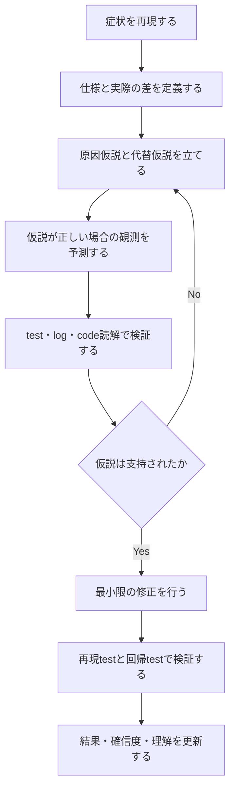

# AlgoLoom Repair Lab 将来構想

> 対象: 他者またはLLMが書いたcodeを読み、根拠ある仮説と検証によって修正する能力を、AlgoLoomの共通UXで鍛える将来の学習ワークフロー
>
> 状態: 将来構想。初期版の実装対象外
>
> 作成日: 2026年7月18日
>
> 関連文書:
> - [製品ビジョン](../product/vision.md)
> - [MVPスコープ](../product/mvp.md)
> - [Core契約](../architecture/core-contracts.md)
> - [Review Backend・LLM Provider設計](../features/llm-provider-design.md)
> - [セキュリティ設計ガイド](../quality/security-design.md)
> - [ストレスフリーUX設計](../quality/stress-free-ux-design.md)
> - [AIレビュー安全設計](../features/ai-review-safety-design.md)

---

## ドキュメント概要

本書は、他者またはLLMが書いたcodeを仮説と検証によって修正する将来の学習ワークフロー「Repair Lab」の学習サイクル、共通UX、安全境界、採用条件を定義します。

## 0. 結論

AlgoLoomは、MVPではAtCoderの終了済み過去問を対象に、問題取得、local test、明示checkpoint、提出、履歴、差分、exportからなるCoreを確実に実装する。AI reviewはMVP後の独立した採用判断とする。正確な範囲は[MVPスコープ](../product/mvp.md)を正とする。

その基盤が安定した後の将来構想として、他者またはLLMが書いたcodeを読み、症状から原因仮説を立て、検証可能な予測を示し、最小限の変更と回帰testによって修正を確かめる学習ワークフローを検討する。本書ではこの構想を仮に**Repair Lab**と呼ぶ。名称、command、画面、採点方式は確定事項ではない。

Repair Labは、AtCoder学習から切り替えて使う別application相当のmodeにしない。教材の種類と学習目的は異なっても、workspace、編集、test、履歴、差分、review、errorと回復の操作体系を共有する。共通UXへ自然に統合できない場合は、AlgoLoomの新機能として実装せず、別applicationとして分離すべきか再評価する。

Repair Labの目的は、bugを早く見つけることや、意図されたpatchを当てることではない。次の能力を反復して鍛えることである。

> 不完全な情報から根拠ある仮説を立て、反証可能な予測へ変換し、観測と実験によって確信度を更新してから修正する能力

単に高い確信度を持つことは評価しない。証拠が乏しい段階では確信度を抑え、追加の観測によって適切に更新できることを重視する。

---

## 1. 位置づけ

### 1.1. AtCoder学習との関係

AtCoderを対象とする学習とRepair Labは、学習目的と教材の責任境界を分ける一方、利用者の基本導線と操作体系を分離しない。

| 領域 | 主な対象 | 中心となる能力 |
|---|---|---|
| AtCoder学習 | 利用者自身が書いた解答 | 問題理解、algorithm選択、実装、提出後の振り返り |
| Repair Lab | 教材として提供された他者・LLM・検証済み生成code | code読解、原因切り分け、仮説検証、最小修正、回帰防止 |

Repair教材を利用していなくても、AtCoderのCore機能を完全に利用できる状態を維持する。Repair教材固有のdata、設定、依存関係は、Coreの起動、test、submit、log、show、diffを妨げてはならない。履歴は保存する対象を区別しても、探し方、表示、差分、reviewの操作感を共有する。

### 1.2. 共通UX契約

Repair Labを追加する場合、次を満たす。

- `repair mode`のような恒常的なglobal modeへ切り替えさせない。現在の教材はworkspace metadata等から安全に認識し、認識したcontextを表示する。
- 問題または教材の取得、通常fileの編集、test、履歴、snapshot表示、diff、reviewという既存のメンタルモデルを再利用する。
- 同じ意味の操作には同じcommand、option規則、成功表示、error、回復方法を使用する。
- 仮説、根拠、予測、確信度等の追加情報は、共通導線の必要な時点へ統合し、Repair専用の操作体系を別に構築しない。
- 外部提出の有無等、意味が本質的に異なる操作は無理に同じcommandへ統合しない。対象固有commandが必要な場合も、最小限に限定する。
- Editor、Viewer、terminal fallback、AIの利用有無に関するユーザーの選択を、AtCoder学習と同じように尊重する。外部toolの選択は既存toolの参照と一時起動を意味し、Repair Labの導入や実行によってEditor、plugin、shell、debugger、test framework等の永続設定を変更しない。
- 履歴の保存形式を内部で分離しても、利用者が別の履歴applicationを覚える状態にしない。

一貫性の対象はcommand名だけではない。対象を認識する方法、作業の始め方、結果の読み方、失敗後の戻り方までを含む。小規模検証では学習効果と同時にこの一貫性を確認し、大きく異なる操作体験が必要だと分かった場合はAlgoLoomへの統合を中止する。

### 1.3. 自分の過去codeだけに限定しない理由

自分のcodeでは、書いた時点の意図や前提を本人が知っている。他者またはLLMのcodeでは、次の実務的な不確実性が加わる。

- 命名、構造、設計判断が自分の慣習と異なる。
- 症状が現れる場所と原因が存在する場所が離れている。
- 一見不要な処理にも互換性や利用者との契約上の理由があり得る。
- 読みにくさ、好みの違い、correctness上の欠陥を区別する必要がある。
- 局所的な修正が、別の入力、呼び出し元、既存機能を壊す可能性がある。

この不確実性を扱うこと自体を、AtCoder学習とは異なる学習価値として設計する。ただし、その違いを別の操作体系として表現しない。

### 1.4. 用語

| 用語 | 本書での意味 |
|---|---|
| Repair Lab | 他者またはLLMが書いた検証済みcodeを題材に、原因仮説と検証による修正を練習する将来の学習ワークフロー。 |
| Core | 問題取得、local test、明示checkpoint、提出、履歴、差分、exportからなるMVPの中核機能。 |
| context | AlgoLoomが現在の処理対象として認識するworkspace、問題または教材、sourceの組み合わせ。 |
| 原因仮説 | 観測された症状を生んでいる処理や前提についての、検証前の説明候補。 |
| 反証可能な予測 | 仮説が正しい場合に得られる観測を示し、結果によって仮説を否定できる予測。 |
| 確信度 | 現在の証拠に基づき、仮説が正しいと考える主観的な見積もり。 |
| test oracle | test結果が期待どおりかを決定的に判定する基準または仕組み。 |
| 回帰test | 修正によって既存の正常動作が壊れていないことを確認するtest。 |
| mutation | 参照実装へ意図的な変更を加え、検証対象となる欠陥を作ること。 |
| sandbox | 未信頼codeが利用できるfilesystem、network、CPU、memory等を制限する隔離環境。 |

---

## 2. 学習サイクル

Repair Labでは、patchだけでなく、修正へ至る調査過程を一つの学習記録として扱う。

### 2.1. 修正前に記録するもの

後付けの説明だけを根拠とみなさない。構造化された学習を選んだ場合は、codeを修正する前に少なくとも次を記録する。

| 項目 | 内容 |
|---|---|
| 症状 | どの条件で、実際に何が起きたか |
| 期待 | 仕様または明示された契約上、何が起きるべきか |
| 原因仮説 | どの処理や前提が症状を生んでいると考えるか |
| 根拠 | code、test結果、log、trace、不変条件等の観測事実 |
| 代替仮説 | 他に説明可能な原因があるか |
| 予測 | 仮説が正しい場合、次の観測で何が起きるか |
| 確信度 | 現在の証拠に基づく主観的な見積もり |
| 次の検証 | 仮説を支持または反証するために何を行うか |

確信度は高いほど良い値ではない。証拠に見合っているか、検証結果を受けて適切に更新されたかを長期的に振り返るための値として扱う。

### 2.2. 修正後に記録するもの

- 実際に行った変更と、その変更が原因を除く理由
- 変更しなかった周辺処理と、その判断理由
- 修正前に失敗し、修正後に成功する再現test
- 既存の正常動作を壊していないことを確認する回帰test
- 当初の仮説が支持、反証、または一部修正されたか
- 検証後の確信度
- 同種の問題で次回先に確認する観点

---

## 3. 修正理由の分類

他者のcodeを自分の好みに書き換えることと、bug修正を混同しない。少なくとも次を区別する。

| 分類 | 意味 | 必要な根拠 |
|---|---|---|
| Correctness fix | 現在の挙動が仕様または契約に反している | 再現条件、期待値、失敗原因、修正後の検証 |
| Risk reduction | 現在は動くが、具体的な将来障害や安全上のriskを減らす | 想定条件、影響範囲、riskが成立する根拠 |
| Refactoring | 外部挙動を変えず、理解・変更・testを容易にする | 挙動不変の確認と改善対象の説明 |

「自分ならこう書く」「短く書ける」「一般的にこちらがきれい」といった好みだけをCorrectness fixの理由にしない。

---

## 4. 教材と正しさの根拠

### 4.1. 教材の段階的な採用

| 種類 | 方針 |
|---|---|
| 手作りの検証済み教材 | 初期のRepair Labで優先する。仕様、bug、test、解説を一貫して管理する |
| 参照実装への意図的な変異 | mutationの種類と影響を記録し、test oracleで期待どおりの失敗を確認できる場合に利用する |
| LLM生成code | 出所を明示し、人間または決定的な検証工程で仕様、失敗条件、test、原因を確定した後に利用する |
| 実在する第三者code | license、帰属、個人情報、secret、文脈、再配布条件を確認できる教材だけを利用する |
| 利用者投稿教材 | moderation、license、悪意あるcode、品質保証、削除手順を設計した後の候補とする |

他者のcodeを無断で収集・再配布しない。実在する障害や脆弱性を教材化する場合は、公開範囲、悪用可能性、修正状況を別途確認する。

### 4.2. LLMの責任境界

LLMは、仮説を深める問い、代替仮説、追加testの候補、説明の曖昧さへのfeedbackを返す補助役として利用できる。一方、次を守る。

- LLMが生成したcodeを、未検証のまま正解付き教材として配布しない。
- codeを生成したLLMの自己評価だけで、教材または利用者のpatchの正しさを確定しない。
- LLMの説明と、test・仕様・静的検査等による確認済み事実を区別して表示する。
- LLMに完成patchを直ちに提示させず、利用者が選択した段階的hintとして扱う。
- remote Providerへの送信範囲と同意は、既存のReview Backend設計に従う。

教材の正しさは、可能な限り明示された仕様、再現可能なtest、決定的なoracleを中心に確認する。LLMを唯一の採点者にしない。

---

## 5. 評価と成長履歴

### 5.1. 評価する対象

最終的なpatchが想定patchと一致したかだけで採点しない。複数の正しい修正を受け入れられるよう、外部挙動と根拠を中心に評価する。

- 症状を安定して再現できたか
- 仕様と実際の挙動の差を正確に説明できたか
- 仮説が具体的で反証可能だったか
- 仮説から観測可能な予測を導けたか
- testやlogが仮説の識別に役立ったか
- patchが必要な範囲に限定されているか
- 再現testと回帰testを残したか
- 結果を受けて仮説と確信度を更新したか

速さ、修正回数の少なさ、hint未使用だけを成功指標にしない。誤った仮説を低costで反証し、より良い仮説へ移れたことも有効な学習として扱う。

### 5.2. 将来の可視化候補

十分な記録と検証精度を確保できた場合、単なる言語・algorithm別の正答率に加えて次を可視化できる。

- 再現testを作る前に修正を始める傾向
- 最初の仮説へ固執する傾向
- 代替仮説を検討できた割合
- 局所修正による回帰を見落とす傾向
- 根拠の種類と、原因特定への寄与
- 申告した確信度と、検証結果の長期的な較正

これらは人格や固定的な能力の断定に使わない。観測可能な行動、対象件数、根拠、確信度を併記し、利用者が次の練習を選ぶための情報として扱う。

---

## 6. 自由と共通UX内の訓練支援

通常のAtCoder学習と同様に、学習順序やAIの利用を必要以上に規定しない。利用者が構造化された訓練を明示的に選んだ場合は、共通導線の中で修正前の仮説記録や段階的なhintを提示できる。ただし、別のEditor、別の履歴UI、Repair専用のcommand体系、恒常的なmode切替を要求しない。

仮説を修正前に記録する等の教材固有のstepは、学習目的に必要な追加情報として扱う。既存操作と無関係なwizardや長い固定flowにせず、利用者が現在地、必要な理由、次の操作を既存の出力規約で理解できるようにする。

同時に、調査方法を一つに固定しない。Editor、debugger、test framework、static analyzer等は、教材の安全な実行条件を満たす範囲で利用者が選択できるようにする。

---

## 7. 安全性

Repair Labは第三者または生成codeを実行し得るため、通常のAtCoder sample test以上の安全設計を必要とする。

- 未信頼codeをhost上で無制限に実行しない。
- network、filesystem、process、CPU、memory、実行時間、出力量の制限を設計する。
- 教材にcredential、個人情報、実在環境のsecretを含めない。
- 外部processと隔離環境の対応OS、保証範囲、既知の制約を明示する。
- 安全な実行環境を提供できない段階では、未信頼codeの自動実行を実装しない。

具体的なsandbox方式とthreat modelは、実装判断時に[セキュリティ設計ガイド](../quality/security-design.md)へ追加する。

---

## 8. 段階的な実装判断

### Phase 0: AtCoder Core

- 問題取得、test、提出、履歴、差分、任意reviewを安定させる。
- Repair Labを初期版の必須機能または導入条件にしない。

### Phase 1: 学習価値の小規模検証

- 少数の手作り・検証済み教材を使う。
- commandや画面を確定する前に、仮説を先に記録する手順が実際の学習に役立つか確認する。
- patchの速さではなく、根拠、予測、test、振り返りを評価する。

### Phase 2: 共通UXへの統合と履歴

- AtCoderの提出履歴と内部で混同しないRepair attemptの保存境界を設計しつつ、履歴の探し方、表示、差分、reviewの操作感を共有する。
- 症状、仮説、根拠、予測、確信度、実験、patch、検証結果をrevisionとして保持する。
- 複数の正しいpatchを受け入れる判定方法を検証する。
- global modeやRepair専用のcommand体系を導入せず、共通context認識と日常操作へ統合できることを検証する。

### Phase 3: 教材生成と個別化

- test oracleで検証できるmutationを段階導入する。
- LLMは教材候補生成とfeedbackへ利用できるが、決定的な検証を通す。
- 十分な件数と精度が得られた行動だけを、根拠付きの練習候補へ利用する。

---

## 9. 現時点の非目標

- 初期版のAtCoder Coreと同時にRepair Labを実装すること
- 大量のbug問題をLLMで自動生成し、無検証で配布すること
- 想定patchとの文字列一致だけで正誤を判定すること
- 速さや一発正解だけを競うgameにすること
- 高い確信度そのものを良い成績として扱うこと
- 利用者の好みとcorrectness上の問題を混同すること
- 少数のattemptから「debugが苦手」等の固定的評価を断定すること
- 未信頼codeを十分な隔離なしで自動実行すること
- 他者のcodeをlicenseや出所の確認なしに収集・再配布すること
- Repair教材のために恒常的なglobal modeへ切り替えさせること
- AtCoder学習とは別のEditor、履歴UI、command体系、error規約を作ること
- 意味の異なる操作へ同じcommand名を割り当て、見かけだけを統一すること

---

## 10. 実装開始の判断条件

少なくとも次を満たしてから、正式な機能設計へ進む。

1. AtCoder Coreの主要導線と履歴保存が安定している。
2. 手作り教材で、構造化された仮説・検証サイクルの学習価値を確認できている。
3. 教材の仕様、test oracle、version、出所、licenseを管理できる。
4. 未信頼codeの実行に必要な隔離とresource制限を定義できる。
5. patchだけでなく、仮説、根拠、予測、検証を保存するdata modelを設計できる。
6. LLMを唯一の正しさの根拠にしない評価方法を用意できる。
7. AtCoder学習と同じ基本導線、操作体系、出力、履歴、回復方法へ統合できる。

これらを満たすまでは、Repair Labを製品上の確約機能として扱わず、将来の差別化仮説として検証を続ける。学習価値があっても共通UXを保てない場合は、AlgoLoomへ無理に追加せず別applicationとして扱う。
