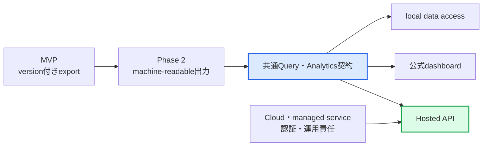

# AlgoLoom ロードマップ

## ドキュメント概要

本書は、AlgoLoomの製品フェーズ、MVP後の拡張候補、任意Capabilityの正式採用条件、長期候補を定義します。記載する候補は実装を確約するbacklogではありません。

## 1. 用語

| 用語 | 本書での意味 |
|---|---|
| Core | MVPで提供する、AIやCloud同期等の任意機能に依存しない中核機能。 |
| Adapter | Coreを特定のEditor、Viewer、外部サービス等から分離する接続境界。 |
| 製品フェーズ | 製品全体として、どの価値と範囲を優先するかを示す大区分。 |
| 局所Phase | 個別の設計文書内だけで有効な実装・検証順序。製品フェーズとは番号を共有しない。 |
| 昇格条件 | 将来候補を正式な製品範囲へ含める前に満たすべき条件。 |
| opt-in | 利用者が明示的に選択した場合にだけ機能を有効にする方式。 |
| fail closed | 安全性を判定できない場合に、処理を許可せず停止する方針。 |
| bootstrap | 同期先の既存データから端末の初期状態を構築する処理。 |

## 2. 製品全体のフェーズ

本書のフェーズは製品全体の優先順位を示す。各機能・配布・運用文書にある`Phase 1`等は、その文書内だけの局所Phaseであり、本書の製品フェーズとは別に扱う。MVPの正式な範囲と完了条件は[AlgoLoom MVPスコープとCore契約](./mvp.md)を正本とする。

| 製品フェーズ | 目的 | 主な対象 | 次へ進む判断 |
|---|---|---|---|
| Phase 1: MVP Core | AtCoderの終了済み過去問について、問題開始から履歴の振り返りまでの主要導線を成立させる。 | `get`、`test`、任意の学習時間計測、freshな解き直し、checkpoint、`submit`、`log`、`show`、`diff`、公式問題・解説ページへのbrowser参照、export | MVP文書の実装開始条件と完了条件を満たす。 |
| Phase 2: Core安定化・近接拡張 | Coreの意味を変えず、実需に基づいて日常利用と対応範囲を改善する。 | 問題選択支援、問題・解法タグ、履歴検索、他ユーザーのAC提出一覧へのbrowser参照、公開用solution bundle、追加host・言語・build方式、外部Adapter、backup・restore等 | install、日常command、offline履歴を複雑にせず追加できることを候補ごとに確認する。 |
| Phase 3以降: 任意Capabilityの検証・採用 | Coreから分離した任意機能について、価値、安全性、配布可能性を個別に検証する。 | AI review、Cloud同期、Repair Lab | 各Capability固有の昇格条件を満たしたものだけを正式な製品範囲へ含める。 |
| 長期候補 | 現在の製品範囲を前提にせず、需要を確認して構想を具体化する。 | 学習データアクセス基盤、Web dashboard、Hosted API、managed service等 | 実需、Coreとの境界、運用・安全上の成立性を確認してから製品フェーズへの昇格を判断する。 |

Phase 2の各候補は実装を約束するbacklogではなく、すべての候補を完了することもPhase 3以降の開始条件ではない。Phase 3以降のCapabilityは相互に必須順序を持たない並行トラックとし、それぞれの前提と昇格条件が満たされた時点で個別に採否を判断する。

## 3. Phase 2: Core安定化・近接拡張

| 候補 | ねらい | 検討時の条件 |
|---|---|---|
| 履歴のインタラクティブ検索 | `log`や`show`で、fzfライクなインクリメンタル検索UIから過去の試行を探せるようにする。 | fzfの導入を必須にせず、非interactiveな既存導線を維持する。 |
| AtCoder Problems catalogと問題選択支援 | 問題catalogと絞り込みを使い、terminal内から問題を選択できるようにする。 | catalog障害や未導入を理由に、公式URLまたは問題IDを使うCore導線を止めない。 |
| 問題タグ・SolveAttempt解法タグ | 「二分探索」「動的計画法」等を複数付与し、過去の実装の振り返りと明示的な分野別練習へ使う。 | 問題一般の分類と今回実際に使った解法、user / external curated / AI suggestionの出典を分離する。外部タグは未AC時のspoilerになり得るため既定で隠し、単一カテゴリ列や自動的な苦手判定へ縮約しない。 |
| 他ユーザーのAC提出一覧への外部参照 | current problem、AC、current language等で絞り込んだAtCoder提出一覧をdefault browserで開き、別実装から学べるようにする。 | 他ユーザーのcode本文・author・submission IDやCookieを取得・保存せず、未AC時のspoiler確認、contest状態、browser障害を[外部学習資料参照設計](../features/external-learning-resources.md)に従って扱う。 |
| 追加host環境 | WSL等、MVP外のhost環境へ対応範囲を広げる。 | 既存の`HostPlatform`契約と検証matrixを弱めない。 |
| 追加の解答言語 | C++、Python、Go、Rust以外の言語を追加する。 | 既存の`LanguageProfile`契約と共通テストを適用できる。 |
| project build | Cargo、Go module、CMake等を使うprojectを扱えるようにする。 | 単一sourceの既定導線を複雑にせず、実行範囲と設定の安全性を定義できる。 |
| local peak memory計測 | local testでpeak RSS等の最大memory観測を参考表示し、極端な確保へ気付けるようにする。 | native macOS、Linux、Windowsごとに値の意味、子process範囲、単位、取得方法を検証する。未対応・取得失敗を`0`やtest失敗にせず、judge memoryや他環境と同一条件で比較しない。 |
| 外部Editor / Diff Viewer Adapter | Core互換性とは分離して、利用者が既に導入した代表的な外部toolの選択、process-localな呼出方法、設定例を実需に応じて追加する。 | 公式連携の有無をEditorでのCore利用可否と混同せず、個別EditorやViewerの機能をCoreへ組み込まない。Editor本体、plugin、ユーザー設定をinstall、update、変更しない。 |
| 詳細local test eventと自動checkpoint | MVPで記録する「最初の公開sample通過」だけでなく、複数回のlocal test履歴と、利用者が選択した場合のevent駆動checkpointを検討する。 | opt-inとし、Editorの未保存bufferは扱わない。明示pause、明示test、最初の全sample通過等の候補event、保存範囲、保持方針、重複表示、SolveAttempt・milestone・必須submission snapshotとの違いを明確にする。 |
| 継続timer表示と外部連携 | 明示的な`status --watch`相当やmachine-readable出力により、希望者がshell prompt、task runner、将来のEditor連携から現在状態を確認できるようにする。 | 秒単位の常時表示を既定にせず、常駐daemon、Editor plugin、外部設定変更をCore要件にしない。時間計測を使わない利用者へ案内を繰り返さない。 |
| 自己振り返り分析 | 同じ問題のfreshな解き直し、snapshotからの再開、言語別、期間別等で、本人のSolveAttempt、時間、提出、差分を振り返る。 | [解き直しworkflow設計](../features/revisit-workflow.md)の履歴分離を維持し、他者rank、公開skill score、単一の成長scoreへ変換せず、時間の短さだけを成長とみなさない。 |
| AtCoder既存履歴のread-only import | AlgoLoom導入前の提出履歴を参照できるようにする。 | AlgoLoomが記録した履歴と外部から取得した履歴を混同しない。 |
| 自動backupとrestore UX | local履歴を安全に退避し、回復しやすくする。 | 同期とは別の責任として設計し、復元時に成功済みデータを失わない。 |
| 公開用solution bundle | 明示選択した自作sourceを、GitHub等へ利用者自身が公開する前の最小構成としてlocalへ切り出す。 | 完全版`export`と分離し、一問・一source、allowlist、終了済みcontest、source originとhashのpreview、secret・外部content・履歴の除外、原子的生成を検証する。GitHub認証、repository作成、commit、push、visibility変更は実装しない。詳細は[公開用solution bundle将来設計](../features/public-solution-bundle-design.md)を参照する。 |
| machine-readable出力と高度なshell / Editor integration | script、task runner、将来のEditor plugin等からCore機能を利用しやすくする。 | 人向けCLIを非公式にparseさせず、その意味と終了statusを変えないversion付き出力契約を定義する。alias、completion、Editor連携は設定例・生成手順を優先し、外部設定を通常commandから編集しない。 |
| 境界づけられたuser preference | 表示、反復入力の既定値、AlgoLoomが利用する既存外部toolの参照と一時的な呼出方法等を、利用者の環境へなじませる。 | 利用者検証で反復的な摩擦を確認し、user preferenceなしの標準導線、Coreの意味と安全契約、旧設定の互換性、設定errorの局所化を維持する。外部tool本体や永続設定をカスタマイズ対象にせず、shellで自然に実現できるalias等は標準toolへ委ねる方法を先に検討する。 |

## 4. Phase 3以降: 任意Capabilityの検証・採用

| Capability | 開始前提 | 正式採用の判断 | 詳細 |
|---|---|---|---|
| AI review | Coreのsnapshot、verdict、diff参照契約が安定している。 | ルール適合、安全な問題識別、権限制約、Provider障害からの分離をすべて確認できる。 | [4.1. AI review](#41-ai-review) |
| Cloud同期 | 標準SQLiteのSchemaとmigrationが安定している。 | 複数端末、offline、競合、bootstrap、disable、配布可能性を検証できる。 | [4.2. Cloud同期](#42-cloud同期) |
| Repair Lab | AtCoder Coreが安定し、共通UX上で小規模な学習価値を検証できる。 | 学習記録の価値と未信頼codeの実行安全性を確認し、Coreと自然に統合できる。 | [4.3. Repair Lab](#43-repair-lab) |

### 4.1. AI review

AI reviewはMVP後の独立した採用判断とする。採用後もCoreへ組み込まず、次をすべて満たした場合だけ正式なoptional Capabilityとして提供する。

- 現行のAtCoderルールをversion付きで確認し、不明時にfail closedにできる。
- 終了済み過去問を安全に識別できる。
- 利用者が送信内容、Provider、費用、保持方針を確認できる。
- reviewを使わなくても同じCore導線が成立する。
- AIがsourceを自動編集、実行、提出しない権限制約がある。
- CoreはAI reviewの型、Provider、設定、保存状態へ依存せず、AI reviewだけがCoreの安定したsnapshot・verdict・diff参照契約へ一方向に依存する。
- AI reviewの保存はCoreのsubmissionやsnapshotへ任意列を追加せず、独立した追記型revisionとして関連付ける。
- Provider未導入、設定不足、判定拒否、timeout、response不正のいずれでも、Coreの成功済み状態を変更しない。

### 4.2. Cloud同期

Cloud同期は標準SQLiteのSchemaとmigrationが安定した後に試作する。

- Turso SDKを基本packageへ必須化しない。
- 2端末、offline、競合、強制終了、bootstrap、disableを検証する。
- 同期はbackupの代替にしない。
- 同期の導入前後で`log`、`show`、`diff`の意味を変えない。
- SDKが未成熟または配布不能なら同期公開を延期し、MVP Coreへ影響させない。

### 4.3. Repair Lab

Repair LabはAtCoder Coreとは異なる教材を扱うが、別application相当のmodeにはしない。仮説、根拠、予測、検証、確信度更新を保存する学習価値と、未信頼codeの実行安全性を確認してから正式設計へ進む。詳細な段階的実装判断は[Repair Lab 将来構想](../future/repair-lab-future-design.md)で定義する。

共通UXへ自然に統合できない場合は、AlgoLoomへ無理に追加せず、別applicationとして分離すべきか再評価する。

## 5. 長期候補

| 候補 | 構想 | 製品フェーズへ昇格する前の確認 |
|---|---|---|
| 学習データアクセス基盤 | version付きexportとPhase 2のmachine-readable出力を起点に、本人の学習履歴と説明可能な派生指標を、保存Schemaに依存しない共通Query契約から提供する。 | Coreの履歴の意味が安定し、観測事実と派生指標、定義version、母数、coverage、欠損を説明できる。DB Schemaや単一skill scoreを公開契約にしない。 |
| local data access | libraryまたはread-only localhost API等により、Cloud accountなしで本人のローカル履歴を個人用UI、script、LLM等から参照できるようにする。 | offline、無料、最小権限、daemon非必須を維持し、source本文を集計とは別の機微scopeとして保護できる。 |
| Web dashboard | 共通Query契約を利用し、チャート等を用いた標準UIをreference clientとして提供する。 | CLIとoffline履歴の価値を弱めず、指標の根拠、自己比較中心の原則、accessibility、Web公開時の認証・Security・運用責任を定義できる。 |
| Hosted API | 認証済みの本人へ同期済み学習データをnetwork経由で提供し、個人作成frontendや外部toolから利用できるようにする。 | Cloud上のデータ権威、user ownership、認証、scope、versioning、privacy、rate limit、無料提供の継続可能性を検証できる。初期はread-onlyとする。 |
| managed service | 同期、Hosted API等の運用をAlgoLoom側で提供する可能性を検討する。 | 利用者需要、費用、認証、法務、privacy、OSS版との責任境界を確認できる。 |

共通Query契約をdashboardより先に定義し、公式dashboard、個人用frontend、外部toolを同じ契約の利用者として扱う。local data accessと公式dashboardは実需に応じて前後または並行できるが、Hosted APIはCloudとmanaged serviceの認証・privacy・運用責任が成立した後に公開する。詳細は[学習データアクセス・可視化API将来設計](../features/learning-data-access-api-design.md)を参照する。

---
