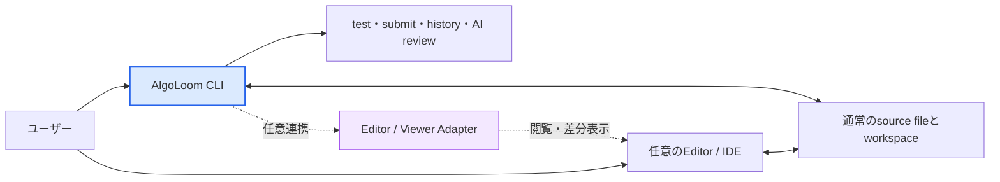

# プロジェクト草案: AlgoLoom

> MVPに含める能力、対象利用者、初期対応環境は[MVPスコープ](mvp.md)、履歴と提出のCore契約は[Core契約](../architecture/core-contracts.md)を正本とする。本書はMVP後を含む製品全体の構想を扱う。

## 1. プロジェクトの目的
アルゴリズムという思考の糸を、ターミナル上で丁寧に織り上げるためのローカルファーストCLIツール。
ブラウザの往復を最小限に抑え、特定のエディタやIDEに依存せず、ユーザーが使い慣れた環境でコーディング・テスト・提出・AIレビュー・成長履歴の管理をシームレスに行う学習基盤を構築する。

AlgoLoomは、ユーザーがコードを書く道具やAIの利用範囲を決めない。ユーザー自身が、自分にとって最も集中しやすいエディタ、IDE、ターミナル、AI支援の組み合わせを選択できることを重視する。

## 2. 用語

| 用語 | 本書での意味 |
|---|---|
| ローカルファースト | 日常操作と履歴参照を端末内で完結でき、Cloudやネットワークを通常経路の必須依存にしない設計方針。 |
| Core | 問題取得、local test、履歴、提出、保存等、Editorや任意機能に依存せず利用できるAlgoLoomの中核機能。 |
| workspace | 利用者がsource fileを編集し、AlgoLoomが問題に関する作業対象として扱う通常のdirectory。 |
| Adapter | Coreを特定のEditor、Viewer、Review Backend等から分離するための接続境界。 |
| Review Backend | local Model API、Cloud API、Coding Agent Bridge等のAI review接続先を共通に扱う境界。 |
| snapshot | 提出や振り返りの時点におけるsource codeの保存内容。 |
| データの権威 | あるデータについて、正しい状態を最終的に決定する唯一の取得元または記録。 |
| fallback | 任意の外部ツールが未設定または利用不可でも、Coreの操作を継続するための代替手段。 |
| 環境非侵襲性 | AlgoLoomが所有しないEditor、shell、plugin、toolchain、Provider runtime、OS設定等を、通常操作によって永続的に変更しない性質。 |

## 3. 中核となる設計思想

### 3.1. エディタ非依存

AlgoLoomは、Neovim、Vim、VS Code、Emacs、Helix、Zed等、特定のエディタやIDEを必須としない。ワークスペースには通常のディレクトリとソースファイルを作成し、編集方法をユーザーへ委ねる。

#### Coreの独立性

- `get`、`test`、`submit`等の主要コマンドは、エディタ連携がなくても利用できる。
- AlgoLoom Coreは、特定エディタのコマンド、設定形式、plugin APIを知らない。

#### 表示とfallback

- `show`と`diff`は、設定されたEditor / Viewer Adapterを介して外部ツールを利用する。
- 外部Viewerが未設定または利用不可の場合も、`show`はterminal上のplain text、`diff`はunified diffで表示できるfallbackを用意する。

#### 外部環境の保護

- 外部toolの選択は、利用者が既に導入したtoolをAdapterから一時的に呼び出すことを意味し、そのtool自体をAlgoLoomが管理または再設定することを意味しない。
- AlgoLoomは通常操作で、Editor / IDE本体、plugin、shell設定、toolchain、Provider runtime、ユーザー設定をインストール、更新、変更、削除しない。
- Neovim等への最適化は、AlgoLoomが設定を直接適用するのではなく、任意のAdapter、設定例、生成した設定断片、利用者が実行できる手順として提供し、Coreの必須依存にしない。
- 将来、外部環境への設定支援を自動化する必要が生じても、通常操作から分離した明示操作とし、変更対象、差分、backup、冪等性、rollbackを確認できない構成では実行しない。まず設定断片の生成と案内で解決できないかを優先して検討する。

### 3.2. ユーザーの主体性とLLM

LLMがコードを生成できる時代でも、人間が自ら考えてコードを書く行為をAlgoLoomの中心から外さない。一方で、AIを使わないことを利用者へ強制もしない。

- 自分ですべて書く。
- エディタの補完だけを利用する。
- 設計相談や提出後のレビューだけにLLMを利用する。
- AI支援を利用しない。

これらを等しく有効な利用方法として扱う。コーディングを始めるまでの摩擦を下げることは、単なる効率化ではなく、ユーザーが自分の思考と技術でコードを書き、人間としての限界へ挑戦し続けられるUXにつながる。

AlgoLoomのAIレビューは任意機能とし、ユーザーのコードを自動編集、自動実行、自動提出する主体にはしない。AlgoLoomは学習者の代わりに問題を解くのではなく、学習者が選んだ道具と進め方を支える基盤である。

#### AIレビューの目的

AlgoLoomのAIレビューの目的は、主として終了済み過去問について、**自分で書いた解答を次の一問で使える知識へ変えること**である。AIによる採点や完成解答の生成を主目的にせず、利用者自身の実装、test結果、提出結果、過去の実装snapshotを材料に、正誤判定だけでは得られない振り返りを支援する。

- ACした実装について、計算量の余裕、境界値、可読性、言語固有のidiom等、正誤判定の外側にある観点を学ぶ。
- 自分の実装と、同じalgorithmの別表現、別のdata structure、異なるalgorithm等を比較し、優劣の断定ではなくtrade-offを理解する。
- WA、TLE、RE、CE等について、完成codeを直ちに受け取るのではなく、原因候補、根拠、追加で試すtest、段階的なhintから自分で修正する力を育てる。
- 初回提出からACまでの実装差分や、同じ問題に対する過去の提出を振り返り、何を理解し、何を変更し、どの課題を繰り返しているかを確認する。複数問題を横断する成長分析は、各問題の安全判定と送信範囲を設計した後の拡張とする。
- 個別の指摘を今回限りの修正で終わらせず、次の問題へ持ち越せる原則、言語知識、確認習慣として整理する。

実装履歴は単に古いcodeを保存するためのものではなく、利用者自身の試行錯誤と成長を振り返る学習資産として扱う。AlgoLoomは、現在のcodeだけを単発でreviewする機能よりも、提出履歴、判定、差分、過去のreviewを結び付けた継続的な振り返りに固有の価値を置く。

AI reviewは常に有益な指摘を返せるとは限らない。重要な改善点を確認できない場合に無理に批判を生成させず、correctness上の疑い、performance上の懸念、readabilityの提案、style上の好み、代替案を区別する。利用者が根拠を確認して採否を決めるための助言として表示し、正解、採点、公式解説、人間のreviewerの代替とはみなさない。

学習者の主体性を守るため、AI reviewは利用者が明示的に求めたときだけ実行する。提出のたびに自動実行せず、完成した別解codeの一括提示や自動適用よりも、少数の重要な観点、実装間の差とtrade-off、利用者自身が考えるための問いを優先する。AtCoderの現行ルールと個別contest ruleをreview前に確認し、禁止対象または判定不能な場合は実行しない。

AIレビューの接続先も、エディタと同じくユーザーが選べる道具として扱う。local Model API、ユーザー自身のAPI credentialを使うCloud API、Providerが公式に組み込みを認めるCoding Agent Bridgeを同じReview Backend境界の後ろへ置く。一方、subscriptionとAPI認証は別の製品経路として区別し、Providerの許可なくlogin情報やOAuth tokenを転用しない。credentialは可能な限りユーザーまたは外部runtimeが所有し、AlgoLoomは安全判定、送信同意、review-onlyの権限制約を担う。

### 3.3. シンプルさとユーザーの自由

AlgoLoomは、初心者を助けるために学習手順を固定したり、利用者を特定の操作方法へ閉じ込めたりしない。CLIの敷居は、案内やモードを増やすことではなく、日常操作で覚える必要がある概念、入力、設定を減らすことで下げる。

#### 日常操作のシンプルさ

- Coreの機能と日常操作は小さく保ち、1つの操作へ複数の目的を持たせすぎない。
- 安全に推測できる値には自然な既定値を用意する。ただし、暗黙の判断を隠さず、必要な利用者は明示的に上書きできるようにする。
- 通常の成功出力は簡潔にし、詳細情報はhelp、明示option、診断command等から必要なときに取得できるようにする。

#### 待機と内部複雑性

AlgoLoomは、利用者の主目的に不要な外部通信、保守処理、任意機能を、その目的を達成するまでの必須経路へ置かない。ローカルで確定できる結果はローカルから直ちに返し、後から安全に実行または再試行できる補助処理は、主目的の完了から分離する。

一方、非同期化や簡潔な表示のために、提出、保存、外部送信、判定待ち等の状態を曖昧にしない。内部のmodule名、stack trace、Provider固有の詳細を日常表示へそのまま出す代わりに、利用者の目的が達成されたか、何が保存されているか、外部作用が発生したか、次に何をすればよいかを平易に示す。

| 処理の性質 | 基本方針 |
|---|---|
| ローカルだけで主目的を満たせる | 無関係なnetwork、同期、保守を待たずに結果を返す |
| 外部通信やcode実行が主目的に必要 | 現在の段階、時間上限、停止可否、後続の確認方法を示す |
| 主目的の後に実行できる補助処理 | 中断時に失ってはならないdataがあれば先に耐久保存して分離し、失敗してもCoreの成功済み状態を変更しない |
| 安全性、privacy、データ完全性、外部作用の確定に必要 | 速さのために省略またはbackground化せず、完了の有無を確認し、確定できなければ状態不明と伝える |

実装上のasync APIやbackground processの採否自体を目的にしない。利用者へ制御を返す安全な境界を先に定め、その境界より前に必要な耐久保存、同意、状態確定を完了させる。

#### 選択の自由と任意機能

- コマンドの実行順序、エディタ、言語、AIの利用有無、問題の選び方、振り返り方を必要以上に規定しない。
- 任意機能は、未設定であってもCoreの利用を妨げず、有効化を繰り返し要求しない。
- 初心者向けの使いやすさをAIへ依存させない。AIがなくても、主要操作、help、エラーからの復旧を理解できるようにする。

#### 安定した中核と境界づけられたカスタマイズ

AlgoLoomは、ユーザーカスタマイズを行わなくても、開発者が設計した一貫性のある標準UXでCore操作を利用できる状態を維持する。そのうえで、個人差、端末差、AlgoLoomが利用する既存toolの選択、反復入力の摩擦を減らすために、必要性が確認できた範囲だけをユーザーがカスタマイズできるようにする。

> 核は一つ、周辺は選べる。

- カスタマイズは、製品側が決めるべき標準UXを利用者へ設計させるためではなく、繰り返し発生する個人的・環境的な摩擦を減らすために提供する。
- 表示上の好み、既定の入力、AlgoLoomが利用する既存Editor / Viewer等の選択と一時的な呼出方法、明示的に選ぶ任意Capabilityは、Coreから分離できる範囲でカスタマイズ対象にできる。外部tool本体やその設定はカスタマイズ対象に含めない。
- commandの意味、成功・失敗・状態不明の区別、データの権威、履歴の不変条件、再実行の安全性、privacy、外部送信や提出への同意は、ユーザー設定によって変更できる対象にしない。
- shell、Editor、OS等の標準機能で自然に実現できる選択は、AlgoLoom固有の設定として重複実装する前に、標準toolまたはAdapterへ委ねる方法を優先する。
- 新しい設定項目は、複数の合理的な選択があり、反復的な負担を実際に減らし、将来も意味を維持できる場合だけ追加する。一度だけ必要な指定は、永続設定ではなく明示option等で扱うことを優先する。
- 新機能は既存利用者へ設定変更を要求せず、安全な製品既定値で既存導線へ統合する。任意機能またはその設定が未導入、不正、利用不能であっても、無関係なCore操作を妨げない。
- 適用された設定値とその由来を必要時に確認でき、個別設定または全設定を安全に標準状態へ戻せるようにする。日常操作では設定階層や内部構造を意識させない。

#### カスタマイズの適用先と所有権

カスタマイズの可否は、技術的に変更できるかではなく、その状態を誰が所有し、AlgoLoomが将来も安全に意味を維持できるかで決める。

| 対象 | 所有者 | AlgoLoomが行えること | 行わないこと |
|---|---|---|---|
| AlgoLoomの設定、DB、cache、temp | AlgoLoom / 利用者 | 公開契約に沿った設定、保存、診断、reset | Coreの意味や安全契約を設定で変更する |
| 明示的に選ばれたworkspace | 利用者 | 問題取得、template作成、sample保存等、commandが予告した操作 | 既存sourceの無断上書き、外部環境の設定埋め込み |
| Editor、shell、plugin、toolchain、OS設定 | 利用者 / 外部tool | 導入済みtoolの検出、選択、安全なargvによる一時起動、設定例の表示 | install、update、永続設定の書換え、plugin追加、`PATH`変更 |
| Provider runtime、model、外部認証cache | 利用者 / Provider | 公式境界を介した接続、read-only診断、明示された送信 | lifecycle管理、model download、認証cacheの読取・複製・変更 |
| OS keyring等のsecret store | 利用者 / OS | 明示操作によるAlgoLoom namespaceの項目参照・保存・削除 | 他applicationや外部runtimeが所有する項目の変更 |

通常commandが永続的に書き込める範囲は、AlgoLoom所有領域と、そのcommandで利用者が明示したworkspace上の対象に限定する。子processだけへ適用するargv、読み取り専用option、必要最小限の環境変数等の一時的な実行条件は、host環境へ永続化しない場合に限り利用できる。

> AlgoLoomをユーザーになじませる。ユーザーの環境をAlgoLoomになじませようとしない。

#### 学習対象間の一貫性

- AtCoder、将来のRepair教材、その他の学習対象で、workspace、編集、test、履歴、差分、review、errorと回復の基本的な操作体系を共有する。対象ごとに恒常的なmode切替や別のcommand体系を覚えさせない。
- 学習対象固有の操作は、外部提出等、その意味が本質的に異なる場合だけ最小限に追加する。同じcommand名を異なる意味へ流用せず、共通UXの中へ自然に統合できない機能は、AlgoLoomへ含めず別applicationとして分離すべきか再評価する。

#### 制約を設ける境界

- 厳格な制約は、安全性、法令・サービスルール、privacy、データ完全性、外部送信や提出等の明示的な同意が必要な境界に限定する。
- これらの制約は学習方法を統制するためではなく、ユーザーのデータ、環境、選択権を守るために設ける。

AlgoLoomの内部実装が複雑になっても、その複雑さを日常のCLIへそのまま露出させない。一方で、簡略化のために必要な選択肢まで削るのではなく、一般的な操作を短くし、必要な場合だけ詳細な指定へ進める構造を採る。

### 3.4. 標準ツールとの責任境界

AlgoLoomは、AlgoLoomだけが意味を理解できる操作に専用commandを用意し、一般的なfile・directory操作を独自commandとして再定義しない。目的はcommand数そのものを最小化することではなく、利用者が新たに覚える製品固有の概念を必要最小限にすることである。

- 問題取得、sample test、提出、判定取得、履歴、AI review、同期等、AlgoLoom固有のmetadata、状態遷移、外部作用を扱う操作はAlgoLoomが担う。
- `cd`、`pwd`、一覧表示、通常fileやdirectoryの作成・移動・rename・copy・削除等、一般的な操作は、利用者が選んだshell、OSのfile manager、Editor / IDE等へ委ねる。
- AlgoLoomは、一般操作の単なる別名となる`move`、`copy`、`cd`等を、初心者向けという理由だけで追加しない。
- 一般操作であっても、AlgoLoom管理dataの整合性、安全な復旧、外部送信への同意等、製品固有の保証が必要な場合は、専用commandまたは専用optionを設けることを妨げない。
- OSの標準操作によるsourceや問題directoryの削除は、AlgoLoomの提出履歴、Cloud上のdata、credential等の削除を意味しない。それらAlgoLoom管理dataの削除が必要になった場合は、対象と影響を確認できる専用操作として分離する。
- helpとerrorは、作成・参照したpath、現在AlgoLoomが認識しているcontext、次に可能な操作を平易に示す。必要な場合はOS・shellごとの標準的な操作例を文書で案内する。
- 初心者支援では独自操作を増やすのではなく、標準的な操作を理解して安全に次へ進める案内を優先する。そこで得た知識をAlgoLoom以外の開発でも使える状態を目指す。
- 最初の問題取得からlocal testまでの推奨導線では、workspace整理のための移動・rename等を必須にしない。標準操作は利用者が必要とした時点で学べるようにする。

この責任境界はCLI上のUXに関するものである。AlgoLoom自身が内部処理としてdirectory作成やfile copyを行う場合は、shell command文字列を組み立ててOS utilityを起動するのではなく、Pythonの安全なfilesystem APIを使用する。

本書および関連文書に記載するcommand名、引数、option、対話例、出力例は、明示的にCLI契約として確定したものを除き、機能と責任を説明するための暫定案とする。具体的なCLI設計は、上記原則と実際の利用検証を踏まえて別途決定する。

利用者導線ごとのストレス要因、改善優先度、errorと回復の共通契約は、[ストレスフリーUX設計](../quality/stress-free-ux-design.md)で定義する。

### 3.5. 履歴参照のローカルファースト契約

過去の提出コードは学習のために繰り返し参照する資産である。したがって、同期を有効化しているか、ネットワークやCloudが利用可能かにかかわらず、履歴参照の通常経路をCloud問い合わせに依存させない。

- `log`、`show`、`diff`は、その端末のローカルユーザーDBから直ちに読み取る。
- 通常の履歴参照で同期完了を待たない。別端末の変更を反映した最新状態が必要な場合だけ、利用者が明示的に同期を実行する。
- `submit`は、AtCoderへの外部送信前に、送信するsource snapshotと提出操作をローカルへ耐久保存する。AtCoderへの送信、submission ID取得、判定確認、将来のCloud同期は別の状態遷移として扱い、部分失敗から回復できるようにする。
- Cloudへの反映成功は「別端末から取得可能」、ローカル保存成功は「この端末から直ちに参照・回復可能」と区別して表示する。
- 問題カタログなど再取得可能な補助データだけをTTL付きローカルキャッシュとして扱う。提出コードや判定結果を、失われてもよいキャッシュとして扱わない。
- 同じ提出履歴をローカルDBとCloudへ保存しても、別々の正本を作らない。同じUUIDとcode hashを持つ1つの論理レコードを、ローカル保存済み・共有済みという状態で複製する。同期状態や再送キューは業務履歴の別の正本ではない。

「ローカルが真」とは、すべてのデータをローカルだけで決定する意味ではない。データごとに権威を1つ定める。

| データ | 権威 |
|---|---|
| 編集中のcode | workspace |
| AtCoderの提出ID・判定 | AtCoder |
| 提出履歴とreview revision | AlgoLoomの不変レコード |
| 問題カタログ | 取得元サービス |

同期、競合、バックアップ、障害復旧の詳細は[ローカル利用とCloud同期の段階的設計](../features/local-and-cloud-sync-design.md)で定義する。待機時間、resource上限、性能計測、修正優先順位は[パフォーマンスと待機体験の設計](../quality/performance-and-waiting-design.md)で定義する。
