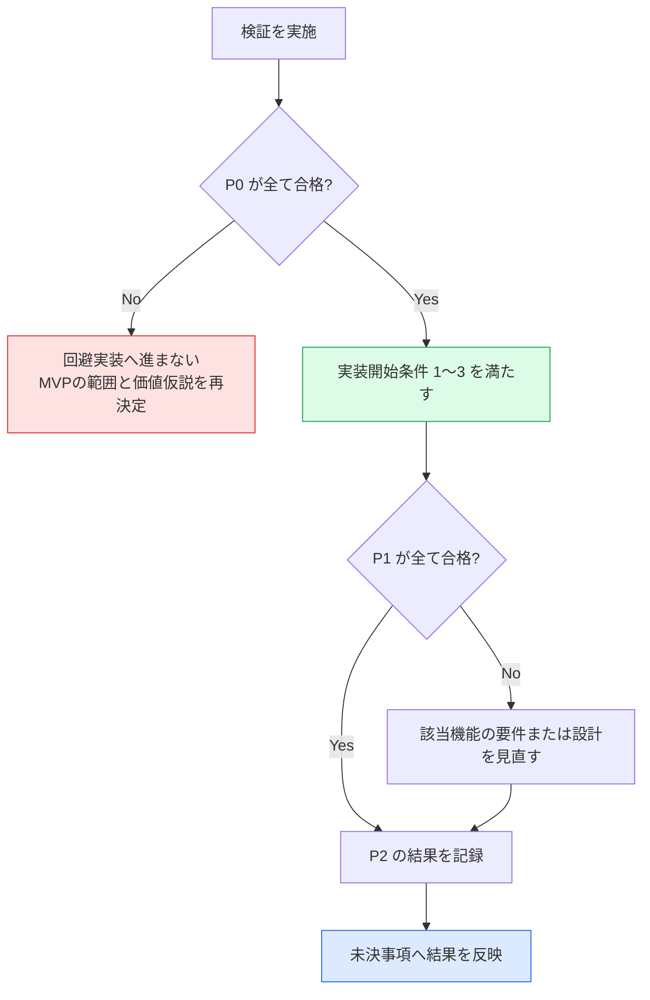

# AlgoLoom JudgeAdapter 技術検証計画

> 対象: MVPの実装を開始する前に確認する、現在のAtCoderに対する`JudgeAdapter`の技術的成立性
>
> 状態: 検証計画（方式Cによる`V-02`は、[`p0-03`](../verification/judge-adapter/results/2026-08-11-p0-03.md)の不合格後、[`p0-04`](../verification/judge-adapter/results/2026-08-11-p0-04.md)で合格し、[`p0-06`](../verification/judge-adapter/results/2026-08-11-p0-06.md)の当日再確認も合格。`p0-06`では提出ページをCloudflare Challenge Pageではないと分類できたが、静的HTMLの言語候補0件で`V-05`は不合格、`V-03`は提出前に中止。`V-04`と方式Aの`V-10`は未実施）
>
> 作成日: 2026年8月10日
>
> 関連文書:
> - [MVPスコープ §4](../product/mvp.md#4-mvpの実装開始条件)
> - [AtCoder認証設計](../architecture/atcoder-authentication.md)
> - [MVP機能設計 §14](../../spec/features.md#14-実装順序)
> - [Core契約 §6](../architecture/core-contracts.md#6-提出契約)
> - [配布方針ガイド §5](../operations/algoloom-distribution.md#5-スクレイピングとアクセス負荷)
> - [未決事項一覧](unresolved-decisions.md)
> - [技術検証の実施手順と成果物](../verification/judge-adapter/README.md)

## ドキュメント概要

本書は、実装開始前に何を実証するか、どこまでできれば合格とするか、どの未決事項へ結果を反映するかを定義します。

## 0. 結論

実証する仮説は一つです。

> 現在のAtCoderに対して、利用者自身のアカウントとセッションで、入出力例の取得・アカウント確認・提出・提出IDの取得・判定確認が成立し、MVP候補の方式AでそのセッションをBot対策の回避なしに安全に確立できる。

これは[MVPスコープ §4](../product/mvp.md#4-mvpの実装開始条件)の実装開始条件1〜3を満たすための作業です。方式Cで主要導線を先に検証し、方式Aを別のP0で検証します。**いずれかのP0が不合格の場合は回避実装へ進まず、MVPの範囲と価値仮説を再決定します。**

実行固有の検証コード、一時出力、認証情報は破棄前提とします。一方、秘密情報や実行固有値を含まず、通信と外部作用の上限をレビューでき、再検証や将来の実装判断に使える汎用の検証支援コードは[`scripts/verification/`](../../scripts/verification/)へ保持できます。保持したコードを製品コードまたは実サービスの証拠とは扱いません。観測の正本は匿名化した実行記録と合否判定です。

## 1. 検証しないこと

- 性能測定、4言語×3OSの網羅（実装後の作業）
- 製品コードの作成、`JudgeAdapter`の最終インターフェース設計
- AIレビュー、クラウド同期に関わる確認
- 一括取得、非公開テストの取得、Bot対策の回避
- レート制限を意図的に発生させること

## 2. 優先度の定義

| 優先度 | 意味 | 不合格時の扱い |
|---|---|---|
| **P0** | 失敗すればMVPが成立しない | 合格するまで実装へ進まない。範囲と価値仮説を再決定する |
| **P1** | 設計した要件を実装できるかが決まる | 該当機能の要件または設計を見直す |
| **P2** | 取得できれば使う | 記録だけ残す。MVPは成立する |

## 3. 検証項目

### 3.1. P0 — 主要導線の成立

| ID | 実証すること | 合格条件 | 関係する機能 |
|---|---|---|---|
| `V-01` | 終了済み過去問1件から公開入出力例を取得できる | 入力と期待出力の組を、件数と対応関係を保って取得できる。取得元と取得時刻を記録できる | `F-PROBLEM-02` |
| `V-02` | 方式Cで取り込んだ現在のセッションがどのアカウントかを、提出せずに確認できる | 入力を表示しない対話経路で本人の`REVEL_SESSION`だけを一時的に取り込み、アカウント識別情報を一意に取得できる。空のセッションによる未認証、認証済み、ページ構造の変更を区別し、期待する本人アカウントと一致する | `F-SUBMIT-01` |
| `V-03` | 明示操作で1件を提出し、提出IDを取得できる | 提出が受理され、AtCoderが発行した提出IDを取得できる | `F-SUBMIT-03` |
| `V-04` | 提出IDを基準に判定を確認できる | 判定待ちと最終判定を区別して取得できる。取得時刻を伴う観測として記録できる | `F-SUBMIT-04` |
| `V-10` | 方式AでMVP用のセッションを安全に確立できる | 空の専用プロファイルを使う可視ブラウザで、利用者がログインとTurnstileを手動で完了できる。ヘルパーが`REVEL_SESSION`だけを取得し、同じアカウント識別情報を確認できる。既存プロファイルを参照せず、秘密情報をログ等へ残さず、ブラウザ・一時プロファイルを後始末できる | `F-SUBMIT-01` |

### 3.2. P1 — 設計要件の実装可能性

| ID | 実証すること | 合格条件 | 関係する機能 |
|---|---|---|---|
| `V-05` | 正規言語IDを、対象コンテストで有効なジャッジ言語へ一意に解決できる | 言語ID、表示名、処理系、バージョンを提出時に取得し保存できる。一意に決まらない場合を検出できる | `F-SUBMIT-02` |
| `V-06` | 送信後にプロセスが落ちても、提出IDから同じ提出を再照合できる | 別プロセスから提出IDで判定を再取得できる。重複提出せずに回復できる | `F-SUBMIT-04`、`E2E-09`、`E2E-10` |
| `V-07` | 認証の失敗原因を区別できる | 未認証、期限切れ、AtCoder側の拒否、ページ構造の変更、通信障害を可能な範囲で分けられる | `F-SUBMIT-01` |
| `V-11` | Cookie更新と失効を推測なしで扱える | `Set-Cookie`の有無と更新を観測し、サーバーが返さない期限を生成せず、プロセス再起動後も同じアカウントを確認できる。期限切れ、更新競合、秘密情報保管庫の障害で提出前に安全に停止できる | `F-SUBMIT-01` |

### 3.3. P2 — 取得できれば使う観測値

| ID | 実証すること | 合格条件 | 関係する機能 |
|---|---|---|---|
| `V-08` | ジャッジ実行時間とメモリを取得できる | 返る場合は単位を正規化して保存できる。返らない場合も判定の保存を継続できる | `F-SUBMIT-04` |
| `V-09` | 外部通信の上限と再試行が設計どおり機能する | 接続・リクエスト・ポーリング全体の上限を分けて設定でき、待機指示を尊重できる | `F-PROBLEM-01` |

### 3.4. 認証方式と検証の関係

- 方式Cは`V-02`〜`V-09`の技術検証専用です。方式CをMVPの通常導線、CIまたは非対話実行の認証方式として採用しません。
- 方式AはMVP製品の第一候補です。`V-10`で代表する1OS・1ブラウザの成立を確認するまで、製品実装を開始しません。
- 方式Cで`V-02`〜`V-04`に合格しても、`V-10`が未実施または不合格ならP0全体とMVP実装開始条件は未充足です。
- 方式Cと方式Aの詳細な信頼境界は[AtCoder認証設計](../architecture/atcoder-authentication.md)を正とします。

## 4. 合否の判定

P0の不合格を、実装の工夫で迂回できる問題として扱いません。[MVPスコープ §7](../product/mvp.md#7-変更管理)の変更管理に従います。

## 5. 検証する未決事項

本検証は、次の未決事項へ根拠を与えます。**検証だけで決定はしません。** 得られた事実を持ち帰り、各文書で判断します。

| 未決事項 | 本検証が与えるもの | 決定する場所 |
|---|---|---|
| [2.3 実行・保持・性能の具体値](unresolved-decisions.md#23-実行保持性能の具体値) | 判定確認の所要時間、ポーリング間隔と最大待機、接続とリクエストの上限の初期値 | 実測後に確定 |
| [1.6 任意機能の具体的な導線](unresolved-decisions.md#16-任意機能の具体的な導線) | 認証状態を確認する具体的な操作と方式Aの初回・再認証導線が成立するか（`V-02`、`V-07`、`V-10`、`V-11`） | CLI設計 |
| [8.1 公開ベータ前にAtCoderへ確認する事項](unresolved-decisions.md#81-公開ベータ前にatcoderへ確認する事項) | 問い合わせへ添える事実。実際のリクエスト数、間隔、保存する内容、認証方式 | AtCoderの回答後 |

あわせて、`online-judge-tools`を`JudgeAdapter`の初期実装として採用できるかを判断できます。[MVPスコープ §3.3](../product/mvp.md#33-mvpの依存関係)のとおり、これは候補実装であり、Domainや保存スキーマの契約にはしません。

## 6. 実施の前提と安全条件

| 項目 | 条件 |
|---|---|
| 対象問題 | 終了済みの過去問1件のみ |
| アカウント | 検証者自身のAtCoderアカウント |
| 言語・OS | 1言語・1OSに限定する |
| 取得範囲 | 公開されている入出力例だけ。非公開テストと問題文を取得しない |
| アクセス | 間隔を空ける。一括取得と背後でのクロールを行わない |
| レート制限 | 意図的に発生させない。発生した場合は指示された待機時間を尊重する |
| Bot対策 | 回避・迂回を実装しない |
| 方式C | 検証者本人が通常のブラウザで取得した`REVEL_SESSION`一つだけを、入力を表示しない対話経路から検証用一時領域へ取り込む。`argv`、環境変数、リポジトリ、成果物へ値を置かない |
| 方式A | 空の専用プロファイルと可視ブラウザを使用し、ID・パスワード入力とTurnstileは人が行う。既存プロファイルの参照、指紋偽装、ヘッドレス化、Turnstile自動操作を行わない |
| 記録 | ソースコード、Cookie、トークン、生のヘッダーを残さない |

## 7. 成果物

- 検証項目ごとの観測記録（取得できた項目、形式、欠損、所要時間）
- `V-01`〜`V-11`の合否判定
- 未決事項2.3へ渡す初期値の候補
- 未決事項8.1の問い合わせへ添える事実
- P0が不合格の場合は、MVPの範囲と価値仮説の再検討案

観測記録は事実だけを残し、判断は各正本文書で行います。

匿名化済みの成果物は[`docs/verification/judge-adapter/results/`](../verification/judge-adapter/results/)へ保存し、[記録テンプレート](../verification/judge-adapter/results/run-record-template.md)を使用します。検証コード、一時出力、認証情報は成果物へ含めません。再利用可能な検証支援コードは[`scripts/verification/`](../../scripts/verification/)へ分離し、実行記録の代わりにしません。実行環境、停止条件、記録の手順は[技術検証の実施手順](../verification/judge-adapter/README.md)を参照します。

## 8. 実施順序

| 順序 | 作業 | 理由 |
|---:|---|---|
| 1 | `V-02` アカウント確認 | 他の項目の前提。提出せずに確認できるため副作用が最も小さい |
| 2 | `V-01` 入出力例の取得 | 外部への書き込みを伴わない |
| 3 | `V-05` ジャッジ言語の解決 | 提出前に必要。ここで一意に決まらなければ提出へ進まない |
| 4 | `V-03` 提出と提出IDの取得 | 最初の外部作用。1件だけ行う |
| 5 | `V-04` 判定確認 | `V-03`の結果を使う |
| 6 | `V-06` 提出IDによる再照合 | 追加提出をせず、`V-03`の提出IDを再利用する |
| 7 | `V-10` 方式Aの認証確立 | 方式Cによる主要導線とは別の実行として、追加提出なしで製品候補を検証する |
| 8 | `V-07`、`V-11` 認証失敗・更新の分類 | AtCoderへ障害を起こさず、通常観測とローカル制御を分ける |
| 9 | `V-08`、`V-09` | 観測の記録 |

方式Cによる主要導線の実行と方式Aの実行は、別の実行記録に分けられます。方式Aの検証では追加提出を行いません。**AtCoderへの提出は検証全体で1件に留めます**。
