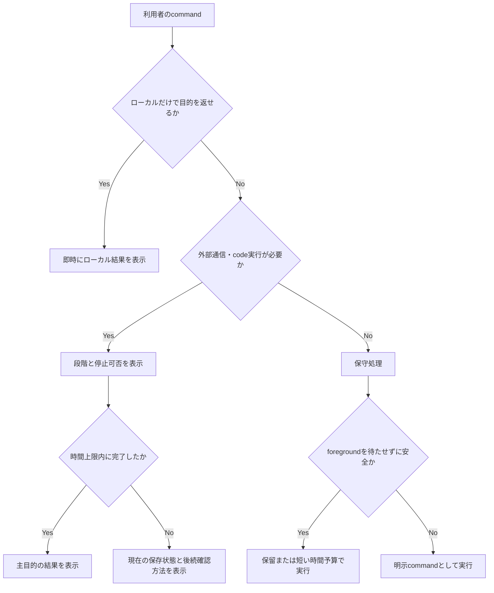

# AlgoLoom パフォーマンスと待機体験の設計

> 対象: AlgoLoomにおけるローカル操作、外部通信、任意コード実行、AIレビュー、DB保守の待機時間と性能
>
> 状態: 設計方針・実装優先順位
>
> 作成日: 2026年7月18日
>
> 更新日: 2026年7月20日
>
> 関連文書:
> - [製品ビジョン](../product/vision.md)
> - [ストレスフリーUX設計](./stress-free-ux-design.md)
> - [問題選択・カタログ設計](../features/problem-selection-and-catalog.md)
> - [Review Backend・LLM Provider設計](../features/llm-provider-design.md)
> - [セキュリティ設計ガイド](./security-design.md)
> - [言語・実行環境の可搬性設計](../architecture/language-and-platform-portability.md)
> - [ローカル利用とCloud同期の段階的設計](../features/local-and-cloud-sync-design.md)
> - [Turso設計ガイド](../integrations/turso-design-guide.md)

---

## ドキュメント概要

本書は、ローカル処理、外部通信、code実行、任意機能、DB保守における応答性と待機UXの原則、優先順位、timeout・取消・resource制限、検証方法を定義します。

## 0. 結論

AlgoLoomで守るべき性能目標は、単に処理時間を短くすることではない。

> 利用者が今すぐ得られる結果を、無関係な通信・保守処理・任意機能によって待たせず、待つ必要がある場合も、何を待っているか、いつ止められるか、次に何をすればよいかを分かるようにする。

このため、処理を次の3種類へ分ける。

| 種類 | 例 | UX上の扱い |
|---|---|---|
| 即時ローカル操作 | `log`、`show`、`diff`、既存workspaceのcontext判定 | networkを待たず、ローカルDBまたはfilesystemから結果を返す |
| 利用者が待つ外部・実行処理 | `get`、compile、test、AtCoder提出・判定取得、AI review、明示`sync run`、明示checkpoint・backup・export | 段階、経過、timeout、停止可否、後続の確認経路を示す |
| 後回しにできる補助・保守処理 | Cloud push、stale catalog更新、破棄可能なcache保守 | foregroundの目的を遅らせない。必要なら明示commandへ分離する |

Cloud DBを通常の履歴参照経路から外したことは、この方針の最初の達成項目である。次に優先すべきなのは、DBの同時実行、カタログ更新、外部待機、test実行の上限である。

---

## 1. 共通原則

### 1.1. 用語

| 用語 | 本書での意味 |
|---|---|
| foreground | 利用者が結果を待っている主目的の処理。 |
| background | 主目的の完了を妨げず、後から実行または再試行できる補助処理。 |
| 制御返却点 | 利用者の主目的に必要な結果と、継続に必要な状態の耐久保存が完了し、安全にCLIの制御を返せる境界。 |
| time budget | foregroundを待たせずに補助処理を試せる時間の上限。 |
| stale cache | 更新期限を過ぎているが、取得時点の内容を検索等に利用できるcache。 |
| polling | 外部処理の状態が確定するまで、間隔を置いて繰り返し確認する処理。 |
| p50 / p95 | 計測値を小さい順に並べたとき、50%または95%の操作が収まる時間。 |
| cold start | modelやprocess等の初回起動により、通常時より長い待機が発生する状態。 |
| resource上限 | timeout、出力量、memory、process数等、端末の占有を防ぐ制限。 |
| learning active duration | 利用者が明示的に開始したSolveAttemptで、pauseを除いたFocusIntervalの合計。処理性能を表すdurationではない。 |
| process duration | compile、run、DB、HTTP、polling等、AlgoLoomまたは外部processの処理に要した時間。 |

### 1.2. 原則

1. **待たせないで済む処理は待たせない。** `log`、`show`、`diff`はCloud、AI、catalog更新、checkpointを待たない。
2. **待つ処理に無期限を作らない。** 接続、全体処理、polling、DB lockのそれぞれに上限と終了後の行動を持たせる。
3. **主目的と補助処理を分ける。** たとえば`submit`ではAtCoder提出、ローカル保存、Cloud共有、AI reviewを独立した結果として扱う。
4. **background化はデータを失わない場合だけ行う。** Cloud pushは保留にできるが、ローカルcommit、提出前の耐久保存、DB migrationは完了確認なしに後回しにしない。
5. **速さのために状態を曖昧にしない。** stale catalog、未同期履歴、判定待ち、review中を成功と誤表示しない。
6. **計測してから複雑なcacheを入れる。** source codeの重複排除、常駐メモリcache、test並列化は初期要件にしない。
7. **人間の時間と機械の時間を混ぜない。** learning active duration、wall elapsed、process duration、judge execution timeを別の値とラベルで扱う。



### 1.3. 非同期化と制御返却点

async APIを使うことと、利用者へ先に制御を返すことは同じではない。外部通信をasyncで実装しても、その結果が主目的に必要ならUX上はforegroundである。反対に、別processや常駐daemonを起動しなくても、pendingとして耐久保存して明示commandまたは次の安全な機会に再試行できれば、主目的から処理を分離できる。

制御返却点より後へ移せるのは、中断して失っても主目的、ユーザーdata、外部作用へ影響しない再取得可能な補助処理か、次の条件をすべて満たす処理である。

- 処理に必要な入力と利用者の意図が、process終了後も失われない形で保存されている。
- 外部作用が発生したかを識別でき、状態不明を成功または未実行と誤認しない。
- retryが冪等であるか、operation ID、submission ID、code hash等で重複を検出できる。
- 利用者が後から状態、最終試行時刻、失敗の影響、次の行動を確認できる。
- 中止、強制終了、version更新、同時実行によって、成功済みのCore状態を壊さない。
- resource使用量と再試行回数に上限があり、foreground処理を継続的に圧迫しない。

一つでも満たせない場合は、必要な状態を確定するまでforegroundで扱うか、利用者が結果を待つ明示commandへ分離する。

| 操作 | 制御返却点より前に完了させること | 主目的の経路から分離すること |
|---|---|---|
| `get` | 利用可能なworkspace、metadata、source、必要なsampleの整合した作成 | browser表示等、失敗してもworkspaceを無効にしない補助動作 |
| `test` | compile・実行結果またはtimeout・取消等の確定状態 | 実測で必要性が確認された安全なcache保守 |
| `submit` | 提出前snapshotとoperationの耐久保存、送信結果または状態不明の記録 | submission ID取得後の判定再確認、Cloud共有、明示的なAI review |
| `log` / `show` / `diff` | その端末にあるローカル結果の取得 | Cloud pull、checkpoint、backupを実行せず、必要なら明示commandへ分離する。破棄可能なcache保守も表示を待たせない |
| `pick` | 既存catalogによる検索結果、または初回取得の確定結果 | stale catalogの更新 |
| migration | 整合した新Schemaへの移行またはrollback | なし。通常commandと並行させない |

初期段階では、background化のためだけに常駐daemonを導入しない。短いtime budget、耐久的なpending、明示的な再試行によって、process終了後に処理を暗黙実行しなくても同じUX契約を満たす。

### 1.4. 学習時間と性能計測の分離

本書のp50 / p95、timeout、待機時間は主としてsystemとprocessの性能を評価する値であり、SolveAttemptの学習時間とは目的が異なる。

| 時間 | 開始・終了の決定者 | 主な用途 | 混同してはいけない値 |
|---|---|---|---|
| learning active duration | 利用者のstart / pause / resumeとCore milestone | 自分の試行の振り返り | commandの高速・低速 |
| wall elapsed | 端末時計上の開始・終了 | 中断を含む全体経過の参考 | 能動的に考えた時間 |
| process duration | ProcessRunner、DB、HTTP client等 | 性能回帰、timeout、cache判断 | 学習者の能力 |
| local peak memory | HostPlatformが取得できたlocal processの最大memory観測 | 異常な確保、resource上限、実装改善の参考 | judge memory、言語間・OS間の公平な比較 |
| judge execution time | AtCoder | 提出codeのremote実行観測 | 解答を考えた時間、local実行時間 |
| judge memory | AtCoder | 提出codeのremote memory観測 | local peak memory、学習時間 |
| verdict polling time | AlgoLoomが判定を待った時間 | 待機UXとnetwork診断 | ACまでの能動時間 |

性能telemetryまたは開発用計測にlearning active durationを混入させない。学習履歴へprocess durationを関連付ける場合も、表示名と単位だけでなく意味を明示し、時間の短さを利用者間rankまたは単一skill scoreへ変換しない。

---

## 2. 修正の優先順位

| 優先度 | 対象 | 修正する理由 | 方針 | 完了の判定 |
|---|---|---|---|---|
| P0 | DB同時実行・保守 | `submit`、`sync`、backup、migrationが重なるとSQLite lockや長い待機が起こり得る | 短いtransaction、有限のlock待機、command間排他、閲覧経路からcheckpointを除外 | lock待ちが無期限にならず、保存済みデータを失わず復旧方法を表示できる |
| P0 | カタログの期限切れ更新 | `pick`時の24時間更新は、順次取得とrate limitにより数秒以上の待機になり得る | stale cacheで先に検索し、更新は明示`catalog update`または結果を妨げない経路へ分離 | 既存catalogがあれば更新失敗・遅延でも`pick`が使える |
| P0 | `get`・提出・判定polling | 外部サービス、認証、network、judge待ちにより終了時刻を予測できない | 接続・全体・pollingの上限、進捗、取消、submission IDからの後続照会を定義 | timeout後も再提出を促さず、何が完了したかを説明できる |
| P0 | compile・testのresource上限 | 無限loop、大量出力、重いcompileが端末とCLIを占有する | compile/run別timeout、出力量・memory/process上限、HostPlatformによるprocess tree終了を実装 | 暴走時に端末を使い切らず、次のtestを実行できる |
| P1 | AI reviewの待機・入出力量 | local modelのcold start、remote遅延、複数snapshotやdiffで待機・費用が増える | input byte/token budget、output上限、cancel、streaming表示、Provider別timeoutを定義 | reviewを中止しても提出・履歴を壊さず、送信範囲と省略を説明できる |
| P1 | `diff`・terminal fallback | 大きなcode・diffを全量生成・描画するとCPU、memory、terminal操作性を消費する | size/line数の保護、出力省略・pager、Viewer失敗時の選択肢を持つ | 大きな履歴でもterminalが操作不能にならない |
| P1 | 繰り返しcompile | 同じsourceをtestするたびにcompileすると日常待機が蓄積する | source hash、compile command、関連設定をkeyにした限定的build cacheを実測後に導入 | cache hit/missが明確で、設定・source変更時に誤った成果物を使わない |
| P2 | backup・export・restore | 履歴増加後に長いI/O、DB lock、容量不足が起こり得る | 明示command、整合snapshot、進捗、取消可否、容量不足の事前確認 | 長時間処理でも通常履歴を壊さず、途中失敗から復旧できる |
| P2 | 起動時の依存初期化 | 通常commandがTurso、LLM、Viewer等の任意依存を読込むと体感が悪化する | command境界までlazy importし、`--help`とCore経路から任意依存を外す | 同期・AI未導入でもCore起動と履歴参照が遅延・失敗しない |

P0はCoreの操作を止める、端末を占有する、または重複提出・履歴不安につながるため、同期BetaやAI拡張より先に実装・検証する。

---

## 3. P0の詳細

### 3.1. DB同時実行、WAL、保守処理

ローカルDBは高速でも、複数processが同時に書き込めば待機する。特に次の組合せを未定義のままにしてはいけない。

| 競合し得る操作 | 想定される問題 | 必要な挙動 |
|---|---|---|
| `submit` と `sync run` | 同時write、push対象の取り違え | 保存transactionを短くし、片方を有限時間だけ待機または安全に再試行する |
| `submit` と backup/export | 長いread transactionやsnapshot作成によるwrite遅延 | backupを明示操作にし、保存を妨げる場合は中止または再実行を案内する |
| migration と通常command | schema不一致、lock、破損した中間状態 | migration中は通常commandを安全に停止し、完了またはrollback後だけ再開する |
| checkpoint と `log` / `show` / `diff` | 本来即時の閲覧がI/O待ちになる | checkpointを閲覧経路で実行しない |

初期実装では、DB lockの待機上限を持ち、超過時に「別のAlgoLoom操作がDBを使用中」であること、保存済みデータへの影響、再試行方法を表示する。具体的な秒数は対応OSと実測で決めるが、無期限のdriver既定値へ委ねない。

### 3.2. カタログ更新を検索の必須待機にしない

[問題選択・カタログ設計](../features/problem-selection-and-catalog.md#8-カタログ更新設計)では、公開JSONを順番に取得し、リソース間に1秒超の間隔を置く。この安全なrate limitは必要だが、期限切れを理由に既存catalogでの検索を停止する理由にはならない。

```text
既存catalogあり
    pick: すぐに既存catalogで検索
    更新: 明示的なcatalog update、または次の安全な機会に確認

catalogなし
    pick: 初回取得の進捗を表示して待機
    失敗時: get <公式URLまたは問題ID> を代替経路として案内
```

未知の問題IDだけは、`get`時に1回だけ更新してもよい。それでも見つからなければ、catalogの失敗とAtCoder公式上の問題不存在を混同せず、公式ページ確認へ進む。

### 3.3. `get`・提出・判定取得の外部待機

外部サービスの応答時間はAlgoLoomが制御できない。したがって、成功まで待ち続けるのではなく、操作ごとに次を持つ。

| 操作 | 待機中に示すこと | 上限後に保持するもの | 後続経路 |
|---|---|---|---|
| `get` | 公式確認、sample取得、workspace作成の現在段階 | 完了済みfileと未完了段階 | 安全な再実行または手動確認 |
| `submit` | 提出済みか、判定待ちか | AtCoder submission ID、code hash、ローカル履歴 | 判定だけ再確認。再提出はしない |
| 判定polling | 経過と最後の確認時刻 | submission IDと最後に得た状態 | `status`等で後から照会 |
| 明示`sync run` | push/pullの段階とpending件数 | ローカルの未push変更 | retryまたは後で再実行 |

connection timeout、個別request timeout、polling全体の最大待機時間を分ける。1つのHTTP requestが失敗したことと、操作全体が回復不能なことを同一視しない。

### 3.4. compile・testのresource制限

これは主に安全性の要件だが、端末が長時間使えなくなることを防ぐため性能UXでもある。既存の[セキュリティ設計](./security-design.md#69-testによる任意コード実行とresource制限)にある方針を、実装可能な既定値と観測へ落とす。

- compileとrunのtimeoutを別々に設定する。
- stdout/stderrは上限までだけ取得し、超過時は読み取りを止めて、対応OSの`HostPlatform`がprocess treeを終了する。
- timeout、signal、runtime error、出力上限、compiler未導入を区別する。
- 初期版ではsampleを無制限に並列実行しない。出力順序、CPU負荷、停止処理を単純に保つ。
- memoryやprocess数の強制制限はOS差が大きいため、native macOS、native Linux、native Windowsごとの対応範囲を明示した上で段階導入する。

### 3.5. compile・testの計測表示

resource制限は端末を守る強制境界、計測表示は利用者が実装を振り返るための観測であり、同じ責任として扱わない。MVPではcompile時間と公開sampleごとのlocal run時間をその場で表示し、全local test eventを履歴へ保存しない。

```text
Compile   OK      842 ms
Sample 1  PASS     12 ms
Sample 2  PASS     18 ms
Peak memory       unavailable on this platform
```

- durationは可能な限りmonotonic clockで測定し、compileとrunを合算した単一の「実行時間」にしない。
- sampleを複数回実行して統計的benchmarkを行う機能はMVPへ含めない。cold start、他processの負荷、runtime初期化等による揺れを隠さない。
- local peak memoryは、OSごとに取得できる値、子processを含む範囲、単位、終了processからの取得可否を検証した後に段階導入する。
- memory値を表示する場合は`peak RSS`等の測定対象を示し、取得不能を`0 B`と表示しない。
- 計測機能が未対応または値の取得だけに失敗しても、compile、sample比較、timeout等の確定結果を失敗へ変更しない。
- AtCoderが返したjudge execution time / memoryは提出履歴のremote観測とし、local値との差を性能保証または回帰判定へ使わない。

---

## 4. P1・P2の詳細

### 4.1. AI review

AI reviewはCoreを止めない任意機能だが、もっとも待機時間が読みにくい。review開始前に次を確定する。

- 送信するcode、diff、test outputの最大byte数またはtoken数
- 上限を超えた場合の優先順位と省略方法
- 最初の応答を表示するまでのtimeout、全体timeout、利用者による中止
- streaming対応Backendでの逐次表示と、非対応Backendでの待機表示
- local modelの起動待ちとremote Providerの接続失敗を区別したerror
- review中断後も提出、ローカル履歴、Cloud同期を成功済みのまま保持すること

model一覧、capability検査、重いhealth checkを毎回のreview実行へ混ぜない。設定変更時または`ai doctor`で検査し、通常実行では短い接続確認だけにする。

### 4.2. `diff`、Viewer、terminal

履歴取得はローカルでも、差分アルゴリズム、外部Viewer起動、terminal描画は別の遅延源である。

- codeまたはdiffが一定のsize・行数を超える場合、全量terminal表示を既定にしない。
- Viewer未設定・起動失敗時は、短い要約、pager、明示optionのいずれかへ安全にfallbackする。
- diff対象を2件へ固定し、履歴全件比較や暗黙の巨大diffをしない。
- 外部Viewerの起動時間はDB取得時間と別に表示・計測する。

### 4.3. compile cache

compile cacheは日常の`test`を速くし得るが、誤った実行結果を出す危険がある。導入する場合は、少なくともsource hash、compile command、compiler version、関連する設定・依存fileをkeyに含める。最初はcacheなしの所要時間とhit率を計測し、コンパイルが実際に主要な待機要因だと確認してから導入する。

### 4.4. backup、export、起動

backup/exportは通常の学習操作から分離する。整合snapshot、容量不足、途中中止、復元検証を扱う明示commandとし、`log`や`show`の開始時に走らせない。

また、Turso、LLM、Viewer等は任意機能である。Coreの起動、`--help`、ローカル履歴参照のためにそれらのSDK、network接続、model確認を実行してはならない。

---

## 5. 性能・待機の初期契約

数値は対応OS、DB規模、sample数、Providerにより変わるため、次は実装開始時の仮説である。固定の約束にする前に、代表的な端末と履歴件数でp50/p95を計測する。

| 操作 | 初期目標・契約 | 測定から除くもの |
|---|---|---|
| `log` | ローカル履歴表示 p95 100ms以内 | terminal emulatorの描画時間 |
| `show` | code取得・表示開始 p95 150ms以内 | 外部Viewerの起動時間 |
| `diff` | 2 snapshot取得・差分生成開始 p95 250ms以内 | 外部Viewerの起動時間 |
| すべての長い操作 | 1秒を超える可能性があれば、段階または進捗を表示 | 正常な短時間操作へのanimation |
| DB lock | 有限時間で成功または回復可能な状態表示へ遷移 | 無期限の既定wait |
| `get` / submit / polling / review / sync | 接続・全体・再試行の上限を分ける | 外部サービスの完了時刻そのもの |
| Cloud push | ローカル保存後の短い時間予算で試し、未完了ならpendingへ移す | 明示`sync run`の完了待機 |
| 制御返却点 | 必要な耐久保存と状態確定より前には制御を返さず、後続処理は再開・照会可能にする | 内部でasync APIを使用したかどうか |

性能計測は平均だけで判断しない。遅い5%の操作、ネットワーク切断、DB lock、巨大出力、cold startでUXが成立するかを重視する。

---

## 6. 検証シナリオと計測

### 6.1. 自動テスト

- 2つのCLI processが同時に保存・同期・backupを始めた場合に、DBが無期限にlockしない。
- 期限切れのcatalogがある状態で、networkを遮断しても`pick`が既存データから検索できる。
- `get`のsample取得、`submit`のpolling、`sync run`、AI reviewを途中で中止しても、保存済み状態を説明できる。
- 制御返却点の直前・直後でprocessを強制終了し、外部作用の重複、保存済みdataの消失、状態の誤表示が起きない。
- pending処理がある状態でCLIを再起動し、状態確認と安全な再試行ができる。
- activeまたはpausedなSolveAttemptがある状態でCLIを再起動し、FocusIntervalを重複させず状態確認、resume、終了ができる。
- 端末時計の後退、極端な飛躍、欠損intervalを与え、負のlearning durationや推測した精密値を生成しない。
- 無限loop、大量stdout/stderr、compile timeoutで子孫processが残らない。
- 大きなsource、長いreview、巨大diffでmemory使用量とterminal出力が上限内に収まる。
- optional dependencyを導入していない環境でも、`aloom --help`、`log`、`show`、`diff`が起動する。

### 6.2. 実機計測

最低限、次を記録する。

| 観測値 | 用途 |
|---|---|
| commandごとのp50 / p95 / 最大時間 | 体感遅延と回帰の検出 |
| SolveAttemptの状態遷移・不正interval件数 | 学習時間記録の信頼性と回復UXの検証。system性能集計とは分離する |
| DB lock待機回数・時間 | transactionや排他方針の見直し |
| catalog取得、JSON解析、SQLite更新の内訳 | `pick`を止めない更新方式の確認 |
| compile時間、test case数、出力量 | build cache・並列化の必要性判断 |
| 対応OSごとのlocal duration分解能、peak memory取得可否・計測範囲 | 表示精度、`unavailable`条件、MVP後のmemory計測採否 |
| reviewの接続時間、最初の表示まで、全体時間、input/output量 | Provider別のtimeout・予算の調整 |
| Cloud push/pull成功率、pending滞留時間 | 同期の時間予算と再試行方針の調整 |

計測ログへsource code、credential、raw responseを残さない。duration、size、件数、状態コード等の必要最小限だけを記録する。

---

## 7. 実装順序と非目標

### 7.1. 実装順序

1. ローカル履歴の索引・ページング・性能計測を実装する。
2. DB lock、migration、checkpoint、backupの実行規約を確定する。
3. SolveAttemptとFocusIntervalの状態保存、時計異常検出、process durationとの表示分離を実装する。
4. `get`、submit、polling、testのtimeout・中止・進捗契約を実装する。
5. catalogをstale cacheで即時検索できるようにし、更新を検索経路から分離する。
6. Turso Syncのpush/pullとpending復旧を検証する。
7. AI reviewのinput/output budgetと待機契約を追加する。
8. 実測結果を基に、compile cache、diff最適化、さらに強いresource制限を判断する。

### 7.2. 初期段階の非目標

初期段階で次を行わない。

- Cloud read cacheを追加して`log`、`show`、`diff`を複雑にすること
- すべてのsample testを無制限に並列化すること
- codeのcontent-addressable deduplicationを先に導入すること
- cache hitを優先してsource、compiler設定、判定結果の正しさを損なうこと
- 常駐daemonを導入してcatalog、sync、backupを暗黙に実行すること

この順序により、日常操作の即時性とデータ完全性を先に確立し、複雑な最適化は実測で必要性を確認してから追加できる。
