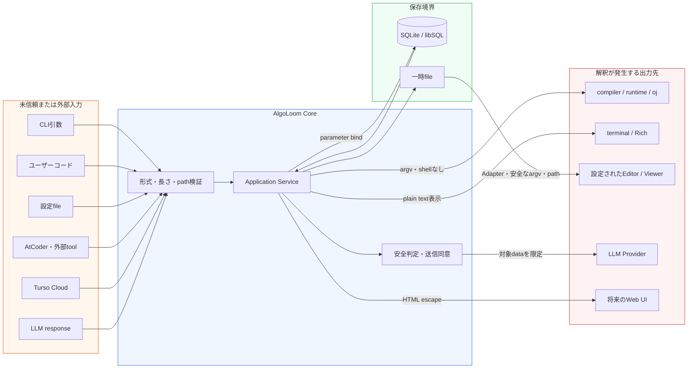
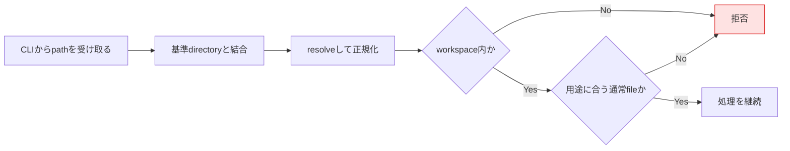
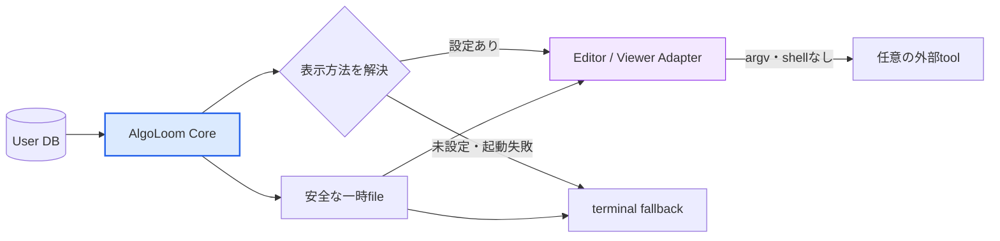
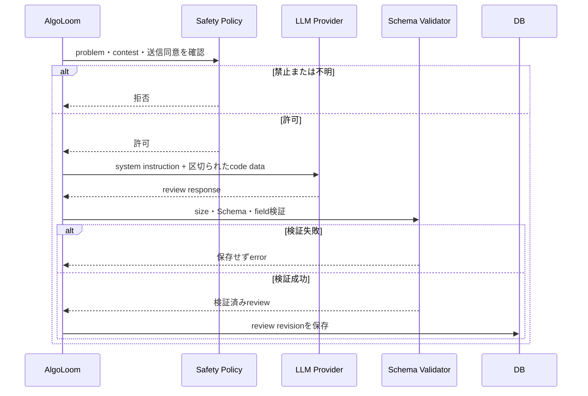

# AlgoLoom セキュリティ設計ガイド

> 対象: AlgoLoomが扱うユーザーコード、CLI入力、SQLite / Turso、外部コマンド、ターミナル、外部Editor / Viewer、LLM Provider、将来のWeb UI
>
> 状態: 設計方針
>
> 作成日: 2026年7月16日
>
> 更新日: 2026年7月19日
>
> 関連文書:
> - [製品ビジョン](../product/vision.md)
> - [MVPスコープ](../product/mvp.md)
> - [Core契約](../architecture/core-contracts.md)
> - [言語・実行環境の可搬性設計](../architecture/language-and-platform-portability.md)
> - [ローカル利用とCloud同期の段階的設計](../features/local-and-cloud-sync-design.md)
> - [Turso設計ガイド](../integrations/turso-design-guide.md)
> - [Turso移行互換性設計](../integrations/turso-migration-compatibility-design.md)
> - [LLM Provider選択・実行基盤設計](../features/llm-provider-design.md)
> - [AIレビュー安全設計](../features/ai-review-safety-design.md)
> - [AlgoLoom配布方針ガイド](../operations/algoloom-distribution.md)

---

## 0. 結論

AlgoLoomでは、ユーザーが書いたコードをデータベースへ保存すること自体を危険な操作とはみなさない。

一方、保存したコードは、後からSQLite、外部コマンド、ターミナル、外部Editor / Viewer、LLM Provider、将来のWeb UI等へ渡される。そのため、**コードを無害化して保存するのではなく、コードを未信頼データとして保持し、各出力先との境界で安全に扱う**。

```text
保存時の原則:
    コードを改変せず、データとして保存する

利用時の原則:
    SQLでは値としてbindする
    subprocessでは1つの引数として渡す
    ターミナルやWebでは表示用にescapeする
    LLMには命令ではなくレビュー対象データとして渡す
```

個人利用を中心とする初期版でも、次の対策は実装コストが低く、セキュリティだけでなく通常の不具合防止にも有効であるため必須とする。

- SQLのパラメータバインド
- `shell=False`と引数配列による外部コマンド実行
- 問題ID、言語、ファイルパス、列名等の許可リスト検証
- 一時ファイルの安全な作成と権限制限
- Rich markup、ANSI制御シーケンス等を解釈させない安全な表示
- LLMレスポンスのSchema検証と、自動適用・自動提出・shell実行の禁止
- コード、Cookie、トークンを通常ログへ出さない運用
- タイムアウト、出力量上限等による偶発的な暴走への対策

コンテナやOS sandboxによる強い隔離は、初期版で自分のコードだけを実行する間は必須としない。他人のコード、共有されたコード、外部からimportしたコードを実行対象へ加える場合に導入を再検討する。

---

## 1. 目的と対象範囲

### 1.1. 目的

- ユーザーコードがSQLやshell commandとして誤って解釈されることを防ぐ。
- DBへ保存された値による二次的なインジェクションを防ぐ。
- コード、提出履歴、AIレビュー、認証情報の機密性と完全性を守る。
- `test`、`submit`、`show`、`diff`、`--review`の安全な実装境界を明確にする。
- ローカル利用、Cloud同期、将来のWeb UIで共通する安全原則を定義する。
- 個人アプリとして維持可能な対策と、将来必要になる強い対策を分離する。

### 1.2. 対象

| 領域 | 主な対象データ・処理 |
|---|---|
| CLI | 問題ID、言語、ファイル名、検索条件、設定値 |
| ワークスペース | ユーザーコード、テンプレート、サンプル入出力 |
| データベース | 提出、コード、判定、レビュー、outbox、同期状態 |
| 外部プロセス | コンパイラ、runtime、online-judge-tools、設定されたEditor / Viewer |
| ターミナル | コード、ログ、テスト結果、外部プロセス出力、AIレビュー |
| LLM | prompt、提出コード、テスト結果、Providerレスポンス |
| Cloud同期 | Tursoへ同期する提出コード、判定、レビュー |
| 将来のWeb UI | コード、レビュー、履歴のHTML表示とdownload |

### 1.3. 対象外

- OS管理者権限を持つ悪意あるローカルユーザーからの防御
- ユーザーが自分で指定した悪意あるコンパイラ、runtime、editor、pluginの安全性保証
- AtCoder、Turso、LLM Provider等の外部サービス内部の安全性保証
- 初期版における、未知の第三者コードを安全に実行するための完全なsandbox
- マルウェア解析や、敵対的コードを積極的に収集・実行する用途

対象外であっても、AlgoLoomが認証情報を不用意に渡したり、不要な権限で外部プロセスを起動したりしないことは本設計の対象とする。

---

## 2. 用語

| 用語 | 本文書での意味 |
|---|---|
| 未信頼データ | 内容を命令として安全に実行できるとは仮定しないデータ。自分で書いたコードや自分のDB内の値も、処理境界では未信頼として扱う |
| 信頼境界 | データの所有者、実行環境、解釈方法、権限等が変わる境目 |
| インジェクション | データとして扱うべき文字列が、SQL、shell、HTML等の命令の一部として解釈される問題 |
| SQLインジェクション | 入力値がSQL文の構造を変更し、意図しない参照・更新・削除等を起こす問題 |
| コマンドインジェクション | ファイル名等がshell commandの一部として解釈され、意図しないコマンドを実行する問題 |
| 保存型・二次インジェクション | DBへ保存した時点では問題が起きず、後から別の機能がその値を命令として解釈して発生するインジェクション |
| パラメータバインド | SQL文と値を分けてDB driverへ渡し、値をSQL構文として解釈させない方法。placeholder、prepared statementとも呼ばれる |
| 入力検証 | 値の形式、長さ、範囲、列挙値、パス等がアプリの期待に合うか確認すること |
| 許可リスト | 使用可能な値を事前に列挙し、その一覧に含まれる値だけを許可する方法 |
| エスケープ | 出力先の文法において、文字を命令ではなく通常の文字として表示できる形へ変換すること |
| パストラバーサル | `../`、絶対パス、symlink等を使って、意図したworkspace外のファイルへアクセスする問題 |
| ANSI制御シーケンス | 色やカーソル移動等をterminalへ指示する特殊文字列。悪用されると表示偽装やclipboard操作等につながり得る |
| Rich markup | PythonのRichが色や装飾として解釈する`[bold]`等の記法。通常文字列との区別が必要になる |
| modeline | Vim / Neovimがファイル内のコメント等からeditor optionを読み取る機能 |
| Editor / Viewer Adapter | `show`や`diff`の表示要求を、ユーザーが選択した外部ツールのargvへ変換する任意の連携境界。AlgoLoom Coreから特定エディタへの依存を分離する |
| 外部所有環境 | Editor、shell、plugin、toolchain、Provider runtime、OS設定等、AlgoLoomではなく利用者または外部toolが所有する永続状態 |
| Prompt injection | LLMへ渡すコードや文章に命令を埋め込み、本来の指示を無視させようとする問題 |
| Review Backend | AIレビューを生成する接続先の総称。Model APIと、外部Coding Agentを制限付きで利用するAgent Bridgeを含む |
| credential owner | API keyやOAuth tokenの保管・更新・失効に責任を持つ主体。ユーザー、OS keyring、credential helper、外部runtime等 |
| Agent Bridge | 外部Coding Agentの公式組み込みinterfaceへ接続し、認証とsessionを外部runtimeに所有させるAdapter |
| XSS | Web画面へ表示した値がHTMLやJavaScriptとして解釈され、ブラウザ上で意図しない処理が実行される問題 |
| sandbox | プロセスが利用できるファイル、network、CPU、memory、system call等を制限する隔離環境 |
| DoS | CPU、memory、disk、network、出力量等を過剰に消費させ、処理を継続できなくすること。サービス拒否攻撃とも呼ばれる |
| secret | Password、session Cookie、API key、DB token等、漏えいすると第三者が権限を利用できる情報 |
| redaction | ログやエラー表示からsecretやコード等を削除またはマスクすること |
| fail closed | 安全性を確認できない場合に、危険になり得る操作を許可せず停止する設計 |
| 最小権限 | 機能に必要な最小限の権限だけを付与する原則 |
| defense in depth | 1つの対策だけに依存せず、複数の境界で被害を防止・限定する考え方 |

「sanitize」という語は、検証、削除、置換、エスケープ等の異なる処理を曖昧に含むため、本設計では原則として使用しない。代わりに「入力検証」「パラメータバインド」「表示時エスケープ」のように具体的な処理を記載する。

---

## 3. セキュリティ上の前提

### 3.1. 利用形態

初期版の主な利用者は、本人が本人の端末でコードを書き、テスト・提出・保存する個人ユーザーである。この前提により、第三者コード実行サービスと比べて攻撃可能性は低い。

ただし、次の理由から「自分のデータだから常に安全」とは仮定しない。

- コードやファイル名には、意図せず引用符、shell記号、ANSI制御文字等が含まれ得る。
- 外部からコードをcopy and pasteする場合がある。
- DB、backup、export fileが手動編集または破損する場合がある。
- Cloud同期によって、別端末で作成・変更されたデータを受け取る。
- LLM Provider、コンパイラ、runtime、AtCoder等から外部生成データを受け取る。
- 将来Web UIを追加すると、保存済みコードがHTMLという別の解釈系へ渡される。

### 3.2. 守る対象

| 資産 | 守る内容 |
|---|---|
| ユーザー端末 | 意図しないcommand実行、workspace外の変更、過剰なresource消費を防ぐ |
| 提出コード | 無断送信、改変、欠落、ログへの露出を防ぐ |
| 提出履歴 | 不正な追加・更新・削除、重複、対応関係の破壊を防ぐ |
| 認証情報 | AtCoder session、Turso token、Provider credentialを漏らさない |
| ターミナル | 制御文字による表示偽装や不要なterminal操作を防ぐ |
| AIレビュー | Prompt injectionの影響を限定し、不正形式のresponseを保存しない |
| 同期状態 | 同期失敗を保存成功と誤表示せず、未同期データを失わない |

### 3.3. 主な入力元と信頼度

| 入力元 | 扱い | 理由 |
|---|---|---|
| CLI引数 | 未信頼 | 形式違反、path、optionに見える値を含み得る |
| ユーザーコード | 未信頼データ | SQL、terminal、editor、LLM等の文法に似た文字列を含み得る |
| user-level設定 / 将来のworkspace設定 | ユーザー管理の設定 | 実行commandを定義できる設定は実質的に実行権限を持つ。MVPのworkspace metadataには実行commandを許可しない |
| DBから取得した行 | 未信頼データ | 手動変更、破損、古いversion、Cloud同期を考慮する |
| AtCoder / online-judge-tools | 外部データ | HTML、判定、error message等の形式変更を考慮する |
| LLM Provider response | 未信頼データ | Schema違反、markup、制御文字、過大responseを含み得る |
| コンパイラ・実行コードのstdout / stderr | 未信頼データ | ANSI制御文字、大量出力、invalid encodingを含み得る |

---

## 4. 信頼境界とデータフロー



DBは安全化装置ではない。DBへ正常に保存できた値でも、後からterminal、外部Editor / Viewer、LLM、HTML等で解釈されれば問題を起こし得る。したがって、保存前の1回だけではなく、各出力境界でその文脈に合った対策を行う。

---

## 5. 共通原則

### 5.1. コードを保存時に改変しない

- 提出したコードのsnapshotを、原則としてUTF-8 textとしてそのまま保存する。
- 改行、引用符、SQLに見える文字列、HTML tagに見える文字列を削除・置換しない。
- decodeできない入力やNUL等、対応外の形式は黙って置換せず、提出前に明確なerrorとして拒否する。
- 保存するsource codeと、AtCoderへ送信するsource codeのhashが一致することを確認可能にする。
- 表示用escape済み文字列をDBへ保存しない。生データと表示形式を分離する。

### 5.2. 文字列連結で命令を作らない

- SQLへ値を埋め込む場合はparameter bindを使用する。
- shell command文字列を生成せず、subprocessへargv配列を渡す。
- HTMLを文字列連結で組み立てず、auto escapeを有効にしたtemplateを使用する。
- LLM promptではsystem instructionとレビュー対象dataを分離する。

### 5.3. 入力検証と出力時処理を分ける

```text
入力検証:
    problem IDとして正しいか
    対応言語か
    workspace内のpathか
    許容sizeか

出力時処理:
    SQLではbindする
    terminalではcontrol sequenceを解釈させない
    HTMLではescapeする
```

入力検証だけで全出力先の安全を保証しない。例えば、C++ codeとして正しい`<script>`という文字列も、将来HTMLへ表示するときにはescapeが必要になる。

### 5.4. 自動実行範囲を限定する

- LLM responseを自動的にcodeへ適用しない。
- LLM responseやreview本文をshellへ渡さない。
- LLMが生成したcodeを自動提出しない。
- DB内の値からmigration SQLやcommandを生成しない。
- 外部から取得した設定をユーザー確認なしに実行設定として採用しない。

### 5.5. secretとユーザーデータを分離する

- AtCoder password、session Cookie、Turso token、Provider credentialをユーザーDBへ保存しない。
- API keyやBearer tokenは元の値が必要なため、passwordのようにhash化して保管できるとは扱わない。
- credentialは、外部runtime、credential helper、環境変数、OS keyringの順に、AlgoLoomが値を所有しない方法を優先する。
- keyringを利用できない場合も、平文設定fileへ自動fallbackしない。
- applicationへ固定の暗号鍵を埋め込み、同じapplicationだけで復号できるfileを安全な保管庫とはみなさない。
- Providerのpassword、social login情報、OAuth tokenを要求しない。外部runtimeの認証cacheを読み取り、複製、同期しない。
- code、review、Cookie、token、raw HTTP headerを通常ログへ出さない。
- Cloud同期とLLM Provider送信は別の外部送信として、別々に同意を得る。

### 5.6. 書き込み先を所有権で制限する

通常commandの書き込み先は、AlgoLoom所有領域と、command契約で利用者が明示したworkspace上の対象に限定する。書き込み可能な権限があることを、その状態を変更してよい根拠にはしない。

| 対象 | 通常commandで許可すること | 許可しないこと |
|---|---|---|
| AlgoLoom config・DB・cache・temp | 公開Schemaと保存契約に沿った操作 | 外部application設定の複製・管理 |
| 明示されたworkspace | 予告したmetadata、sample、template等の作成 | 既存sourceの無断上書き、外部tool設定の配置 |
| Editor・shell・plugin・toolchain・OS設定 | read-only検出、既存toolの一時起動 | install、update、削除、設定file・plugin・`PATH`の変更 |
| Provider runtime・model・外部認証cache | 公式interfaceへの接続、read-only診断 | lifecycle操作、download、認証cacheの読取・複製・変更 |
| OS keyring等のsecret store | 明示操作によるAlgoLoom namespaceの項目参照・保存・削除 | 他applicationや外部runtimeが所有する項目の変更 |

- child processだけへ渡すargv、読み取り専用option、working directory、必要最小限の環境変数は、process終了後にhost設定へ残らない一時条件として扱う。
- alias、completion、Editor連携等の支援は、設定fileを直接編集するより、設定断片、差分、利用者が実行できる手順の生成を優先する。
- 将来のsetup helperが外部所有環境を変更する場合は通常commandと権限を分離し、対象path、差分、backup、冪等性、rollbackを検証できなければfail closedにする。

---

## 6. 脅威と対策

### 6.1. 優先度一覧

| 脅威 | 主な入口 | 想定される影響 | 初期版の方針 |
|---|---|---|---|
| SQL injection | code、problem ID、検索条件 | DBの漏えい、改変、削除 | 全値をbindし、動的識別子は許可リスト化 |
| Command injection | filename、problem ID、Adapter設定、argv | 任意command実行 | 組み込みAdapter、`shell=False`、argv配列、`--`、path検証 |
| Path traversal | problem ID、filename、temp file | workspace外の読み書き | `resolve()`後の境界確認、安全なtemp API |
| Terminal injection | code、stdout / stderr、LLM response | 表示偽装、terminal機能の悪用 | control sequence除去、Rich markup無効化 |
| Editor経由の影響 | DBから復元したcode | option、plugin、autocommand等の副作用 | Adapter分離、安全なargv、ツール別の安全閲覧mode |
| Prompt injection | code comment、test output | review品質低下、意図しないresponse | data分離、Schema検証、自動操作禁止 |
| Agent Bridgeの過剰権限 | 外部Coding Agent | file改変、command実行、secret・networkへの到達 | 一時directory、read-only、tool禁止、session破棄 |
| 保存型XSS | code、review | 将来のWeb UIでscript実行 | context別escape、CSP、`innerHTML`禁止 |
| Resource exhaustion | 無限loop、大量出力、巨大code | CLI停止、disk・memory圧迫 | timeout、size・出力量上限、process終了 |
| Secret漏えい | log、Cloud、LLM prompt | account・DBの不正利用 | 保存対象分離、redaction、明示同意 |
| 不正・破損DB | 手動編集、Cloud、migration不一致 | 誤表示、crash、危険な出力 | Schema version、型・長さ検証、固定migration |

### 6.2. SQLインジェクション

すべての値をSQLite / libSQL driverのparameter bindで渡す。

```python
# 良い例
cursor.execute(
    "INSERT INTO submissions (id, problem_id, source_code) VALUES (?, ?, ?)",
    (submission_id, problem_id, source_code),
)
```

次の実装は禁止する。

```python
# 禁止例: source_codeがSQL構造へ入る
cursor.execute(
    f"INSERT INTO submissions (source_code) VALUES ('{source_code}')"
)
```

追加ルール:

- `problem_id`、`language`、`verdict`、日時等も、codeと同様にbindする。
- `ORDER BY`の列名等、bindできないSQL識別子は固定mappingまたは許可リストから選ぶ。
- `LIKE`検索で`%`と`_`を通常文字として扱う場合は、LIKE用escape規則を明示する。
- `executescript()`はbundled migration等の固定SQLに限定し、ユーザーデータを混ぜない。
- DBから取得した文字列を、新しいSQL文として実行しない。
- ローカルSQLite AdapterとTurso Adapterの両方で同じinjection testを実行する。

### 6.3. 外部コマンドとcommand injection

`test`、`submit`、`show`、`diff`では外部processを起動するため、SQLよりも影響が大きいcommand injectionに注意する。

```python
# 良い例
subprocess.run(
    ["g++", str(source_path), "-o", str(output_path)],
    shell=False,
    check=False,
    timeout=compile_timeout,
)
```

```python
# 禁止例
subprocess.run(
    f"g++ {source_path} -o {output_path}",
    shell=True,
)
```

言語設定のcommandは文字列ではなくargv templateとして管理する。

```yaml
languages:
  cpp:
    extension: .cpp
    compile:
      - g++
      - "{source}"
      - -o
      - "{output}"
    run:
      - "{output}"
```

追加ルール:

- placeholderはargv要素の値として置換し、置換後に再度shell解析しない。
- executable、対応language、使用可能なplaceholderを検証する。
- `-`から始まるpathがoptionとして解釈されないよう、対応するtoolでは`--`を使用する。
- AlgoLoomが起動するprocessへ、AtCoder Cookie、Turso token、Provider key等の不要な環境変数を渡さない。必要に応じて環境変数を明示的に構成する。
- command全体や全環境変数をdebug logへ出さない。
- ユーザーが自分で設定した任意のexecutableはユーザー権限で実行されるため、入手元不明の設定fileを読み込む場合は注意を表示する。
- AlgoLoom自身がdirectory作成、file copy、移動等を内部処理として行う場合は、`mkdir`、`cp`、`mv`、PowerShell等のshell commandを生成せず、Pythonのfilesystem APIを使用する。
- 一般的なfile・directory操作を利用者の標準toolへ委ねるというUX方針を、AlgoLoom内部からshellを起動してよいという意味に解釈しない。

### 6.4. Path traversalと一時ファイル

`problem_id`、source filename、template path等を、そのままpathへ連結しない。



- 正規問題IDは想定形式へcanonicalizeし、directory名へ使用可能な文字を制限する。
- 書き込み先は`resolve()`後にworkspaceまたはAlgoLoom管理directory内であることを確認する。
- 問題や履歴の識別に絶対pathまたはdirectory名だけを使用せず、問題directoryと一緒に移動する検証済みmetadataと正規問題IDを使用する。
- workspaceや問題directoryの移動・renameは、特定のOS commandやfile watcherで追跡せず、各command開始時に現在のfilesystem状態を再検証する。これによりshell、file manager、Editor / IDEの操作を同じ安全境界で扱う。
- 同じ正規問題IDのmetadataが複数見つかった場合は、暗黙に1つを選択したりfileを統合・削除したりせず、曖昧性をerrorとして明示指定を求める。
- symlinkの扱いを明示する。生成先と一時fileでは追跡しないことを既定とする。
- 一時directoryはOSの安全なtemp APIで作成し、推測可能な固定名を使用しない。
- 一時directoryは原則`0700`、code fileは`0600`相当とする。
- `show` / `diff`の一時file名をproblem IDやtitleだけから生成しない。
- cleanupは`try/finally`等で行い、異常終了時に残る可能性もprivacy説明へ含める。
- cleanup時に、検証していないpathを再帰削除しない。

### 6.5. ターミナルとRich表示

#### terminalへ出す値

次の値はterminalへ出す前に未信頼データとして扱う。

- ユーザーコード
- test対象programのstdout / stderr
- compiler / runtimeのerror
- online-judge-toolsとAtCoderからのmessage
- LLM Providerのreviewとerror
- DBに保存されたproblem title、device name、review

#### 対策

- Richへ通常文字列を渡す場合はmarkupを無効化するか、`Text`等のplain text APIを使用する。
- 外部出力に含まれるANSI CSI / OSC等の制御シーケンスを既定で解釈しない。
- 改行とtab等、表示に必要な文字だけを許可し、危険なcontrol characterを可視化または除去する。
- 外部processの出力量に上限を設け、打ち切った場合は省略したことを明示する。
- terminalへ完全な提出コードを常時表示しない。確認表示が必要な場合もsecretを含む可能性を説明する。
- plain text表示と、AlgoLoom自身が生成した装飾用markupを混在させない。

### 6.6. 外部Editor / Viewerによる`show` / `diff`

AlgoLoom Coreは特定のeditorやIDEに依存しない。`show`と`diff`では、CoreがDBからcodeを取得して安全な一時fileを用意し、その表示要求を任意のEditor / Viewer Adapterへ渡す。Adapterが未設定または起動できない場合は、terminal上のplain textまたはunified diffへfallbackする。



組み込みAdapterのuser preferenceは、Adapter IDと既存executableの参照を基本とする。読み取り専用option、option終端、temp file placeholder等は、利用者がraw command templateとして自由入力するのではなく、Adapterが検証済みcapabilityからargv配列として生成する。

```yaml
viewer:
  adapter: nvim_readonly
  executable: /usr/local/bin/nvim

diff_viewer:
  adapter: nvim_diff_readonly
  executable: /usr/local/bin/nvim
```

- Adapter内部で使用可能なplaceholderを`{file}`、`{left}`、`{right}`等へ限定する。
- placeholderはargv要素全体として置換し、置換後の値をshellで再解析しない。
- `$VISUAL`や`$EDITOR`を利用する場合もshellへ渡さず、executableと許可されたoptionだけを検証する。shell展開、command substitution、pipe、redirect、Editor commandの注入を許可しない。
- `show`はDBのcodeを直接編集させず、一時fileのsnapshotを表示対象とする。
- 対応toolでは読み取り専用optionと、option終端の`--`を使用する。
- Adapterが対応していないoptionを推測して付与しない。toolごとのcapabilityとして定義する。
- 任意argvを受け取る汎用Adapterは通常のカスタマイズ契約に含めない。将来必要性を検討する場合は、組み込みの安全閲覧modeと別の高riskな明示機能として設計する。
- Editor / Viewerの選択は、既存executableと一時的な呼出方法を選ぶことであり、外部tool本体やその永続設定への変更権限をAdapterへ与えない。
- AlgoLoomは外部editor、IDE、plugin、設定を通常操作でインストール、更新、変更、削除しない。
- 安全閲覧modeのoptionや環境変数はchild processだけに適用し、Editor設定fileやhostの環境変数へ書き戻さない。
- 外部toolの起動失敗を、履歴取得やDB読み取りの失敗として扱わない。
- ユーザー設定やpluginを読み込む外部editorはsandboxではないことを説明する。

Neovim Adapterで安全性を優先する例:

```python
subprocess.run(
    [
        "nvim",
        "--clean",
        "-n",
        "-R",
        "--cmd",
        "set nomodeline",
        "--",
        str(temp_path),
    ],
    shell=False,
)
```

Neovimで`diff`を表示する場合も、同じ原則で`-d`と2つの一時fileをargvとして渡す。組み込みAdapterは安全閲覧modeをcanonicalな既定とする。`--clean`を外してユーザー設定を読み込むmodeを将来提供する場合は明示的なopt-inとし、そのprocessの安全性が利用中の設定とpluginに依存することを説明する。いずれのmodeでもAlgoLoomはNeovimの設定fileやpluginを変更しない。

### 6.7. LLM Prompt injection

コードコメント、test output、compiler error等には、LLMへ向けた命令に見える文章が含まれ得る。Prompt injectionを完全に防ぐことはできないため、LLMの権限と後続処理を制限して影響を小さくする。



- system messageで、codeとtest output内の命令をレビュー対象データとして扱うよう指示する。
- source codeを明確なfieldまたはdelimiter内へ入れ、system instructionと文字列連結しない。
- structured outputを要求し、業務Schema、field長、列挙値をAlgoLoom側で検証する。
- Provider responseをcommand、SQL、HTMLとして実行しない。
- reviewは提案として表示し、自動適用・自動提出しない。
- Providerへtool、filesystem、shell等の権限をAlgoLoomから付与しない。
- raw response、credential、source codeをerror logへそのまま出さない。

### 6.8. 将来のWeb UIと保存型XSS

Web dashboardを追加する場合、DBへ保存済みのcode、review、problem title等を未信頼データとして扱う。

- HTML templateのauto escapeを有効にする。
- codeは`textContent`相当で表示し、`innerHTML`へ渡さない。
- Markdown reviewをHTML化する場合は、許可するelementとattributeを限定したrendererを使用する。
- JavaScript文字列、URL、HTML attribute等、出力文脈ごとに適切なencodingを行う。
- Content Security Policyを設定し、inline scriptを既定で禁止する。
- code downloadは適切な`Content-Type`と`X-Content-Type-Options: nosniff`を使用する。
- Turso tokenをbrowserへ配布せず、認証・認可を行うbackendを介する。
- 複数ユーザー対応時は、すべてのqueryでuser ownershipを検証する。

### 6.9. `test`による任意コード実行とresource制限

`aloom test`はユーザーが指定したcodeを意図的に実行する機能である。これはcommand injectionとは別の、製品仕様上許可されたcode executionである。

#### 初期版の対策

初期版では自作codeを前提とし、次の偶発事故対策を行う。

- compileとrunに別々のtimeoutを設定する。
- stdout / stderrの取得量に上限を設ける。
- 子processを`HostPlatform`のprocess treeとして管理し、timeout時にnative macOS、native Linux、native Windowsそれぞれで残存processも終了する。
- build outputをworkspace内の管理directoryまたは安全なtemp directoryへ限定する。
- 実行時にAtCoder Cookie、Turso token、Provider key等を環境変数として渡さない。
- 異常終了、signal、timeout、出力上限超過を区別して表示する。

#### sandboxの再評価条件

次の機能を追加する場合は、OS sandbox、container、VM等による隔離を必須候補として再評価する。

- 他人が作成したcodeのimportと実行
- Cloudや共有DBから取得したcodeの自動実行
- repositoryを開くだけで実行される自動test
- 不特定ユーザーへ提供するWeb実行service
- LLMが生成したcodeの自動実行

隔離時に検討するresourceは、filesystem write、network access、process数、CPU時間、memory、file size、system call、実行userである。

### 6.10. DB、Cloud同期、backup

- ローカルDB、outbox、backupにはsource codeが含まれるため、秘密情報ではなくても非公開のユーザーデータとして扱う。
- 標準SQLite file自体は暗号化されているとは仮定せず、OS file permissionと端末のdisk encryptionを利用する。
- Cloud同期は既定OFFとし、送信データと保存先を説明した後に有効化する。
- DB tokenは端末・DB単位の最小権限とし、失効・再発行可能にする。
- Cloudから取得した行も、型、必須field、列挙値、文字列長、Schema versionを検証する。
- migration SQLは配布物に含めた固定fileだけから読み込み、DB行やCloud responseから生成しない。
- code hashは同期・移行時の欠落や偶発的改変の検出に使う。hashだけで悪意ある改変を防止できるとはみなさない。
- backupとexportは公開repository、共有directory、release成果物へ誤混入しないよう除外・検査する。

### 6.11. ログとエラー処理

#### 記録してよい情報

- operation ID
- command名
- 成否と安全なerror category
- source codeそのものを含まないcode hash
- 件数、処理時間、Provider type、model名
- secretを除いたendpoint識別情報

#### 記録しない情報

- source code全文
- test inputに含まれ得るprivate data
- AtCoder Cookie、password
- Turso token、Provider credential
- raw HTTP header
- 環境変数一覧
- Providerのraw error / response全文

debug logを提供する場合も既定OFFとし、redaction後の情報だけを出力する。予期しない例外の文字列にcodeやcredentialが含まれる可能性があるため、外部libraryの例外をそのままterminalやlogへ表示しない。

### 6.12. Provider credentialとAgent Bridge

Review Backendの追加では、認証方式と実行権限を別々に評価する。Model APIへはユーザーが用意したAPI credentialを最小限のscopeで渡し、Agent Bridgeでは外部runtimeに認証を所有させる。

| 経路 | AlgoLoomが保持するもの | 禁止するもの |
|---|---|---|
| External runtime | executable、socket等の接続情報 | OAuth token、login cacheの読取・複製 |
| Credential helper | helper名とkey ID | helper出力のlog・DB保存 |
| 環境変数 | 変数名 | 値の設定file・diagnostic出力 |
| OS keyring | key ID | 平文fileへのsilent fallback |

- Claude CodeやGemini CLI等のsubscription credentialは、Providerが第三者組み込みを明示的に許可しない限り再利用しない。
- passwordやGoogle等のsocial login情報をAlgoLoomへ入力させない。
- `~/.claude`、`~/.gemini`、`~/.codex`等の認証cacheを探索しない。
- 公式の組み込みinterfaceがないCLIを、headless実行できるという理由だけでAdapter化しない。
- Agent Bridgeへ渡すcwdはreview専用の一時directoryとし、対象codeと必要最小限のmetadataだけを配置する。
- filesystem write、shell、MCP、browser、plugin、任意toolを既定で拒否し、review-onlyを保証できなければfail closedとする。
- 外部runtimeへ渡す環境変数を明示的に構成し、AtCoder Cookie、Turso token、他Providerのcredentialを除外する。
- reviewごとにsessionと一時directoryを破棄し、responseはModel APIと同じSchema Validatorを通す。

---

## 7. コマンド別の安全要件

| コマンド | 主な境界 | 必須要件 |
|---|---|---|
| `get` | problem ID、URL、filesystem | 正規ID検証、1問単位、workspace境界、safe filename |
| `test` | source path、compiler、runtime | argv実行、timeout、出力上限、secretを除いた環境 |
| `submit` | source、oj、AtCoder、DB | file検証、確認、SQL bind、snapshot hash、error redaction |
| `submit --review` | code、contest policy、LLM | 安全判定、送信同意、data最小化、Schema検証、自動操作禁止 |
| `log` | DB、terminal / Rich | bindされた検索、許可されたsort、plain text表示 |
| `show` | DB、temp file、Editor / Viewer Adapter | 安全なtemp file、argv、対応toolの読み取り専用mode、terminal fallback |
| `diff` | DB、2つのtemp file、Diff Viewer Adapter | `show`と同じ要件、各pathの独立検証、unified diff fallback |
| `sync` | local DB、token、Turso | keyring、最小権限、Schema検証、保存状態の分離表示 |
| 将来のWeb UI | DB、browser | 認証・認可、context別escape、CSP、token非配布 |

---

## 8. 段階的な実装

### Phase 1: MVP Coreで必須

- 全queryのparameter bind
- 動的SQL識別子の許可リスト
- 外部processの`subprocess` argv実行と`shell=False`
- problem ID、language、path、file type、sizeの検証
- 安全なtemp directory、permission、cleanup
- compile / run timeoutと出力量上限
- Rich markupとterminal制御文字の安全な処理
- source表示と差分の安全なterminal出力
- secret、code、raw errorのlog redaction
- 攻撃的入力を使った自動test

### Phase 2: 各任意機能の公開前に必須

- Editor / Viewer Adapterのargv template、terminal fallback、安全閲覧mode
- LLM response Schema検証と自動操作禁止
- Review Backend credentialの非保存、認証cache非参照、平文fallback禁止
- Agent Bridgeを導入する場合の一時directory、tool禁止、session破棄
- Cloud同意、送信対象、無効化、exportのUX
- keyring、token失効、端末単位credential
- Cloud取得行のSchema・size検証
- backup・dump・wheel・sdistへのユーザーデータ混入検査
- dependency scan、secret scan、release artifact検査
- 古いCLIと新しいSchemaが混在する場合のfail closed
- セキュリティ問題の報告窓口とtoken漏えい時の手順

### Phase 3: 外部コード実行・Web UI追加時に必須

- OS sandbox、containerまたはVMによるcode execution隔離
- CPU、memory、process、filesystem、network制限
- Web認証・認可とuser ownership検証
- 保存型XSS対策、CSP、security header
- request size、rate limit、session管理
- 複数ユーザーを前提とした監査ログ

---

## 9. テスト方針

### 9.1. SQLとDB

- [ ] codeに引用符、semicolon、SQL comment、改行があっても完全な文字列として保存・復元できる。
- [ ] `'); DROP TABLE submissions; --`等をcodeやproblem IDへ含めてもSQL構造が変化しない。
- [ ] 一覧、詳細、検索、保存、更新、削除の全queryでparameter bindを使用している。
- [ ] sort列とtable名を外部入力から直接組み立てない。
- [ ] SQLite AdapterとTurso Adapterで同じtestが通る。
- [ ] 長いcode、Unicode、空文字、対応外encoding、NULの扱いが仕様どおりである。
- [ ] DBから取得した不正な列挙値や過大fieldを安全に拒否できる。

### 9.2. 外部processとpath

- [ ] filenameにspace、quote、semicolon、`$()`に見える文字、先頭`-`があっても追加commandを実行しない。
- [ ] `../`、絶対path、workspace外を指すsymlinkを用途に応じて拒否する。
- [ ] compiler、runtime、Editor / Viewerを`shell=True`で起動していない。
- [ ] timeout時に子processと孫processが残らない。
- [ ] stdout / stderr上限を超えた場合にmemoryを使い切らず停止できる。
- [ ] temp fileが他ユーザーから読み取れず、異常時も危険なpathを削除しない。
- [ ] 代表的な通常commandの前後で、AlgoLoom所有領域と明示workspace以外のEditor・shell・plugin・toolchain設定に差分がない。
- [ ] child process用のoptionと環境変数が、hostの設定fileや永続環境へ書き戻されない。

### 9.3. Terminal、Editor / Viewer、LLM

- [ ] Rich markupに見えるcodeやreviewが装飾命令として解釈されない。
- [ ] ANSI CSI / OSC等を含むstdoutやreviewを安全に表示できる。
- [ ] Adapter未設定または外部tool起動失敗時に、安全なterminal表示へfallbackできる。
- [ ] 組み込みEditor / Viewer Adapterが、任意command templateではなく検証済みAdapter IDとexecutable参照から安全なargvを生成する。
- [ ] DB由来のfilenameが外部toolのoptionとして解釈されない。
- [ ] Neovim Adapterの安全閲覧modeでは、modelineに見えるcodeを`show` / `diff`してもmodelineが適用されない。
- [ ] code commentにLLM向け命令があっても、responseを自動実行・自動適用しない。
- [ ] LLM responseのSchema違反、過大response、未知fieldを保存しない。
- [ ] Provider errorにcredentialやcodeが含まれても通常logへ出ない。
- [ ] Agent Bridgeからfile write、shell、MCP、browser、pluginを利用できない。
- [ ] Agent Bridgeへworkspace全体や不要な環境変数を渡さず、review後にsessionと一時directoryを破棄する。

### 9.4. Secretと配布物

- [ ] AtCoder Cookie、Turso token、Provider credentialをユーザーDBへ保存しない。
- [ ] Provider password、social login情報、OAuth token、認証cacheを要求・読取・複製しない。
- [ ] keyringが利用できない場合に平文fileへ自動fallbackしない。
- [ ] 子processへ不要なsecret環境変数を渡さない。
- [ ] wheel、sdist、release archiveにDB、workspace、backup、credentialが含まれない。
- [ ] Cloud同期OFFではcodeとreviewをCloudへ送らない。
- [ ] AIレビューOFFではcodeをLLM Providerへ送らない。
- [ ] crash reportとdebug logをsecret scanできる。

### 9.5. Test fixture

実ユーザーのcode、Cookie、tokenをsecurity testへ使用しない。作者が作成した次のfixtureを用意する。

- SQL文に見える文字列を含むcode
- shell記号や先頭`-`を含むfilename
- path traversalとsymlink
- Rich markupとANSI制御文字
- Editor optionやVim / Neovim modelineに見えるcomment
- LLMへの命令に見えるcode comment
- 無限loop、大量stdout / stderr、巨大source
- Schema違反のDB行とLLM response

---

## 10. 実装レビュー用チェックリスト

### データ境界

- [ ] 新しい入力元と出力先をdata flowへ追加したか。
- [ ] 入力値の形式、長さ、列挙値、path境界を定義したか。
- [ ] DBに保存済みという理由だけで値を信頼していないか。
- [ ] raw dataと表示用に加工したdataを混同していないか。

### SQL・process・表示

- [ ] SQLの値をすべてbindしているか。
- [ ] 動的識別子を許可リストから選んでいるか。
- [ ] 外部processをargv配列と`shell=False`で起動しているか。
- [ ] pathがoptionやworkspace外のfileとして解釈されないか。
- [ ] terminal、Rich、HTML等の出力文脈に応じて安全に表示しているか。

### 権限とprivacy

- [ ] 必要のないsecret、file、environment、network accessを渡していないか。
- [ ] credential ownerとcredential sourceを定義し、subscriptionとAPI認証を混同していないか。
- [ ] codeやcredentialをlog、error、telemetryへ出していないか。
- [ ] 新しいCloud送信またはProvider送信に明示同意が必要か確認したか。
- [ ] 失敗時に安全側へ停止し、ローカル保存済みdataを失わないか。

### 外部環境の所有権

- [ ] 新しい連携が、外部toolの選択・一時起動と、tool本体・永続設定の変更を混同していないか。
- [ ] 通常commandの書き込み先がAlgoLoom所有領域と明示workspaceへ限定されているか。
- [ ] Editor、shell、plugin、toolchain、Provider runtime、OS設定をinstall、update、変更、削除していないか。
- [ ] child processへの一時的なargv・環境変数をhostへ永続化していないか。
- [ ] 設定支援を直接適用せず、設定断片や手順の生成で実現できないか検討したか。
- [ ] 外部設定を変更する専用helperなら、対象path、差分、backup、冪等性、rollbackを検証したか。

### 将来拡張

- [ ] 他人のcodeを実行する機能になっていないか。
- [ ] Web表示を追加した場合、保存型XSSと認可を検討したか。
- [ ] LLMへ新しいtool権限や自動操作を追加していないか。
- [ ] Cloud Schema変更時に古いclientの挙動を検証したか。

---

## 11. インシデント時の基本対応

token、Cookie、code等の漏えいまたは不正操作が疑われる場合は、原因調査より先に被害拡大を止める。

1. 該当するAtCoder session、Turso token、Provider credentialを失効する。
2. Cloud同期とAIレビューを一時停止する。
3. DB、outbox、log、backupを削除せず、権限を制限して保全する。
4. 漏えいした可能性のある範囲と時刻を確認する。
5. secretを除いた情報で原因を調査する。
6. 修正版を用意し、credentialを再発行する。
7. 公開配布後は、影響version、回避策、更新方法を利用者へ通知する。

DB破損と疑われる場合は、即座にDBを削除・上書きせず、WAL、sidecar、outboxを含めて退避し、件数、主キー、code hash、Schema versionを検証する。

---

## 12. 設計判断の要約

1. ユーザーコードは、保存前に危険文字を削除する対象ではない。
2. コード、DB行、外部出力、LLM responseは、各処理境界で未信頼データとして扱う。
3. SQLではparameter bind、processではargv、terminalとWebでは安全なplain text表示を使用する。
4. `test`によるcode executionは製品機能であり、command injectionとは分けて考える。
5. 自作codeだけを扱う初期版では完全sandboxを要求しないが、timeoutと出力量上限は設ける。
6. 他人のcode、共有code、自動実行、Web実行serviceへ拡張する場合はsandboxを再評価する。
7. LLMは助言を返すだけとし、自動適用、自動提出、shell実行の権限を持たせない。
8. Cloud同期、LLM送信、ログ出力を別々のdata flowとして扱い、それぞれ最小化・同意・redactionを行う。
9. Provider credentialは可能な限りAlgoLoomが所有せず、認証cacheの転用と平文fallbackを禁止する。
10. Coding Agent連携は公式interfaceを使い、一時directory、tool禁止、session破棄によりreview-onlyへ制限する。
11. 個人アプリであっても、parameter bind、`shell=False`、path検証、表示時escapeは過剰対策ではなく、初期品質の一部とする。
12. 通常commandの永続的な書き込み先をAlgoLoom所有領域と明示workspaceへ限定し、外部toolの選択・一時起動を、そのtool本体や設定を変更する権限とみなさない。
