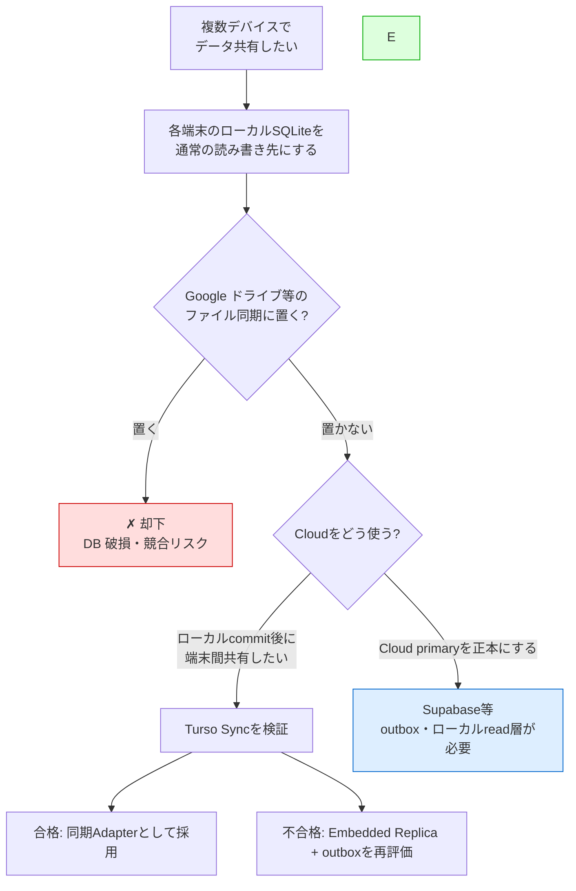

# 複数デバイスでのデータ共有：DB候補比較メモ

> 目的：SQLite のデータを複数デバイスで共有したい。できるだけ無料枠に収めたい。
>
> 位置付け：本書はCloudサービスの調査メモであり、AlgoLoomの現在の保存・同期アーキテクチャを決める正本ではない。正本は[ローカル利用とCloud同期の段階的設計](../features/local-and-cloud-sync-design.md)および[Turso設計ガイド](../integrations/turso-design-guide.md)とする。
> 作成日：2026年7月15日 ／ 料金・無料枠は各社とも頻繁に変わるため、最終判断の前に必ず公式の pricing ページで最新値を確認してください。

---

## ドキュメント概要

本書は、複数デバイスでSQLiteのデータを共有するためのDB候補を、構成、offline動作、競合、費用の観点から比較した調査メモです。現在の同期方式を決める正本ではありません。

## 0. TL;DR（結論）

- **Google ドライブに SQLite を置く案は却下**。ファイル単位で同期する仕組みは DB ファイルと相性が悪く、破損・競合の温床になる（既知のアンチパターン）。
- AlgoLoomでは、全端末にローカルSQLiteを置き、`log`、`show`、`diff`をCloud問い合わせなしで実行する。Cloud DBを通常の読み取り先にしない。
- 複数端末共有が必要な場合は、ローカルDBへcommitしてからCloudへ反映する同期方式を選ぶ。現時点ではTurso Syncを第一候補として耐久・競合・復旧・配布を検証する。
- Supabase、Neon等のCloud-primary構成は一般的な選択肢だが、AlgoLoomの「Cloud障害時にもローカル保存・履歴参照を継続する」契約には追加のoutbox・ローカル読み取り層が必要になる。
- 料金・無料枠・SDKの評価は変動するため、同期Adapterを実装・公開する直前に公式資料で再確認する。

---

## 1. 用語

| 用語 | 本書での意味 |
|---|---|
| Cloud-primary | Cloud上のDBを通常の書き込み先または正本とする構成。 |
| outbox | Cloudへ未送信の変更を端末内へ先に保存し、後から安全に再送するためのqueue。 |
| Adapter | 上位の保存契約を変えずに、DBや同期方式ごとの実装差を閉じ込める境界。 |
| Embedded Replica | Cloud primaryの複製を端末内に置き、主にローカル読み取りへ使う方式。 |
| Turso Sync | 各端末のローカルDBで読み書きし、`push()` / `pull()`でCloudと同期する方式。 |
| BaaS | Database、認証、API等のbackend機能をまとめて提供するservice。Backend as a Serviceの略。 |
| row scan | queryを処理するためにDBが走査する行。Tursoの課金単位に関係する。 |
| WAL | DB本体へ反映する前の変更を別fileへ記録するSQLiteの仕組み。Write-Ahead Loggingの略。 |
| keepalive | 一定間隔で軽いqueryを送り、無料枠の自動停止を避ける運用。 |

---

## 2. 全体像（選び方の分岐）

---

## 3. 一覧比較表

| 候補 | 種別 | 無料枠の要点 | アイドル時の挙動 | 認証/API 同梱 | あなたのスタックとの相性 |
|------|------|--------------|------------------|:---:|------|
| **Google Drive + SQLite** | ファイル同期 | 実質無料 | ― | ✗ | ✗ 破損リスクで非推奨 |
| **Supabase** | BaaS（Postgres 基盤） | DB 500MB / MAU 5万 / 帯域 5GB | 7日で**完全停止**（手動復帰・約30秒） | ◎ 認証・自動REST/GraphQL・Realtime | ◎ SDK 充実、東京リージョン |
| **Neon** | サーバーレス Postgres | 100プロジェクト / 各0.5GB / 100 CU時間 | 5分で**自動スリープ→自動復帰**（約500ms） | ✗ DB のみ | ○ 標準 Postgres、Go の学習に好適 |
| **Turso（libSQL）** | エッジ SQLite | 100 DB / 5GB / 読5億・書1000万行/月 | サーバーレス（コールドスタート無を謳う） | ✗ DB のみ | ◎ SQLite 互換、Go/Rust/TS SDK |
| **Crunchy Bridge** | マネージド Postgres | $5 最低課金枠（厳密な永久無料ではない） | 常時稼働寄り | ✗ DB のみ | ○ **東京リージョン**あり |

> ◎=特に強い ○=可 ✗=なし／非推奨

---

## 4. コスト比較表（2026年7月時点・目安）

| 候補 | 無料 | 有料の入口 | 課金の考え方 | 無料枠での「詰まりどころ」 |
|------|:---:|------|------|------|
| **Supabase** | $0 | **Pro $25/月**〜（+従量） | プラン定額（使わなくても定額） | 7日停止 / DB 500MB / バックアップなし |
| **Neon** | $0（$5 spend cap） | **Launch 約$19/月**〜（+従量） | 実際に稼働した compute 時間に課金 | compute 100 CU時間/月 / 各0.5GB |
| **Turso** | $0 | **Developer $4.99/月**〜 | ストレージ＋**行スキャン数**に課金 | 「行読み取り」超過（後述の罠） |
| **Crunchy Bridge** | 実質$5〜 | $10/月前後〜 | インスタンス課金 | 純粋な永久無料枠ではない |

**ポイント：課金モデルの性格が違う**

- **Supabase＝定額型**：使っても使わなくても月 $25。トラフィックが読めるアプリで予算を立てやすい。
- **Neon＝従量型**：断続利用なら数ドル、無操作時はほぼ $0。放置しがちな個人アプリと相性が良い。
- **Turso＝行スキャン課金**：後述の「row-read の罠」に注意。読み取りが多い設計だと予想外に増える。

---

## 5. 各候補の詳細

### ✗ Google Drive + SQLite（却下）

- **なぜダメか**
  - ファイル同期は DB を「丸ごと1ファイル」として扱い、中の差分やトランザクション境界を理解しない。
  - 2台で同時編集すると「Conflict コピー」が生成され、DB はファイルレベルでマージ不能 → 片方の変更が消える。
  - 開いている最中のファイルを同期するとスナップショットが不整合になり、コピー側が破損しうる。
  - WAL モードの `.db-wal` / `.db-shm` が整合性を保って同期されず壊れやすい。
- **かろうじて動く条件**：常に1台だけが書き込み、他は完全に閉じてから開き、同期完了を待つ ―― を厳守できる場合のみ。現実にはミスで事故る。
- **結論**：恒久運用の基盤にはしない。

---

### Supabase（第一候補：最速で作れる）

Postgres を核に、認証・自動 API・ストレージ・Realtime をひとまとめにした BaaS。

- **メリット**
  - テーブルを定義するだけで **REST / GraphQL API が自動生成**。バックエンドをほぼ書かずに複数デバイス同期を実現できる。
  - **認証が同梱**（誰のデータかの識別が最初から可能）。
  - クライアント SDK が充実。中身は標準 Postgres なので後で移行もしやすい。
  - **東京リージョン**を選べる。カード登録不要・商用利用可。
- **デメリット / 注意**
  - **7日間クエリが届かないと自動停止**。データは消えないが、手動復帰＋約30秒のコールドスタート。
  - 無料枠は**自動バックアップなし**。
  - DB 500MB / 帯域 5GB / 共有 CPU（RAM 500MB）。
- **無料枠を活かす運用**
  - `keepalive` cron を仕込む（後述）。
  - `pg_dump` の定期退避でバックアップを自作。

---

### Neon（放置耐性・DB専用）

コンピュートとストレージを分離したサーバーレス Postgres。DB 単体に特化。

- **メリット**
  - **5分無操作で自動スリープ → 次のクエリで自動復帰**（約500ms）。**手動復帰が不要**で、放置しがちな個人アプリに向く。
  - 無料枠が **100プロジェクト**と多く、実験・使い捨てに強い。
  - **ブランチング**（コピーオンライトで DB を瞬時に複製）。無料枠に **$5 の spend cap**。
  - 標準 Postgres なので、API を **Go で自作**すればバックエンド学習も兼ねられる。
- **デメリット / 注意**
  - **DB のみ**。認証・API・ストレージは自前で用意する必要がある。
  - compute は 100 CU時間/月、各プロジェクト 0.5GB。
- **向くケース**：「認証や自動 API は要らない、堅い Postgres を安く放置運用したい」。

---

### Turso / libSQL（SQLite の手触りを残す）

SQLite のフォーク libSQL をマネージド提供。エッジ配置と embedded replica が売り。

- **メリット**
  - **SQLite 互換**。既存の SQLite 知識・ツール・ORM（Drizzle など）がそのまま活きる。
  - **embedded replica**：ローカルに同期レプリカを持ち、読み込みがローカルディスク速度（マイクロ秒級）。書き込みは primary へ。
  - **無料枠が寛容**：100 DB / 5GB / 読み取り5億行・書き込み1000万行/月。Go・Rust・TS の SDK あり。
- **デメリット / 注意**
  - **単一 writer モデル**は SQLite 譲りで残る（同時書き込みは直列化）。
  - **「row-read の罠」**：課金は「行スキャン」単位。インデックスの無いフルスキャンや `count`/`avg`/`sum` などの集計は、走査した全行が読み取りとして計上され、想定より早く枠を消費しがち。→ 適切なインデックス設計が必須。
  - **エッジ / embedded replica 前提**でこそ真価。単純な1インスタンス利用だと Postgres 勢との差別化が薄い。
- **向くケース**：「前回話した SQLite 路線を、マネージドで安全にやりたい」「ローカル読み込みを極速にしたい」。

---

### その他（参考）

- **Crunchy Bridge**：**東京リージョン**が選べるので国内レイテンシ重視なら候補。ただし $5 最低課金の形で、厳密な「永久無料枠」ではない点に注意。
- **Koyeb Postgres**：無料枠あり。5分でオートスリープする挙動は Neon 系に近い。
- **Cloudflare D1**：SQLite ベースだが **Workers 前提**。アプリが Workers 上なら好相性、そうでないと扱いにくい。

---

## 6. あなたのケースでの推奨

AlgoLoomでは、複数端末で共有する個人アプリ、かつ書き込むのは基本的に自分1人で同時編集しない、という前提を採る。

1. まず標準SQLiteだけで、ローカル保存・`log`・`show`・`diff`・backup/restoreを完成させる。
2. Turso Syncを、同じ論理スキーマとAdapter契約で試作する。Cloud障害時のローカル継続、強制終了からの復旧、2端末同期、競合、wheel導入に合格した場合だけ採用する。
3. Turso Syncが条件を満たさない場合は、Embedded Replica + outboxを再評価する。ただしoutboxの未共有履歴を通常の履歴として表示できることを必須条件にする。

Supabase、Neon、Crunchy Bridge等は、将来Cloud-primary構成を再検討する場合の比較対象として残す。その場合も、Cloudへの直接問い合わせで履歴表示を遅くしないためのローカル永続化・読み取り層を別途設計する。

---

## 7. 補足：無料枠を安全に使うための2点

### keepalive cron（Supabase の自動停止対策）

- **仕組み**：Supabase は「実際に DB へクエリが届かない状態が7日」続くと停止する。**7日以内に1回でも本物のクエリ**を投げればタイマーがリセットされる。
- **やること**：GitHub Actions のスケジュール実行などで、**3日おきに `SELECT 1;` 相当の軽いクエリを1本**投げる。3日間隔なら1回失敗しても次で拾えて安全。
- **注意**：ダッシュボードを開くだけ／キャッシュが返る API 呼び出しは「アクティビティ」扱いにならない。**DB まで到達するクエリ**が必要。
- **前提**：アプリを数日に1回以上ちゃんと使うなら、その利用自体がクエリを生むので keepalive 不要なことも多い。効いてくるのは「作って数週間放置」パターン。

### バックアップは別途用意する

- keepalive は「停止回避」であって**バックアップの代わりにはならない**。
- 無料枠でも `pg_dump`（Supabase/Neon/Crunchy）や `turso db dump`（Turso）を **GitHub Actions で定期実行**し、プライベートリポジトリや R2 等に退避しておくと安心。

---

*※ 本資料の数値は 2026年7月15日 時点の調査に基づく目安です。各社とも料金・無料枠を頻繁に改定するため、契約前に公式ページで最新の条件を確認してください。*
