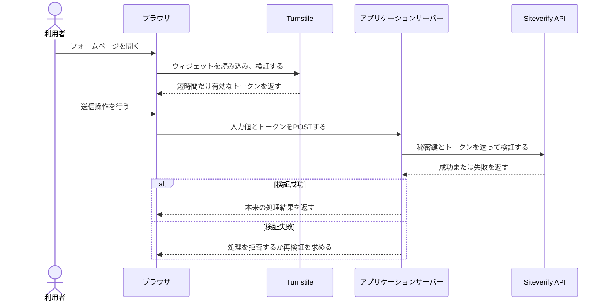
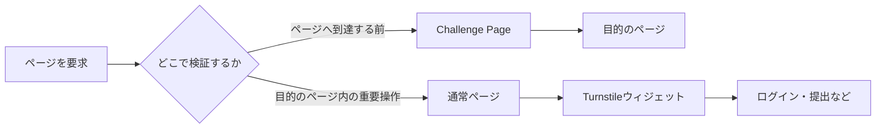
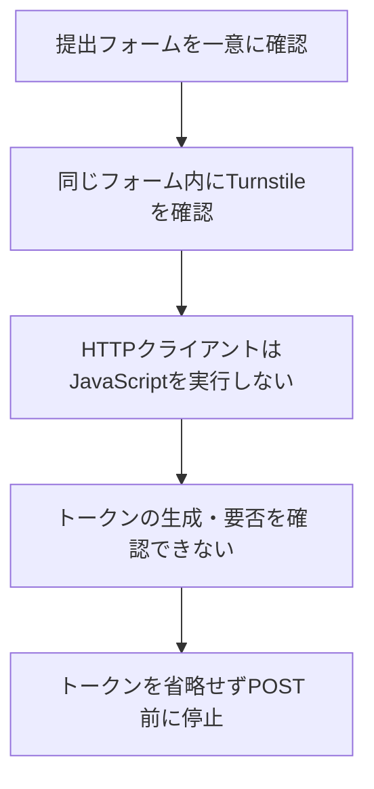

# Cloudflare Turnstile入門

> 対象: Web開発を学び始めたJr.エンジニア
>
> 状態: 学習用参考資料
>
> 確認日: 2026年8月12日
>
> 参照元: Cloudflare公式ドキュメント

## ドキュメント概要

本書は、Cloudflare Turnstileが何をする機能なのか、フォーム送信時にどのように動くのか、Cloudflare Challenge Pageと何が違うのかを説明します。最後に、AlgoLoomの`p0-07`で提出POST前に停止した理由を、この仕組みに当てはめて整理します。

## 0. 結論

Turnstileは、ログイン、登録、問い合わせ、購入、提出などの重要な操作を自動化された不正利用から守るため、Webページへ埋め込む検証機能です。従来型CAPTCHAのように画像問題を毎回解かせるのではなく、ブラウザや実行環境から得られる信号を使い、多くの場合は利用者の操作を最小限にして正当性を確認します。

特に重要な点は次のとおりです。

- 通常のフォーム連携では、検証結果のトークンをHTTPリクエストヘッダーではなく、フォーム本文の`cf-turnstile-response`フィールドで送ります。
- トークンを受け取ったアプリケーションサーバーは、Cloudflareの`Siteverify` APIで必ずサーバー側検証を行います。
- トークンがないことだけで「ボットと確定した」とは限りません。「正当性を確認するための証明がない」ため、サーバーが処理を拒否する可能性がある状態です。
- Turnstileウィジェットと、ページ全体を差し替えるCloudflare Challenge Pageは別のものです。

## 1. Turnstileは何のために使うのか

Webサイトには、人が使う通常の操作に見せかけた自動処理が送られてくることがあります。たとえば、大量の迷惑投稿、アカウントの不正作成、認証情報を総当たりする試行、フォームや購入処理の乱用です。

Turnstileは、重要な操作の直前でブラウザに小さな検証を実行させ、その結果を短時間だけ有効なトークンとしてアプリケーションへ渡します。サイト運営者はそのトークンを検証し、操作を続けてよいか判断できます。

Cloudflare公式の[Turnstile概要](https://developers.cloudflare.com/turnstile/)では、次の特徴が説明されています。

- Webサイト全体の通信をCloudflare経由にしなくても、ウィジェット単体を組み込めます。
- 小さな非対話的検証やブラウザの信号を利用します。
- 状況によってはチェックボックスを表示しますが、画像選択問題への依存を減らしています。
- ウィジェットにはManaged、Non-interactive、Invisibleの3種類があります。

Turnstileは「人間であることを完全に証明する装置」ではありません。ブラウザから得られる複数の信号を使い、正当なアクセスである可能性を評価する仕組みです。

## 2. フォーム送信時の全体像

一般的なフォーム連携は、次の順番で動きます。



この流れは、Cloudflare公式の[クライアント側表示](https://developers.cloudflare.com/turnstile/get-started/client-side-rendering/)と[サーバー側検証](https://developers.cloudflare.com/turnstile/get-started/server-side-validation/)に基づきます。

### 2.1. 登場する値

| 値 | 置かれる場所 | 役割 | 公開してよいか |
|---|---|---|---|
| サイトキー | HTMLまたはJavaScript | どのTurnstileウィジェットかを識別する | 公開情報として扱う |
| 秘密鍵 | アプリケーションサーバー | `Siteverify` APIを呼び出すサーバーを認証する | 公開しない |
| Turnstileトークン | ブラウザで生成され、アプリケーションサーバーへ送られる | 直前の検証結果を表す | 一時的な値として扱い、再利用しない |
| `cf-turnstile-response` | 既定では送信フォームの本文 | Turnstileトークンを運ぶ入力フィールド | フィールド名は公開情報。値は一時的なトークン |
| `cf_clearance` | 任意の事前通過設定を使う場合のCookie | 後続のCloudflare検査を通過済みであることを示す | Turnstileトークンとは別物 |

秘密鍵は、ブラウザへ渡してはいけません。ブラウザが受け取るサイトキーと、アプリケーションサーバーだけが保持する秘密鍵は役割が異なります。

### 2.2. トークンはどこへ付くのか

Turnstileウィジェットをフォーム内へ置くと、既定ではJavaScriptが非表示の`cf-turnstile-response`フィールドを追加します。したがって、概念上の送信本文は次のようになります。

```text
task=abc300_a
language=python
source=<利用者が入力した値>
cf-turnstile-response=<ブラウザが得た一時トークン>
```

これはリクエストヘッダーへ付ける固定の「ボットではない印」ではありません。サイト側の設定で応答フィールド名を変更したり、自動追加を無効にしたりできますが、[ウィジェット設定の既定値](https://developers.cloudflare.com/turnstile/get-started/client-side-rendering/widget-configurations/)は`cf-turnstile-response`です。

アプリケーションサーバーは受け取ったトークンを、自身だけが知る秘密鍵とともに`Siteverify` APIへ送ります。

```text
secret=<サーバーだけが保持する秘密鍵>
response=<ブラウザから受け取った一時トークン>
```

この2回目の通信は、利用者のブラウザからではなくアプリケーションサーバーからCloudflareへ行います。

## 3. ウィジェットの表示方法

### 3.1. 利用者にどう見えるか

| 種類 | 利用者に見えるもの | 操作 |
|---|---|---|
| Managed | 状況に応じて進行表示やチェックボックス | 必要な場合だけ操作する |
| Non-interactive | 進行表示を含むウィジェット | 操作しない |
| Invisible | 通常は表示されない | 操作しない |

画面に問題やチェックボックスが出ない場合でも、検証をしていないとは限りません。公式の種類と挙動は[Turnstile概要](https://developers.cloudflare.com/turnstile/)で確認できます。

### 3.2. 開発者がどう起動するか

| 表示方式 | 代表的な記述 | 動作 |
|---|---|---|
| 暗黙的な表示 | HTMLに`.cf-turnstile`を置く | JavaScriptが対象要素を探して自動表示する |
| 明示的な表示 | `turnstile.render()`を呼ぶ | アプリケーションの処理から表示する |
| 実行を分ける方式 | `turnstile.execute()`を呼ぶ | 表示時点と検証開始時点を分ける |

したがって、生のHTMLに`turnstile.render()`や`turnstile.execute()`が見つからないだけでは、Turnstileが起動しないとは断定できません。`.cf-turnstile`要素をJavaScriptが暗黙的に見つける方式があるためです。

## 4. Challenge Pageとの違い

TurnstileウィジェットとCloudflare Challenge Pageは、同じCloudflareの検証技術を利用しますが、ページ内での位置付けが違います。

| 比較項目 | Turnstileウィジェット | Challenge Page |
|---|---|---|
| 表示される場所 | 目的のページやフォームの中 | 目的のページへ到達する前の独立したページ |
| 主な保護単位 | ログインや提出などの特定操作 | ページへのリクエスト全体 |
| 通過後の代表的な結果 | フォームとともに送る短時間のトークン | 目的のページへ進み、通常は通過状態をCookieで保持 |
| 公式のHTTP応答識別 | ウィジェットのHTMLやJavaScript構造を確認する | 応答ヘッダー`cf-mitigated: challenge`を確認する |
| HTTP 200だけでの判別 | 判別できない | 判別できない。Challenge PageもHTMLを返し得る |



Cloudflare公式は、[TurnstileのChallenge形式](https://developers.cloudflare.com/cloudflare-challenges/challenge-types/turnstile/)を「目的のページへ到達した後、ページ内の重要操作を守るもの」と説明しています。一方、[Challenge Page](https://developers.cloudflare.com/cloudflare-challenges/challenge-types/challenge-pages/)は目的のページへ進む前にリクエストを一時停止します。Challenge Pageの機械的な識別には、公式の[応答の検出方法](https://developers.cloudflare.com/cloudflare-challenges/challenge-types/challenge-pages/detect-response/)で示される`cf-mitigated: challenge`を使います。

## 5. トークンの有効期間とサーバー検証

Turnstileトークンには、次の制約があります。

- 有効期間は生成から5分です。
- 一度だけ使用できます。
- 最大長は2,048文字です。
- アプリケーションサーバーでの`Siteverify` API検証が必須です。
- 期限切れや使用済みの場合は、ブラウザで新しいトークンを取得する必要があります。

代表的な検証失敗は次のとおりです。

| 状態 | 代表的なエラーコード | 意味 |
|---|---|---|
| トークンが送られていない | `missing-input-response` | 検証対象の応答がない |
| トークンが不正 | `invalid-input-response` | 形式または値を検証できない |
| 期限切れまたは再利用 | `timeout-or-duplicate` | 5分を超えたか、すでに使用されている |

ここで重要なのは、`missing-input-response`が「この利用者はボットである」という判定名ではないことです。Cloudflareへ検証を依頼するためのトークンが不足している状態を表します。その失敗を受けて本来の操作を拒否するかどうかは、アプリケーションサーバー側が決めます。

## 6. サイトへ組み込むときの基本原則

サイト運営者としてTurnstileを組み込む場合は、次の原則を守ります。

- クライアント側の見た目やコールバックだけで成功扱いにせず、サーバー側で`Siteverify` APIを呼び出します。
- 秘密鍵をHTML、JavaScript、公開リポジトリ、ログへ出しません。
- トークンを保存して後から使い回しません。
- 期限切れや重複利用を通常の失敗として扱い、必要なら利用者へ再検証を案内します。
- 自分のアプリケーションの自動テストでは、Cloudflare公式の[テスト用サイトキーと秘密鍵](https://developers.cloudflare.com/turnstile/troubleshooting/testing/)を使います。
- 第三者サイトの本番ウィジェットを回避したり、トークンを自動取得したりしません。

## 7. `p0-07`へ当てはめる

AlgoLoomの`p0-07`では、対象フォームが提出処理に使われるかどうかは判別できています。不明だったのは、そのフォームに含まれるTurnstileをAtCoderの提出POSTがどのように検証するかです。

| 分類 | `p0-07`で分かったこと |
|---|---|
| 確認済み | 認証済みの通常ページであり、対象の提出フォームを一意に認識した |
| 確認済み | 対象フォーム内にTurnstileウィジェットが1件あった |
| 確認済み | `cf-mitigated: challenge`がなく、Cloudflare Challenge Pageではなかった |
| 観測できず | JavaScript実行後に生成されるTurnstileトークンと応答フィールド |
| 未確認 | AtCoderのサーバーが提出POSTでトークンを必須とするか |
| 判断 | 必要なトークンを推測で省略せず、提出POST前に安全側で停止した |

関係を単純化すると、次のとおりです。



つまり、「検出したフォームが提出処理に関係するか分からなかった」のではありません。提出フォームだと分かったうえで、そのフォームに組み込まれた検証を満たさずPOSTしてよい根拠がなかったため停止しました。詳しい実行記録は[`p0-07`](../docs/verification/judge-adapter/results/2026-08-12-p0-07.md)を参照してください。

## 8. 用語表

| 用語 | 意味 |
|---|---|
| CAPTCHA | 自動処理と正当な利用者を見分けるための検証方式の総称 |
| Turnstile | Cloudflareが提供する、利用者の負担を抑えたCAPTCHA代替機能 |
| ウィジェット | Webページ内へ埋め込むTurnstileの表示・実行単位 |
| サイトキー | ブラウザ側でウィジェットを識別する公開用の値 |
| 秘密鍵 | アプリケーションサーバーが検証APIを呼ぶための非公開の値 |
| トークン | ブラウザでの検証結果を示す、短時間かつ一度だけ有効な値 |
| `cf-turnstile-response` | Turnstileトークンを送る既定のフォームフィールド名 |
| `Siteverify` | アプリケーションサーバーがトークンの有効性を確認するCloudflare API |
| Challenge Page | 目的のページへ到達する前に表示されるCloudflareの検証ページ |
| `cf-mitigated` | 応答がChallenge Pageへ置き換わったことを示すCloudflareのHTTP応答ヘッダー |
| `cf_clearance` | Cloudflareの検証を通過した状態を一定期間示すCookie。通常のTurnstileトークンとは別物 |

## 9. 公式資料

- [Cloudflare Turnstile概要](https://developers.cloudflare.com/turnstile/)
- [クライアント側表示](https://developers.cloudflare.com/turnstile/get-started/client-side-rendering/)
- [ウィジェット設定](https://developers.cloudflare.com/turnstile/get-started/client-side-rendering/widget-configurations/)
- [サーバー側検証](https://developers.cloudflare.com/turnstile/get-started/server-side-validation/)
- [TurnstileのChallenge形式](https://developers.cloudflare.com/cloudflare-challenges/challenge-types/turnstile/)
- [Challenge Page](https://developers.cloudflare.com/cloudflare-challenges/challenge-types/challenge-pages/)
- [Challenge Page応答の検出方法](https://developers.cloudflare.com/cloudflare-challenges/challenge-types/challenge-pages/detect-response/)
- [通過状態と`cf_clearance`](https://developers.cloudflare.com/cloudflare-challenges/concepts/clearance/)
- [Turnstileのテスト](https://developers.cloudflare.com/turnstile/troubleshooting/testing/)
