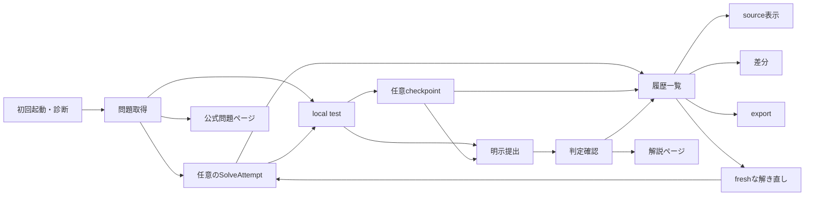
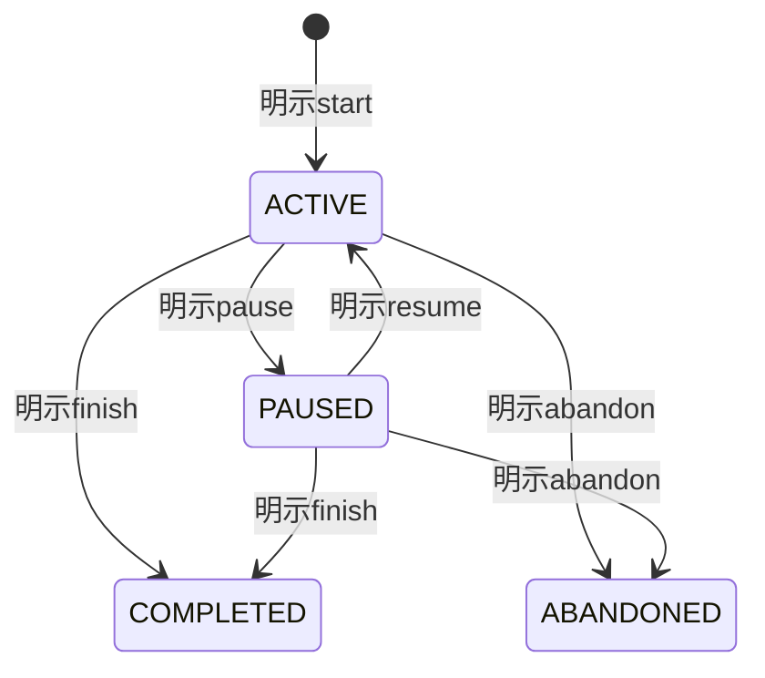
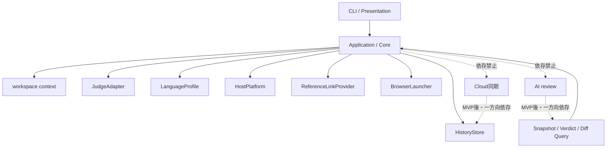

# AlgoLoom MVP機能設計

## 1. 目的と読み方

本書は、MVPで実装する機能、依存関係、完了条件を実装単位へ分解します。

- 機能IDは要件・実装・testを結ぶ追跡用IDです。
- 操作名は概念名であり、最終的なsubcommand名を確定しません。
- MVP後の候補は実装対象と混同しないよう、末尾へ分離します。
- 共通不変条件は[Core開発契約](core-contracts.md)を優先します。

## 2. MVPの機能構成



### 2.1. 機能一覧

| ID | 機能 | 利用者の入力・契機 | 主な結果 | 依存 |
|---|---|---|---|---|
| `MVP-SYS-01` | 初回起動・診断 | 初回起動、明示診断 | Core、DB、選択言語の準備状態と次の行動 | ― |
| `MVP-CTX-01` | workspace context解決 | current directory、明示source | workspace、問題、sourceの一意なcontext | `MVP-SYS-01` |
| `MVP-GET-01` | 問題識別・公式確認 | 正規問題IDまたはAtCoder公式URL | 正規化済み問題context | `MVP-SYS-01` |
| `MVP-GET-02` | sample取得・workspace作成 | 問題context、canonical language ID | metadata、source、公開sampleを持つcheckout | `MVP-GET-01` |
| `MVP-RDO-01` | freshな解き直し | 問題、言語 | 新しいsibling checkoutとSolveAttempt | `MVP-GET-02`, `MVP-ATT-01` |
| `MVP-ATT-01` | SolveAttempt状態管理 | start、pause、resume、status、finish、abandon | 状態とFocusInterval | `MVP-CTX-01`, `MVP-DAT-01` |
| `MVP-ATT-02` | active duration・milestone | attempt操作、sample通過、提出、AC | active durationと3種のmilestone | `MVP-ATT-01`, `MVP-TST-01`, `MVP-SUB-03` |
| `MVP-TST-01` | build・sample test | source、取得済み公開sample | compile、実行、比較、計測の結果 | `MVP-CTX-01`, `MVP-GET-02` |
| `MVP-CHK-01` | 明示checkpoint | 保存済みsource | 不変source snapshot | `MVP-CTX-01`, `MVP-DAT-01` |
| `MVP-SUB-01` | 提出準備 | source、AtCoder session、明示同意 | account確認済みの提出operationとsnapshot | `MVP-CTX-01`, `MVP-DAT-01` |
| `MVP-SUB-02` | AtCoder提出 | `PREPARED` operation | submission IDまたは送信状態不明の記録 | `MVP-SUB-01` |
| `MVP-SUB-03` | 判定確認・再確認 | submission ID | pendingまたは最終verdictの観測 | `MVP-SUB-02` |
| `MVP-HIS-01` | 履歴一覧 | current contextまたは明示対象 | attempt、checkpoint、提出、判定の一覧 | `MVP-DAT-01` |
| `MVP-HIS-02` | snapshot表示 | snapshotまたは履歴の選択 | terminal上のplain text | `MVP-HIS-01` |
| `MVP-HIS-03` | snapshot差分 | 二つのsnapshot | 比較対象を明示したunified diff | `MVP-HIS-01` |
| `MVP-REF-01` | 公式問題ページ参照 | current problem、明示操作 | default browserへの起動要求 | `MVP-CTX-01` |
| `MVP-REF-02` | 解説ページ参照 | current problem、明示操作 | spoiler確認後のbrowser起動要求 | `MVP-CTX-01` |
| `MVP-EXP-01` | 学習履歴export | 保存先、明示操作 | version付きの可搬なexport | `MVP-DAT-01` |
| `MVP-DAT-01` | ローカル保存・migration | Coreの業務操作、schema更新 | transaction済みSQLiteと復旧可能な退避 | `MVP-SYS-01` |
| `MVP-UX-01` | help・進捗・回復案内 | help、長時間処理、部分失敗 | 主結果、保持data、未完了処理、次の一手 | 全機能 |

## 3. 基盤機能

### 3.1. 初回起動・診断

| 要件 | 完了条件 |
|---|---|
| 設定fileの手編集を要求しない | install後、推奨導線だけで最初のlocal testへ進める |
| AI、Cloud、外部Viewerを要求しない | 任意依存なしでCoreが起動する |
| C++、Python、Go、Rustを個別診断する | 一言語の不足が別言語とoffline履歴を止めない |
| host OSとtoolchainを診断する | 原因、影響する機能、公式の導入先を示す |
| 外部環境を変更しない | Editor、shell、plugin、toolchain、OS設定に差分を作らない |
| DBを安全に初期化する | foreign key、unique constraint、schema versionが有効になる |

### 3.2. workspace context

| 状況 | 動作 |
|---|---|
| current directoryから一意に解決できる | 認識したworkspace、問題、sourceを使用する |
| sourceが明示される | 親方向のmetadataと整合する場合だけ使用する |
| 複数sourceまたは複数checkoutが候補になる | 候補を示し、明示指定を求める |
| metadataが欠損・矛盾する | 外部作用やcode実行の前に停止する |
| workspaceまたは問題directoryが移動・renameされる | 絶対pathやdirectory名に依存せず再認識する |
| sourceだけがcontext外へ移動される | 暗黙に別問題へ関連付けない |

## 4. 問題開始と解き直し

### 4.1. 問題取得

```text
入力を正規化
  → AtCoder公式で一件の問題を確認
  → 公開sampleを取得
  → metadata・source・testを安全に作成
  → 開始問題をローカルDBへ保存
  → 補助動作として公式問題ページを開く
```

| 要件 | 完了条件 |
|---|---|
| 正規問題IDとAtCoder公式URLを受け付ける | 不正domain、曖昧ID、対象外問題を作用前に拒否する |
| 一件だけ取得する | 一括crawl、hidden test取得、background crawlを行わない |
| 選択した一言語だけを作る | 組み込み`LanguageProfile`のtemplateを一つ生成する |
| 宣言的metadataだけを置く | credential、endpoint、任意commandを含めない |
| 再実行を安全にする | 編集済みsource、sample、metadataを上書き・重複させない |
| 段階ごとの完了状態を識別する | 中断後に成功済み段階から安全に再開できる |
| browser失敗を分離する | checkoutが利用可能なら問題取得は成功のまま保つ |

### 4.2. freshな解き直し

| 要件 | 完了条件 |
|---|---|
| fresh templateを既定にする | 前回sourceをcopy、reset、上書きしない |
| sibling checkoutを作る | 既存checkoutをmerge、rename、削除しない |
| 新しいSolveAttemptを作る | 前回の時間、milestone、snapshot、判定を変更しない |
| directory名を表示用途に限定する | suffix、ordinal、絶対pathを恒久IDにしない |
| 検証済みsampleを再利用できる | symlink・hard linkを既定にせず、安全にcopyする |
| 既存active / paused attemptを保護する | 暗黙にpause、finish、abandon、mergeしない |
| fileとDBの部分失敗を回復する | 重複checkout・attemptを作らず再実行できる |

## 5. SolveAttemptとlocal test

### 5.1. SolveAttempt状態



| 要件 | 完了条件 |
|---|---|
| 計測開始を明示操作にする | `get`、file保存、`test`で暗黙開始しない |
| 計測なしを正常状態にする | test、submit、履歴を制限せず、案内を繰り返さない |
| active durationをFocusIntervalから算出する | pause中、process時間、判定待ちを含めない |
| 状態遷移を冪等にする | 同じ操作の再実行でintervalを重複作成しない |
| 時計異常を検出する | 負値、推測値、虚偽の精密値として保存しない |
| 別attemptを保護する | 新しいattempt開始時に既存attemptを暗黙変更しない |

### 5.2. milestone

| milestone | 記録条件 | 保存する時間 |
|---|---|---|
| 最初の公開sample通過 | currentかつ未終了のattemptで全sampleが初めて一致 | test完了時点のactive duration |
| 初回提出 | attemptに関連するsubmission IDを初めて取得 | 送信開始前に保存したactive duration |
| 初AC | attemptに関連する提出で最初のACを観測 | ACした提出の送信開始時のactive duration |

### 5.3. local test

| 段階 | 入力 | 結果分類・表示 |
|---|---|---|
| context解決 | workspace、問題、source | 一意な対象または作用前error |
| toolchain診断 | canonical language ID | 利用可能または不足toolの診断 |
| build | `BuildPlan` | success、compile error、timeout、出力量超過、取消 |
| run | `RunPlan`、公開sample input | success、runtime error、timeout、signal、出力量超過、取消 |
| compare | stdout、公開sample output | sampleごとの一致・不一致 |
| measurement | monotonic clock | compile duration、sampleごとのlocal run duration |

- processはshell文字列ではなくargv配列で起動します。
- compileとrunには別のtimeoutとresource上限を設けます。
- timeout・取消時は対象process treeを終了します。
- local testはAtCoder上のACを保証しません。
- 全local test eventはMVPの永続履歴へ保存しません。

## 6. snapshotと振り返り

| 機能 | 保存・表示対象 | 必須条件 |
|---|---|---|
| checkpoint | 明示時点の保存済みsource | 外部通信なし、不変snapshot、未保存bufferは対象外 |
| submission snapshot | 実際に送信するsource bytes | 送信bytesとhashが一致する |
| 履歴一覧 | attempt、時間、milestone、checkpoint、提出、判定 | local DBだけから取得し、状態を混同しない |
| source表示 | 利用者が選んだsnapshot | read-only、terminal plain text |
| 差分 | 利用者が確認した二つのsnapshot | unified diff、暗黙の「最良版」を作らない |

### 6.1. snapshot不変条件

- 保存後にsource本文を上書きしません。
- 正確なsource bytesからhashを計算します。
- 文字コードと改行を暗黙に正規化しません。
- checkoutの移動・削除後も履歴として保持します。
- 内容を重複排除しても履歴eventの意味を失いません。

## 7. 提出と判定

### 7.1. 提出前確認

| 確認対象 | 拒否条件 |
|---|---|
| 問題context | 欠損、矛盾、対象外 |
| source | 複数候補、読取失敗、size上限超過 |
| canonical languageとjudge言語 | 対応するjudge言語を一意に解決できない |
| AtCoder account identity | 未確認、または保存済みaccountと異なる |
| 提出内容と外部作用 | 利用者が明示的に提出していない |

- 初回提出前に、AtCoderのAI学習拒否設定を一度だけ非blockingで案内します。
- AlgoLoomは拒否設定を代行、推測、保証しません。
- AtCoder credentialとsessionを履歴DB、workspace、export、通常logへ保存しません。

### 7.2. 提出状態

```text
PREPARED
  ├─ 送信前の失敗 → FAILED_BEFORE_SEND
  └─ 送信開始 → SEND_STARTED
                    ├─ ID取得 → REMOTE_ACCEPTED → VERDICT_PENDING → FINAL
                    └─ 応答不明 → REMOTE_STATUS_UNKNOWN
```

| 状態 | 保持する事実 | 次の安全な操作 |
|---|---|---|
| `PREPARED` | account、問題、言語、snapshot、hash、operation ID | 送信または安全な取消 |
| `FAILED_BEFORE_SEND` | 外部未送信と確認できる失敗 | 原因修正後の新しい明示操作 |
| `SEND_STARTED` | 外部へ到達した可能性 | 結果確認。無条件再送は禁止 |
| `REMOTE_ACCEPTED` | submission ID | 同じIDの判定確認 |
| `VERDICT_PENDING` | 最後のverdict観測 | 後から同じIDを再確認 |
| `FINAL` | 最終verdictと取得時刻 | 履歴、差分、明示的な次の提出 |
| `REMOTE_STATUS_UNKNOWN` | 送信有無を断定できない事実 | 公式提出一覧と利用者確認 |

### 7.3. 判定観測

- polling timeoutは提出失敗として扱いません。
- verdictは取得時刻付きの観測として追記します。
- judge execution timeとmemoryは取得できた場合だけ保存します。
- 欠損値を`0`または推測値で補いません。
- AtCoder提出、local保存、判定確認を別々の結果として表示します。

## 8. 外部学習資料

| 機能 | 許可する処理 | 安全条件 | 保存 |
|---|---|---|---|
| 公式問題ページ | 公式URLをdefault browserへ渡す | 明示操作または`get`の補助動作 | 本文を保存しない |
| 問題別解説ページ | 公式URLをdefault browserへ渡す | 終了済み、未ACなら明示確認 | 本文・画像・PDF・動画を保存しない |

- `ReferenceLinkProvider`はURL構成だけを担当します。
- `BrowserLauncher`はOSへの起動要求だけを担当します。
- browser起動成功を、page load、login、閲覧成功とみなしません。
- contest終了を確認できない場合、spoiler-sensitiveな資料を開きません。
- test失敗、WA、timeout後に解説を自動表示しません。

## 9. ローカル保存とexport

### 9.1. SQLiteとmigration

| 要件 | 完了条件 |
|---|---|
| Python標準`sqlite3`を唯一のMVP保存方式にする | Turso SDKとCloud accountなしで全Core履歴を扱える |
| 業務操作をtransaction化する | 必要な更新をcommitまたはrollbackできる |
| schema versionを保存する | 既知versionだけを明示migrationする |
| migration前に退避する | 失敗時に旧Schemaへ復旧できる |
| 未知の将来Schemaを保護する | 自動downgradeせず通常起動を停止する |
| lock、disk full、破損を分類する | 外部提出の成否と分けて回復経路を示す |

### 9.2. export

| 含める | 含めない |
|---|---|
| format version、作成時刻、AlgoLoom version | Cookie、token、password、環境変数 |
| 問題、SolveAttempt、FocusInterval、milestone | 不要な絶対path、端末固有executable path |
| checkpoint、submission、verdict、snapshot | 問題文、解説、画像、他ユーザーcode |
| record間の関連とsource回収手段 | Cloud credential、Provider credential |

- export中のDB更新で不整合な組み合わせを出力しません。
- AlgoLoomなしでもsourceを回収できる形式にします。
- restore、Cloud backup、公開用bundleはMVP対象外です。

## 10. アーキテクチャへの配置

| 機能領域 | Port・境界 | Adapter・実装責任 |
|---|---|---|
| CLIと表示 | CLI / Application | 入力、確認、進捗、結果表示を業務状態遷移から分離 |
| 問題取得・提出・判定 | `JudgeAdapter` | AtCoder固有の取得、認証確認、言語解決、提出、判定 |
| 外部資料 | `ReferenceLinkProvider` | AtCoder固有URLの構成。本文は取得しない |
| browser | `BrowserLauncher` | native OSへのURL起動要求 |
| build・run | `LanguageProfile` | template、診断、`BuildPlan`、`RunPlan` |
| process・file | `HostPlatform` / `ProcessRunner` | timeout、process tree、path、atomic file、terminal |
| 履歴・export | `HistoryStore` | SQLite transaction、query、migration |
| workspace | workspace context | metadata探索、曖昧性と矛盾の検出 |



## 11. 機能横断の品質要件

| ID | 要件 | 検証観点 |
|---|---|---|
| `Q-01` | local-first | test、checkpoint、履歴、表示、差分、exportがCloudなしで成立する |
| `Q-02` | 冪等性 | 同じ操作の再実行でsource、履歴、外部提出を重複・破壊しない |
| `Q-03` | 部分失敗からの回復 | 主結果、保持data、未完了処理、次の安全な操作を示す |
| `Q-04` | 外部作用の明示 | network、提出、browser起動をlocal処理と区別する |
| `Q-05` | 有限待機 | HTTP、polling、DB lock、compile、runに上限と取消後の経路がある |
| `Q-06` | resource保護 | stdout、stderr、生成file、process数等に妥当な上限がある |
| `Q-07` | process安全性 | argv配列で起動し、利用者入力をshell文字列へ連結しない |
| `Q-08` | data保護 | secret、source、raw header、不要pathを通常logへ出さない |
| `Q-09` | terminal安全性 | 外部文字列とcodeの制御文字・markupを無害化する |
| `Q-10` | 環境非侵襲性 | 外部toolのinstall、更新、設定変更を通常操作で行わない |
| `Q-11` | 可搬性 | 4言語を`LanguageProfile`、3 OSを`HostPlatform`で分離する |
| `Q-12` | 待機UX | 長時間処理は段階、経過、停止可否、後続確認方法を示す |
| `Q-13` | 自己比較 | 時間・判定・差分を他者rankや単一skill scoreへ変換しない |
| `Q-14` | 外部content境界 | 問題・解説・他ユーザーcodeの本文をDB、cache、exportへ保存しない |

## 12. 実装順序

| 順序 | 実装単位 | 完了条件 |
|---:|---|---|
| 1 | `JudgeAdapter`技術検証 | sample取得、account確認、提出、submission ID、判定確認が成立する |
| 2 | `LanguageProfile`と`HostPlatform` | 4言語、3 OSの契約testとE2E matrixがある |
| 3 | local DB、migration、context | transaction、移動・rename、曖昧性、障害回復を検証できる |
| 4 | 初回診断、問題取得 | clean環境から一件のcheckoutを安全に作成できる |
| 5 | local test | build、run、compare、timeout、process tree終了を検証できる |
| 6 | SolveAttempt、milestone、checkpoint | 状態、時間、不変snapshotをofflineで確認できる |
| 7 | freshな解き直し | file / DBの各中断点から重複なく回復できる |
| 8 | 提出・判定再確認 | 送信状態不明とpolling中断から再提出せず回復できる |
| 9 | 履歴、表示、差分、外部参照、export | offline振り返りと安全な持ち出しが成立する |
| 10 | release hardening | security、fault injection、3 OS実機、利用者検証を満たす |

## 13. MVP受け入れシナリオ

| ID | シナリオ | 合格条件 |
|---|---|---|
| `E2E-01` | clean環境から最初の問題を解く | 任意機能と設定file手編集なしで`get → test`を完了する |
| `E2E-02` | 4言語を3 OSで実行する | build / run計画と結果分類が共通契約に一致する |
| `E2E-03` | `get`を各段階で中断する | 編集済みsourceを失わず、再実行で重複を作らない |
| `E2E-04` | compile / runをtimeoutさせる | process treeを残さず、次のtestを実行できる |
| `E2E-05` | attemptをpause・resumeする | intervalを重複せず、active durationをoffline確認できる |
| `E2E-06` | freshな解き直しを各段階で中断する | 旧sourceと履歴を保ち、checkout・attemptを重複させない |
| `E2E-07` | checkpoint後にworkspaceを削除する | 不変snapshotをDBから表示・exportできる |
| `E2E-08` | 提出前保存を失敗させる | AtCoderへ送信しない |
| `E2E-09` | 送信直後に通信を切る | 状態不明を記録し、自動再送しない |
| `E2E-10` | 判定pollingを中断する | submission IDから同じ提出を再確認できる |
| `E2E-11` | browser起動を失敗させる | workspace、履歴、提出の成功状態を変更しない |
| `E2E-12` | DB lock、disk full、migration失敗を起こす | 成功済みdataを失わず、復旧経路を示す |
| `E2E-13` | exportを検査する | sourceを回収でき、secret・不要path・外部本文を含まない |
| `E2E-14` | AI、Cloud、Viewerなしで利用する | Coreの主要導線を完了できる |

## 14. MVP後の機能候補

この表は実装契約ではありません。各候補は昇格条件を満たした後に、別の仕様で確定します。

| 製品段階 | 候補 | 主な能力 | MVPへ入れない理由・採用条件 |
|---|---|---|---|
| Phase 2 | 履歴の対話検索 | incremental search、非interactive fallback | 既存の`log`、`show`を必須依存なしで維持する |
| Phase 2 | 問題catalog・選択支援 | catalog更新、filter、`pick`、stale fallback | catalog障害で問題ID・公式URLの導線を止めない |
| Phase 2 | 問題・解法タグ | 複数tag、scope、source、spoiler制御 | user、外部、AIの出典を分離する |
| Phase 2 | 他ユーザーAC提出一覧 | AtCoder提出一覧をbrowser表示 | code本文、author、Cookieを取得・保存しない |
| Phase 2 | 対応環境拡張 | WSL、追加言語、project build | 既存Portと検証matrixを弱めない |
| Phase 2 | local peak memory | OS別のpeak観測 | 値の意味と範囲を3 OSで検証する |
| Phase 2 | Editor / Diff Viewer Adapter | 既存toolで表示 | 外部toolと設定を変更せずterminal fallbackを保つ |
| Phase 2 | 詳細test履歴・自動checkpoint | opt-inのevent記録 | 保存範囲、保持、重複、無効化を定義する |
| Phase 2 | 継続timer・外部連携 | watch、machine-readable status | daemonとEditor pluginをCore要件にしない |
| Phase 2 | 自己振り返り分析 | attempt、期間、言語、差分の比較、snapshotからの再開 | 他者rankと単一scoreを作らない |
| Phase 2 | AtCoder既存履歴import | read-only backfill | AlgoLoomで記録した履歴と区別する |
| Phase 2 | backup・restore | 世代管理、整合backup、復元 | 同期と分離し、復元で既存dataを失わない |
| Phase 2 | 公開候補bundle | 一問・一sourceのlocal bundle | allowlist、rule、privacy検査後に採用判断する |
| Phase 2 | machine-readable出力 | version付きJSON、安定exit status | 人向け出力をparseさせない |
| Phase 2 | user preference | 表示・既定値・外部tool参照 | Core契約を変えず、標準状態へresetできる |
| Phase 3以降 | AI review | Provider設定、安全判定、同意、review revision | Core snapshot契約の安定とfail closedが前提 |
| Phase 3以降 | Cloud同期 | enable、bootstrap、push / pull、retry、disable | 2端末、offline、競合、配布の検証が前提 |
| Phase 3以降 | Repair Lab | 仮説、予測、修正、検証、振り返り | 学習価値、未信頼code隔離、共通UXを検証する |
| 長期 | 学習データQuery | version付きRead Modelと説明可能な指標 | DB Schemaを外部契約にしない |
| 長期 | local data access | read-only libraryまたはlocalhost API | accountなし、offline、最小権限を維持する |
| 長期 | 公式dashboard | 共通Queryを使うreference client | 自己比較、accessibility、Web securityを満たす |
| 長期 | Hosted API | 認証済み本人へのread API | ownership、scope、rate limit、運用責任が前提 |
| 長期 | managed service | 同期・APIの運用 | 需要、費用、法務、privacyを別途判断する |

## 15. 未決事項

| 領域 | 本書で確定しないこと | 参照先 |
|---|---|---|
| CLI | subcommand、引数、option、alias、completion | [未決事項 1.1](../docs/project/unresolved-decisions.md#11-日常commandの最終仕様) |
| workspace | metadata名・形式・version、探索上限、明示option | [未決事項 1.2](../docs/project/unresolved-decisions.md#12-workspace-metadataとcontext指定) |
| 時間計測 | 最終CLI、表示精度、時計異常の訂正UX | [未決事項 1.8](../docs/project/unresolved-decisions.md#18-学習時間計測のcliと時計異常からの回復) |
| 外部資料 | 最終CLI、spoiler文、non-interactive確認 | [未決事項 1.9](../docs/project/unresolved-decisions.md#19-外部学習資料のcliとspoiler確認) |
| 解き直し | 最終CLI、stable local identity、途中marker | [未決事項 1.10](../docs/project/unresolved-decisions.md#110-freshな解き直しのcliと回復) |
| 表示 | 色、spinner、table、進捗、詳細表示量 | [未決事項 1.4](../docs/project/unresolved-decisions.md#14-履歴表示診断の細部) |
| 構造化出力 | exit code、machine-readable Schema | [未決事項 1.5](../docs/project/unresolved-decisions.md#15-exit-codeとmachine-readable出力) |
| 実装 | CLI framework、module、table、column、file形式 | [未決事項 2.1](../docs/project/unresolved-decisions.md#21-実装技術の最終形) |
| 制限値 | timeout、出力量、size、保持期間 | [未決事項一覧](../docs/project/unresolved-decisions.md) |
