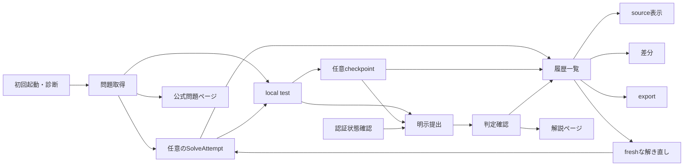
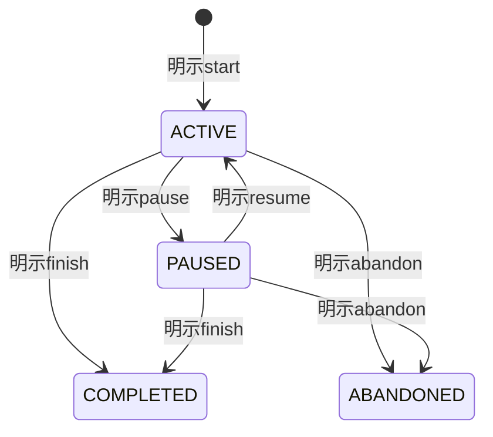
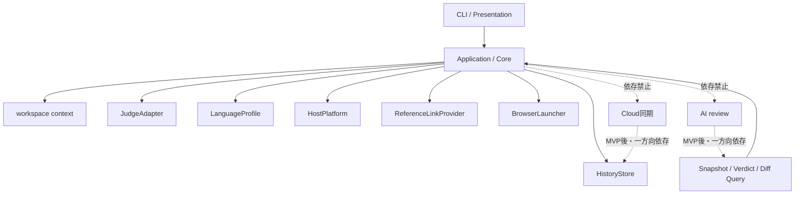

# AlgoLoom MVP機能設計

## 1. 目的と読み方

### 1.1. 本書の役割

本書は、MVPで実装する機能、依存関係、完了条件を実装単位へ分解します。

| 本書で決めること | 本書で決めないこと |
|---|---|
| 機能の単位、責任、依存関係 | subcommand、引数、option、aliasの最終名称 |
| 機能ごとの要件と完了条件 | class、module、table、columnの最終名称 |
| 機能横断の品質要件 | timeout、出力量、size、保持期間の具体値 |
| 実装順序と受け入れシナリオ | metadata fileとexport fileの最終形式 |

- 共通不変条件は[Core開発契約](core-contracts.md)、MVPの境界は[MVP実装範囲](scope.md)を優先します。
- 本書と`docs/`の設計文書が矛盾する場合は、[正本と優先順位](README.md#3-正本と優先順位)に従い、`docs/`を優先して不整合を修正します。
- MVP後の候補は[§16](#16-mvp後の機能候補)へ分離し、実装対象と混同しません。

### 1.2. 用語

正本は[Core契約 §1](../docs/architecture/core-contracts.md#1-用語)と[アーキテクチャ概要 §1](../docs/architecture/overview.md#1-用語)です。本書を単独で読むために必要な範囲を再掲します。

| 用語 | 本書での意味 |
|---|---|
| Core | AI、Cloud同期、外部Viewer等を設定しなくても成立する日常機能と共通契約 |
| optional Capability | Coreの安定した契約へ一方向に依存し、未導入・失敗でもCoreを変化させない機能 |
| workspace | 問題directoryを配置し、AlgoLoomが作業対象として認識する通常のdirectory |
| problem checkout | ある問題のsourceを編集する一つの物理directory。同じ問題に複数存在でき、移動・rename可能 |
| problem metadata | 問題directoryと一緒に移動する宣言的file。正規問題ID、judge、schema version等を持つ |
| context | commandが処理対象とするworkspace、問題、sourceの組み合わせ |
| canonical language ID | `cpp`、`python`、`go`、`rust`等、toolchain名やjudge上のversionに依存しない言語識別子 |
| source snapshot | ある時点の正確なsource bytesと、由来・問題・言語・時刻を結び付けた不変記録 |
| checkpoint | 利用者の明示操作で作るsource snapshot |
| submission snapshot | 外部送信に使う正確なsource bytesを保持する必須のsource snapshot |
| SolveAttempt | ある問題へ一度取り組む開始から終了までの学習記録。解き直しは別recordにする |
| FocusInterval | SolveAttempt内でpauseを除いて能動的に取り組んだ一つの時間区間 |
| active duration | 妥当なFocusIntervalの合計。wall elapsedやprocess durationと区別する |
| learning milestone | 最初の公開sample通過、初回提出、初AC等、SolveAttempt内の到達点 |
| submission operation | 外部送信前の耐久保存から、判定確定または状態不明からの回復までを表す提出操作記録 |
| submission | AtCoderが受理し、submission IDを発行した提出 |
| verdict observation | AtCoderから判定状態を取得した、取得時刻付きの観測記録 |
| 外部学習資料 | AtCoder上の問題、解説、他ユーザーの提出code等、本文をAlgoLoomへ保存せずbrowserで参照する資料 |
| 外部所有環境 | Editor、shell、plugin、toolchain、Provider runtime、OS設定等、AlgoLoomが所有しない永続状態 |
| 冪等性 | 同じ操作を再実行しても、重複や上書きによって既存データを壊さない性質 |
| fail closed | 安全性を確認できない場合に、許可せず停止する方針 |
| `LanguageProfile` | 言語固有のtemplate、toolchain診断、`BuildPlan` / `RunPlan`を提供する組み込み境界 |
| `HostPlatform` | OS固有のprocess、path、terminal、file操作を閉じ込める境界 |
| `JudgeAdapter` | AtCoder固有の取得、認証確認、提出、判定確認、judge言語解決を閉じ込める境界 |
| `ReferenceLinkProvider` | judge固有の公式URLを構成する境界。外部本文を取得しない |
| `BrowserLauncher` | OSへのURL起動要求だけを担う境界 |
| `HistoryStore` | transaction、履歴状態、queryをSQLite詳細から分ける境界 |

### 1.3. 機能IDと表記規則

| 記法 | 意味 |
|---|---|
| `MVP-XXX-NN` | 機能ID。要件、実装、testを結ぶ追跡用IDであり、CLIやmodule名ではない |
| `R<n>` | 各機能節の要件ID。完全形は`機能ID-R<n>`（例: `MVP-SYS-01-R3`） |
| `Q-NN` | 機能横断の品質要件ID |
| `E2E-NN` | 受け入れシナリオID |

- 機能IDの中間3文字は責任領域を示します（`SYS`基盤、`CTX`context、`GET`問題取得、`RDO`解き直し、`ATT`学習時間、`TST`local test、`CHK`checkpoint、`AUTH`認証、`SUB`提出、`HIS`履歴、`REF`外部参照、`EXP`export、`DAT`保存、`UX`共通体験）。
- `get`、`test`、`submit`等の操作名は責任を示す概念名であり、最終的なsubcommand名を確定しません。
- 「〜しない」と書いた項目は禁止事項であり、実装判断で緩和できません。
- 各節の先頭にある「正本」は、要件の背景と判断理由を確認する`docs/`側の参照先です。

## 2. MVPの機能構成

### 2.1. 主要導線



### 2.2. 機能一覧

| ID | 機能 | 利用者の入力・契機 | 主な結果 | 依存 |
|---|---|---|---|---|
| `MVP-SYS-01` | 初回起動・環境診断 | 初回起動、明示診断 | Core、DB、選択言語の準備状態と次の行動 | ― |
| `MVP-CTX-01` | workspace context解決 | current directory、明示source | workspace、問題、sourceの一意なcontext | `MVP-SYS-01` |
| `MVP-GET-01` | 問題識別・公式確認 | 正規問題IDまたはAtCoder公式URL | 正規化済み問題context | `MVP-SYS-01` |
| `MVP-GET-02` | sample取得・checkout作成 | 問題context、canonical language ID | metadata、source、公開sampleを持つcheckout | `MVP-GET-01` |
| `MVP-RDO-01` | freshな解き直し | 問題、言語 | 新しいsibling checkoutとSolveAttempt | `MVP-GET-02`, `MVP-ATT-01` |
| `MVP-ATT-01` | SolveAttempt状態管理 | start、pause、resume、status、finish、abandon | 状態、FocusInterval、現在状態の表示 | `MVP-CTX-01`, `MVP-DAT-01` |
| `MVP-ATT-02` | active duration・milestone | attempt操作、sample通過、提出、AC | active durationと3種のmilestone | `MVP-ATT-01`, `MVP-TST-01`, `MVP-SUB-03` |
| `MVP-TST-01` | build・sample実行・比較 | source、取得済み公開sample | compile、実行、比較、計測の結果 | `MVP-CTX-01`, `MVP-GET-02` |
| `MVP-CHK-01` | 明示checkpoint | 保存済みsource | 不変source snapshot | `MVP-CTX-01`, `MVP-DAT-01` |
| `MVP-AUTH-01` | AtCoder認証状態確認 | 明示確認、提出前確認 | account identityまたは所有者を示した認証error | `MVP-SYS-01` |
| `MVP-SUB-01` | 提出準備 | source、AtCoder session、明示同意 | account確認済みの提出operationとsnapshot | `MVP-CTX-01`, `MVP-DAT-01`, `MVP-AUTH-01` |
| `MVP-SUB-02` | AtCoder提出 | `PREPARED` operation | submission IDまたは送信状態不明の記録 | `MVP-SUB-01` |
| `MVP-SUB-03` | 判定確認・再確認 | submission ID | pendingまたは最終verdictの観測 | `MVP-SUB-02` |
| `MVP-HIS-01` | 履歴一覧 | current contextまたは明示対象 | attempt、checkpoint、提出、判定の一覧 | `MVP-CTX-01`, `MVP-DAT-01` |
| `MVP-HIS-02` | snapshot表示 | snapshotまたは履歴の選択 | terminal上のplain text | `MVP-HIS-01` |
| `MVP-HIS-03` | snapshot差分 | 二つのsnapshot | 比較対象を明示したunified diff | `MVP-HIS-01` |
| `MVP-REF-01` | 公式問題ページ参照 | current problem、明示操作 | default browserへの起動要求 | `MVP-CTX-01` |
| `MVP-REF-02` | 解説ページ参照 | current problem、明示操作 | spoiler確認後のbrowser起動要求 | `MVP-CTX-01` |
| `MVP-EXP-01` | 学習履歴export | 保存先、明示操作 | version付きの可搬なexport | `MVP-DAT-01` |
| `MVP-DAT-01` | ローカル保存・migration | Coreの業務操作、schema更新 | transaction済みSQLiteと復旧可能な退避 | `MVP-SYS-01` |
| `MVP-UX-01` | 共通出力・待機・回復 | 全commandの結果表示、長時間処理、部分失敗 | 主結果、保持data、未完了処理、次の一手 | 全機能 |

### 2.3. 外部作用の有無

実装時に、どの機能がlocalで完結するかを先に確認します。

| 分類 | 機能 |
|---|---|
| localだけで完結する | `MVP-CTX-01`, `MVP-ATT-01`, `MVP-ATT-02`, `MVP-TST-01`, `MVP-CHK-01`, `MVP-HIS-01`, `MVP-HIS-02`, `MVP-HIS-03`, `MVP-EXP-01`, `MVP-DAT-01` |
| AtCoderへ通信する | `MVP-GET-01`, `MVP-GET-02`, `MVP-AUTH-01`, `MVP-SUB-02`, `MVP-SUB-03` |
| OSのbrowserへ起動要求する | `MVP-REF-01`, `MVP-REF-02`, `MVP-GET-02`の補助動作 |
| 外部toolをread-onlyで検出する | `MVP-SYS-01`, `MVP-TST-01`のtoolchain診断 |

## 3. 基盤機能

### 3.1. 初回起動・環境診断（`MVP-SYS-01`）

> 正本: [ストレスフリーUX設計 §3.1](../docs/quality/stress-free-ux-design.md#31-インストール前の選択と前提環境)、[Core契約 §2.4](../docs/architecture/core-contracts.md#24-設定と実行commandの信頼境界)、[配布方針ガイド §9.1](../docs/operations/algoloom-distribution.md#91-第1段階-github--pypi)

| # | 要件 | 完了条件 |
|---|---|---|
| R1 | 設定fileの手編集を要求しない | install後、推奨導線だけで最初のlocal testへ進める |
| R2 | AI、Cloud、外部Viewerを要求しない | 任意依存を導入しない環境でCoreが起動する |
| R3 | C++、Python、Go、Rustを個別診断する | 一言語の不足が別言語とoffline履歴を止めない |
| R4 | host OSとtoolchainを診断する | 原因、影響する機能、公式の導入先を示す |
| R5 | 外部環境を変更しない | Editor、shell、plugin、toolchain、OS設定に差分を作らない |
| R6 | DBを安全に初期化する | foreign key、unique constraint、schema versionが有効になる |
| R7 | 診断入口を一つにする | 利用者がSubsystemを判別せずに診断へ到達できる |
| R8 | version表示を一致させる | 正式commandと互換commandが同じentry point、version、exit statusを返す |

- installと各言語の実行準備完了を同じ状態として扱いません。
- 不足する外部toolは、影響を受ける機能と受けない機能を分けて示します。
- 外部toolのinstall、update、設定file編集、`PATH`変更を通常操作で行いません。

### 3.2. 保存領域とworkspace layout

> 正本: [Core契約 §2.4](../docs/architecture/core-contracts.md#24-設定と実行commandの信頼境界)、[アーキテクチャ概要 §4](../docs/architecture/overview.md#4-ディレクトリ構成ハイブリッド型)

| 領域 | 内容 | 通常commandで許可すること |
|---|---|---|
| AlgoLoom所有領域 | config、履歴DB、cache、temp | Schemaと保存契約に沿った作成、更新、migration、削除 |
| 利用者が明示したworkspace | 問題directory、metadata、公開sample、source template | 予告したfileの作成。既存sourceの無断上書きは禁止 |
| 外部所有環境 | Editor、shell、plugin、toolchain、OS設定 | read-only検出と、安全なargvによる既存toolの一時起動 |
| OS keyring等のsecret store | AlgoLoom namespaceの項目 | 明示操作による参照・保存・削除。他applicationや外部runtimeの項目は変更しない |

`MVP-GET-02`が作る推奨layoutは次のとおりです。作成後の配置は利用者が自由に変更できます。

```text
algoloom_workspace/
├── abc300_a/                 # 初回のproblem checkout
│   ├── <problem-metadata>    # 名称と形式は未決（§17）
│   ├── main.cpp              # 選択した1言語のtemplateだけを生成
│   └── test/                 # 取得した公開sample
├── abc300_a--02/             # freshな解き直し（MVP-RDO-01）
└── abc300_a-python/          # 同じ問題を別言語で解く場合
```

- 選択した1言語のsourceだけを作り、4言語分を同時生成しません。
- suffix、display ordinal、絶対pathを問題、checkout、SolveAttemptの恒久IDにしません。
- 一般的なfile・directory操作をAlgoLoom独自commandとして再定義しません。

### 3.3. workspace context（`MVP-CTX-01`）

> 正本: [Core契約 §2.3](../docs/architecture/core-contracts.md#23-workspaceとcontext)、[ストレスフリーUX設計 §4.1](../docs/quality/stress-free-ux-design.md#41-現在地と対象fileの曖昧さ)

| 状況 | 動作 |
|---|---|
| current directoryから一意に解決できる | 認識したworkspace、問題、sourceを表示して使用する |
| sourceが明示される | 拡張子、`LanguageProfile`、親方向のmetadataと整合する場合だけ使用する |
| 複数sourceまたは複数checkoutが候補になる | 候補を示し、明示指定を求める |
| metadataが欠損・矛盾する | 外部作用やcode実行の前に停止する |
| workspaceまたは問題directoryが移動・renameされる | 絶対pathやdirectory名に依存せず再認識する |
| sourceだけがcontext外へ移動される | 暗黙に別問題へ関連付けず、明示指定または復旧方法を示す |
| 同じ正規問題IDのcheckoutが複数ある | merge、rename、削除をせず、候補を示す |

- 各command開始時にfilesystemとmetadataからcontextを再検証し、file watcherを正しさの条件にしません。
- `.vscode`、`.idea`等のEditor固有fileを生成・要求せず、metadataやsource候補として解釈しません。
- workspace全体へ恒久的な「現在の言語」modeを設けません。

## 4. 問題開始と解き直し

### 4.1. 問題取得（`MVP-GET-01`, `MVP-GET-02`）

> 正本: [Core契約 §3.1](../docs/architecture/core-contracts.md#31-取得対象)、[同 §3.2](../docs/architecture/core-contracts.md#32-冪等性と部分失敗)、[問題選択・カタログ設計 §6.3](../docs/features/problem-selection-and-catalog.md#63-getの処理)

```text
入力を正規化
  → AtCoder公式で一件の問題を確認
  → 公開sampleを取得
  → metadata・source・testを安全に作成
  → 開始問題をローカルDBへ保存
  → 補助動作として公式問題ページを開く
```

| # | 要件 | 完了条件 |
|---|---|---|
| R1 | 正規問題IDとAtCoder公式URLを受け付ける | 不正domain、曖昧ID、対象外問題を作用前に拒否する |
| R2 | 一件だけ取得する | 一括crawl、hidden test取得、background crawlを行わない |
| R3 | 選択した一言語だけを作る | 組み込み`LanguageProfile`のtemplateを一つ生成する |
| R4 | 宣言的metadataだけを置く | credential、endpoint、任意commandを含めない |
| R5 | 再実行を安全にする | 編集済みsource、sample、metadataを上書き・重複させない |
| R6 | 段階ごとの完了状態を識別する | 中断後に成功済み段階から安全に再開できる |
| R7 | browser失敗を分離する | checkoutが利用可能なら問題取得は成功のまま保つ |
| R8 | 外部通信へ上限を設ける | request timeout、上限付きretry、適切な間隔を持つ |

- MVPの対象は終了済みのAtCoder Algorithm問題です。AHC、interactive問題、特殊judgeは、安全に処理できない場合は理由を示して停止します。
- CAPTCHA、rate limit、Bot対策を回避しません。

### 4.2. 問題metadataと公開sample

> 正本: [Core契約 §2.2](../docs/architecture/core-contracts.md#22-データの権威)、[同 §2.3](../docs/architecture/core-contracts.md#23-workspaceとcontext)

| 対象 | 保持する内容 | 契約 |
|---|---|---|
| problem metadata | 正規問題ID、judge、schema version等の宣言的情報 | 問題directoryと一緒に移動できる通常fileにする |
| 公開sample | sample入出力、取得元、取得時刻 | 内容と由来を確認してから再利用または更新する |
| 未知のmetadata schema version | 認識できない事実 | 推測して解釈せず、影響する操作だけを停止する |

- 問題本文、画像、解説、hidden testを取得・保存しません。
- 検証できないlocal sampleは、`MVP-GET-01`の契約に従って一問分だけ再取得します。

### 4.3. freshな解き直し（`MVP-RDO-01`）

> 正本: [解き直しworkflow設計](../docs/features/revisit-workflow.md)、[Core契約 §3.3](../docs/architecture/core-contracts.md#33-解き直し用problem-checkout)

MVPで扱う開始modeを次のとおり区別します。

| mode | sourceの開始点 | directory | MVP |
|---|---|---|---|
| fresh revisit | 選択言語の組み込みtemplate | 新しいsibling checkout | 対象（既定） |
| in-place new attempt | 現在の保存済みsource | 現在のcheckout | 対象（`MVP-ATT-01`の明示start） |
| snapshot-based revisit | 明示した自分のsnapshot | 新しいsibling checkout | 対象外（[§16](#16-mvp後の機能候補)） |
| resume | 既存source | 既存checkout | 新規attemptではない |

| # | 要件 | 完了条件 |
|---|---|---|
| R1 | fresh templateを既定にする | 前回sourceをcopy、reset、上書きしない |
| R2 | sibling checkoutを作る | 既存checkoutをmerge、rename、削除しない |
| R3 | 新しいSolveAttemptを作る | 前回の時間、milestone、snapshot、判定を変更しない |
| R4 | directory名を表示用途に限定する | suffix、ordinal、絶対pathを恒久IDにしない |
| R5 | 検証済みsampleを再利用できる | symlink・hard linkを既定にせず、安全にcopyする |
| R6 | 既存active / paused attemptを保護する | 暗黙にpause、finish、abandon、mergeしない |
| R7 | fileとDBの部分失敗を回復する | 重複checkout・attemptを作らず再実行できる |
| R8 | 開始点を表示で区別する | fresh revisitとin-place new attemptを混同させない |

- file成功・DB失敗と、DB成功・file失敗を別の回復経路として扱います。
- cleanupが必要でも、利用者fileを自動削除しません。
- 他ユーザーのcodeや外部解説のsample codeを開始元にしません。

## 5. SolveAttemptと学習時間

> 正本: [Core契約 §5.6](../docs/architecture/core-contracts.md#56-solveattemptと学習時間)、[ストレスフリーUX設計 §4.8](../docs/quality/stress-free-ux-design.md#48-時間計測による焦りと記録忘れ)

### 5.1. SolveAttempt状態（`MVP-ATT-01`）



| # | 要件 | 完了条件 |
|---|---|---|
| R1 | 計測開始を明示操作にする | `get`、file保存、`test`で暗黙開始しない |
| R2 | 計測なしを正常状態にする | test、submit、履歴を制限せず、案内を繰り返さない |
| R3 | active durationをFocusIntervalから算出する | pause中、process時間、判定待ちを含めない |
| R4 | 状態遷移を冪等にする | 同じ操作の再実行でintervalを重複作成しない |
| R5 | 時計異常を検出する | 負値、推測値、虚偽の精密値として保存しない |
| R6 | 別attemptを保護する | 新しいattempt開始時に既存attemptを暗黙変更しない |
| R7 | process終了後も継続できる | 各明示操作で状態を耐久保存し、再起動後にresume・finishできる |

- 常駐daemon、Editor plugin、file watcherを計測条件にしません。
- 時計の後退、極端な飛躍、欠損intervalは、影響するdurationを不確実または算出不能として示します。

### 5.2. active durationとmilestone（`MVP-ATT-02`）

| milestone | 記録条件 | 保存する時間 |
|---|---|---|
| 最初の公開sample通過 | currentかつ未終了のattemptで全sampleが初めて一致 | test完了時点のactive duration |
| 初回提出 | attemptに関連するsubmission IDを初めて取得 | 送信開始前に保存したactive duration |
| 初AC | attemptに関連する提出で最初のACを観測 | ACした提出の送信開始時のactive duration |

- 初ACのdurationへ判定polling時間を加算しません。
- 遅れて到着した判定によって、確定済みmilestoneのdurationを増やしません。
- 部分失敗時も、確定済みmilestoneを削除または別attemptへ付け替えません。

### 5.3. 現在状態の表示

| 対象 | 表示契約 |
|---|---|
| 正規の確認経路 | 明示的な`status`相当を現在状態とactive durationの確認経路にする |
| 通常画面 | 秒単位で増える精密値を常駐再描画しない |
| `test`・checkpoint後 | 計測中のときだけ、落ち着いた粒度で短く補助表示できる |
| 時間のラベル | active duration、wall elapsed、process duration、judge execution timeを区別する |
| 未計測 | errorや不完全な履歴として扱わず、開始を繰り返し促さない |

## 6. local test（`MVP-TST-01`）

> 正本: [Core契約 §4](../docs/architecture/core-contracts.md#4-local-test契約)、[ストレスフリーUX設計 §3.4](../docs/quality/stress-free-ux-design.md#34-日常的なテストとerror表示)、[パフォーマンスと待機体験の設計 §3.4](../docs/quality/performance-and-waiting-design.md#34-compiletestのresource制限)

### 6.1. 実行段階

| 段階 | 入力 | 結果分類 |
|---|---|---|
| context解決 | workspace、問題、source | 一意な対象または作用前error |
| toolchain診断 | canonical language ID | 利用可能、または不足toolの診断 |
| build | `BuildPlan` | success、compile error、timeout、出力量超過、取消 |
| run | `RunPlan`、公開sample input | success、runtime error、timeout、signal、出力量超過、取消 |
| compare | stdout、公開sample output | sampleごとの一致・不一致 |
| measurement | monotonic clock | compile duration、sampleごとのlocal run duration |

- processはshell文字列ではなくargv配列で起動します。
- compileとrunには別のtimeoutとresource上限を設けます。
- timeout・取消時は対象process treeを終了します。
- 子processへAtCoder sessionや不要な環境変数を渡しません。
- 全local test eventはMVPの永続履歴へ保存しません。

### 6.2. 比較方式

`test`が保証するのは取得済み公開sampleに対するlocal実行結果であり、AtCoder上のACではありません。

| # | 要件 | 完了条件 |
|---|---|---|
| R1 | stdoutと公開sample出力を比較する | 比較対象と比較単位を表示できる |
| R2 | 失敗種別を不一致と混同しない | compile error、runtime error、timeout、signal終了、出力量超過を別分類で示す |
| R3 | judgeを再現できない形式を明示する | 浮動小数の許容、special judge、複数解等は近似判定と表示するか、未対応として停止する |
| R4 | 失敗理由を特定できる | どのsampleが、どの理由で失敗したかを確認できる |

空白・改行の正規化規則と浮動小数の既定許容誤差は[§17](#17-未決事項)の未決事項です。確定するまで、近似判定を「AtCoderのjudgeと一致する」と表示しません。

### 6.3. 結果表示とresource保護

| # | 要件 | 完了条件 |
|---|---|---|
| R1 | 主結果を先に示す | 成功数、失敗数、最初に失敗したsampleを最初に表示する |
| R2 | 差分を確認できる | expectedとactualの最初の差をplain textで確認できる |
| R3 | 長い出力を抑制する | raw outputを既定で省略し、省略した事実と確認方法を示す |
| R4 | 表示順序を安定させる | 実行順序と結果表示順序を一定にする |
| R5 | 端末を占有しない | sampleを無制限に並列実行せず、出力量とprocess数へ上限を設ける |
| R6 | 時間を分けて示す | compile durationとsampleごとのrun durationを単一の「実行時間」へ合算しない |
| R7 | 計測失敗をtest失敗にしない | 未対応・取得失敗は`unavailable`と理由を示す |
| R8 | 欠損値を補わない | local peak memoryはMVP対象外とし、取得不能を`0`と表示しない |

- 利用者のcodeを自動修正しません。
- local値とjudge値を同一環境のbenchmarkとして比較しません。

## 7. snapshotと振り返り

> 正本: [Core契約 §5.2](../docs/architecture/core-contracts.md#52-snapshotの不変条件)、[同 §5.3](../docs/architecture/core-contracts.md#53-checkpoint)、[同 §5.4](../docs/architecture/core-contracts.md#54-履歴表示と差分)

### 7.1. 保存・表示対象

| 機能 | 保存・表示対象 | 必須条件 |
|---|---|---|
| checkpoint（`MVP-CHK-01`） | 明示時点の保存済みsource | 外部通信なし、不変snapshot、未保存bufferは対象外 |
| submission snapshot（`MVP-SUB-01`） | 実際に送信するsource bytes | 送信bytesとhashが一致する |
| 履歴一覧（`MVP-HIS-01`） | attempt、時間、milestone、checkpoint、提出、判定 | local DBだけから取得し、状態を混同しない |
| source表示（`MVP-HIS-02`） | 利用者が選んだsnapshot | read-only、terminal plain text |
| 差分（`MVP-HIS-03`） | 利用者が確認した二つのsnapshot | unified diff、暗黙の「最良版」を作らない |

- checkpointを作らなくても`test`と提出を利用できます。
- Editorのsaveとcheckpointを同じ「一時保存」として扱いません。
- checkpoint、提出待ち、提出済み、判定待ち、最終判定を混同しません。
- 便利な既定候補（初回提出と最新AC等）を設けても、比較対象を明示できるようにします。

### 7.2. snapshot不変条件

- 保存後にsource本文を上書きしません。
- 正確なsource bytesからhashを計算します。
- 文字コードと改行を暗黙に正規化しません。
- 問題、judge、言語、作成理由、端末生成UTC時刻を記録します。
- checkoutの移動・削除後も履歴として保持します。
- 内容を重複排除しても履歴eventの意味を失いません。

## 8. 認証・提出・判定

### 8.1. AtCoder認証状態確認（`MVP-AUTH-01`）

> 正本: [ストレスフリーUX設計 §3.2](../docs/quality/stress-free-ux-design.md#32-atcoder認証の開始期限切れ障害)、[Core契約 §6.5](../docs/architecture/core-contracts.md#65-atcoderアカウント)

| # | 要件 | 完了条件 |
|---|---|---|
| R1 | 初回提出より前に確認できる | 提出を試さずに現在のsessionのaccountを確認できる |
| R2 | 失敗原因を分類する | 未認証、期限切れ、AtCoder側拒否、ページ構造変更、通信障害を可能な範囲で分ける |
| R3 | 所有者を示す | credentialの所有者がAlgoLoomでないことを平易に伝える |
| R4 | Coreを止めない | 認証errorを理由にlocal test、履歴閲覧、export、checkpointを停止しない |
| R5 | 次の一手を示す | errorごとに利用者が行える行動を一つ示す |
| R6 | account変更を検出する | 保存済みaccountと異なる場合は送信前に停止して説明する |

- Cookie、password、session tokenを履歴DB、workspace、export、通常logへ保存しません。
- Bot対策の回避方法を案内しません。
- 複数AtCoderアカウントの統合管理はMVP対象外です。

### 8.2. 提出前確認（`MVP-SUB-01`）

> 正本: [Core契約 §6.1](../docs/architecture/core-contracts.md#61-原則)、[配布方針ガイド §6.1](../docs/operations/algoloom-distribution.md#61-基本方針)、[セキュリティ設計ガイド §5.1](../docs/quality/security-design.md#51-コードを保存時に改変しない)

| 確認対象 | 拒否条件 |
|---|---|
| 問題context | 欠損、矛盾、対象外 |
| source | 複数候補、読取失敗、size上限超過、decode不能またはNUL等の対応外形式 |
| canonical languageとjudge言語 | 対象contestで対応するjudge言語を一意に解決できない |
| AtCoder account identity | 未確認、または保存済みaccountと異なる |
| 提出内容と外部作用 | 利用者が明示的に提出していない |

外部送信前に、少なくとも次を耐久保存します。

| 保存する事実 | 備考 |
|---|---|
| 一意なoperation ID | AtCoderのidempotency keyと誤認しない |
| 正規問題IDとjudge | ― |
| AtCoder account identity | ― |
| canonical language ID | ― |
| judge固有の言語ID、表示名、処理系・version | 提出時に解決した事実として保存する |
| source snapshotとcode hash | 送信bytesと一致させる |
| 作成時刻とoperation state | 端末生成のUTC時刻 |

- 提出対象（問題、judge言語、source、hash、提出先）を表示して明示同意を得ます。source全文の常時表示は行いません。
- 短時間の重複提出を検知し、自動再提出ループを実装しません。
- test成功を理由に無条件で自動提出しません。
- 個別ruleが適用され得るcontestでは、規約を確認できるリンクを提出前に示します。
- 初回提出前に、AtCoderのAI学習拒否設定を一度だけ非blockingで案内します。AlgoLoomは拒否設定を代行、推測、保証しません。

### 8.3. 提出状態（`MVP-SUB-02`）

```text
PREPARED
  ├─ 送信前の失敗 → FAILED_BEFORE_SEND
  └─ 送信開始 → SEND_STARTED
                    ├─ ID取得 → REMOTE_ACCEPTED → VERDICT_PENDING → FINAL
                    └─ 応答不明 → REMOTE_STATUS_UNKNOWN
```

| 状態 | 保持する事実 | 次の安全な操作 |
|---|---|---|
| `PREPARED` | §8.2の耐久保存内容 | 送信または安全な取消 |
| `FAILED_BEFORE_SEND` | 外部未送信と確認できる失敗 | 原因修正後の新しい明示操作 |
| `SEND_STARTED` | 外部へ到達した可能性 | 結果確認。無条件再送は禁止 |
| `REMOTE_ACCEPTED` | submission ID | 同じIDの判定確認 |
| `VERDICT_PENDING` | 最後のverdict観測 | 後から同じIDを再確認 |
| `FINAL` | 最終verdictと取得時刻 | 履歴、差分、明示的な次の提出 |
| `REMOTE_STATUS_UNKNOWN` | 送信有無を断定できない事実 | 公式提出一覧と利用者確認 |

状態名は実装設計で変更できますが、意味の区別は変更できません。

### 8.4. 判定観測（`MVP-SUB-03`）

- pollingには間隔と最大待機時間を設け、polling timeoutを提出失敗として扱いません。
- verdictは取得時刻付きの観測として追記します。
- judge execution timeとmemoryは、AtCoderが返した場合だけnullableな観測として保存します。
- 欠損値を`0`または推測値で補いません。
- pendingから最終判定への進行を、source snapshotの上書きとして実装しません。
- 最終判定後に外部状態との差異を検出した場合、履歴を黙って書き換えず再照合の事実を記録します。
- AtCoder提出、local保存、判定確認を別々の結果として表示します。

## 9. 外部学習資料（`MVP-REF-01`, `MVP-REF-02`）

> 正本: [外部学習資料参照設計](../docs/features/external-learning-resources.md)、[Core契約 §3.4](../docs/architecture/core-contracts.md#34-外部学習資料への参照)

| 機能 | 許可する処理 | 安全条件 | 保存 |
|---|---|---|---|
| 公式問題ページ | 公式URLをdefault browserへ渡す | 明示操作または`get`の補助動作 | 本文を保存しない |
| 問題別解説ページ | 公式URLをdefault browserへ渡す | 終了済み、未ACなら明示確認 | 本文・画像・PDF・動画を保存しない |

| 状態 | 動作 |
|---|---|
| 終了済み問題・明示操作 | browserへ委譲する |
| 未ACのcurrent SolveAttempt | spoilerを含み得ることを確認する |
| non-interactive実行 | 明示optionがなければspoiler-sensitiveな資料を開かない |
| contest開催中または終了確認不能 | 開かず、確認できない理由を示す |
| browser起動失敗 | URLと手動操作を示し、Core履歴を変更しない |

- `ReferenceLinkProvider`はURL構成だけ、`BrowserLauncher`はOSへの起動要求だけを担当します。
- `https`と許可hostだけを開き、`file:`、`javascript:`、`data:`等を受け付けません。
- browser起動成功を、page load、login、閲覧成功とみなしません。
- test失敗、WA、timeout、提出完了後に解説を自動表示しません。
- 「AtCoderの解説ページを開く」と表示し、「公式解説を取得した」と表示しません。
- browser Cookie、profile、login状態を読取・複製しません。
- MVPでは、外部資料を開いたevent自体を履歴へ保存しません。

## 10. ローカル保存とexport

### 10.1. SQLiteとmigration（`MVP-DAT-01`）

> 正本: [Core契約 §7.1](../docs/architecture/core-contracts.md#71-ローカル保存)、[同 §7.2](../docs/architecture/core-contracts.md#72-migration)

| # | 要件 | 完了条件 |
|---|---|---|
| R1 | Python標準`sqlite3`を唯一のMVP保存方式にする | Turso SDKとCloud accountなしで全Core履歴を扱える |
| R2 | 業務操作をtransaction化する | 必要な更新をcommitまたはrollbackできる |
| R3 | schema versionを保存する | 既知versionだけを明示migrationする |
| R4 | migration前に退避する | 失敗時に旧Schemaへ復旧できる |
| R5 | 未知の将来Schemaを保護する | 自動downgradeせず通常起動を停止する |
| R6 | 障害を分類する | lock、disk full、破損を外部提出の成否と分けて回復経路を示す |
| R7 | 値をparameter bindする | 動的識別子は許可リストから選ぶ |

### 10.2. 同時実行と保守処理

> 正本: [パフォーマンスと待機体験の設計 §3.1](../docs/quality/performance-and-waiting-design.md#31-db同時実行wal保守処理)、[未決事項 2.4](../docs/project/unresolved-decisions.md#24-db保守の実行規約)

| 競合し得る操作 | 必要な挙動 |
|---|---|
| 複数processの同時保存 | transactionを短く保ち、有限時間だけ待機または安全に再試行する |
| migration中の通常command | migration中は通常commandを安全に停止し、完了またはrollback後に再開する |
| 保守処理と閲覧経路 | `MVP-HIS-01`〜`MVP-HIS-03`の経路でcheckpoint、backup、exportを実行しない |
| DB lock超過 | 無期限待機せず、使用中である事実、保存済みdataへの影響、再試行方法を示す |

### 10.3. export（`MVP-EXP-01`）

> 正本: [Core契約 §7.3](../docs/architecture/core-contracts.md#73-export)

| 含める | 含めない |
|---|---|
| format version、作成時刻、AlgoLoom version | Cookie、token、password、環境変数 |
| 問題、SolveAttempt、FocusInterval、milestone | 不要な絶対path、端末固有executable path |
| checkpoint、submission、verdict、snapshot | 問題文、解説、画像、他ユーザーcode |
| record間の関連とsource回収手段 | Cloud credential、Provider credential |

- export中のDB更新で不整合な組み合わせを出力しません。
- AlgoLoomなしでもsourceを回収できる形式にし、形式を文書化します。
- MVPの`export`は私的な可搬性・退避が目的であり、公開用の安全な成果物ではありません。
- restore、Cloud backup、公開用bundleはMVP対象外です。

## 11. 共通出力・待機・回復（`MVP-UX-01`）

> 正本: [ストレスフリーUX設計 §8](../docs/quality/stress-free-ux-design.md#8-出力とerrorの共通形式)、[Core契約 §2.6](../docs/architecture/core-contracts.md#26-出力とerror)

### 11.1. 出力順序

| 順序 | 情報 | 通常表示での扱い |
|---:|---|---|
| 1 | 利用者の主目的の結果 | 最初に短く示す |
| 2 | 追加で失敗した処理 | 保存状態、外部作用、状態不明を明示する |
| 3 | 影響を受けないもの | 部分失敗時に明示する |
| 4 | 次の行動 | 安全な行動を原則一つ示す |

### 11.2. 結果分類とerror

| 分類 | 表示する事実 |
|---|---|
| success | 主目的の結果 |
| 利用者入力error | 不正な入力と、受け付ける形式 |
| 環境error | 不足するtool、影響する機能、公式の導入先 |
| 外部サービスerror | 到達したか、再試行が安全か |
| 状態不明 | 成功または未実行と推測せず、確認が必要な事実として示す |

- module名、stack trace、raw HTTP response、外部toolのraw errorは既定で省略し、診断経路へ分離します。
- credential、source、raw header、不要pathを通常logへ出しません。
- 外部文字列とcodeは、制御文字とmarkupを無害化してからterminalへ出します。
- colorだけで成功・失敗を区別しません。

### 11.3. 待機と非対話実行

| 対象 | 契約 |
|---|---|
| 1秒を超える可能性がある処理 | 現在の段階、経過、停止可否、後続の確認方法を示す |
| 短時間で終わる処理 | 過剰なanimationを出さない |
| 中止 | 安全に停止できる処理は中止可能にし、残る状態と失われる進捗を示す |
| 制御返却点 | 必要な耐久保存と状態確定より前に制御を返さない |
| 非TTY・色なし・狭い幅 | 成功・失敗の分類、履歴、snapshot、提出の意味を変えない |
| non-interactive | 確認が必要な操作は、明示optionがなければ実行しない |
| 任意依存の未導入 | help、`MVP-HIS-01`〜`MVP-HIS-03`が起動と表示に成功する |

## 12. アーキテクチャへの配置

> 正本: [アーキテクチャ概要 §2.1](../docs/architecture/overview.md#21-依存方向)、[Core契約 §8](../docs/architecture/core-contracts.md#8-内部境界)

| 機能領域 | Port・境界 | Adapter・実装責任 |
|---|---|---|
| CLIと表示 | CLI / Application | 入力、確認、進捗、結果表示を業務状態遷移から分離 |
| 問題取得・認証・提出・判定 | `JudgeAdapter` | AtCoder固有の取得、認証確認、言語解決、提出、判定 |
| 外部資料 | `ReferenceLinkProvider` | AtCoder固有URLの構成。本文は取得しない |
| browser | `BrowserLauncher` | native OSへのURL起動要求 |
| build・run | `LanguageProfile` | template、診断、`BuildPlan`、`RunPlan` |
| process・file | `HostPlatform` / `ProcessRunner` | timeout、process tree、path、atomic file、terminal |
| 履歴・export | `HistoryStore` | SQLite transaction、query、migration |
| workspace | workspace context | metadata探索、曖昧性と矛盾の検出 |



- 個別`LanguageProfile`同士、個別`HostPlatform` Adapter同士を依存させません。
- 個別実装の選択は起動時のcomposition rootまたはregistryへ閉じ込めます。
- MVPで実装しないAI、Cloud同期、Web APIの型、SDK、設定、状態をCoreへ持ち込みません。

## 13. 機能横断の品質要件

| ID | 要件 | 主な対象機能 | 検証観点 |
|---|---|---|---|
| `Q-01` | local-first | `TST`, `CHK`, `HIS`, `EXP` | test、checkpoint、履歴、表示、差分、exportがCloudなしで成立する |
| `Q-02` | 冪等性 | `GET`, `RDO`, `ATT`, `SUB` | 同じ操作の再実行でsource、履歴、外部提出を重複・破壊しない |
| `Q-03` | 部分失敗からの回復 | 全機能 | 主結果、保持data、未完了処理、次の安全な操作を示す |
| `Q-04` | 外部作用の明示 | `GET`, `AUTH`, `SUB`, `REF` | network、提出、browser起動をlocal処理と区別する |
| `Q-05` | 有限待機 | `GET`, `AUTH`, `SUB`, `TST`, `DAT` | HTTP、polling、DB lock、compile、runに上限と取消後の経路がある |
| `Q-06` | resource保護 | `TST`, `HIS` | stdout、stderr、生成file、process数、表示量に妥当な上限がある |
| `Q-07` | process安全性 | `TST`, `SYS` | argv配列で起動し、利用者入力をshell文字列へ連結しない |
| `Q-08` | data保護 | `AUTH`, `SUB`, `DAT`, `EXP` | secret、source、raw header、不要pathを通常logへ出さない |
| `Q-09` | terminal安全性 | `TST`, `HIS`, `UX` | 外部文字列とcodeの制御文字・markupを無害化する |
| `Q-10` | 環境非侵襲性 | `SYS`, `TST`, `REF` | 外部toolのinstall、更新、設定変更を通常操作で行わない |
| `Q-11` | 可搬性 | `TST`, `GET`, `HIS` | 4言語を`LanguageProfile`、3 OSを`HostPlatform`で分離する |
| `Q-12` | 待機UX | `GET`, `SUB`, `TST` | 長時間処理は段階、経過、停止可否、後続確認方法を示す |
| `Q-13` | 自己比較 | `ATT`, `HIS` | 時間・判定・差分を他者rankや単一skill scoreへ変換しない |
| `Q-14` | 外部content境界 | `GET`, `REF`, `EXP` | 問題・解説・他ユーザーcodeの本文をDB、cache、exportへ保存しない |
| `Q-15` | 実行環境非依存 | `UX`, `CTX` | 非TTY、色なし、Editor非依存、任意依存なしでCore導線と意味が成立する |

## 14. 実装順序

| 順序 | 実装単位 | 完了条件 |
|---:|---|---|
| 1 | `JudgeAdapter`技術検証 | sample取得、account確認、提出、submission ID、判定確認が成立する |
| 2 | `LanguageProfile`と`HostPlatform` | 4言語、3 OSの契約testとE2E matrixがある |
| 3 | local DB、migration、context | transaction、排他、移動・rename、曖昧性、障害回復を検証できる |
| 4 | 初回診断、問題取得 | clean環境から一件のcheckoutを安全に作成できる |
| 5 | local test | build、run、比較方式、timeout、process tree終了を検証できる |
| 6 | SolveAttempt、milestone、checkpoint | 状態、時間、不変snapshotをofflineで確認できる |
| 7 | freshな解き直し | file / DBの各中断点から重複なく回復できる |
| 8 | 認証確認、提出、判定再確認 | 認証状態を先に確認でき、送信状態不明とpolling中断から再提出せず回復できる |
| 9 | 履歴、表示、差分、外部参照、export | offline振り返りと安全な持ち出しが成立する |
| 10 | 共通出力・待機・診断の統一 | 出力順序、error分類、進捗、統一診断入口を全commandへ適用する |
| 11 | release hardening | security、fault injection、3 OS実機、利用者検証を満たす |

縦に一度通すため、最初から全機能を同じ深さで設計しません。ただし、提出前の耐久保存と履歴モデルを後付けにしません。

## 15. MVP受け入れシナリオ

| ID | シナリオ | 主な対象 | 合格条件 |
|---|---|---|---|
| `E2E-01` | clean環境から最初の問題を解く | `SYS`, `GET`, `TST` | 任意機能と設定file手編集なしで`get → test`を完了する |
| `E2E-02` | 4言語を3 OSで実行する | `TST` | build / run計画と結果分類が共通契約に一致する |
| `E2E-03` | `get`を各段階で中断する | `GET` | 編集済みsourceを失わず、再実行で重複を作らない |
| `E2E-04` | compile / runをtimeoutさせる | `TST` | process treeを残さず、次のtestを実行できる |
| `E2E-05` | attemptをpause・resumeする | `ATT` | intervalを重複せず、active durationをoffline確認できる |
| `E2E-06` | freshな解き直しを各段階で中断する | `RDO` | 旧sourceと履歴を保ち、checkout・attemptを重複させない |
| `E2E-07` | checkpoint後にworkspaceを削除する | `CHK`, `HIS` | 不変snapshotをDBから表示・exportできる |
| `E2E-08` | 提出前保存を失敗させる | `SUB` | AtCoderへ送信しない |
| `E2E-09` | 送信直後に通信を切る | `SUB` | 状態不明を記録し、自動再送しない |
| `E2E-10` | 判定pollingを中断する | `SUB` | submission IDから同じ提出を再確認できる |
| `E2E-11` | browser起動を失敗させる | `REF` | workspace、履歴、提出の成功状態を変更しない |
| `E2E-12` | DB lock、disk full、migration失敗を起こす | `DAT` | 成功済みdataを失わず、復旧経路を示す |
| `E2E-13` | exportを検査する | `EXP` | sourceを回収でき、secret・不要path・外部本文を含まない |
| `E2E-14` | AI、Cloud、Viewerなしで利用する | `Q-01`, `Q-15` | Coreの主要導線を完了できる |
| `E2E-15` | workspaceと問題directoryを移動・renameする | `CTX` | file watcherなしで同じcontextを再認識する |
| `E2E-16` | 認証切れの状態で利用する | `AUTH` | 原因の所有者と次の行動を示し、test・履歴を停止しない |
| `E2E-17` | 別accountのsessionで提出する | `AUTH`, `SUB` | 送信前に停止し、無確認で提出しない |
| `E2E-18` | 未AC・contest状態不明で解説を開く | `REF` | spoilerを確認し、確認不能なら開かない |
| `E2E-19` | 二つのsnapshotを比較する | `HIS` | 比較対象を確認・指定でき、暗黙の「最良版」を作らない |
| `E2E-20` | 時間表示を確認する | `ATT` | active duration、wall elapsed、process duration、judge execution timeを区別できる |
| `E2E-21` | 通常commandの前後で外部環境を検査する | `Q-10` | Editor、shell、plugin、toolchain、OS設定に差分がない |
| `E2E-22` | 二つのprocessが同時にDBを使用する | `DAT` | 無期限にlockせず、保存済みdataを失わない |
| `E2E-23` | 非TTY・色なしで実行する | `Q-15` | 結果分類と履歴の意味が変わらず、必要な明示引数を判別できる |

## 16. MVP後の機能候補

この表は実装契約ではありません。各候補は昇格条件を満たした後に、別の仕様で確定します。

| 製品段階 | 候補 | 主な能力 | MVPへ入れない理由・採用条件 |
|---|---|---|---|
| Phase 2 | 履歴の対話検索 | incremental search、非interactive fallback | 既存の`log`、`show`を必須依存なしで維持する |
| Phase 2 | 問題catalog・選択支援 | catalog更新、filter、`pick`、stale fallback | catalog障害で問題ID・公式URLの導線を止めない |
| Phase 2 | 問題・解法タグ | 複数tag、scope、source、spoiler制御 | user、外部、AIの出典を分離する |
| Phase 2 | snapshotからの解き直し | 明示snapshotのmaterialize、origin snapshot関係 | fresh revisitの履歴分離と外部code非importを維持する |
| Phase 2 | 他ユーザーAC提出一覧 | AtCoder提出一覧をbrowser表示 | code本文、author、Cookieを取得・保存しない |
| Phase 2 | 対応環境拡張 | WSL、追加言語、project build | 既存Portと検証matrixを弱めない |
| Phase 2 | local peak memory | OS別のpeak観測 | 値の意味と範囲を3 OSで検証する |
| Phase 2 | Editor / Diff Viewer Adapter | 既存toolで表示 | 外部toolと設定を変更せずterminal fallbackを保つ |
| Phase 2 | 詳細test履歴・自動checkpoint | opt-inのevent記録 | 保存範囲、保持、重複、無効化を定義する |
| Phase 2 | 継続timer・外部連携 | watch、machine-readable status | daemonとEditor pluginをCore要件にしない |
| Phase 2 | 自己振り返り分析 | attempt、期間、言語、差分の比較 | 他者rankと単一scoreを作らない |
| Phase 2 | AtCoder既存履歴import | read-only backfill | AlgoLoomで記録した履歴と区別する |
| Phase 2 | backup・restore | 世代管理、整合backup、復元 | 同期と分離し、復元で既存dataを失わない |
| Phase 2 | 公開候補bundle | 一問・一sourceのlocal bundle | allowlist、rule、privacy検査後に採用判断する |
| Phase 2 | machine-readable出力 | version付きJSON、安定exit status | 人向け出力をparseさせない |
| Phase 2 | user preference | 表示・既定値・外部tool参照 | Core契約を変えず、標準状態へresetできる |
| Phase 3以降 | AI review | Provider設定、安全判定、同意、review revision | Core snapshot契約の安定とfail closedが前提 |
| Phase 3以降 | Cloud同期 | enable、bootstrap、push / pull、retry、disable | 2端末、offline、競合、配布の検証が前提 |
| Phase 3以降 | Repair Lab | 仮説、予測、修正、検証、振り返り | 学習価値、未信頼code隔離、共通UXを検証する |
| 長期 | 学習データQuery | version付きRead Modelと説明可能な指標 | DB Schemaを外部契約にしない |
| 長期 | local data access | read-only libraryまたはlocalhost API | accountなし、offline、最小権限を維持する |
| 長期 | 公式dashboard | 共通Queryを使うreference client | 自己比較、accessibility、Web securityを満たす |
| 長期 | Hosted API | 認証済み本人へのread API | ownership、scope、rate limit、運用責任が前提 |
| 長期 | managed service | 同期・APIの運用 | 需要、費用、法務、privacyを別途判断する |

## 17. 未決事項

本書で確定しない事項です。実装前に参照先で状態を確認します。

| 領域 | 本書で確定しないこと | 参照先 |
|---|---|---|
| CLI | subcommand、引数、option、alias、completion | [未決事項 1.1](../docs/project/unresolved-decisions.md#11-日常commandの最終仕様) |
| workspace | metadata名・形式・version、探索上限、明示option | [未決事項 1.2](../docs/project/unresolved-decisions.md#12-workspace-metadataとcontext指定) |
| 保存領域 | AlgoLoom所有領域の具体path、config・DB・cacheの配置 | [未決事項 2.1](../docs/project/unresolved-decisions.md#21-実装技術の最終形) |
| local test | 空白・改行の正規化規則、浮動小数の既定許容誤差、近似判定の表示文言 | 本書§6.2、[Core契約 §4.1](../docs/architecture/core-contracts.md#41-testが保証すること) |
| 履歴 | toolchain observationを履歴へ保存するか（[Core契約 §5.1](../docs/architecture/core-contracts.md#51-mvpで保存する履歴)と[可搬性設計 §4.2](../docs/architecture/language-and-platform-portability.md#42-境界ごとの責任)の整合確認が必要） | 設計reviewで解消する |
| 認証 | 認証状態を確認する具体的な操作と表示 | [未決事項 1.6](../docs/project/unresolved-decisions.md#16-任意機能の具体的な導線) |
| 時間計測 | 最終CLI、表示精度、時計異常の訂正UX | [未決事項 1.8](../docs/project/unresolved-decisions.md#18-学習時間計測のcliと時計異常からの回復) |
| 外部資料 | 最終CLI、spoiler文、non-interactive確認option | [未決事項 1.9](../docs/project/unresolved-decisions.md#19-外部学習資料のcliとspoiler確認) |
| 解き直し | 最終CLI、stable local identity、途中marker | [未決事項 1.10](../docs/project/unresolved-decisions.md#110-freshな解き直しのcliと回復) |
| 表示 | 色、spinner、table、進捗、詳細表示量 | [未決事項 1.4](../docs/project/unresolved-decisions.md#14-履歴表示診断の細部) |
| 構造化出力 | exit code、machine-readable Schema | [未決事項 1.5](../docs/project/unresolved-decisions.md#15-exit-codeとmachine-readable出力) |
| 実装 | CLI framework、module、table、column、file形式 | [未決事項 2.1](../docs/project/unresolved-decisions.md#21-実装技術の最終形) |
| 制限値・性能 | timeout、出力量、size、保持期間、性能SLOの確定値 | [未決事項 2.3](../docs/project/unresolved-decisions.md#23-実行保持性能の具体値) |
